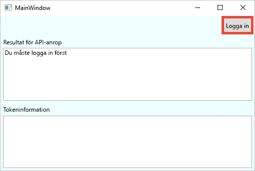
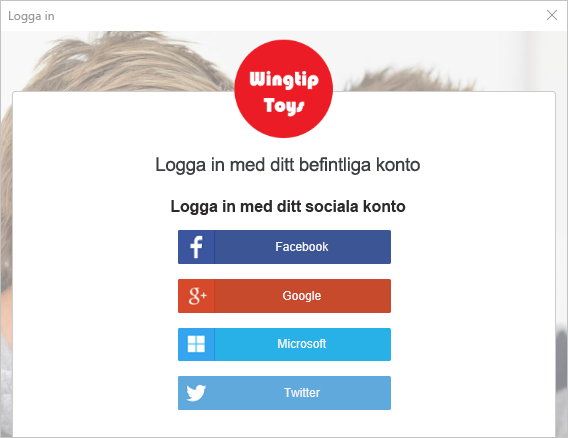
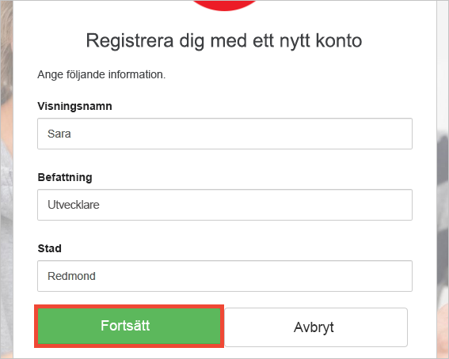
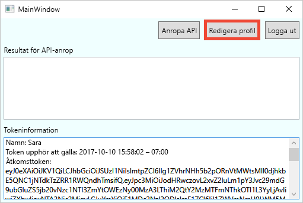
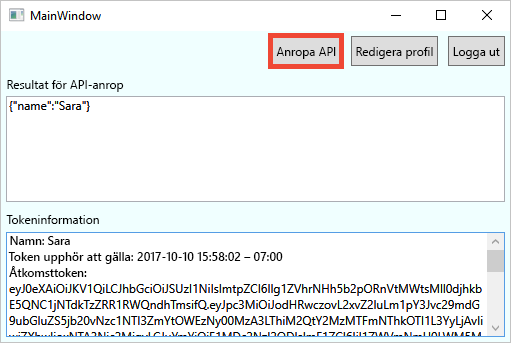

# Testkör ett skrivbordsprogram som konfigurerats med Azure AD B2C

Azure Active Directory B2C ger Identitetshantering i molnet för att hålla ditt program, företag och kunder som skyddas.  Denna Snabbstart använder skrivbordsapp för Windows Presentation Foundation (WPF) som ska användas som exempel för att demonstrera:

* Med hjälp av den **registrera dig eller logga In** princip för att skapa eller logga in med ett sociala identitetsleverantör eller ett lokalt konto med en e-postadress. 
* **Anropar en API** att hämta ditt namn från en Azure AD B2C skyddad resurs.

## Krav

* Installera [Visual Studio 2017](https://www.visualstudio.com/downloads/) med följande arbetsbelastningar:
    - **Skrivbord .NET-utveckling**

* Ett sociala konto från Facebook, Google, Microsoft eller Twitter. Om du inte har en sociala konto, krävs en giltig e-postadress.

[!INCLUDE [quickstarts-free-trial-note](../../includes/quickstarts-free-trial-note.md)]

## Hämta exemplet

[Hämta eller klona exempelprogrammet](https://github.com/Azure-Samples/active-directory-b2c-dotnet-desktop) från GitHub.

## Kör appen i Visual Studio

Öppna i projektmappen exempel programmet den `active-directory-b2c-wpf.sln` lösningen i Visual Studio. 

Välj **Felsök > Starta felsökning** att skapa och köra programmet. 

## Skapa ett konto

Klicka på **logga in** att starta den **registrera dig eller logga In** arbetsflöde. När du skapar ett konto kan använda du ett befintligt sociala identitet provider-konto eller ett e-postkonto.

### Logga med ett sociala identitetsleverantören.

Klicka på knappen för den identitetsleverantör som du vill använda för att registrera dig med sociala identitetsleverantör. Om du föredrar att använda en e-postadress, hoppa till den [logga med en e-postadress](#sign-up-using-an-email-address) avsnitt.

Du måste autentisera med sociala kontot autentiseringsuppgifter och den programmet behörighet att läsa information från sociala kontot (inloggning). Programmet kan hämta profilinformation från sociala kontot, till exempel ditt namn och ort genom att bevilja åtkomst. 

Ditt nya kontoinformation finns i förväg med information från ditt sociala konto. Ändra informationen om du vill och klickar på **Fortsätt**.

Du har skapat ett nytt Azure AD B2C-användarkonto som använder en identitetsleverantör. Efter inloggning, visas den åtkomst-token i den *Token info* textruta. Åtkomst-token används när åtkomst till API-resursen.

Nästa steg: [gå att redigera din profil](#edit-your-profile) avsnitt.

### Logga med en e-postadress

Om du väljer att inte använda ett konto för sociala för autentisering kan du skapa ett Azure AD B2C-användarkonto med en giltig e-postadress. Ett lokalt användarkonto i Azure AD B2C använder Azure Active Directory som identitetsleverantören. Om du vill använda din e-postadress, klickar du på den **har du inget konto? Logga nu** länk.

Ange en giltig e-postadress och klicka på **skicka verifieringskoden**. En giltig e-postadress krävs för att få verifieringskoden från Azure AD B2C.

Ange den Verifieringskod du via e-post och klickar på **Kontrollera koden**.

Lägg till din profilinformation och på **skapa**.

Du har skapat en ny Azure AD B2C lokalt användarkonto. Efter inloggning, visas den åtkomst-token i den *Token info* textruta. Åtkomst-token används när åtkomst till API-resursen.

## Redigera din profil

Azure Active Directory B2C innehåller funktioner för att tillåta användare att uppdatera deras profiler. Klicka på **Redigera profil** så här redigerar du den profil som du har skapat.

Välj den identitetsleverantör som är associerade med det konto som du skapade. Om du använde Twitter som identitetsleverantören när du skapade ditt konto kan du till exempel välja Twitter att ändra de tillhörande profilen information.

Ändra din **visningsnamn** eller **Stad**. 

En ny åtkomsttoken visas i den *Token info* textruta. Om du vill bekräfta ändringarna i din profil, kopiera och klistra in åtkomst-token i token avkodarens https://jwt.ms.

## Komma åt en resurs

Klicka på **anropa API** skyddade resursen https://fabrikamb2chello.azurewebsites.net/hello att begära en Azure AD B2C. 

Programmet innehåller den åtkomst-token som visas i den *Token info* textruta i begäran. API: et skickar tillbaka det visningsnamn som ingår i den åtkomst-token.

## Nästa steg

Nästa steg är att skapa din egen Azure AD B2C-klient och konfigurera samplet som ska köras med din klient. 

> [!div class="nextstepaction"]
> [Skapa en Azure Active Directory B2C-klient i Azure-portalen](active-directory-b2c-get-started.md)
