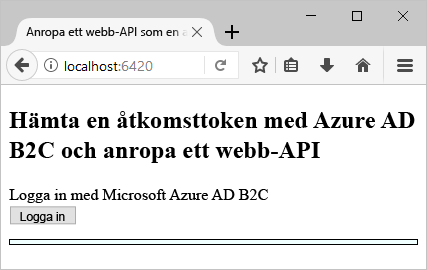
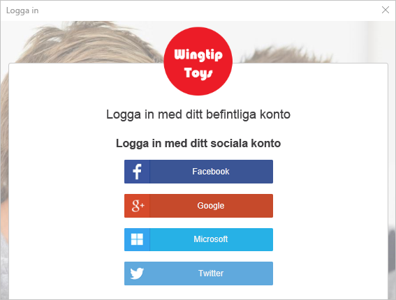
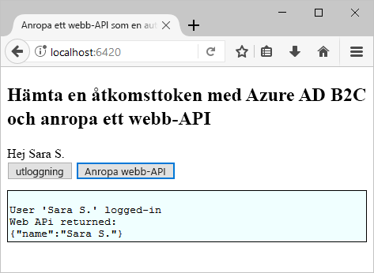

# <a name="quickstart-set-up-sign-in-for-a-single-page-app-using-azure-active-directory-b2c"></a>Snabbstart: Konfigurera inloggning för en ensidesapp med hjälp av Azure Active Directory B2C

Azure Active Directory (AD Azure) B2C tillhandahåller identitetshantering i molnet för att skydda dina program, ditt företag och dina kunder. Med Azure AD B2C kan program autentisera med konton på sociala medier och företagskonton med öppna protokoll. I den här snabbstarten använder du ett enkelsidigt program för ASP.NET till att logga in med en social identitetsprovider och anropa en Azure AD B2C-skyddad webb-API.

[!INCLUDE [quickstarts-free-trial-note](../../includes/quickstarts-free-trial-note.md)]

## <a name="prerequisites"></a>Nödvändiga komponenter

- [Visual Studio 2017](https://www.visualstudio.com/downloads/) med arbetsbelastningen **ASP.NET och webbutveckling**.
- Installera [Node.js](https://nodejs.org/en/download/)
- Ett konto från ett socialt medium, till exempel Facebook, Google, Microsoft eller Twitter.
- [Ladda ned en zip-fil](https://github.com/Azure-Samples/active-directory-b2c-javascript-msal-singlepageapp/archive/master.zip) eller klona exempelwebbappen från GitHub.

    ```
    git clone https://github.com/Azure-Samples/active-directory-b2c-javascript-msal-singlepageapp.git
    ```

## <a name="run-the-application"></a>Köra programmet

1. Starta servern genom att köra följande kommandon från Node.js-kommandotolken: 

    ```
    cd active-directory-b2c-javascript-msal-singlepageapp
    npm install && npm update
    node server.js
    ```

    Server.js visar det portnummer som lyssnar på localhost.

    ```
    Listening on port 6420...
    ```

2. Bläddra till programmets URL. Till exempel `http://localhost:6420`.

## <a name="sign-in-using-your-account"></a>Logga in på ditt konto

1. Klicka på **Inloggning** för att starta arbetsflödet.

    

    Exemplet stöder flera registreringsalternativ, till exempel att använda en social identitetsprovider eller att skapa ett lokalt konto med en e-postadress. För den här snabbstarten använder du ett konto från ett socialt medium, till exempel Facebook, Google, Microsoft eller Twitter. 

2. Azure AD B2C visar en anpassad inloggningssida för ett fiktivt varumärke som kallas Wingtip Toys för exempelwebbappen. Klicka på knappen för den identitetsprovider som du vill använda för att registrera dig med en social identitetsprovider.

    

    Du autentiserar dig (loggar in) med autentiseringsuppgifterna för ditt sociala konto och ger behörighet till programmet att läsa information från det sociala kontot. När du beviljar åtkomst kan programmet hämta profilinformation från det sociala kontot, till exempel ditt namn och din ort. 

3. Avsluta inloggningsprocessen för identitetsprovidern.

## <a name="access-a-protected-api-resource"></a>Få åtkomst till en skyddad API-resurs

Klicka på **Anropa webb-API** för att returnera ditt visningsnamn från Web API-anropet som ett JSON-objekt. 



Det enkelsidiga exempelprogrammet innehåller en åtkomsttoken i begäran till den skyddade webb-API-resursen.

## <a name="clean-up-resources"></a>Rensa resurser

Du kan använda Azure AD B2C-klientorganisationen om du vill prova andra snabbstarter eller självstudier för Azure AD B2C. När den inte längre behövs kan du ta bort [Azure AD B2C-klientorganisationen](active-directory-b2c-faqs.md#how-do-i-delete-my-azure-ad-b2c-tenant).

## <a name="next-steps"></a>Nästa steg

I den här snabbstarten använde du ett enkelsidigt exempelprogram för att logga in med en anpassad inloggningssida, logga in med en social identitetsprovider, skapa ett Azure AD B2C-konto och anropa ett Azure AD B2C-skyddat webb-API. 

Kom igång med att skapa en egen Azure AD B2C-klientorganisation.

> [!div class="nextstepaction"]
> [Skapa en Azure Active Directory B2C-klientorganisation i Azure-portalen](tutorial-create-tenant.md)
