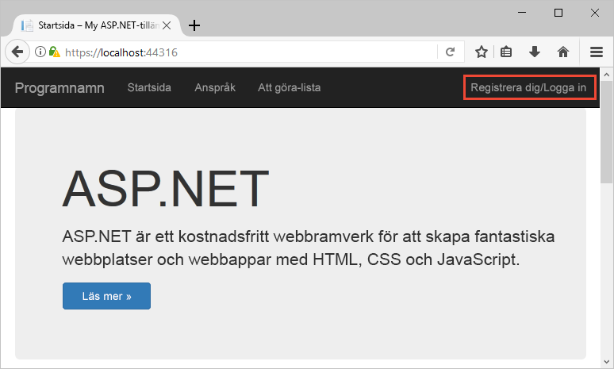
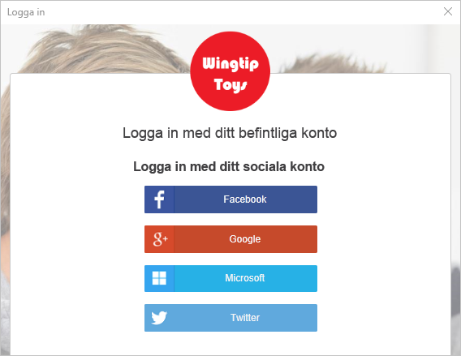
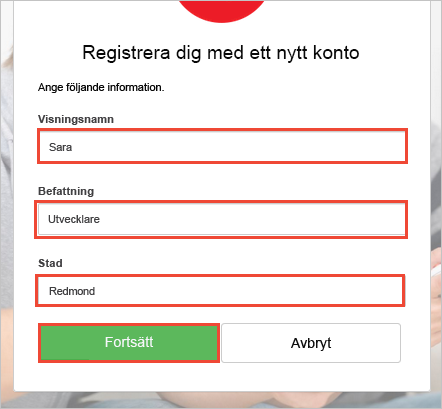
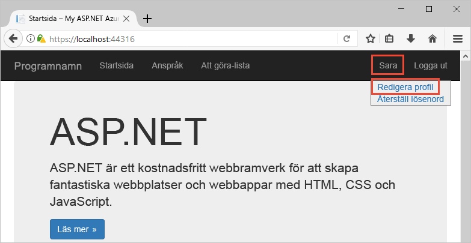
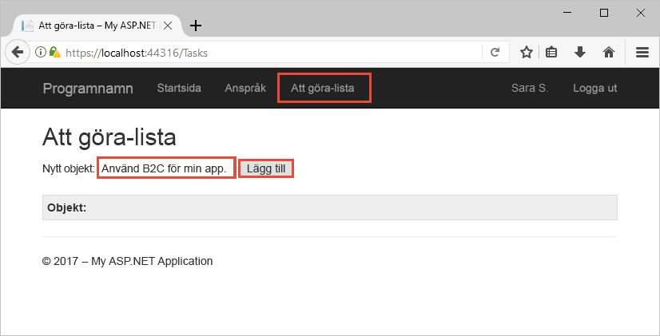

# Testkör en Azure AD B2C-aktiverade webbapp

Azure Active Directory B2C ger Identitetshantering i molnet för att hålla ditt program, företag och kunder som skyddas. Denna Snabbstart använder en exempelapp uppgiften listan för att demonstrera:

> [!div class="checklist"]
> * Logga in med en anpassad inloggningssida.
> * Logga in med ett sociala identitetsleverantör.
> * Skapa och hantera din Azure AD B2C-konto och användarens profil.
> * Anropa ett webb-API som skyddas av Azure AD B2C.

## Krav

* [Visual Studio-2017](https://www.visualstudio.com/downloads/) med den **ASP.NET och web development** arbetsbelastning. 
* Ett sociala konto från Facebook, Google, Microsoft eller Twitter.

[!INCLUDE [quickstarts-free-trial-note](../../includes/quickstarts-free-trial-note.md)]

## Hämta exemplet

[Hämta eller klona exempelprogrammet](https://github.com/Azure-Samples/active-directory-b2c-dotnet-webapp-and-webapi) från GitHub.

## Kör appen i Visual Studio

Öppna i projektmappen exempel programmet den `B2C-WebAPI-DotNet.sln` lösningen i Visual Studio. 

Lösningen är ett uppgiften listan exempelprogram som består av två projekt:

* **TaskWebApp** – en ASP.NET MVC-webbprogram där en användare kan hantera sina arbetsuppgifter i listan.  
* **TaskService** – ett ASP.NET Web API-serverdel som hanterar operations utförs på en användares att göra listobjekt. Webbprogrammet anropar den här webb-API och visar resultatet.

För den här snabbstarten måste du köra både det `TaskWebApp` och `TaskService` projekt på samma gång. 

1. I Visual Studio-menyn, Välj **projekt > Ange Startprojekt...** . 
2. Välj **flera Startprojekt** knappen.
3. Ändra den **åtgärd** för båda projekten till **starta**. Klicka på **OK**.

Välj **Felsök > Starta felsökning** att skapa och köra båda programmen. Varje program öppnas på sin egen webbläsarflik i:

`https://localhost:44316/`-Den här sidan är ASP.NET-webbprogram. Du kan interagera direkt med det här programmet i Snabbstart.
`https://localhost:44332/`-Den här sidan är webb-API som anropas av ASP.NET-webbprogram.

## Skapa ett konto

Klicka på den **registrering / logga in** länken i ASP.NET-webbprogram för att starta den **registrera dig eller logga In** arbetsflöde. När du skapar ett konto kan använda du ett befintligt sociala identitet provider-konto eller ett e-postkonto. Använd sociala identitet provider-konto från Facebook, Google, Microsoft eller Twitter för denna Snabbstart.

### Logga med ett sociala identitetsleverantören.

Klicka på knappen för den identitetsleverantör som du vill använda för att registrera dig med sociala identitetsleverantör. 

Du måste autentisera med sociala kontot autentiseringsuppgifter och den programmet behörighet att läsa information från sociala kontot (inloggning). Programmet kan hämta profilinformation från sociala kontot, till exempel ditt namn och ort genom att bevilja åtkomst. 

Slut processen inloggning identitetsprovider. Till exempel om du väljer Twitter, ange dina autentiseringsuppgifter för Twitter och på **logga in**.

Din nya Azure AD B2C profil kontouppgifterna finns i förväg med information från ditt sociala konto.

Uppdatera fält visningsnamn, befattning och ort och klicka på **Fortsätt**.  De värden du anger används för din Azure AD B2C användarprofil.

Du har:

> [!div class="checklist"]
> * Autentiseras med en identitetsleverantör.
> * Skapa ett användarkonto i Azure AD B2C. 

## Redigera din profil

Azure Active Directory B2C innehåller funktioner för att tillåta användare att uppdatera deras profiler. Klicka på ditt profilnamn i menyraden web application och välj **Redigera profil** så här redigerar du den profil som du har skapat.

Ändra din **visningsnamn** och **Stad**.  Klicka på **Fortsätt** att uppdatera din profil.

Lägg märke till ditt namn i den övre högra delen av sidan visar uppdaterade namnet. 

## Åtkomst till en skyddad web API-resurs

Klicka på **uppgiftslista** att ange och ändra din att göra listobjekt. ASP.NET-webbprogram innehåller en åtkomst-token i begäran till web API resurs begärande behörighet att utföra åtgärder på användarens lista arbetsuppgifter. 

Ange text i den **nytt objekt** textruta. Klicka på **Lägg till** skyddas webb-API som lägger till ett listobjekt för att göra att anropa Azure AD B2C.

Du har har använt ditt användarkonto i Azure AD B2C kan ringa en auktoriserad en Azure AD B2C skyddade webb-API.

## Nästa steg

Exempel som används i den här snabbstarten kan användas för andra Azure AD B2C-scenarier inklusive:

* Skapa ett nytt lokalt konto med en e-postadress.
* Återställa lösenordet lokalt konto.

Om du är redo att detaljerad information om hur du skapar en egen Azure AD B2C-klient och konfigurera samplet som ska köras med en egen klient kan du prova följande kursen.

> [!div class="nextstepaction"]
> [Skapa en ASP.NET-webbapp med Azure Active Directory B2C profil för registrering, inloggning, redigera och återställning av lösenord](active-directory-b2c-devquickstarts-web-dotnet-susi.md)