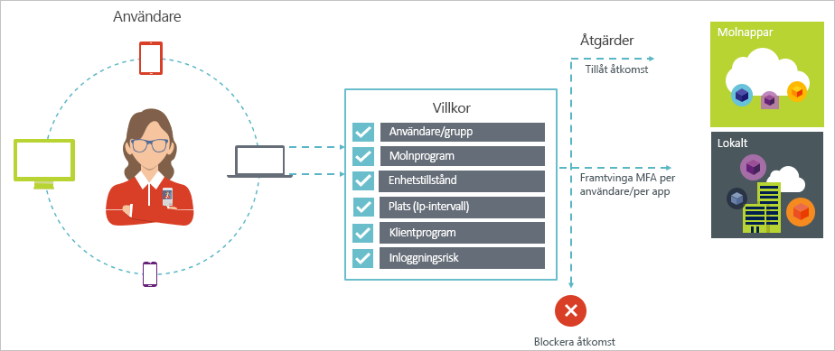
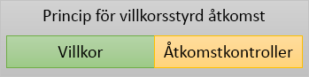

# Villkorlig åtkomst i Azure Active Directory

Säkerhet är ett viktigt mål för organisationer som använder molnet. En viktig aspekt av molnet säkerhet är identitets- och när det gäller att hantera dina molnresurser. Med mobile första, molnet först världen, kan användare åtkomst till organisationens resurser med olika enheter och appar från var som helst. Det innebär räcker bara fokusera på vem som kan komma åt en resurs inte längre. För att kunna master balansen mellan säkerhet och produktivitet måste IT-proffs också factor hur en resurs används i ett access control beslut. Med villkorlig åtkomst i Azure AD, kan du lösa det här kravet. Villkorlig åtkomst är en funktion i Azure Active Directory som gör att du kan använda reglagen på åtkomst till appar i din miljö baserat på specifika villkor från en central plats. 

Den här artikeln innehåller en översikt av villkorlig åtkomst i Azure AD.

## Vanliga scenarier

I en mobile första, molnet först värld kan Azure Active Directory enkel inloggning till enheter, appar och tjänster från var som helst. Med den ökande mängden av enheter (inklusive BYOD) arbetar av företagets nätverk och tredjeparts SaaS-appar, IT-proffs står inför två andra mål:

- Ge användarna att vara produktiva var och när
- Skydda företagets tillgångar när som helst

Du kan använda rätt åtkomstkontroller på villkor som krävs med hjälp av principer för villkorlig åtkomst. Azure AD villkorlig åtkomst ger ökad säkerhet vid behov och förblir utanför dina användares sätt när den inte. 

Följande är några vanliga problem för åtkomst som villkorlig åtkomst kan hjälpa dig med:

- **[Logga in risk](active-directory-conditional-access-conditions.md#sign-in-risk)**: Azure AD Identity Protection identifierar inloggning risker. Hur du begränsa åtkomsten om identifierade risk inloggning anger en felaktig aktören? Vad händer om du vill hämta en starkare bevis att en inloggning har utförts av legitim användare eller din tvivel är starkt att även blockera specifika användare från att komma åt en app?

- **[Nätverksplats](active-directory-conditional-access-locations.md)**: Azure AD kan nås från var som helst. Vad händer om en åtkomstförsök utförs från en nätverksplats som inte kontrolleras av IT-avdelningen? Med hjälp av en kombination av användarnamn och lösenord kan vara bra tillräckligt som bevis på identitet för åtkomst försöker dina resurser från företagsnätverket. Vad händer om du behovet av en starkare identitetsbevis åtkomst försöker som initieras från andra oväntat länder eller regioner världen? Vad händer om du även vill blockera åtkomst försöker från vissa platser?  

- **[Enhetshantering](active-directory-conditional-access-conditions.md#device-platforms)**: I Azure AD användare har åtkomst till molnappar från en mängd olika enheter, inklusive mobila och personliga enheter. Vad händer om du kräver att åtkomstförsök bör bara utföras med hjälp av enheter som hanteras av IT-avdelningen? Vad händer om du vill även blockera vissa typer av enheter från åtkomst till molnappar i din miljö? 

- **[Klientprogrammet](active-directory-conditional-access-conditions.md#client-apps)**: idag, du kan komma åt många molnappar med hjälp av olika apptyper som till exempel webbaserade appar, mobila appar eller skrivbordsprogram. Vad händer om en åtkomstförsök utförs med hjälp av en typ av klient app som orsakar kända problem? Vad händer om du behöver en enhet som hanteras av IT-avdelningen för vissa typer av appen? 

Dessa och relaterade svaren representerar vanliga scenarier för åtkomst för villkorlig åtkomst i Azure AD. Villkorlig åtkomst är en funktion i Azure Active Directory som gör att du kan hantera åtkomst scenarier med hjälp av en principbaserad metod.

## Principer för villkorlig åtkomst

En princip för villkorlig åtkomst är definition av ett scenario för åtkomst med hjälp av följande mönster:

**Gör detta** definierar svar i principen. Det är viktigt att notera att målet för en villkorlig åtkomstprincip inte att bevilja åtkomst till en molnapp. I Azure AD är bevilja åtkomst till molnappar föremål för användare. Med en princip för villkorlig åtkomst som du styr hur behöriga användare (användare som har beviljats åtkomst till en molnapp) har åtkomst till molnappar vissa villkor. I ditt svar tillämpa du ytterligare krav, t.ex multifaktorautentisering och en hanterad enhet. I samband med villkorlig åtkomst i Azure AD kallas de krav som din princip tillämpar åtkomstkontroller. I formuläret mest restriktiva kan principen blockera åtkomst. Mer information finns i [åtkomstkontroller i Azure Active Directory för villkorlig åtkomst](active-directory-conditional-access-controls.md).
     

**När detta inträffar** definierar orsak för att utlösa principen. Därför kännetecknas av en grupp av villkor är uppfyllda. Spela upp en särskild roll i Azure AD villkorlig åtkomst, tilldelning av två villkor:

- **[Användare](active-directory-conditional-access-conditions.md#users-and-groups)**: de användare som utför ett åtkomstförsök (**som**). 

- **[Molnappar](active-directory-conditional-access-conditions.md#cloud-apps)**: ett åtkomstförsök mål (**vad**).    

Dessa två villkor är obligatoriskt i en princip för villkorlig åtkomst. Du kan även inkludera ytterligare villkor som beskriver hur försöket utförs utöver de två obligatoriska villkor. Vanliga exempel använder mobila enheter eller platser utanför företagets nätverk. Mer information finns i [villkor i Azure Active Directory för villkorlig åtkomst](active-directory-conditional-access-conditions.md).   

Kombinationen av villkor med din åtkomstkontroller representerar en princip för villkorlig åtkomst. 

Med villkorlig åtkomst till Azure AD, kan du styra hur behöriga användare kan komma åt dina molnappar. Målet med en princip för villkorlig åtkomst är att tillämpa ytterligare kontroller i ett åtkomstförsök till en molnapp som drivs av hur ett åtkomstförsök utförs.

En fördel med att använda en principbaserad metod för att skydda åtkomst till dina molnappar är att du kan starta utformning principkraven för din miljö med strukturen som beskrivs i den här artikeln utan att oroa teknisk implementering. 

## Vad du behöver veta

### Allmänna krav för att använda villkorlig åtkomst

Du kan använda villkorlig åtkomst i Azure AD för att skydda molnappar när Autentiseringsförsöket kommer från:

- En webbläsare

- Ett klientprogram som använder modern autentisering

- Exchange ActiveSync

Mer information finns i [klientappar](active-directory-conditional-access-conditions.md#client-apps).

Vissa [molnappar](active-directory-conditional-access-conditions.md#cloud-apps) också stöder äldre autentiseringsprotokoll. Detta gäller, till exempel SharePoint Online och Exchange Online. När ett klientprogram kan använda ett äldre autentiseringsprotokoll att komma åt en molnappen, kan Azure AD tillämpa en princip för villkorlig åtkomst på den här åtkomstförsök. Om du vill förhindra att ett klientprogram kringgå tillämpning av principer, bör du kontrollera om det är möjligt att endast aktivera modern autentisering på de berörda molnapparna.

Är exempel på appar villkorlig åtkomst inte gäller för klient:

- Office 2010 eller tidigare

- Office 2013 när modern autentisering inte är aktiverat

Mer information finns i [Ställ in SharePoint Online och Exchange Online för villkorlig åtkomst i Azure Active Directory](active-directory-conditional-access-no-modern-authentication.md).

### Krav för att använda villkorlig åtkomst

Använda villkorlig åtkomst kräver en Azure AD Premium-licens. Du hittar rätt licens för dina behov [jämföra allmänt tillgängliga funktioner i lediga, grundläggande och Premium-utgåvorna](https://azure.microsoft.com/pricing/details/active-directory/).

## Nästa steg

- Om du vill veta mer om:
    - Villkor, se [villkor i Azure Active Directory för villkorlig åtkomst](active-directory-conditional-access-conditions.md).

    - Åtkomstkontroller, se [åtkomstkontroller i Azure Active Directory för villkorlig åtkomst](active-directory-conditional-access-controls.md).

- Om du vill hämta viss erfarenhet av att konfigurera principer för villkorlig åtkomst, se [Kom igång med villkorlig åtkomst i Azure Active Directory](active-directory-conditional-access-azure-portal-get-started.md).

- Om du är redo att konfigurera principer för villkorlig åtkomst för din miljö finns i [bästa praxis för villkorlig åtkomst i Azure Active Directory](active-directory-conditional-access-best-practices.md). 
