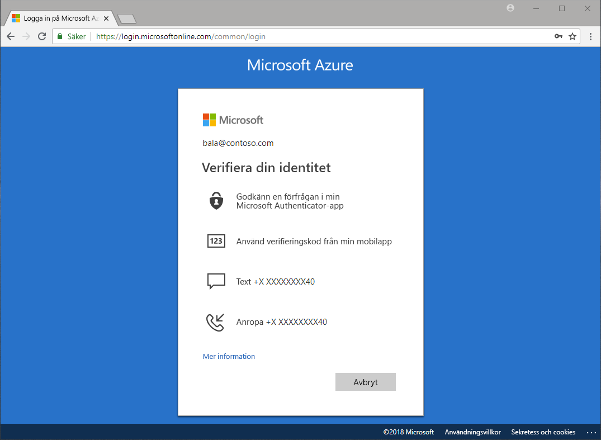

# Vilka metoder är tillgängliga för autentisering?

Vi hör på nyheterna att lösenord stjäls och identiteter komprometteras. Genom att kräva en andra faktor utöver ett lösenord ökar du direkt säkerheten för din organisation. Microsoft Azure Active Directory (Azure AD) innehåller funktioner såsom Azure Multi-Factor Authentication (Azure MFA) och självåterställning av lösenord (SSPR) med Azure AD för att hjälpa administratörer att skydda sina organisationer och användare med ytterligare autentiseringsmetoder.

Det finns många scenarier som omfattar inloggning till ett program, återställning av lösenord, aktivering av Windows Hello och annat, och dina användare kan bli ombedda att tillhandahålla ytterligare verifiering för att identifiera sig.

Ytterligare verifiering kan ges i form av autentiseringsmetoder som:

* En kod som tillhandahålls i ett e-post- eller textmeddelande
* Ett telefonsamtal
* En avisering eller kod på telefonen
* Svar på säkerhetsfrågor

Självåterställning av lösenord med Azure MFA och Azure AD ger administratörer kontroll över konfiguration, princip, övervakning och rapportering med hjälp av Azure AD och Azure-portalen för att skydda sina organisationer.

## Återställning av lösenord för självbetjäning

Självåterställning av lösenord ger användarna möjlighet att återställa sina lösenord utan inblandning av administratören, när och var som helst.

> [!VIDEO https://www.youtube.com/embed/hc97Yx5PJiM]

Självåterställning av lösenord inkluderar:

* **Lösenordsändring:** Jag känner till mitt lösenord men jag vill ändra det till något nytt.
* **Lösenordsåterställning:** Jag kan inte logga in, och jag vill återställa lösenordet med hjälp av en eller flera godkända autentiseringsmetoder.
* **Kontoupplåsning:** Jag kan inte logga in eftersom mitt konto är låst, och jag vill låsa upp det med hjälp av en eller flera godkända autentiseringsmetoder.

## Multi-Factor Authentication

Azure Multi-Factor Authentication (MFA) är Microsofts verifieringslösning i två steg. Med autentiseringsmetoder som är godkända av administratör hjälper Azure MFA till att skydda din åtkomst till data och program, samtidigt som behovet av en enkel inloggningsprocess uppfylls.

## Licenskrav

[!INCLUDE [Active Directory P1 license](../../../includes/active-directory-p1-license.md)]

## Nästa steg

Nästa steg är att sätta igång och konfigurera självåterställning av lösenord och Azure Multi-Factor Authentication.

Kom igång med självåterställning av lösenord genom att läsa [snabbstartsartikeln om att aktivera SSPR](quickstart-sspr.md).

Mer information om självåterställning av lösenord finns i artikeln om [hur självåterställning av lösenord i Azure AD fungerar](concept-sspr-howitworks.md)

Läs mer om Azure Multi-Factor Authentication i artikeln om [hur Azure Multi-Factor Authentication fungerar](concept-mfa-howitworks.md)
