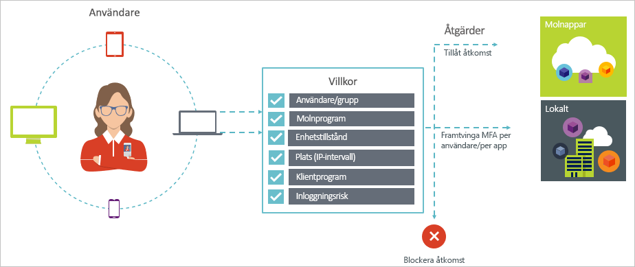
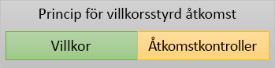

# Vad är villkorsstyrd åtkomst i Azure Active Directory?

Säkerhet är en mycket viktig fråga för organisationer som använder molnet. En viktig aspekt av molnsäkerhet är identitet och åtkomst när det gäller att hantera dina molnresurser. I en mobil- och molnorienterad värld kan användare komma åt organisationens resurser med hjälp av en mängd olika enheter och appar från var som helst. Därför räcker det inte att bara fokusera på vem som kan komma åt en resurs. För att uppnå rätt balans mellan säkerhet och produktivitet måste du även beakta hur åtkomsten till en resurs går till när du fattar ett beslut om åtkomstkontroll. Med villkorsstyrd åtkoms i Azure AD kan du uppfylla det här kravet. Villkorsstyrd åtkomst är en funktion i Azure Active Directory. Med villkorsstyrd åtkomst kan du implementera automatiserade beslut för åtkomstkontroll om åtkomst till dina molnappar, baserat på villkor. 

Den här artikeln innehåller en konceptuell översikt av villkorsstyrd åtkomst i Azure AD.

## Vanliga scenarier

I en mobil- och molnorienterad värld ger Azure Active Directory enkel inloggning till enheter, appar och tjänster från var som helst. I och med den ökande mängden enheter (inklusive BYOD), arbete utanför företagsnätverk och SaaS-appar från tredje part står du inför två motsatta mål:

- Underlätta för användarna att vara produktiva oavsett tid och plats
- Se till att företagets resurser alltid är skyddade

Genom att använda principer för villkorsstyrd åtkomst kan du använda rätt åtkomstkontroller enligt de villkor som råder. Med villkorsstyrd åtkomst i Azure AD får du extra säkerhet vid behov, och det lägger sig inte i användarnas arbetsflöde när den säkerheten inte behövs. 

Nedan följer några vanliga problem med åtkomst som villkorsstyrd åtkomst kan hjälpa dig med:

- **[Inloggningsrisk](conditions.md#sign-in-risk)**: Azure AD Identity Protection identifierar inloggningsrisker. Hur begränsar du åtkomsten om en identifierad inloggningsrisk indikerar en obehörig användare? Hur gör du om du behöver starkare bevis på att en inloggning har utförts av legitim användare? Hur gör du om du har misstankar som är starka nog att du vill även blockera enskilda användare från att komma åt en app?  

- **[Nätverksplats](location-condition.md)**: Azure AD kan användas från var som helst. Vad händer om en åtkomstförsök utförs från en nätverksplats som inte kontrolleras av IT-avdelningen? En kombination av användarnamn och lösenord kan vara tillräckligt bra som identitetsbevis för åtkomstförsök till dina resurser från företagsnätverket. Hur gör du om du kräver starkare identitetsbevis för åtkomstförsök som initieras från andra oväntade länder eller regioner i världen? Och kanske vill du till och med blockera åtkomstförsök från vissa regioner?  

- **[Enhetshantering](conditions.md#device-platforms)**: I Azure AD kan användare komma åt molnappar från en mängd olika enheter, inklusive mobila och personliga enheter. Vill du kräva att åtkomstförsök endast utförs med hjälp av enheter som hanteras av IT-avdelningen? Kanske vill du till och med blockera vissa enhetstyper från att komma åt molnappar i din miljö? 

- **[Klientprogram](conditions.md#client-apps)**: I dag kan du komma åt många molnappar med hjälp av olika apptyper, till exempel webbaserade appar, mobilappar och skrivbordsappar. Vad händer om ett åtkomstförsök utförs med en klientapptyp som orsakar kända problem? Hur gör du om du kräver en enhet som hanteras av IT-avdelningen för vissa typer av appar? 

Dessa frågor och relaterade svar representerar vanliga åtkomstscenarier för villkorsstyrd åtkomst i Azure AD. Villkorsstyrd åtkomst är en funktion i Azure Active Directory som gör det möjligt att hantera åtkomstscenarier med hjälp av en principbaserad metod.

## Principer för villkorsstyrd åtkomst

En principer för villkorsstyrd åtkomst är en definition av ett åtkomstscenario med hjälp av följande mönster:

**Gör då detta** definierar svaret på din princip. Observera att målet med en princip för villkorsstyrd åtkomst inte att bevilja åtkomst till en molnapp. Att bevilja åtkomst till molnappar är har i Azure AD att göra med användartilldelningar. Med en princip för villkorsstyrd åtkomst kontrollerar du hur behöriga användare (användare som har beviljats åtkomst till en molnapp) kommer åt molnappar med vissa villkor. I ditt svar tillämpar du ytterligare krav såsom multifaktorautentisering, en hanterad enhet och mer. I samband med villkorsstyrd åtkomst i Azure AD kallas de krav som din princip tillämpar åtkomstkontroller. I den mest restriktiva formen kan din princip blockera åtkomst. Mer information finns på sidan om [åtkomstkontroller i villkorsstyrd åtkomst med Azure Active Directory](controls.md).
     

**Om det här händer** definierar anledningen till att utlösa principen. Den här orsaken kännetecknas av en grupp villkor som uppfylls. I villkorsstyrd åtkomst i Azure AD spelar de två tilldelningsvillkoren en särskild roll:

- **[Användare](conditions.md#users-and-groups)**: de användare som utför ett åtkomstförsök (**Vem**). 

- **[Molnappar](conditions.md#cloud-apps)**: målen för ett åtkomstförsök (**Vad**).    

De här två villkoren är obligatoriska i en princip för villkorsstyrd åtkomst. Utöver de två obligatoriska villkoren kan du även inkludera ytterligare villkor som beskriver hur åtkomstförsök utförs. Vanliga exempel använder mobila enheter eller platser som ligger utanför företagets nätverk. Mer information finns på sidan om [villkor i villkorsstyrd åtkomst med Azure Active Directory](conditions.md).   

Kombinationen av villkor med dina åtkomstkontroller representerar en princip för villkorsstyrd åtkomst. 

Med villkorsstyrd åtkomst i Azure AD kan du kontrollera hur behöriga användare kan komma åt dina molnappar. Målet med en princip för villkorsstyrd åtkomst är att tillämpa ytterligare åtkomstkontroller på ett åtkomstförsök till en molnapp som drivs av hur ett åtkomstförsök utförs.

En fördel med att använda en principbaserad metod för att skydda åtkomst till dina molnappar är att du kan börja utforma principkraven för din miljö med hjälp av den struktur som beskrivs i den här artikeln utan att behöva bekymra dig om teknisk implementering. 

## Licenskrav för att använda villkorsstyrd åtkomst

Användning av villkorsstyrd åtkomst kräver en Azure AD Premium-licens. Hitta rätt licens för dina behov i [Jämför allmänt tillgängliga funktioner i Free, Basic och Premium-utgåvorna](https://azure.microsoft.com/pricing/details/active-directory/).

## Nästa steg

- Om du vill veta mer om:
    - Villkor kan du läsa sidan om [villkor i villkorsstyrd åtkomst med Azure Active Directory](conditions.md).

    - Åtkomstkontroller kan du läsa sidan om [åtkomstkontroller i villkorsstyrd åtkomst med Azure Active Directory](controls.md).

- Om du vill få lite erfarenhet med att konfigurera principer för villkorsstyrd åtkomst kan du läsa sidan om att [kräva MFA för specifika appar med villkorsstyrd åtkomst i Azure Active Directory](app-based-mfa.md).

- Om du är redo att konfigurera principer för villkorsstyrd åtkomst för din miljö kan du läsa sidan om [metodtips för villkorsstyrd åtkomst i Azure Active Directory](best-practices.md). 

- Om du vill ha en stegvis distributionsplan med rekommenderade principer kan du läsa sidan om [distributionsplan för villkorsstyrd åtkomst](http://aka.ms/conditionalaccessdeploymentplan)
