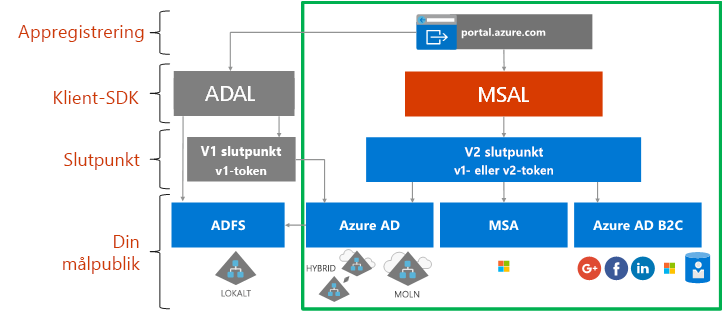

# Om Microsoft Identity-plattformen

Microsoft Identity-plattformen är en utveckling av identitetstjänsten och utvecklingsplattformen Azure Active Directory (Azure AD). Den hjälper utvecklare att bygga program som loggar in alla Microsoft-identiteter, får tokens för att anropa Microsoft Graph, andra Microsoft API:er eller API:er som utvecklare har byggt. Det är en fullständig plattform som består av en autentiseringstjänst, bibliotek med öppen källkod, programregistrering och -konfiguration (genom en utvecklarportal och ett program-API), fullständig utvecklardokumentation, kodexempel och annat innehåll för utvecklare. Microsoft Identity-plattformen stöder branschstandardprotokoll som OAuth 2.0 och OpenID Connect.

Hittills har de flesta utvecklare arbetat med Azure AD v1.0-plattformen för att autentisera Azure AD-identiteter (arbets- och skolkonton) genom att begära token från Azure AD v1.0-slutpunkten, med hjälp av Azure AD Authentication Library (ADAL), Azure-portalen för programregistrering och -konfiguration, och Azure AD Graph API för programmässig programkonfiguration. Azure AD v1.0-plattformen är en mogen plattform som fortsätter att fungera för företagsprogram.

Om du vill utöka och utveckla funktionerna hos Microsoft Identity-plattformen kan du nu autentisera en bredare uppsättning Microsoft-identitet (Azure AD-identiteter, Microsoft-konton (t.ex. outlook.com och hotmail.com), och sociala och lokala konton via Azure AD B2C) via den så kallade Azure AD v2.0-slutpunkten. Här använder du Microsoft Authentication Library (MSAL) eller ett annat OAuth2.0- eller OpenID Connect-bibliotek med öppen källkod, Azure-portalen för programregistrering och -konfiguration, och Microsoft Graph API för programmässig programkonfiguration. Den uppdaterade Microsoft Identity-plattformen (särskilt MSAL-biblioteken och de senaste appregistreringsfunktionerna i Azure-portalen) har utvecklats betydligt under det senaste året. För att slutföra den här versionen rekommenderar vi utvecklare att utveckla och testa sina program med den senaste Microsoft Identity-plattformen.

Program som använder det senaste ADAL och MSAL kommer att SSO-anslutas till varandra. Program som uppdaterats från ADAL till MSAL behåller användartillståndet för inloggning. Utvecklare kan välja att uppdatera sina program till MSAL, eftersom program som skapats med ADAL fortsätter att fungera och stödjas.

## Microsoft Identity-plattformsgränssnittet

I diagrammet nedan visas Microsoft Identity-gränssnittet på hög nivå, bland annat appregistreringsfunktioner, SDK:er, slutpunkter och identiteter som stöds.

Microsoft Identity-plattformen har två slutpunkter (v1.0 och v2.0) och två uppsättningar klientbibliotek för att hantera dessa slutpunkter. När du utvecklar ett nytt program bör du tänka över fördelarna och det aktuella tillståndet för slutpunkterna och autentiseringsbiblioteken. Tänk också på följande:

* Plattformar som stöds

    * [ADAL](active-directory-authentication-libraries.md) stöder .NET, JavaScript, iOS, Android, Java och Python
    * [Förhandsversionen av MSAL](reference-v2-libraries.md) stöder .NET, JavaScript, iOS och Android
    * Båda slutpunkterna stöder .NET- och Node.js-servermellanprogram för att skydda API:er och inloggning. 

* Det flesta innovationer, som dynamiskt medgivande och inkrementellt medgivande, sker på v2.0-slutpunkten och MSAL men vi fortsätter att stödja v1.0 och ADAL.

    I Azure-portalen var du tidigare tvungen att statiskt identifiera alla omfång som appen behövde. Med v2.0-slutpunkten och portalerna som associeras med slutpunkten kan du statiskt definiera dessa omfång precis som tidigare eller kan begära dem dynamiskt när appen behöver behörigheten. Ger dynamiskt en eller flera valfria funktioner, inkrementellt medgivande. Med inkrementellt medgivande kan du fråga efter en delmängd omfång som du behöver när en användare först autentiseras och fråga efter ytterligare omfång när de behövs. 
    
    När du till exempel använder en kameraapp på en mobil enhet ombeds användaren att tillåta att appen får åtkomst till kameran, och bara när användaren har godkänt detta har kameran åtkomst till kameran och kan ta ett foto.  När appen är redo att spara det nya fotot kan den fråga efter läs-/skrivbehörighet för foton. 

* Möjliga större ändringar

    MSAL är lämpligt att använda i en produktionsmiljö. Vi ger samma stöd på produktionsnivå för MSAL som för våra nuvarande produktionsbibliotek. Under förhandsversionsperioden kan vi göra ändringar av API:et, det interna cacheformatet och andra mekanismer i det här biblioteket, som du måste ta tillsammans med felkorrigeringar och funktionsförbättringar. Det kan påverka programmet. Till exempel kan en ändring av cacheformatet påverka dina användare, till exempel kräva att de loggar in igen. En API-ändring kan kräva att du uppdaterar din kod. När vi släpper en allmänt tillgänglig version kommer vi att kräva att du uppdaterar till den allmänt tillgängliga versionen inom sex månader, eftersom program som använder förhandsversionen av biblioteket kanske inte längre fungerar.

## Nästa steg

Läs mer om v1.0 och v2.0.

* [Om v1.0](v1-overview.md)
* [Om v2.0](v2-overview.md)
