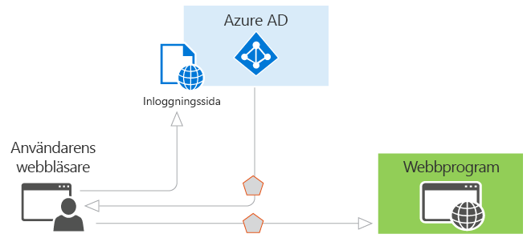

# Autentiseringsscenarier för Azure AD

Azure Active Directory (Azure AD) förenklar autentisering för utvecklare genom att tillhandahålla identitet som en tjänst med stöd för branschstandardprotokoll som OAuth 2.0 och OpenID Connect, samt open source-bibliotek för olika plattformar som hjälper dig att Börja koda snabbt. Den här artikeln hjälper dig att förstå har stöd för olika scenarier för Azure AD och visar dig hur du kommer igång. Den är uppdelad i följande avsnitt:

* [Grunderna för autentisering i Azure AD](#basics-of-authentication-in-azure-ad)
* [Anspråk i säkerhetstoken för Azure AD](#claims-in-azure-ad-security-tokens)
* [Grunderna för att registrera ett program i Azure AD](#basics-of-registering-an-application-in-azure-ad)
* [Programtyper och scenarier](#application-types-and-scenarios)

  * [Webbläsarens webbprogram](#web-browser-to-web-application)
  * [Ensidesapplikation (SPA)](#single-page-application-spa)
  * [Internt program till webb-API](#native-application-to-web-api)
  * [Webbprogram till webb-API](#web-application-to-web-api)
  * [Daemon eller ett serverprogram till webb-API](#daemon-or-server-application-to-web-api)

## Grunderna för autentisering i Azure AD

Om du är bekant med grundläggande begrepp för autentisering i Azure AD kan du läsa det här avsnittet. I annat fall kan du hoppa över ned till [programtyper och scenarier](#application-types-and-scenarios).

Anta att du har det enklaste scenariot där identitet krävs: en användare i en webbläsare måste autentisera till ett webbprogram. Det här scenariot beskrivs mer detaljerat i de [webbläsarens webbprogram](#web-browser-to-web-application) avsnittet, men det är en bra utgångspunkt för att illustrera funktioner i Azure AD och få en överblick hur scenariot fungerar. Överväg följande diagram för det här scenariot:

Diagrammet ovan i åtanke är här vad du behöver veta om dess olika komponenter:

* Azure AD är identitetsprovidern, och ansvarar för att verifiera identiteten för användare och program som finns i en organisations katalog och slutligen utfärda säkerhetstoken efter lyckad autentisering för dessa användare och program.
* Ett program som vill flytta över autentisering till Azure AD måste vara registrerad i Azure AD, som registrerar och som unikt identifierar appen i katalogen.
* Utvecklare kan använda open source-Azure AD-autentiseringsbibliotek för att göra autentisering enkelt genom att hantera protocol-information för dig. Mer information finns i [Azure Active Directory Authentication Libraries](active-directory-authentication-libraries.md).
* När en användare har autentiserats måste måste programmet Validera användarens säkerhetstoken för att säkerställa att autentiseringen har lyckats. Vi har några exempel på vad programmet måste göra på en mängd olika språk och ramverk på [GitHub](https://github.com/Azure-Samples?q=active-directory). Om du skapar en webbapp i ASP.NET, finns i den [Lägg till inloggning för ett ASP.NET web app för](https://docs.microsoft.com/en-us/azure/active-directory/develop/guidedsetups/active-directory-aspnetwebapp). Om du skapar ett web API-resursen i ASP.NET, finns i den [webb-API: Kom igång med](https://docs.microsoft.com/en-us/azure/active-directory/develop/active-directory-devquickstarts-webapi-dotnet).
* Flödet av begäranden och svar för autentiseringsprocessen bestäms av autentiseringsprotokollet som användes, till exempel OAuth 2.0, OpenID Connect, WS-Federation eller SAML 2.0. Dessa protokoll beskrivs mer ingående i den [Azure Active Directory-autentiseringsprotokoll](active-directory-authentication-protocols.md) artikeln och i avsnitten nedan.

> [!NOTE]
> Azure AD stöder OAuth 2.0 och OpenID Connect standarder som gör omfattande användning av ägar-token, inklusive ägar-token som JWTs. En *ägartoken* är en förenklad säkerhetstoken som ger ”ägar” åtkomst till en skyddad resurs. I detta avseende är ”ägar” en part som kan utgöra en token. Även om en part måste först autentisera med Azure AD för att ta emot ägartoken om steg som krävs inte vidtas för att skydda token i överföring och lagring, kan den fångas upp och används av en oavsiktlig part. Även om vissa säkerhetstoken har en inbyggd mekanism för att förhindra obehöriga personer från att använda dem, ägar-token har inte den här mekanismen och måste transporteras i en säker kanal, till exempel transport layer security (HTTPS). Om en ägartoken skickas i klartext, kan en man-in-the-middle-attack användas av en obehörig part att hämta token och använda den för en obehörig åtkomst till en skyddad resurs. Samma säkerhetsprinciper gäller när du lagrar eller cachelagring ägar-token för senare användning. Se alltid till att ditt program skickar och lagrar ägar-token på ett säkert sätt. Mer säkerheten på ägartoken, finns [RFC 6750 avsnitt 5](http://tools.ietf.org/html/rfc6750).

Nu när du har en översikt över grunderna, läser du avsnitten nedan för att förstå hur etablering fungerar i Azure AD och vanliga scenarier som har stöd för Azure AD.

## Anspråk i säkerhetstoken för Azure AD

Säkerhetstoken (åtkomst och ID-token) utfärdat av Azure AD innehåller anspråk eller intyg för information om ämnet som har autentiserats. Dessa anspråk kan användas av programmet för flera olika uppgifter. Program kan till exempel använda anspråk för att validera token, identifiera ämnets directory-klient, Visa användarinformation, fastställa användarens tillstånd och så vidare. Anspråk som finns i alla angivna säkerhetstoken är beroende av typ av token, vilken typ av autentiseringsuppgift som används för att autentisera användaren och programkonfigurationen. En kort beskrivning av varje typ av anspråk som genereras av Azure AD finns i tabellen nedan. Mer information finns i [token och anspråkstyper som stöds](active-directory-token-and-claims.md).

| Begär | Beskrivning |
| --- | --- |
| Program-ID:t | Identifierar det program som använder token. |
| Målgrupp | Identifierar mottagarens resursen token är avsedd för. |
| Application Authentication Context Class Reference | Anger hur klienten har autentiserat (offentliga klienter eller konfidentiell klient). |
| Autentisering snabbmeddelanden | Innehåller information om datum och tid när autentiseringen inträffade. |
| Autentiseringsmetod | Anger hur ämnet för token autentiserades (lösenord, certifikat, etc.). |
| Förnamn | Innehåller det angivna namnet för användaren som angetts i Azure AD. |
| Grupper | Innehåller objekt-ID: N för Azure AD-grupper som användaren är medlem i. |
| Identitetsprovider | Registrerar den identitetsprovider som autentiserats ämnet för token. |
| Utfärdat på | Registrerar den tid då token utfärdats, används ofta för token färskhet. |
| Utfärdare | Identifierar STS som genererat token samt Azure AD-klient. |
| Efternamn | Innehåller användarens efternamn som angetts i Azure AD. |
| Namn | Innehåller en mänsklig läsbara värde som identifierar föremål för token. |
| Objekt-ID | Innehåller en oföränderlig, unik identifierare för ämnet i Azure AD. |
| Roller | Innehåller egna namnen på Azure AD-programroller som användaren har beviljats. |
| Omfång | Anger de behörigheter som beviljats till klientprogrammet. |
| Ämne | Anger huvudnamn som token kontrollerar information. |
| Klient-ID:t | Innehåller en oföränderlig, unik identifierare för directory-klienten som utfärdade token. |
| Livslängd för token | Definierar det tidsintervall inom vilket en token är giltig. |
| Användarens huvudnamn | Innehåller användarens huvudnamn av ämne. |
| Version | Innehåller det lägre versionsnumret för token. |

## Grunderna för att registrera ett program i Azure AD

Alla program som outsources autentisering till Azure AD måste registreras i en katalog. Det här steget ska du tala om Azure AD om ditt program, inklusive URL: en där den finns, URL: en att skicka svar efter autentisering, URI: N att identifiera ditt program och mycket mer. Den här informationen krävs för några viktiga skäl:

* Azure AD behöver kommunicera med programmet vid hantering av inloggnings- eller utbyte token. Informationen som skickas mellan Azure AD och programmet innehåller följande:
  
  * **Program-ID-URI** -ID för ett program. Det här värdet skickas till Azure AD under autentiseringen för att indikera vilket program anroparen vill ha en token för. Dessutom inkluderas det här värdet i token så att programmet vet att det var det avsedda målet.
  * **Svars-URL** och **omdirigerings-URI** – för en webb-API eller ett webbprogram, svars-URL är den plats där Azure AD skickar autentiseringssvaret, inklusive en token om autentiseringen lyckades. För ett internt program är omdirigerings-URI en unik identifierare till vilken Azure AD omdirigerar användaragenten i ett OAuth 2.0-begäran.
  * **Program-ID** -ID för ett program som genereras av Azure AD när programmet har registrerats. När du begär en auktoriseringskod eller token, skickas det program-ID och nyckel till Azure AD under autentiseringen.
  * **Nyckeln** -nyckeln som ska skickas tillsammans med ett program-ID när du autentiserar till Azure AD att anropa ett webb-API.
* Azure AD behöver att säkerställa att programmet har behörigheterna som krävs för att komma åt dina katalogdata, andra program i din organisation, och så vidare.

Etablering blir tydligare när du förstår att det finns två typer av program som kan utvecklas och integrerad med Azure AD:

* **Program för klienter med enkel** – en enda klient-programmet är avsett att användas i en organisation. Det här är vanligtvis line-of-business (LoB) program som skrivits av företagsutvecklare. En enda klient behöver bara användas av användare i en katalog och därför kan den bara behöver etableras i en katalog. Programmen registreras vanligtvis av en utvecklare i organisationen.
* **Program med flera innehavare** -program med flera innehavare är avsedd att användas i många organisationer är inte bara en organisation. Det här är vanligtvis software-as-a-service (SaaS)-program som skrivits av en oberoende programvaruleverantör (ISV). Program för flera innehavare måste tillhandahållas i varje katalog där de ska användas, vilket kräver att användaren eller administratören tillstånd att registrera dem. Förfarandet medgivande startar när ett program som har registrerats i katalogen och ges åtkomst till Graph API eller kanske en annan webb-API. När en användare eller administratör från en annan organisation registrerar sig att använda programmet, visas en dialogruta som visar de behörigheter som programmet kräver. Användaren eller administratören kan sedan godkänna att programmet, vilket ger programmet åtkomst till den angivna data och slutligen registrerar programmet i sin katalog. Mer information finns i [översikt över ramverket för medgivande](quickstart-v1-integrate-apps-with-azure-ad.md#overview-of-the-consent-framework).

### Ytterligare överväganden när du utvecklar en eller flera klient apps
Vissa ytterligare överväganden uppstå när du utvecklar ett program för flera klienter i stället för en enskild klient-program. Till exempel om du gör ditt program tillgängligt för användare i flera kataloger, måste en mekanism för att avgöra vilken klientorganisation som de finns i. En enskild klient behöver bara titta i sin egen katalog för en användare, även om ett program för flera innehavare behöver identifiera en viss användare från alla kataloger i Azure AD. Om du vill utföra den här uppgiften, tillhandahåller Azure AD en gemensam autentiseringsslutpunkt där alla program med flera innehavare kan dirigera inloggningsförfrågningar, i stället för en klientspecifik slutpunkt. Den här slutpunkten är https://login.microsoftonline.com/common för alla kataloger i Azure AD, medan en klientspecifik slutpunkt kan vara https://login.microsoftonline.com/contoso.onmicrosoft.com. Vanliga slutpunkten är särskilt viktigt att tänka på när du utvecklar ditt program eftersom du behöver den nödvändiga logiken för att hantera flera klienter under inloggning, utloggning, och tokenvalidering.

Om du utvecklar för närvarande en enda klient-program, men vill göra den tillgänglig för många organisationer, kan du enkelt ändra programmet och dess konfiguration i Azure AD för att göra det flera innehavare kan. Dessutom använder Azure AD samma signeringsnyckeln för alla token i alla kataloger om du tillhandahåller autentisering i en enda klient eller program med flera innehavare.

Varje scenario som beskrivs i det här dokumentet innehåller ett avsnitt som beskriver dess etablering krav. Mer detaljerad information om att etablera ett program i Azure AD, samt skillnaderna mellan enstaka och flera innehavare program finns i [integrera program med Azure Active Directory](quickstart-v1-integrate-apps-with-azure-ad.md) för mer information. Läs vidare för att förstå de vanliga Programscenarier i Azure AD.

## Programtyper och scenarier

Var och en av de scenarier som beskrivs här kan utvecklas med hjälp av olika språk och plattformar. De backas upp av fullständig kodexempel som är tillgängliga i den [kod exempelguide](active-directory-code-samples.md), eller direkt från motsvarande [GitHub-lagringsplatser för exemplet](https://github.com/Azure-Samples?q=active-directory). Dessutom, om ditt program kräver en viss typ eller segment i ett scenario för slutpunkt till slutpunkt, kan i de flesta fall att funktionerna läggas oberoende av varandra. Till exempel om du har ett internt program som anropar ett webb-API kan du kan enkelt lägga till ett webbprogram som också anropar webb-API. Följande diagram illustrerar dessa scenarier och programtyper, och hur du kan lägga till olika komponenter:

Det här är de fem primära programmet scenarier som stöds av Azure AD:

* [Webbläsarens webbprogram](#web-browser-to-web-application): en användare måste logga in till ett webbprogram som skyddas av Azure AD.
* [Enkel sidan program (SPA)](#single-page-application-spa): en användare måste logga in på en ensidesapplikation som skyddas av Azure AD.
* [Internt program till webb-API](#native-application-to-web-api): ett internt program som körs på en telefon, surfplatta eller dator måste autentisera en användare för att hämta resurser från ett webb-API som skyddas av Azure AD.
* [Webbprogram till webb-API](#web-application-to-web-api): ett program behöver få resurser från ett webb-API som skyddas av Azure AD.
* [Daemon eller ett serverprogram till webb-API](#daemon-or-server-application-to-web-api): en daemon-program eller ett serverprogram utan användargränssnitt för web måste hämta resurser från ett webb-API som skyddas av Azure AD.

### Webbläsarens webbprogram

Det här avsnittet beskriver ett program som autentiserar en användare i en webbläsare till ett webbprogram. I det här scenariot uppmanar webbprogrammet användarens webbläsare att logga in dem till Azure AD. Azure AD returnerar ett svar via användarens webbläsare, som innehåller anspråk om användaren i en säkerhetstoken. Det här scenariot stöder inloggning med WS-Federation, SAML 2.0 och OpenID Connect-protokoll.

#### Diagram

#### Beskrivning av protokollet flöde

1. När en användare besöker programmet och behöver logga in, omdirigeras via en begäran till autentiseringsslutpunkten för i Azure AD.
1. Användaren loggar in på sidan logga in.
1. Om autentiseringen lyckas skapar en autentiseringstoken Azure AD och returnerar ett svar till programmets svars-URL som har konfigurerats i Azure-portalen. För ett produktionsprogram måste svars-URL vara HTTPS. Den returnerade token innehåller anspråk om användaren och Azure AD som krävs av programmet för att validera token.
1. Programmet verifierar token med hjälp av en offentlig signeringsnyckel och information om utfärdare är tillgänglig på federationsmetadatadokumentet för Azure AD. När programmet verifierar token, startar en ny session med användaren. Den här sessionen gör att användaren kan komma åt programmet tills det upphör att gälla.

#### Kodexempel

Se kodexempel för webbläsaren till webbprogram scenarier. Och kom tillbaka ofta – nya exempel läggs ofta. [Webbprogram](active-directory-code-samples.md#web-applications).

#### Registrera

* Enskild klient: Om du skapar ett program för din organisation, den måste registreras i företagets katalog med hjälp av Azure portal.
* Flera innehavare: Om du skapar ett program som kan användas av användare utanför organisationen, det måste vara registrerad i företagets katalog, men även måste registreras i varje organisations katalog som kommer att använda programmet. Du kan inkludera en registreringsprocess för dina kunder som gör det möjligt för dem att godkänna ditt program för att göra programmet tillgängligt i sin katalog. När de registrerar sig för ditt program, kommer de att visas en dialogruta som visar de behörigheter som programmet kräver och sedan alternativet för att godkänna. Beroende på behörigheterna som krävs kanske en administratör i den andra organisationen måste ge ditt medgivande. När användaren eller administratören godkänner, registreras programmet i sin katalog. Mer information finns i [integrera program med Azure Active Directory](quickstart-v1-integrate-apps-with-azure-ad.md).

#### Giltighetstid för token

Användarens session upphör att gälla när livslängd för token som utfärdas av Azure AD upphör att gälla. Ditt program kan förkorta denna tidsperiod om du vill, till exempel logga ut användare baserat på en period av inaktivitet. När sessionen upphör att gälla, uppmanas användaren att logga in igen.

### Ensidesapplikation (SPA)

Det här avsnittet beskriver autentisering för ett enda sidan program som använder Azure AD och OAuth 2.0 implicit auktorisering bevilja för att skydda dess webb-API: et tillbaka avslutas. Den enda sidan program är vanligtvis strukturerade som en JavaScript-presentationslagret (klientdel) som körs i webbläsaren och en webb-API-serverdel som körs på en server och implementerar affärslogiken i programmet. Mer information om implicit auktoriseringsbeviljande och hjälper dig att avgöra om det är bäst för ditt program-scenario genom att se [förstå OAuth2 implicit ge flow i Azure Active Directory](active-directory-dev-understanding-oauth2-implicit-grant.md).

I det här scenariot, när användaren loggar in, JavaScript klientdelens slutliga användning [Active Directory Authentication Library för JavaScript (ADAL. JS)](https://github.com/AzureAD/azure-activedirectory-library-for-js) och implicit auktoriseringsbeviljande att hämta ID-token (id_token) från Azure AD. Token cachelagras och klienten kopplas till den på begäran som ägartoken när anrop till dess webb-API-serverdel som skyddas med OWIN-mellanprogrammet. 

#### Diagram

#### Beskrivning av protokollet flöde

1. Användaren navigerar till webbprogrammet.
1. Programmet returnerar JavaScript klientdelen (presentationslagret) till webbläsaren.
1. Användaren initierar inloggning, till exempel klickar du på länken logga in. Webbläsaren skickar en GET till auktoriseringsslutpunkten för Azure AD för att begära en ID-token. Den här begäran innehåller programmets ID och svars-URL i Frågeparametrar.
1. Azure AD verifierar svars-URL mot registrerade svars-URL som har konfigurerats i Azure-portalen.
1. Användaren loggar in på sidan logga in.
1. Om autentiseringen lyckas, Azure AD skapar en ID-token och returnerar det som ett URL-fragment (#) till programmets svars-URL. För ett produktionsprogram måste svars-URL vara HTTPS. Den returnerade token innehåller anspråk om användaren och Azure AD som krävs av programmet för att validera token.
1. JavaScript-klient-kod som körs i webbläsaren extraherar token från svaret som ska användas i skydda anrop till programmets web API tillbaka avslutas.
1. Webbläsaren anropar programmets webb-API: et tillbaka sluta med ID-token i auktoriseringshuvudet. Azure AD-Autentiseringstjänsten utfärdar en ID-token som kan användas som en ägartoken om resursen är samma som klient-ID (i det här fallet detta gäller skick webb-API Apps egen backend). 

#### Kodexempel

Se kodexempel för enskild sida program (SPA)-scenarier. Se till att Kom tillbaka ofta – nya exempel läggs ofta. [Enkel Sidprogram (SPA)](active-directory-code-samples.md#single-page-applications).

#### Registrera

* Enskild klient: Om du skapar ett program för din organisation, den måste registreras i företagets katalog med hjälp av Azure portal.
* Flera innehavare: Om du skapar ett program som kan användas av användare utanför organisationen, det måste vara registrerad i företagets katalog, men även måste registreras i varje organisations katalog som kommer att använda programmet. Du kan inkludera en registreringsprocess för dina kunder som gör det möjligt för dem att godkänna ditt program för att göra programmet tillgängligt i sin katalog. När de registrerar sig för ditt program, kommer de att visas en dialogruta som visar de behörigheter som programmet kräver och sedan alternativet för att godkänna. Beroende på behörigheterna som krävs kanske en administratör i den andra organisationen måste ge ditt medgivande. När användaren eller administratören godkänner, registreras programmet i sin katalog. Mer information finns i [integrera program med Azure Active Directory](quickstart-v1-integrate-apps-with-azure-ad.md).

När du har registrerat programmet, måste den konfigureras för att använda Implicit beviljande av OAuth 2.0-protokollet. Det här protokollet är inaktiverat för program som standard. Om du vill aktivera protokollet OAuth2-Implicit beviljande för ditt program, redigera dess applikationsmanifestet från Azure-portalen och ange ”oauth2AllowImplicitFlow”-värdet till true. Detaljerade anvisningar finns i [aktiverar OAuth 2.0 Implicit beviljande för den enda sidan program](quickstart-v1-integrate-apps-with-azure-ad.md).

#### Giltighetstid för token

Med hjälp av ADAL.js hjälper med:

* Uppdatera en utgångna token
* begär en åtkomsttoken att anropa ett webb-API-resursen

Efter en lyckad autentisering skriver en cookie i användarens webbläsare för att upprätta en session i Azure AD. Observera att sessionen finns mellan användare och Azure AD (inte mellan användaren och webbprogrammet). När en token upphör att gälla använder ADAL.js den här sessionen tyst hämtar en annan token. ADAL.js använder en dold iFrame för att skicka och ta emot begäran med Implicit beviljande av OAuth-protokollet. ADAL.js kan också använda samma mekanism för att erhålla åtkomsttoken tyst för andra webb-API-resurser som programmet anropar så länge dessa resurser stöd för cross-origin resource sharing (CORS) har registrerats i katalogen för den användaren och alla nödvändiga tillstånd har anges av användaren under inloggning.

### Internt program till webb-API

Det här avsnittet beskriver ett internt program som anropar ett webb-API för en användares räkning. Det här scenariot är byggt på beviljandetypen för OAuth 2.0 auktorisering kod med en offentlig klient enligt beskrivningen i avsnitt 4.1 i den [OAuth 2.0-specifikationen](http://tools.ietf.org/html/rfc6749). Internt program hämtar en åtkomsttoken för användaren med hjälp av OAuth 2.0-protokollet. Den här åtkomst-token som sedan skickas i begäran till webb-API som ger användaren behörighet och returnerar önskad resurs.

#### Diagram

#### Beskrivning av protokollet flöde

Om du använder AD-Autentiseringsbibliotek, hanteras de flesta av protokolldetaljer som beskrivs nedan för dig, som popup-fönster i webbläsaren, tokencachelagring och hantering av uppdateringstoken.

1. Använd en webbläsare som popup internt program gör en begäran till slutpunkten för auktorisering i Azure AD. Den här begäran innehåller program-ID och omdirigerings-URI: N för internt program som visas i Azure-portalen och program-ID-URI för webb-API. Om användaren inte har redan har loggat in uppmanas de att logga in igen
1. Azure AD autentiserar användaren. Om det är ett program med flera innehavare och medgivande som krävs för att använda programmet, måste användaren tillstånd om de inte redan gjort det. Efter att godkänna och efter lyckad autentisering, utfärdar Azure AD ett auktorisering kod svar tillbaka till klientprogrammets omdirigerings-URI.
1. När Azure AD utfärdar ett auktorisering kod svar tillbaka till omdirigeringen-URI, klientprogrammet stoppar webbläsare interaktion och extraherar Auktoriseringskoden från svaret. Med den här auktoriseringskod klientprogrammet skickar en begäran till tokenslutpunkten för Azure AD som innehåller Auktoriseringskoden, information om klientprogrammet (program-ID och omdirigerings-URI) och önskad resurs (program-ID-URI för den webb-API).
1. Auktoriseringskod och information om klient-API för program- och verifieras av Azure AD. Vid lyckad validering returnerar två token i Azure AD: en JWT-token för åtkomst och en uppdatering JWT-token. Dessutom kan returnerar Azure AD grundläggande information om användare, till exempel deras Visa namn och klient-ID.
1. Över HTTPS använder klientprogrammet returnerade JWT-åtkomsttoken för att lägga till JWT-sträng med en ”ägar” beteckning i auktoriseringshuvudet för begäran till webb-API. Webb-API: verifierar JWT-token och om verifieringen lyckas, returnerar önskad resurs.
1. När åtkomsttoken upphör att gälla får klientprogrammet ett felmeddelande som anger att användaren behöver för att autentisera igen. Om programmet har en giltig uppdateringstoken kan användas den för att få en ny åtkomsttoken utan att fråga användaren att logga in igen. Om uppdatera-token upphör att gälla, måste programmet för interaktiv autentisering användaren igen.

> [!NOTE]
> Uppdateringstoken som utfärdats av Azure AD kan användas för åtkomst till flera resurser. Om du har ett klientprogram som har behörighet att anropa två webb-API: er kan till exempel uppdateringstoken användas för att hämta en åtkomsttoken till andra webb-API samt.

#### Kodexempel

Se kodexempel för internt program till webb-API-scenarier. Och kom tillbaka ofta – vi lägga till nya exempel ofta. [Internt program till webb-API](active-directory-code-samples.md#desktop-and-mobile-public-client-applications-calling-microsoft-graph-or-a-web-api).

#### Registrera

* Enskild klient: Båda överordnade länkens interna program och webb-API måste registreras i samma katalog i Azure AD. Webb-API kan konfigureras för att exponera en uppsättning behörigheter som används för att begränsa internt program åtkomst till dess resurser. Klientprogrammet sedan markerar önskade behörigheter i listrutan ”behörigheter till andra program” i Azure-portalen.
* Flera innehavare: Först internt program bara registrerad i utvecklaren eller utgivarens katalog. Andra har internt program konfigurerats för att ange de behörigheter som krävs ska fungera. Den här listan över behörigheter som krävs visas i en dialogruta när en användare eller administratör i målmappen ger du ditt medgivande till programmet, vilket gör dem tillgängliga för deras organisation. Vissa program kräver endast användarnivå behörigheter, som alla användare i organisationen kan godkänna. Andra program som kräver på administratörsnivå som en användare i organisationen inte kan godkänna. Endast en directory-administratören kan samtycka till program som kräver den här behörighetsnivån. När användaren eller administratören godkänner, registreras endast webb-API i sin katalog. Mer information finns i [integrera program med Azure Active Directory](quickstart-v1-integrate-apps-with-azure-ad.md).

#### Giltighetstid för token

När internt program använder dess auktoriseringskod för att hämta en JWT åtkomsttoken, emot tas även en uppdatering JWT-token. Uppdateringstoken kan användas för att autentisera användaren igen utan att behöva logga in igen när åtkomsttoken upphör att gälla. Den här uppdateringstoken används sedan för att autentisera användaren, vilket innebär att en ny åtkomsttoken och uppdateringstoken.

### Webbprogram till webb-API

Det här avsnittet beskriver ett webbprogram som krävs för att få resurser från ett webb-API. I det här scenariot finns två identitetstyper av som webbprogrammet kan använda för att autentisera och anropa webb-API: en Programidentitet eller en delegerad användaridentitet.

*Programidentitet:* det här scenariot använder OAuth 2.0-klientautentiseringsuppgifter för att autentisera sig som programmet och få åtkomst till webb-API. När du använder en Programidentitet, webb-API kan bara identifiera att webbprogrammet anropar det, eftersom webb-får API: et inte någon information om användaren. Om programmet tar emot information om användaren, så skickas den via programprotokollet och är inte signerat av Azure AD. Webb-API litar på att användaren autentiseras för webbprogrammet. Därför är det här mönstret kallas ett betrodda undersystem.

*Delegerad användaridentitet:* det här scenariot kan utföras på två sätt: OpenID Connect och OAuth 2.0-auktoriseringskod med en konfidentiell klient. Webbprogrammet hämtar en åtkomsttoken för användaren, vilket bevisar för webb-API som användaren har autentiserats till webbprogrammet och att webbprogrammet kunde erhålla en delegerad användaridentitet för att anropa webb-API. Den här åtkomsttoken skickas i begäran till webb-API som ger användaren behörighet och returnerar önskad resurs.

#### Diagram

#### Beskrivning av protokollet flöde

Både program-ID och delegerad identitet användartyper diskuteras i flödet nedan. Den viktigaste skillnaden mellan dem är att måste den delegerade användaridentiteten först skaffa en auktoriseringskod innan användaren kan logga in och få åtkomst till webb-API.

##### Ge programmet identitet med hjälp av OAuth 2.0-klientautentiseringsuppgifter

1. En användare är inloggad i Azure AD i webbprogrammet (se den [webbläsarens webbprogram](#web-browser-to-web-application) ovan).
1. Webbprogrammet måste hämta en åtkomsttoken så att den kan autentisera till webb-API och hämta önskad resurs. Den gör en begäran till tokenslutpunkten för Azure AD, ger autentiseringsuppgifter, program-ID och API: er webbprogram ID-URI.
1. Azure AD autentiserar programmet och returnerar en JWT åtkomst-token som används för att anropa webb-API.
1. Över HTTPS använder webbprogrammet returnerade JWT-åtkomsttoken för att lägga till JWT-sträng med en ”ägar” beteckning i auktoriseringshuvudet för begäran till webb-API. Webb-API: verifierar JWT-token och om verifieringen lyckas, returnerar önskad resurs.

##### Delegerad användaridentiteter med OpenID Connect

1. En användare är inloggad i ett webbprogram med Azure AD (se den [webbläsarens webbprogram](#web-browser-to-web-application) ovan). Om användaren av webbprogrammet inte har ännu godkänt att så att det webbaserade programmet och anropa webb-API för dess räkning, måste användaren godkänna. Programmet visas de behörigheter som krävs och om någon av dessa finns på administratörsnivå normal användare i katalogen inte kommer att kunna godkänna. Förfarandet medgivande gäller endast för program för flera innehavare, inte enskild klient program, som programmet har redan behörighet. När användaren är inloggad, fick webbprogrammet ett ID-token med information om användaren, samt en auktoriseringskod.
1. Med den auktoriseringskod som utfärdats av Azure AD kan skickar webbprogrammet en begäran till tokenslutpunkten för Azure AD som innehåller Auktoriseringskoden, information om klientprogrammet (program-ID och omdirigerings-URI) och önskad resurs (program-ID URI för webb-API).
1. Auktoriseringskod och information om webbprogram och webb-API verifieras av Azure AD. Vid lyckad validering returnerar två token i Azure AD: en JWT-token för åtkomst och en uppdatering JWT-token.
1. Över HTTPS använder webbprogrammet returnerade JWT-åtkomsttoken för att lägga till JWT-sträng med en ”ägar” beteckning i auktoriseringshuvudet för begäran till webb-API. Webb-API: verifierar JWT-token och om verifieringen lyckas, returnerar önskad resurs.

##### Delegerad användaridentiteter med OAuth 2.0-auktoriseringskod

1. En användare är redan inloggad på ett webbprogram, vars autentiseringsmetod är oberoende av Azure AD.
1. Webbprogrammet kräver en auktoriseringskod att hämta en åtkomsttoken, så att den skickar en begäran via webbläsaren till auktoriseringsslutpunkten för Azure AD, vilket ger det program-ID och omdirigerings-URI för det webbaserade programmet efter en lyckad autentisering. Användaren loggar in till Azure AD.
1. Om användaren av webbprogrammet inte har ännu godkänt att så att det webbaserade programmet och anropa webb-API för dess räkning, måste användaren godkänna. Programmet visas de behörigheter som krävs och om någon av dessa finns på administratörsnivå normal användare i katalogen inte kommer att kunna godkänna. Den här medgivande gäller både enstaka och flera innehavare program. Enskild klient-om kan en administratör utföra admin medgivande till medgivande för sina användare. Detta kan göras med hjälp av den `Grant Permissions` knappen i den [Azure-portalen](https://portal.azure.com). 
1. När användaren har godkänt får webbprogrammet auktoriseringskod som krävs för att hämta en åtkomsttoken.
1. Med den auktoriseringskod som utfärdats av Azure AD kan skickar webbprogrammet en begäran till tokenslutpunkten för Azure AD som innehåller Auktoriseringskoden, information om klientprogrammet (program-ID och omdirigerings-URI) och önskad resurs (program-ID URI för webb-API).
1. Auktoriseringskod och information om webbprogram och webb-API verifieras av Azure AD. Vid lyckad validering returnerar två token i Azure AD: en JWT-token för åtkomst och en uppdatering JWT-token.
1. Över HTTPS använder webbprogrammet returnerade JWT-åtkomsttoken för att lägga till JWT-sträng med en ”ägar” beteckning i auktoriseringshuvudet för begäran till webb-API. Webb-API: verifierar JWT-token och om verifieringen lyckas, returnerar önskad resurs.

#### Kodexempel

Se kodexempel för webbprogram till webb-API-scenarier. Och kom tillbaka ofta – nya exempel läggs ofta. Web [program till webb-API](active-directory-code-samples.md#web-applications-signing-in-users-calling-microsoft-graph-or-a-web-api-with-the-users-identity).

#### Registrera

* Enskild klient: För både program-ID och delegerade användaren identitet fall kan webbappen och webb-API måste registreras i samma katalog i Azure AD. Webb-API kan konfigureras för att exponera en uppsättning behörigheter som används för att begränsa webbprogrammets åtkomst till dess resurser. Om en delegerad användaridentitetstypen används måste webbprogrammet väljas önskade behörigheter från listrutan ”behörigheter till andra program” i Azure-portalen. Det här steget krävs inte om identitet programtyp som används.
* Flera innehavare: Först webbprogrammet har konfigurerats för att ange de behörigheter som krävs ska fungera. Den här listan över behörigheter som krävs visas i en dialogruta när en användare eller administratör i målmappen ger du ditt medgivande till programmet, vilket gör dem tillgängliga för deras organisation. Vissa program kräver endast användarnivå behörigheter, som alla användare i organisationen kan godkänna. Andra program som kräver på administratörsnivå som en användare i organisationen inte kan godkänna. Endast en directory-administratören kan samtycka till program som kräver den här behörighetsnivån. När användaren eller administratören godkänner, registreras webbappen och webb-API både i sin katalog.

#### Giltighetstid för token

När webbprogrammet använder dess auktoriseringskod för att hämta en JWT åtkomsttoken, emot tas även en uppdatering JWT-token. Uppdateringstoken kan användas för att autentisera användaren igen utan att behöva logga in igen när åtkomsttoken upphör att gälla. Den här uppdateringstoken används sedan för att autentisera användaren, vilket innebär att en ny åtkomsttoken och uppdateringstoken.

### Daemon eller ett serverprogram till webb-API

Det här avsnittet beskrivs en daemon eller server-program som behöver få resurser från ett webb-API. Det finns två underordnade scenarier som gäller för det här avsnittet: en daemon som måste anropa ett webb-API som bygger på beviljandetypen för autentiseringsuppgifter för klienten i OAuth 2.0; och ett serverprogram (till exempel ett webb-API) som måste anropa ett webb-API som bygger på OAuth 2.0 Behalf draft-specifikationen.

För scenariot när en daemon-programmet måste anropa ett webb-API, är det viktigt att förstå några saker. Först går inte användarinteraktion med en daemon-programmet, vilket kräver att programmet har sin egen identitet. Ett exempel på en daemonprogram är ett batch-jobb eller en tjänst i operativsystemet som körs i bakgrunden. Den här typen av program begär en åtkomsttoken genom att använda dess Programidentitet och presentera dess program-ID, autentiseringsuppgifter (lösenord eller certifikat) och program till Azure AD-ID-URI. Efter en lyckad autentisering får daemon en åtkomsttoken från Azure AD, som sedan används för att anropa webb-API.

För scenariot när ett serverprogram behöver anropa ett webb-API, är det bra att använda ett exempel. Anta att en användare har autentiserats på en programspecifik och interna programmet måste anropa ett webb-API. Azure AD utfärdar en JWT-token för åtkomst för att anropa webb-API. Om webb-API måste anropa ett annat underordnat webb-API, använda den on-behalf-of-flöde för att delegera användarens identitet och autentisera till andra nivån webb-API.

#### Diagram

#### Beskrivning av protokollet flöde

##### Ge programmet identitet med hjälp av OAuth 2.0-klientautentiseringsuppgifter

1. Serverprogrammet måste först autentisera med Azure AD som själva, utan en mänsklig interaktion, till exempel en dialogruta för interaktiv inloggning. Den gör en begäran till tokenslutpunkten för Azure AD, att ange autentiseringsuppgifter, program-ID och program-ID-URI.
1. Azure AD autentiserar programmet och returnerar en JWT åtkomst-token som används för att anropa webb-API.
1. Över HTTPS använder webbprogrammet returnerade JWT-åtkomsttoken för att lägga till JWT-sträng med en ”ägar” beteckning i auktoriseringshuvudet för begäran till webb-API. Webb-API: verifierar JWT-token och om verifieringen lyckas, returnerar önskad resurs.

##### Delegerad användaridentiteter med OAuth 2.0 Behalf Draft-specifikationen

Flödet beskrivs nedan förutsätter att en användare har autentiserats på ett annat program (t.ex ett internt program) och deras användar-ID har använts för att hämta en åtkomsttoken till den första nivån webben-API.

1. Internt program skickar åtkomsttoken till den första nivån webben-API.
1. Den första nivån webben-API skickar en begäran till tokenslutpunkten för Azure AD, ger dess program-ID och autentiseringsuppgifter, samt användarens åtkomsttoken. Dessutom kan begäran skickas med en on_behalf_of parameter som anger webb API begär nya-tokens för att anropa en underordnad webb-API åt den ursprungliga användaren.
1. Azure AD verifierar att den första nivån webben-API har behörighet att komma åt andra nivån webb-API och verifierar begäran kan returnera en JWT-token för åtkomst och en JWT uppdateringstoken till den första nivån webben-API.
1. Över HTTPS anropar första nivån webb-API sedan den andra nivån webben-API genom att lägga till tokensträng i auktoriseringshuvudet i begäran. Den första nivån webben-API kan fortsätta att anropa den andra nivån webben-API så länge åtkomsttoken och uppdateringstoken är giltiga.

#### Kodexempel

Se kodexempel för Daemon eller ett program till webb-API-scenarier. Och kom tillbaka ofta – nya exempel läggs ofta. [Servern eller Daemon-programmet till webb-API](active-directory-code-samples.md#daemon-applications-accessing-web-apis-with-the-applications-identity)

#### Registrera

* Enskild klient: För både program-ID och delegerade användaren identitet fall kan programmet daemon eller server måste vara registrerad i samma katalog i Azure AD. Webb-API kan konfigureras för att exponera en uppsättning behörigheter som används för att begränsa daemon eller servers åtkomst till dess resurser. Om en delegerad användaridentitetstypen används måste serverprogrammet att välja önskade behörigheter i listrutan ”behörigheter till andra program” i Azure-portalen. Det här steget krävs inte om identitet programtyp som används.
* Flera innehavare: Först daemon eller server programmet är konfigurerat för att ange de behörigheter som krävs ska fungera. Den här listan över behörigheter som krävs visas i en dialogruta när en användare eller administratör i målmappen ger du ditt medgivande till programmet, vilket gör dem tillgängliga för deras organisation. Vissa program kräver endast användarnivå behörigheter, som alla användare i organisationen kan godkänna. Andra program som kräver på administratörsnivå som en användare i organisationen inte kan godkänna. Endast en directory-administratören kan samtycka till program som kräver den här behörighetsnivån. När användaren eller administratören godkänner, är både webb-API: er registrerade i sin katalog.

#### Giltighetstid för token

När det första programmet använder dess auktoriseringskod för att hämta en JWT åtkomsttoken, emot tas även en uppdatering JWT-token. När åtkomsttoken upphör att gälla användas uppdateringstoken för att autentisera användaren igen utan att fråga efter autentiseringsuppgifter. Den här uppdateringstoken används sedan för att autentisera användaren, vilket innebär att en ny åtkomsttoken och uppdateringstoken.

## Se även

[Utvecklarhandbok för Azure Active Directory](azure-ad-developers-guide.md)

[Kodexempel för Azure Active Directory](active-directory-code-samples.md)

[Viktig Information om signeringsnyckel i Azure AD](active-directory-signing-key-rollover.md)

[OAuth 2.0 i Azure AD](https://msdn.microsoft.com/library/azure/dn645545.aspx)
