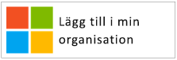
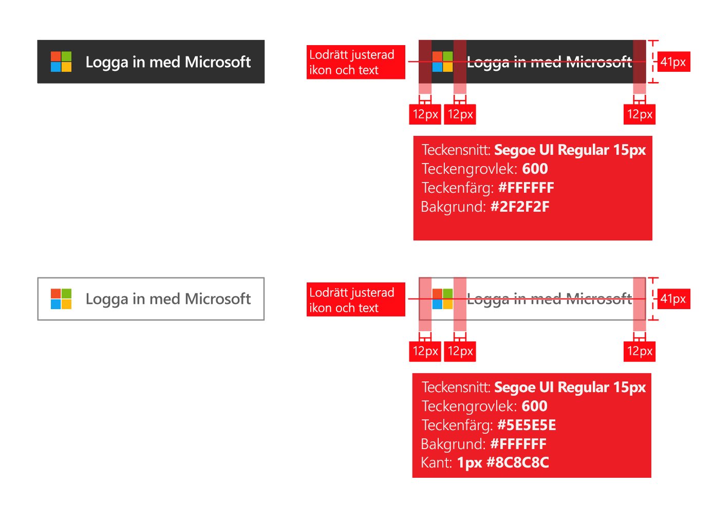
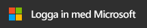
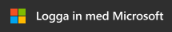
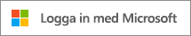
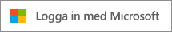
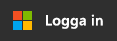
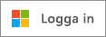

# Varumärkesriktlinjer för program

När du utvecklar program med Azure Active Directory (Azure AD) behöver du dirigera kunderna när de vill använda sitt arbets- eller skolkonto (hanteras i Azure AD) eller sitt personliga konto när de registrerar sig och loggar in i ditt program.

I den här artikeln kommer du att:

- Lära dig om de två typer av användarkonton som hanteras av Microsoft och hur du refererar till Azure AD-konton i ditt program
- Ta reda på vad du behöver göra för att lägga till Microsoft-logotypen för användning i din app
- Ladda ned de officiella bilderna för **Logga in** eller **Logga in med Microsoft** för användning i din app
- Läs mer om vad du behöver göra och tänka på när det gäller varumärkesanpassning och navigering

## Personliga konton jämfört med arbets- eller skolkonton från Microsoft

Microsoft hanterar två typer av användarkonton:

- **Personliga konton** (kallades tidigare Windows Live ID). De här kontona sätts upp mellan *enskilda* användare och Microsoft. De ger åtkomst till konsumentenheter och konsumenttjänster från Microsoft. De här kontona är avsedda för personligt bruk.
- **Arbets- eller skolkonton.** De här kontona hanteras av Microsoft, åt organisationer som använder Azure Active Directory. De är avsedda för att logga in på Office 365 och andra företagstjänster från Microsoft.

Microsofts arbets- eller skolkonton tilldelas vanligtvis till slutanvändare (anställda, studenter, myndighetsanställda) av organisationerna (företag, skola/universitet, myndighet). De hanteras direkt i molnet (via Azure AD-plattformen) eller synkroniseras till Azure AD från en lokal katalog, t.ex. Windows Server Active Directory. Microsoft *övervakar* arbets- och skolkonton, men de ägs och kontrolleras av organisationen.

## Referenser till Azure AD-konton i programmet

Microsoft visar inte varumärkena Azure och Active Directory för slutanvändare och det bör inte du heller göra.

- När användaren har loggat in använder du organisationens namn och logotyp så mycket som möjligt. Det är bättre än att använda allmänna termer, exempelvis ”organisationen”.
- När användare inte är inloggade kan du benämna deras konton som arbets- eller skolkonton och använda Microsoft-logotypen för att förmedla att Microsoft hanterar de här kontona. Använd inte termer som företagskonto och affärskonto. Det förvirrar användaren.

## Piktogram för användarkonto

I en tidigare version av de här riktlinjerna rekommenderar vi ett blått piktogram. Vi har fått återkoppling från användare och utvecklare och rekommenderar nu att du använder Microsofts logotyp istället. När användare ser Microsoft-logotypen förstår de att de kan återanvända kontot de använder med Office 365 och andra Microsoft-företagstjänster när de loggar in i ditt program.

## Registrera sig och logga in med Azure AD

Det kan finnas flera olika sätt att registrera sig och logga in i ditt program. Följande avsnitt visar hur båda scenarierna går till.

**Om slutanvändare kan registrera sig för ditt program (till exempel för en kostnadsfri utvärderingsversion)** : Du kan visa en **logga in**-knapp där användare kan komma åt din app med sitt arbetskonto eller personliga konto. Azure AD visar en samtyckestext första gången de öppnar din app.

**Om appen kräver behörigheter som endast administratörer kan godkänna, eller om programmet kräver organisationslicensiering**: Separera administratörshämtning från användarinloggning. Knappen för att **hämta den här appen** omdirigerar administratörer för att logga in och ber dem sedan att ge samtycke åt användare i organisationen. Det här har den ytterligare fördelen att prompter om slutanvändargodkännande undertrycks.

## Skaffa app – visuell vägledning

Den länk du lägger in för apphämtning måste omdirigera användaren till Azure AD-godkännandesidan (auktorisering). Administratören måste kunna godkänna så att appen får åtkomst till organisationens data, som tillhandahålls av Microsoft. Information om hur du begär åtkomst beskrivs i artikeln om att [integrera app med Azure Active Directory](quickstart-v1-integrate-apps-with-azure-ad.md).

När administratörerna har godkänt din app kan de välja att lägga till den i användarnas Office 365-programstartsupplevelse (tillgänglig via våfflan och [https://portal.office.com/myapps](https://portal.office.com/myapps)). Om du vill annonsera den här funktionen kan du till exempel skriva ”Lägg till den här appen i organisationen” och visa en knapp enligt följande exempel:

Vi rekommenderar dock att du skriver förklarande text istället för att förlita dig på knappar. Ett exempel:

> *Om du redan använder Office 365 eller andra företags tjänster från Microsoft kan du bevilja < your_app_name > åtkomst till din organisations data. Detta gör att användarna kan komma åt < your_app_name > med sina befintliga arbets konton.*

Du kan ladda ned den officiella Microsoft-logotypen och använda den i din app. Högerklicka på den du vill använda och spara den på datorn.

| Tillgång                                | PNG-format | SVG-format |
| ------------------------------------ | ---------- | ---------- |
| Microsoft-logotyp  |  |  |

## Visuell vägledning för inloggning

I din app bör det finnas en inloggningsknapp som omdirigerar användarna till inloggningsslutpunkten som motsvarar det protokoll du använder för att integrera med Azure AD. I det här avsnittet finns information om hur knappen ska se ut.

### Piktogram och Logga in med Microsoft

Det är associationerna som Microsoft-logotypen och uttrycket Logga in med Microsoft ger som unikt representerar Azure AD bland eventuella andra identitetsleverantörer som fungerar med din app. Om det inte finns tillräckligt med utrymme för Logga in med Microsoft går det bra att förkorta det till Logga in. Du kan välja ett ljust eller ett mörkt färgschema för knapparna.

I det här diagrammet visar vi Microsofts riktlinjer när du använder tillgångarna med din app. Riktlinjerna gäller för Logga in med Microsoft och det kortare Logga in.

Du kan ladda ned de officiella bilderna och använda dem i din app. Högerklicka på den du vill använda och spara den på datorn.

| Tillgång                                | PNG-format | SVG-format |
| ------------------------------------ | ---------- | ---------- |
| Logga in med Microsoft (mörkt tema)  |  |  |
| Logga in med Microsoft (ljust tema) |  |  |
| Logga in (mörkt tema)                 |  |  |
| Logga in (ljust tema)                |  |  |

## Rekommendationer för varumärke

**JA.** Skriv ”arbets- eller skolkonto” i kombination med knappen Logga in med Microsoft. Det här är en fras användarna känner igen och vet hur de ska använda. **NEJ.** Skriv inte andra termer, exempelvis företagskonto, jobbkonto eller affärskonto.

**NEJ.** Skriv inte Office 365-ID eller Azure-ID. Office 365 är också namnet på en konsumentprodukt från Microsoft. Den använder inte Azure AD för autentisering.

**NEJ.** Ändra inte på Microsoft-logotypen.

**NEJ.** Visa inte varumärkena Azure och Active Directory för slutanvändarna. Det går bra att använda de här termerna när du riktar dig till utvecklare, IT-proffs och administratörer.

## Rekommendationer vid navigering

**JA.** Gör det möjligt för användare att logga ut och växla till ett annat användarkonto. De flesta har bara ett privat konto hos Microsoft/Facebook/Google/Twitter, men många har flera konton som de använder i sitt arbete. Funktioner för flera inloggade användare kommer snart.
