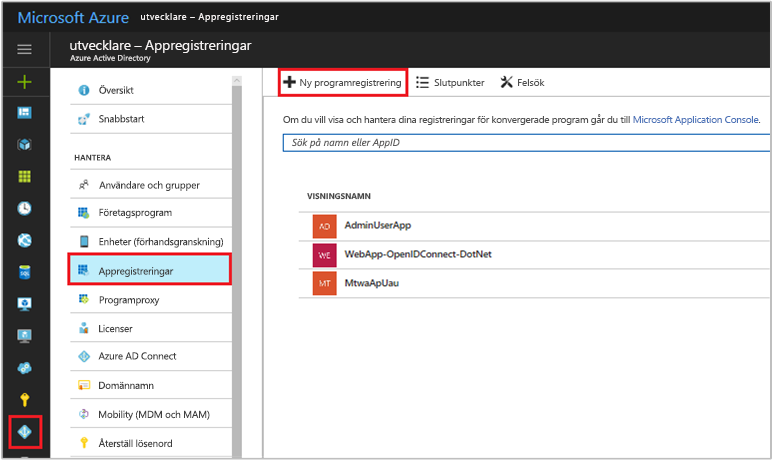
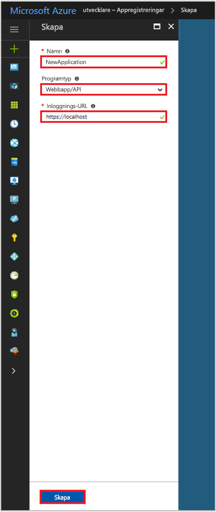

# Snabbstart: Registrera en app med Azure Active Directory v1.0-slutpunkten

[!INCLUDE [active-directory-develop-applies-v1](../../../includes/active-directory-develop-applies-v1.md)]

Företagsutvecklare och SaaS-leverantörer (software-as-a-service) kan utveckla kommersiella molntjänster och affärsprogram som kan integreras med Azure Active Directory (Azure AD) och då ger säker inloggning och behörighet till tjänsterna. För att kunna integrera ett program eller en tjänst med Azure AD måste en utvecklare först registrera programmet med Azure AD.

Alla program som vill använda funktionerna i Azure AD måste först registreras i en Azure AD-klientorganisation. Registreringsprocessen innebär att du ger Azure AD information om ditt program, till exempel den URL där det finns, den URL som ska användas för att skicka svar när en användare autentiseras, den URI som identifierar appen och så vidare.

Den här snabbstarten visar hur du lägger till och registrerar ett program i Azure AD.

## Nödvändiga komponenter

För att komma igång ser du till att ha en Azure AD-klientorganisation som du kan använda för att registrera dina appar till. Om du inte redan har en klientorganisation kan du [läsa om hur du skaffar en](quickstart-create-new-tenant.md).

## Registrera ett nytt program med hjälp av Azure-portalen

1. Logga in på [Azure Portal](https://portal.azure.com).
1. Om ditt konto ger dig tillgång till fler än en väljer du ditt konto i det övre högra hörnet och ställer in din portalsession på önskad Azure AD-klientorganisation.
1. I det vänstra navigeringsfönstret väljer du **Azure Active Directory**-tjänsten.
1. Välj **Appregistreringar** och välj sedan **Ny programregistrering**.

    

1. När sidan **Skapa** visas anger du programmets registreringsinformation: 

    - **Namn:** ange ett beskrivande programnamn
    - **Programtyp:**
      - Välj **Internt** för [klientprogram](developer-glossary.md#client-application) som installeras lokalt på en enhet. Den här inställningen används för OAuth-offentliga [interna klienter](developer-glossary.md#native-client).
      - Välj **Webbapp/API** för [klientprogram](developer-glossary.md#client-application) och [resurs/API-program](developer-glossary.md#resource-server) som är installerade på en säker server. Den här inställningen används för OAuth-konfidentiella [webbklienter](developer-glossary.md#web-client) och offentliga [användaragentbaserade klienter](developer-glossary.md#user-agent-based-client). Samma program kan även visa både en klient och resurs/API.
    - **Inloggnings-URL:** för ”webbapp/API”-program anger du grundläggande URL för din app. Till exempel kan `http://localhost:31544` vara URL för en webbapp som körs på din lokala dator. Användare skulle då använda den här URL:en för att logga in till ett webbklientprogram. 
    - **Omdirigerings-URI** för ”interna” program anger du den URI som används av Azure AD för att returnera tokensvar. Ange ett värde som är specifikt för ditt program, till exempel `http://MyFirstAADApp`

      

    Om du vill ha specifika exempel på webbprogram eller interna program kan du läsa **snabbstarterna** i dokumentationen.

1. När det är klart väljer du **Skapa**.

    Azure AD tilldelar ett unikt program-ID till ditt program, och du kommer till programmets huvudsakliga registreringssida. Beroende på om ditt program är ett webbprogram eller ett internt program ges olika alternativ för att lägga till ytterligare funktioner i programmet.

      > [!NOTE]
      > Som standard konfigureras ett nyligen registrerat program för att **endast** tillåta att användare från samma klientorganisation loggar in på programmet.

## Nästa steg

- Se [Azure AD-ramverket för medgivande](consent-framework.md) för att få en översikt över medgivande.
- För att aktivera konfigurationsfunktioner i din programregistrering – till exempel autentiseringsuppgifter, behörigheter och att aktivera inloggning för användare från andra klientorganisationer – läser du [Uppdatera ett program i Azure AD](quickstart-v1-update-azure-ad-app.md).
- Mer information om de två Azure AD-objekt som representerar ett registrerat program och relationen mellan dem finns i [Programobjekt och tjänsthuvudnamnsobjekt](app-objects-and-service-principals.md).
- Mer information om de varumärkesriktlinjer som du bör använda när du utvecklar program med Azure Active Directory finns i [Varumärkesriktlinjer för program](howto-add-branding-in-azure-ad-apps.md).
