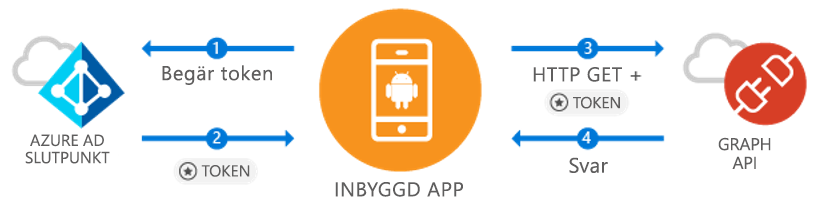

# <a name="quickstart-sign-in-users-and-call-the-microsoft-graph-api-from-an-android-app"></a>Snabbstart: Logga in användare och anropa Microsoft Graph API från en Android-app

[!INCLUDE [active-directory-develop-applies-v1-adal](../../../includes/active-directory-develop-applies-v1-adal.md)]

Om du utvecklar ett Android-program gör Microsoft det enkelt att logga in Azure Active Directory-användare (Azure AD). Azure AD gör att ditt program kan komma åt användardata via Microsoft Graph eller ditt eget skyddade webb-API.

Azure AD Authentication Library (ADAL) för Android gör att din app kan börja använda [Microsoft Azure Cloud](https://cloud.microsoft.com) och [Microsoft Graph API](https://developer.microsoft.com/graph) genom att stödja [Microsoft Azure Active Directory-konton](https://azure.microsoft.com/services/active-directory/) med hjälp av branschens standard-OAuth 2.0 och OpenID Connect.

I den här snabbstarten lär du dig att:

* Hämta en token för Microsoft Graph
* Uppdatera en token
* Anropa Microsoft Graph
* Logga ut användaren

## <a name="prerequisites"></a>Nödvändiga komponenter

För att komma igång behöver du en Azure AD-klientorganisationen där du kan skapa användare och registrera en app. Om du inte redan har en klientorganisation kan du [läsa om hur du skaffar en](quickstart-create-new-tenant.md).

## <a name="scenario-sign-in-users-and-call-the-microsoft-graph"></a>Scenario: Logga in användare och anropa Microsoft Graph



Du kan använda den här appen för alla Azure AD-konton. Den stöder både scenarier med en enda klientorganisation och med flera klientorganisationer (beskrivs i steg). Den visar hur du kan skapa appar för att ansluta till företagsanvändare och få åtkomst till deras Azure- och O365-data via Microsoft Graph. Under autentiseringsflödet kommer slutanvändarna att behöva logga in och godkänna programmets behörigheter, och i vissa fall kan det krävas att en administratör godkänner appen. Merparten av logiken i det här exemplet visar hur du autentiserar slutanvändarna och gör ett grundläggande anrop till Microsoft Graph.

## <a name="sample-code"></a>Exempelkod

Du hittar den fullständiga exempelkoden [på GitHub](https://github.com/Azure-Samples/active-directory-android).

```Java
// Initialize your app with MSAL
AuthenticationContext mAuthContext = new AuthenticationContext(
        MainActivity.this,
        AUTHORITY,
        false);


// Perform authentication requests
mAuthContext.acquireToken(
    getActivity(),
    RESOURCE_ID,
    CLIENT_ID,
    REDIRECT_URI,
    PromptBehavior.Auto,
    getAuthInteractiveCallback());

// ...

// Get tokens to call APIs like the Microsoft Graph
mAuthResult.getAccessToken()
```

## <a name="step-1-register-and-configure-your-app"></a>Steg 1: Registrera och konfigurera din app

Du behöver ha ett internt klientprogram som har registrerats med Microsoft med hjälp av [Azure-portalen](https://portal.azure.com).

1. Gå till appregistrering
    - Navigera till [Azure-portalen](https://aad.portal.azure.com).
    - Välj ***Azure Active Directory*** > ***Appregistreringar***.

2. Skapa appen
    - Välj **Ny programregistrering**.
    - Ange ett appnamn i fältet **Namn**.
    - I **Programtyp** väljer du **Intern**.
    - I **Redirect URI** (Omdirigerings-URI) anger du `http://localhost`.

3. Konfigurera Microsoft Graph
    - Välj **Inställningar > Nödvändiga behörigheter**.
    - Välj **Lägg till**, och i **Välj ett API** väljer du ***Microsoft Graph***.
    - Välj behörigheten **Logga in och läsa användarprofil** och tryck sedan på **Välj** för att spara.
        - Den här behörigheten mappar till omfånget `User.Read`.
    - Valfritt: I **Nödvändiga behörigheter > Windows Azure Active Directory** tar du bort den valda behörigheten **Logga in och läsa användarprofil**. Då undviker du att sidan för användarmedgivande visar behörigheten två gånger.

4. Gratulerar! Din app har konfigurerats. I nästa avsnitt behöver du:
    - `Application ID`
    - `Redirect URI`

## <a name="step-2-get-the-sample-code"></a>Steg 2: Hämta exempelkoden

1. Klona koden.
    ```
    git clone https://github.com/Azure-Samples/active-directory-android
    ```
2. Öppna exemplet i Android Studio.
    - Välja **Öppna ett befintligt Android Studio-projekt**.

## <a name="step-3-configure-your-code"></a>Steg 3: Konfigurera koden

All konfiguration för det här kodexemplet finns i filen ***src/main/java/com/azuresamples/azuresampleapp/MainActivity.java***.

1. Ersätt konstanten `CLIENT_ID` med `ApplicationID`.
2. Ersätt konstanten `REDIRECT URI` med den `Redirect URI` som du konfigurerade tidigare (`http://localhost`).

## <a name="step-4-run-the-sample"></a>Steg 4: Kör exemplet

1. Välj **Skapa > Rensa projekt**.
2. Välj **Kör > Kör app**.
3. Appen bör skapas och visa en grundläggande UX. När du klickar på knappen `Call Graph API` frågar den efter en inloggning och anropar sedan Microsoft Graph API tyst med den nya token.

## <a name="next-steps"></a>Nästa steg

1. Gå till [ADAL Android Wiki](https://github.com/AzureAD/azure-activedirectory-library-for-android/wiki) för att få mer information om biblioteksmekanismerna och hur du konfigurerar nya scenarier och funktioner.
2. I inbyggda scenarier använder appen en inbäddad Webview och kommer inte att lämna appen. `Redirect URI` kan vara vad som helst.
3. Upptäcker du problem eller har förfrågningar? Du kan skapa ett ärende eller ett inlägg på Stack Overflow med taggen `azure-active-directory`.

### <a name="cross-app-sso"></a>Enkel inloggning mellan appar

Lär dig [hur du aktiverar SSO mellan appar på Android med hjälp av ADAL](howto-v1-enable-sso-android.md).

### <a name="auth-telemetry"></a>Autentiseringstelemetri

ADAL-biblioteket visar autentiseringstelemetri för att hjälpa apputvecklare förstå hur deras appar fungerar och bygga bättre upplevelser. På så sätt kan du fånga lyckade inloggningar, aktiva användare och flera andra intressanta insikter. Användning av autentiseringstelemetri kräver att apputvecklare upprättar en telemetritjänst för att aggregera och lagra händelser.

Mer information om autentiseringstelemetri finns i [autentiseringstelemetri för ADAL Android](https://github.com/AzureAD/azure-activedirectory-library-for-android/wiki/Telemetry).
