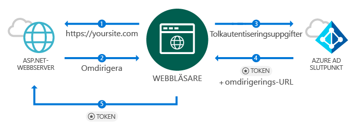
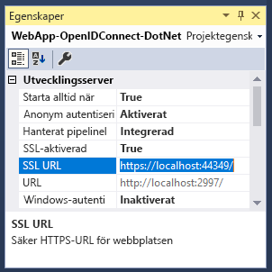
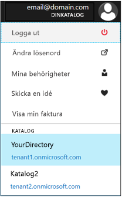
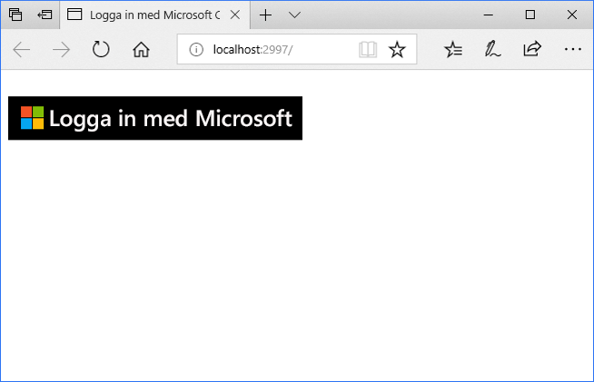
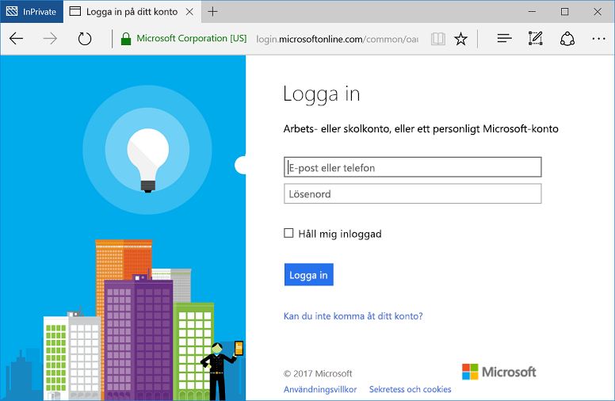

# <a name="quickstart-add-sign-in-with-microsoft-to-an-aspnet-web-app"></a>Snabbstart: Lägga till inloggning med Microsoft till en ASP.NET-webbapp

[!INCLUDE [active-directory-develop-applies-v1](../../../includes/active-directory-develop-applies-v1.md)]

I den här snabbstarten lär du dig hur du implementerar inloggning med Microsoft med hjälp av en ASP.NET MVC-lösning med ett traditionellt webbläsarbaserat program med OpenID Connect. Du lär dig hur du lägger till inloggning från arbets- och skolkonton i ditt ASP.NET-program.

När du är klar med den här snabbstarten kommer ditt program att acceptera inloggningar med arbets- och skolkonton från organisationer som är integrerade med Azure Active Directory (AD Azure).

> [!NOTE]
> Om du vill aktivera inloggningar för personliga konton förutom arbets-och skolkonton kan du använda den  *[Microsoft identity-plattformen endpoint](azure-ad-endpoint-comparison.md)*. Mer information finns i [självstudien ASP.NET](tutorial-v2-asp-webapp.md) samt [i den här artikeln](active-directory-v2-limitations.md) förklarar den *Microsoft identity-plattformen endpoint*.

## <a name="prerequisites"></a>Nödvändiga komponenter

Innan du börjar kontrollerar du att följande krav är uppfyllda:

* Visual Studio 2015 Update 3 eller Visual Studio 2017 är installerat. Saknas det? [Ladda ned Visual Studio 2017 utan kostnad](https://www.visualstudio.com/downloads/)

## <a name="scenario-sign-in-users-from-work-and-school-accounts-in-your-aspnet-app"></a>Scenario: Logga in användare från arbets- och skolkonton i din ASP.NET-app



I det här scenariot ansluter en webbläsare till en ASP.NET-webbplats och begär att en användare autentiserar via en inloggningsknapp. I det här scenariot sker merparten av renderingen av webbsidan på serversidan.

Snabbstarten demonstrerar hur du loggar in användare i ett ASP.NET-webbprogram med början från en tom mall, och innehåller bland annat steg som beskriver hur du lägger till en inloggningsknapp, kontrollanter och metoder, samt beskriver koncepten bakom dessa aktiviteter. Du kan också skapa ett projekt för att logga in Azure AD-användare (arbets- och skolkonton) med hjälp av [Visual Studio-webbmallen](https://docs.microsoft.com/aspnet/visual-studio/overview/2013/creating-web-projects-in-visual-studio#organizational-account-authentication-options) och välja **Organisationskonton** och sedan något av molnalternativen – det här alternativet använder en mer omfattande mall, med ytterligare kontrollanter, metoder och vyer.

## <a name="libraries"></a>Bibliotek

Den här snabbstarten använder följande paket:

| Bibliotek | Beskrivning |
|---|---|
| [Microsoft.Owin.Security.OpenIdConnect](https://www.nuget.org/packages/Microsoft.Owin.Security.OpenIdConnect/) | Mellanprogram som gör att ett program kan använda OpenIdConnect för autentisering |
| [Microsoft.Owin.Security.Cookies](https://www.nuget.org/packages/Microsoft.Owin.Security.Cookies) |Mellanprogram som gör att ett program kan hantera en användarsession med hjälp av cookies |
| [Microsoft.Owin.Host.SystemWeb](https://www.nuget.org/packages/Microsoft.Owin.Host.SystemWeb) | Gör att OWIN-baserade program kan köras i IIS med hjälp av pipelinen för ASP.NET-förfrågningar |
|  |  |

## <a name="step-1-set-up-your-project"></a>Steg 1: Konfigurera projektet

De här stegen visar hur du installerar och konfigurerar autentiseringspipelinen via OWIN-mellanprogrammet i ett ASP.NET-projekt med hjälp av OpenID Connect.

Om du i stället vill ladda ned Visual Studio-projektet för det här exemplet följer du dessa steg:
1. [Ladda ned projektet på GitHub](https://github.com/AzureADQuickStarts/WebApp-OpenIdConnect-DotNet/archive/GuidedSetup.zip).
1. Gå vidare till konfigurationssteget för att konfigurera kodexemplet innan du kör koden.

## <a name="step-2-create-your-aspnet-project"></a>Steg 2: Skapa ASP.NET-projektet

1. I Visual Studio går du till **Fil > Nytt > Projekt**.
2. Under **Visual C#\Web** väljer du **ASP.NET-webbprogram (.NET Framework)**.
3. Namnge ditt program och välj **OK**.
4. Välj **Tom** och markera sedan kryssrutan för att lägga till **MVC**-referenser.

## <a name="step-3-add-authentication-components"></a>Step 3: Lägga till autentiseringskomponenter

1. Gå till **Verktyg > NuGet Package Manager > Package Manager Console** i Visual Studio.
2. Lägg till **NuGet-paket för OWIN-mellanprogram** genom att skriva följande i Package Manager-konsolfönstret:

    ```powershell
    Install-Package Microsoft.Owin.Security.OpenIdConnect
    Install-Package Microsoft.Owin.Security.Cookies
    Install-Package Microsoft.Owin.Host.SystemWeb
    ```

<!--start-collapse-->
> ### <a name="about-these-packages"></a>Om dessa paket
>Biblioteken ovan möjliggör enkel inloggning (SSO) med hjälp av OpenID Connect via cookie-baserad autentisering. När autentiseringen har slutförts och den token som representerar användaren skickas till ditt program, skapar OWIN-mellanprogrammet en sessions-cookie. Webbläsaren använder sedan den här cookien för efterföljande förfrågningar så att användaren inte behöver autentisera på nytt, och ingen ytterligare verifiering krävs.
<!--end-collapse-->

## <a name="step-4-configure-the-authentication-pipeline"></a>Steg 4: Konfigurera autentiseringspipelinen

Följ dessa steg för att skapa en *startklass* för OWIN-mellanprogrammet och konfigurera OpenID Connect-autentisering. Den här klassen körs automatiskt.

> [!TIP]
> Om ditt projekt inte har en `Startup.cs`-fil i rotmappen:<br/>
> 1. Högerklicka på projektets rotmapp: > **Lägg till > Nytt objekt > OWIN-startklass**<br/>
> 2. Ge den namnet `Startup.cs`<br/>
>
>> Kontrollera att den klass som valts är en OWIN-startklass och inte en C#-standardklass. Bekräfta detta genom att kontrollera om `[assembly: OwinStartup(typeof({NameSpace}.Startup))]` visas ovanför namnområdet.

Så här skapar du en *startklass* för OWIN-mellanprogrammet:

1. Lägg till namnområdena *OWIN* och *Microsoft.IdentityModel* till `Startup.cs`:

    [!code-csharp[main](../../../WebApp-OpenIDConnect-DotNet/WebApp-OpenIDConnect-DotNet/Startup.cs?name=AddedNameSpaces "Startup.cs")]

2. Ersätt startklassen med följande kod:

    [!code-csharp[main](../../../WebApp-OpenIDConnect-DotNet/WebApp-OpenIDConnect-DotNet/Startup.cs?name=Startup "Startup.cs")]

<!--start-collapse-->
> [!NOTE]
> De parametrar som du anger i *OpenIDConnectAuthenticationOptions* fungerar som koordinater som programmet använder för att kommunicera med Azure AD. Eftersom OpenID Connect-mellanprogrammet använder cookies måste du även konfigurera cookie-autentisering som du ser i föregående kod. Värdet *ValidateIssuer* instruerar OpenIdConnect att inte begränsa åtkomsten till en specifik organisation.
<!--end-collapse-->

<!--end-setup-->

<!--start-use-->

## <a name="step-5-add-a-controller-to-handle-sign-in-and-sign-out-requests"></a>Steg 5: Lägga till en styrenhet för att hantera inloggnings- och utloggningsbegäranden

Skapa en ny kontrollant som exponerar in- och utloggningsmetoder.

1.  Högerklicka på mappen **Controllers** och välj **Lägg till > Kontrollant**
2.  Välj **MVC-kontrollant (.NET-version) – tom**.
3.  Välj **Lägg till**.
4.  Ge den namnet `HomeController` och välj **Lägg till**.
5.  Lägg till **OWIN**-namnområden till klassen:

    [!code-csharp[main](../../../WebApp-OpenIDConnect-DotNet/WebApp-OpenIDConnect-DotNet/Controllers/HomeController.cs?name=AddedNameSpaces "HomeController.cs")]

6. Lägg till följande metoder för in- och utloggningshantering i kontrollanten genom att initiera en autentiseringsfråga via följande kod:

    [!code-csharp[main](../../../WebApp-OpenIDConnect-DotNet/WebApp-OpenIDConnect-DotNet/Controllers/HomeController.cs?name=SigInAndSignOut "HomeController.cs")]

## <a name="step-6-create-the-apps-home-page-to-sign-in-users-via-a-sign-in-button"></a>Steg 6: Skapa appens startsida för att logga in användare via en inloggningsknapp

Skapa en ny vy i Visual Studio för att lägga till inloggningsknappen och visa användarinformation efter autentiseringen:

1. Högerklicka på mappen **Views\Home** och välj **Lägg till vy**.
1. Ge den namnet **Index**.
1. Lägg till följande HTML-kod, som innehåller inloggningsknappen, i filen:

    [!code-html[main](../../../WebApp-OpenIDConnect-DotNet/WebApp-OpenIDConnect-DotNet/Views/Home/Index.cshtml "Index.cshtml")]

<!--start-collapse-->
Den här sidan lägger till en knapp för inloggning i SVG-format med en svart bakgrund:<br/><br/> För fler inloggningsknappar går du till [Varumärkesriktlinjer för program](howto-add-branding-in-azure-ad-apps.md).
<!--end-collapse-->

## <a name="step-7-display-users-claims-by-adding-a-controller"></a>Steg 7: Visa användarens anspråk genom att lägga till en kontrollant

Den här kontrollanten demonstrerar hur `[Authorize]`-attributet kan skydda en kontrollant. Det här attributet begränsar åtkomsten till kontrollanten genom att bara tillåta autentiserade användare. Följande kod använder attributet för att visa användaranspråk som hämtades som en del av inloggningen.

1. Högerklicka på mappen **Controllers** och välj **Lägg till > Kontrollant**.
1. Välj **MVC-kontrollant {version} – tom**.
1. Välj **Lägg till**.
1. Ge den namnet **ClaimsController**.
1. Ersätt koden i kontrollantklassen med följande kod, som lägger till attributet `[Authorize]` till klassen:

    [!code-csharp[main](../../../WebApp-OpenIDConnect-DotNet/WebApp-OpenIDConnect-DotNet/Controllers/ClaimsController.cs?name=ClaimsController "ClaimsController.cs")]

<!--start-collapse-->
> [!NOTE]
> Eftersom attributet `[Authorize]` används kan metoderna för den här kontrollanten endast köras om användaren har autentiserats. Om användaren inte har autentiserats och försöker få åtkomst till kontrollanten, initierar OWIN en autentiseringsfråga och tvingar användaren att autentisera. Koden ovan letar i användarens anspråk efter specifika attribut som finns med i användarens token. Dessa attribut är användarens fullständiga namn och användarnamn, samt objektidentifieraren för den globala användaren. Den innehåller också *klientorganisations-ID:t*, som representerar ID:t för användarens organisation.
<!--end-collapse-->

## <a name="step-8-create-a-view-to-display-the-users-claims"></a>Steg 8: Skapa en vy för att visa användarens anspråk

Skapa en ny vy i Visual Studio för att visa användarens anspråk på en webbsida:

1. Högerklicka på mappen **Views\Claims** och välj sedan **Lägg till vy**.
1. Ge den namnet **Index**.
1. Lägg till följande HTML-kod i filen:

    [!code-html[main](../../../WebApp-OpenIDConnect-DotNet/WebApp-OpenIDConnect-DotNet/Views/Claims/Index.cshtml "Index.cshtml")]

<!--end-use-->

<!--start-configure-->

## <a name="step-9-configure-your-webconfig-and-register-an-application"></a>Steg 9: Konfigurera *web.config* och registrera ett program

1. I Visual Studio lägger du till följande i `web.config` (som finns i rotmappen) under avsnittet `configuration\appSettings`:

    ```xml
    <add key="ClientId" value="Enter_the_Application_Id_here" />
    <add key="RedirectUrl" value="Enter_the_Redirect_Url_here" />
    <add key="Tenant" value="common" />
    <add key="Authority" value="https://login.microsoftonline.com/{0}" />
    ```
2. Välj projektet i Solution Explorer och titta på fönstret <i>Egenskaper</i> (om du inte ser egenskapsfönstret trycker du på F4)
3. Ändra SSL aktiverat till <code>True</code>
4. Kopiera projektets SSL-URL till Urklipp:<br/><br/><br />
5. I <code>web.config</code> ersätter du <code>Enter_the_Redirect_URL_here</code> med SSL-URL:en för ditt projekt.

### <a name="register-your-application-in-the-azure-portal-then-add-its-information-to-webconfig"></a>Registrera ditt program på Azure-portalen och lägg sedan till dess information i *web.config*

1. Gå till [Appregistreringar på Microsoft Azure-portalen](https://portal.azure.com/#blade/Microsoft_AAD_IAM/ActiveDirectoryMenuBlade/RegisteredApps) för att registrera ett program.
2. Välj **Ny programregistrering**.
3. Ange ett namn för ditt program.
4. Klistra in Visual Studio-projektets *SSL-URL* i **Inloggnings-URL**. Den här URL:en läggs också till automatiskt i listan över svars-URL:er för det program som du registrerar.
5. Välj **Skapa** för att registrera programmet. Den här åtgärden tar dig tillbaka till listan med program.
6. Sök och/eller välj det program som du nyss skapade för att öppna dess egenskaper.
7. Kopiera GUID under **Program-ID** till Urklipp.
8. Gå tillbaka till Visual Studio och ersätt `Enter_the_Application_Id_here` i `web.config` med program-ID:t från programmet som du nyss registrerade.

> [!TIP]
> Om ditt konto har konfigurerats för åtkomst till flera kataloger kontrollerar du att du har valt rätt katalog för den organisation som du vill att programmet ska registreras för genom att klicka på namnet på ditt konto längst upp till höger på Azure-portalen och verifiera den valda katalogen:<br/>

## <a name="step-10-configure-sign-in-options"></a>Steg 10: Konfigurera inloggningsalternativ

Du kan konfigurera ditt program så att endast användare som tillhör en organisations Azure AD-instans kan logga in, eller godkänna inloggningar från användare oavsett vilken organisation de tillhör. Följ anvisningarna för något av följande alternativ:

### <a name="configure-your-application-to-allow-sign-ins-of-work-and-school-accounts-from-any-company-or-organization-multi-tenant"></a>Konfigurera ditt program för att tillåta inloggningar med arbets- och skolkonton från alla företag eller organisationer (flera innehavare)

Följ anvisningarna nedan om du vill godkänna inloggningar med arbets- och skolkonton från alla företag eller organisationer som är integrerade med Azure AD. Det här är ett vanligt scenario för *SaaS-program*:

1. Gå tillbaka till [Appregistreringar på Microsoft Azure-portalen](https://portal.azure.com/#blade/Microsoft_AAD_IAM/ActiveDirectoryMenuBlade/RegisteredApps) och leta upp det program som du nyss registrerade.
2. Under **Alla inställningar** väljer du **Egenskaper**.
3. Ändra egenskapen **Multi-klient** till **Ja** och välj sedan **Spara**.

Mer information om den här inställningen och begreppet ”program för flera innehavare” finns i [Översikt över flera innehavare](howto-convert-app-to-be-multi-tenant.md).

### <a name="restrict-users-from-only-one-organizations-active-directory-instance-to-sign-in-to-your-application-single-tenant"></a>Begränsa inloggningen till ditt program till en enda organisations Active Directory-instans (en enda innehavare)

Det här alternativet är ett vanligt scenario för affärsapplikationer.

Om du vill att programmet endast ska godkänna inloggningar från konton som tillhör en viss Azure AD-instans (inklusive *gästkonton* för den instansen) följer du dessa steg:

1. Ersätt parametern `Tenant` i *web.config* från `Common` med organisationens klientnamn, t.ex. *contoso.onmicrosoft.com*.
1. Ändra argumentet `ValidateIssuer` i [*OWIN-startklassen*](#step-4-configure-the-authentication-pipeline) till `true`.

Följ dessa steg om du endast vill tillåta användare från en lista med specifika organisationer:

1. Ange `ValidateIssuer` till Sant.
1. Använd parametern `ValidIssuers` för att ange en lista med organisationer.

Ett annat alternativ är att implementera en anpassad metod för att verifiera utfärdarna med hjälp av parametern *IssuerValidator*. Mer information om `TokenValidationParameters` finns i [den här MSDN-artikeln](https://msdn.microsoft.com/library/system.identitymodel.tokens.tokenvalidationparameters.aspx "MSDN-artikel om TokenValidationParameters").

<!--end-configure-->

<!--start-configure-arp-->
<!--
## Configure your ASP.NET Web App with the application's registration information

In this step, you will configure your project to use SSL, and then use the SSL URL to configure your application’s registration information. After this, add the application’ registration information to your solution via *web.config*.

1.  In Solution Explorer, select the project and look at the `Properties` window (if you don’t see a Properties window, press F4)
2.  Change `SSL Enabled` to `True`
3.  Copy the value from `SSL URL` above and paste it in the `Redirect URL` field on the top of this page, then click *Update*:<br/><br/><br />
4.  Add the following in `web.config` file located in root’s folder, under section `configuration\appSettings`:

```xml
<add key="ClientId" value="[Enter the application Id here]" />
<add key="RedirectUri" value="[Enter the Redirect URL here]" />
<add key="Tenant" value="common" />
<add key="Authority" value="https://login.microsoftonline.com/{0}" /> 
```
-->
<!--end-configure-arp-->
<!--start-test-->

## <a name="step-11-test-your-code"></a>Steg 11: Testa koden

1. Tryck på **F5** för köra projektet i Visual Studio. Webbläsaren öppnas och du dirigeras till `http://localhost:{port}` där du ser knappen **Logga in med Microsoft**.
1. Välj knappen för att logga in.

### <a name="sign-in"></a>Logga in

När du är redo att testa använder du ett arbetskonto (Azure AD) för att logga in.





#### <a name="expected-results"></a>Förväntat resultat

Efter inloggningen omdirigeras användaren till startsidan för din webbplats, som är den HTTPS-URL som anges i registreringsinformationen för ditt program på Microsofts programregistreringsportal. Den här sidan visar nu *Hello {Användare}* och en länk för att logga ut, samt en länk för att visa användarens anspråk – vilket är en länk till auktoriseringskontrollanten som du skapade tidigare.

### <a name="see-users-claims"></a>Visa användarens anspråk

Välj hyperlänken för att se användarens anspråk. Den här åtgärden leder dig till kontrollanten och vyn som endast är tillgängliga för användare som har autentiserats.

#### <a name="expected-results"></a>Förväntat resultat

 Du bör se en tabell som innehåller de grundläggande egenskaperna för den inloggade användaren:

| Egenskap | Värde | Beskrivning |
|---|---|---|
| Namn | {User Full Name} | Användarens förnamn och efternamn |
| Användarnamn | <span>user@domain.com</span> | Användarnamnet som används för att identifiera den inloggade användaren |
| Subjekt| {Subject} |En sträng som identifierar användarinloggningen unikt på webben |
| Klient-ID:t | {Guid} | Ett *guid* som representerar användarens Azure AD-organisation unikt |

Dessutom ser du en tabell med alla användaranspråk i autentiseringsbegäran. En lista över alla anspråk i en ID-Token och deras beskrivning finns i [listan över anspråk i ID-token](https://docs.microsoft.com/azure/active-directory/develop/active-directory-token-and-claims).

### <a name="optional-access-a-method-that-has-an-authorize-attribute"></a>(Valfritt) Få åtkomst till en metod som har ett *[Authorize]*-attribut

I det här steget ska du testa att komma åt anspråkskontrollanten som en anonym användare:<br/>
Välj länken för att logga ut användaren och slutför utloggningsprocessen.<br/>
Skriv `http://localhost:{port}/claims` i webbläsaren för att få åtkomst till kontrollanten som skyddas med `[Authorize]`-attributet

#### <a name="expected-results"></a>Förväntat resultat

Du uppmanas att autentisera dig för att få tillgång till vyn.

## <a name="additional-information"></a>Ytterligare information

<!--start-collapse-->
### <a name="protect-your-entire-web-site"></a>Skydda hela webbplatsen

Om du vill skydda hela webbplatsen lägger du till `AuthorizeAttribute` till `GlobalFilters` i `Global.asax` `Application_Start`-metoden:

```csharp
GlobalFilters.Filters.Add(new AuthorizeAttribute());
```
<!--end-collapse-->

<div></div>
<br/>

<!--end-test-->

## <a name="next-steps"></a>Nästa steg

Nu kan du fortsätta med fler scenarier.

> [!div class="nextstepaction"]
> [Självstudie om ASP.NET](https://docs.microsoft.com/azure/active-directory/develop/tutorial-v2-asp-webapp)
