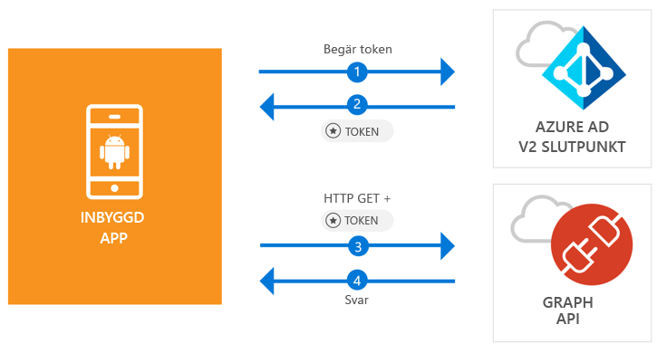

# <a name="quickstart-sign-in-users-and-call-the-microsoft-graph-api-from-an-android-app"></a>Snabbstart: Logga in användare och anropa Microsoft Graph API från en Android-app

[!INCLUDE [active-directory-develop-applies-v2-msal](../../../includes/active-directory-develop-applies-v2-msal.md)]

Den här snabbstarten innehåller ett kodexempel som visar hur ett Android-program kan logga in personliga konton eller arbets- och skolkonton, hämta en åtkomsttoken och anropa Microsoft Graph API.



> [!NOTE]
> **Förutsättningar**
> * Android Studio 3 eller senare
> * Android SDK 21 eller senare krävs (SDK 27 rekommenderas)

> [!div renderon="docs"]
> ## <a name="register-and-download"></a>Registrera och ladda ned
> ### <a name="register-and-configure-your-application-and-code-sample"></a>Registrera och konfigurera programmet och kodexemplet
> #### <a name="step-1-register-your-application"></a>Steg 1: Registrera ditt program
> Du registrerar programmet och lägger till programregistreringsinformationen i din lösning genom att göra följande:
> 1. Gå till [Microsoft-portalen för programregistrering](https://apps.dev.microsoft.com/portal/register-app) för att registrera ett program.
> 1. I rutan **Programnamn** anger du namnet på programmet.
> 1. Kontrollera att kryssrutan **Interaktiv installation** är avmarkerad och välj sedan **Skapa**.
> 1. Välj **Lägg till plattform**, välj **Internt program** och välj sedan **Spara**.

> [!div renderon="portal" class="sxs-lookup"]
> #### <a name="step-1-configure-your-application"></a>Steg 1: Konfigurera ditt program
> För att kodexemplet för den här snabbstarten ska fungera behöver du lägga till en svars-URL som **msal{AppId}://auth** (där {AppId} är program-ID för din app).
> > [!div renderon="portal" id="makechanges" class="nextstepaction"]
> > [Gör den här ändringen åt mig]()
>
> > [!div id="appconfigured" class="alert alert-info"]
> >  appen konfigureras med de här attributen

#### <a name="step-2-download-the-project"></a>Steg 2: Ladda ned projektet

* [Ladda ned Android Studio-projektet](https://github.com/Azure-Samples/active-directory-android-native-v2/archive/master.zip)

#### <a name="step-3-configure-your-project"></a>Steg 3: Konfigurera projektet

1. Extrahera och öppna projektet i Android Studio.
1. Under **app** > **java** > **<i>{värd}.{namnrymd}</i>** öppnar du **MainActivity**.
1. Ersätt den rad som börjar med `final static String CLIENT_ID` med:

    > [!div renderon="portal" class="sxs-lookup"]
    > ```java
    > final static String CLIENT_ID = "ENTER_THE_APPLICATION_ID_HERE";
    > ```

    > [!div renderon="docs"]
    > ```java
    > final static String CLIENT_ID = "<ENTER_THE_APPLICATION_ID_HERE>";
    > ```

1. Öppna: **app** > **manifests** > **AndroidManifest.xml**.
1. Lägg till att följande aktivitet i noden **manifest\application**. Det här kodavsnittet registrerar en **BrowserTabActivity** så att operativsystemet kan återuppta ditt program när autentiseringen är klar:

    > [!div renderon="docs"]
    > ```xml
    > <!--Intent filter to capture System Browser calling back to our app after Sign In-->
    > <activity
    >     android:name="com.microsoft.identity.client.BrowserTabActivity">
    >     <intent-filter>
    >         <action android:name="android.intent.action.VIEW" />
    >         <category android:name="android.intent.category.DEFAULT" />
    >         <category android:name="android.intent.category.BROWSABLE" />
    > 
    >         <!--Add in your scheme/host from registered redirect URI-->
    >         <!--By default, the scheme should be similar to 'msal[appId]' -->
    >         <data android:scheme="msal<ENTER_THE_APPLICATION_ID_HERE>"
    >             android:host="auth" />
    >     </intent-filter>
    > </activity>
    > ```

    > [!div renderon="portal" class="sxs-lookup"]
    > ```xml
    > <!--Intent filter to capture System Browser calling back to our app after Sign In-->
    > <activity
    >     android:name="com.microsoft.identity.client.BrowserTabActivity">
    >     <intent-filter>
    >         <action android:name="android.intent.action.VIEW" />
    >         <category android:name="android.intent.category.DEFAULT" />
    >         <category android:name="android.intent.category.BROWSABLE" />
    > 
    >         <!--Add in your scheme/host from registered redirect URI-->
    >         <!--By default, the scheme should be similar to 'msal[appId]' -->
    >         <data android:scheme="msalENTER_THE_APPLICATION_ID_HERE"
    >             android:host="auth" />
    >     </intent-filter>
    > </activity>
    > ```

> [!div renderon="docs"]
> <span>6.</span> Ersätt `<ENTER_THE_APPLICATION_ID_HERE>` med *program-ID* för ditt program. Om du behöver hitta *program-ID* går du till sidan *Översikt*.

## <a name="more-information"></a>Mer information

Läs följande avsnitt för att få mer information om den här snabbstarten.

### <a name="msal"></a>MSAL

MSAL ([com.microsoft.identity.client](https://javadoc.io/doc/com.microsoft.identity.client/msal)) är det bibliotek som används för att logga in användare och begära token som används för åtkomst till ett API som skyddas av Microsoft Azure Active Directory (Azure AD). Du kan använda Gradle för att installera det genom att lägga till följande i **Gradle-skript** > **build.gradle (modul: app)** under **Beroenden**:

```gradle  
implementation 'com.android.volley:volley:1.1.1'
implementation 'com.microsoft.identity.client:msal:0.1.+'
```

### <a name="msal-initialization"></a>MSAL-initiering

Du kan lägga till referensen för MSAL genom att lägga till följande kod:

```java
import com.microsoft.identity.client.*;
```

Initiera sedan MSAL med hjälp av följande kod:

```java
sampleApp = new PublicClientApplication(
        this.getApplicationContext(),
        CLIENT_ID);
```

> |Där: ||
> |---------|---------|
> |`CLIENT_ID` | Program-ID från den app som registrerats i *portal.azure.com* |

### <a name="requesting-tokens"></a>Begära token

MSAL har två metoder som används för att hämta token: `acquireToken` och `acquireTokenSilentAsync`

#### <a name="getting-a-user-token-interactively"></a>Hämta en användartoken interaktivt

Vissa situationer kräver att användare tvingas interagera med Azure AD v2.0-slutpunkten, vilket resulterar i ett kontextbyte till systemets webbläsare för att antingen verifiera användarnas autentiseringsuppgifter eller för medgivande. Några exempel är:

* Första gången användaren loggar in på programmet
* När användarna kan behöva ange sina autentiseringsuppgifter igen eftersom lösenordet har upphört att gälla
* När programmet begär åtkomst till en resurs som användaren behöver ge sitt medgivande för
* När tvåfaktorsautentisering krävs

```java
sampleApp.acquireToken(this, SCOPES, getAuthInteractiveCallback());
```

> |Där:||
> |---------|---------|
> | `SCOPES` | Innehåller de omfång som begärs (det vill säga `{ "user.read" }` för Microsoft Graph eller `{ "<Application ID URL>/scope" }` för anpassade webb-API:er (dvs. `api://<Application ID>/access_as_user`)) |
> | `getAuthInteractiveCallback` | Motringning som körs när kontroll ges tillbaka till programmet efter autentisering |

#### <a name="getting-a-user-token-silently"></a>Hämta en token obevakat

Du vill inte kräva att användarna verifierar sina autentiseringsuppgifter varje gång de behöver komma åt en resurs. I de flesta fall vill du ha hämtning och förnyelse av token utan någon användarinteraktion. Du kan använda metoden `AcquireTokenSilentAsync` för att hämta token för att komma åt skyddade resurser efter den inledande metoden `acquireToken`:

```java
sampleApp.acquireToken(getActivity(), SCOPES, getAuthInteractiveCallback());
```

> |Där:||
> |---------|---------|
> | `SCOPES` | Innehåller de omfång som begärs (det vill säga `{ "user.read" }` för Microsoft Graph eller `{ "<Application ID URL>/scope" }` för anpassade webb-API:er (dvs. `api://<Application ID>/access_as_user`)) |
> | `getAuthInteractiveCallback` | Motringning som körs när kontroll ges tillbaka till programmet efter autentisering |

## <a name="next-steps"></a>Nästa steg

### <a name="learn-the-steps-to-create-the-application-used-in-this-quickstart"></a>Lär dig stegen för hur du skapar det program som används i den här snabbstarten

Prova att använda Android-självstudien för en komplett stegvis guide till att skapa appar och nya funktioner, bland annat en fullständig förklaring av den här snabbstarten.

> [!div class="nextstepaction"]
> [Självstudie: Anropa Graph API för Android](https://docs.microsoft.com/azure/active-directory/develop/guidedsetups/active-directory-android)

### <a name="msal-for-android-library-wiki"></a>Wiki: MSAL för Android-bibliotek

Läs mer om MSAL–biblioteket för Android:

> [!div class="nextstepaction"]
> [Wiki: MSAL för Android-bibliotek](https://github.com/AzureAD/microsoft-authentication-library-for-android/wiki)

[!INCLUDE [Help and support](../../../includes/active-directory-develop-help-support-include.md)]
