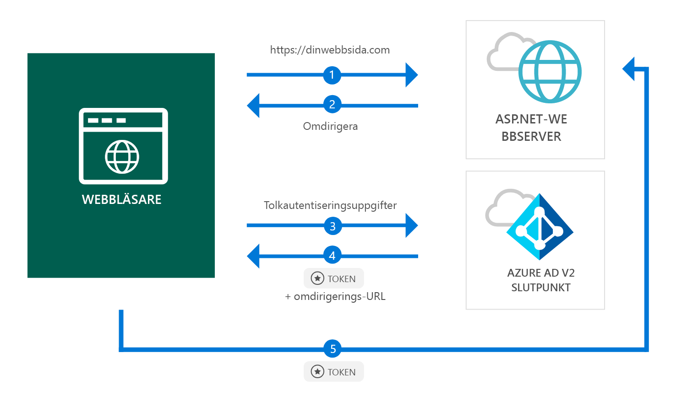

# <a name="quickstart-add-sign-in-with-microsoft-to-an-aspnet-web-app"></a>Snabbstart: Lägga till inloggning med Microsoft till en ASP.NET-webbapp

[!INCLUDE [active-directory-develop-applies-v2](../../../includes/active-directory-develop-applies-v2.md)]

I den här snabbstarten lär du dig hur en ASP.NET-webbapp kan logga in personliga konton (hotmail.com, outlook.com osv.) och arbets- och skolkonton från alla instanser av Active Directory (Azure AD).



> [!div renderon="docs"]
> ## <a name="register-and-download-your-quickstart-app"></a>Registrera och ladda ned snabbstartsappen
> Det finns två alternativ för att starta snabbstartsprogrammet:
> * [Express] [Alternativ 1: Registrera och konfigurera appen automatiskt och ladda sedan ned ditt kodexempel](#option-1-register-and-auto-configure-your-app-and-then-download-your-code-sample)
> * [Manuellt] [Alternativ 2: Registrera och konfigurera programmet och kodexemplet](#option-2-register-and-manually-configure-your-application-and-code-sample)
>
> ### <a name="option-1-register-and-auto-configure-your-app-and-then-download-your-code-sample"></a>Alternativ 1: Registrera och konfigurera appen automatiskt och ladda sedan ned ditt kodexempel
>
> 1. Gå till [Azure-portalen – Programregistrering (förhandsversion)](https://portal.azure.com/#blade/Microsoft_AAD_RegisteredApps/applicationsListBlade/quickStartType/AspNetWebAppQuickstartPage/sourceType/docs).
> 1. Ange ett namn för ditt program och klicka på **Registrera**.
> 1. Följ anvisningarna för att ladda ned och konfigurera det nya programmet automatiskt med ett enda klick.
>
> ### <a name="option-2-register-and-manually-configure-your-application-and-code-sample"></a>Alternativ 2: Registrera och konfigurera programmet och kodexemplet manuellt
>
> #### <a name="step-1-register-your-application"></a>Steg 1: Registrera ditt program
> Du registrerar programmet och lägger till appens registreringsinformationen i lösningen manuellt med hjälp av följande steg:
>
> 1. Logga in på [Azure-portalen](https://portal.azure.com) med ett arbets- eller skolkonto eller ett personligt Microsoft-konto.
> 1. Om ditt konto ger dig tillgång till fler än en klientorganisation väljer du ditt konto i det övre högra hörnet och ställer in din portalsession på önskad Azure AD-klientorganisation.
> 1. I det vänstra navigeringsfönstret väljer du **Azure Active Directory**-tjänsten och sedan **Appregistreringar (förhandsversion)** > **Ny registrering**.
> 1. När sidan **Registrera ett program** visas anger du programmets registreringsinformation:
>      - I avsnittet **Namn** anger du ett beskrivande programnamn som ska visas för appens användare, till exempel `ASPNET-Quickstart`.
>      - Lägg till `https://localhost:44368/` i **Svars-URL** och klicka på **Registrera**.
Välj **autentiseringsmenyn** och ange **ID-token** under **Implicit beviljande** och välj sedan **Spara**.

> [!div class="sxs-lookup" renderon="portal"]
> #### <a name="step-1-configure-your-application-in-azure-portal"></a>Steg 1: Konfigurera din app i Azure-portalen
> För att kodexemplet för den här snabbstarten ska fungera måste vi lägga till en svars-URL som `https://localhost:44368/`.
> > [!div renderon="portal" id="makechanges" class="nextstepaction"]
> > [Gör den här ändringen åt mig]()
>
> > [!div id="appconfigured" class="alert alert-info"]
> >  Appen har konfigurerats med det här attributet

#### <a name="step-2-download-your-project"></a>Steg 2: Ladda ned ditt projekt

[Ladda ned Visual Studio 2017-lösningen](https://github.com/AzureADQuickStarts/AppModelv2-WebApp-OpenIDConnect-DotNet/archive/master.zip)

#### <a name="step-3-configure-your-visual-studio-project"></a>Steg 3: Konfigurera ditt Visual Studio-projekt

1. Extrahera zip-filen i en lokal mapp närmare rotkatalogen, till exempel **C:\Azure-Samples**
1. Öppna lösningen i Visual Studio (AppModelv2-WebApp-OpenIDConnect-DotNet.sln)
1. Redigera **Web.config** och ersätt parametrarna `ClientId` och `Tenant` med:

    ```xml
    <add key="ClientId" value="Enter_the_Application_Id_here" />
    <add key="Tenant" value="Enter_the_Tenant_Info_Here" />
    ```

> [!div renderon="docs"]
> Där:
> - `Enter_the_Application_Id_here` – är program-Id för programmet som du har registrerat.
> - `Enter_the_Tenant_Info_Here` – är ett av alternativen nedan:
>   - Om ditt program stöder **Endast min organisation** ska du ersätta värdet med **klient-Id** eller **klientnamn** (till exempel contoso.microsoft.com)
>   - Om ditt program stöder **Konton i valfri organisationskatalog** ersätter du värdet med `organizations`
>   - Om ditt program stöder **Alla Microsoft-kontoanvändare** ersätter du värdet med `common`
>
> > [!TIP]
> > För att hitta värdena för *program-ID*, *katalog-ID (klient)* och *Kontotyper som stöds* går du till **översiktssidan**

## <a name="more-information"></a>Mer information

I det här avsnittet får du en översikt över koden som krävs för att logga in användare. Det kan vara användbart för att förstå hur koden fungerar, huvudargumenten och också om du vill lägga till inloggning för en befintlig ASP.NET-app.

### <a name="owin-middleware-nuget-packages"></a>OWIN-mellanprogrammets NuGet-paket

Du kan konfigurera autentiserings-pipeline med cookiebaserad autentisering med hjälp av OpenID Connect i ASP.NET med paket för OWIN-mellanprogrammet. Du kan installera dessa paket genom att köra följande kommandon i **Package Manager-konsolen** i Visual Studio:

```powershell
Install-Package Microsoft.Owin.Security.OpenIdConnect
Install-Package Microsoft.Owin.Security.Cookies
Install-Package Microsoft.Owin.Host.SystemWeb
```

### <a name="owin-startup-class"></a>OWIN-startklass

OWIN-mellanprogrammet använder en *startklass* som körs när värdprocessen initieras (i snabbstartens fall filen *startup.cs* som finns i rotmappen). Följande kod visar parametern som används av den här snabbstarten:

```csharp
public void Configuration(IAppBuilder app)
{
    app.SetDefaultSignInAsAuthenticationType(CookieAuthenticationDefaults.AuthenticationType);

    app.UseCookieAuthentication(new CookieAuthenticationOptions());
    app.UseOpenIdConnectAuthentication(
        new OpenIdConnectAuthenticationOptions
        {
            // Sets the ClientId, authority, RedirectUri as obtained from web.config
            ClientId = clientId,
            Authority = authority,
            RedirectUri = redirectUri,
            // PostLogoutRedirectUri is the page that users will be redirected to after sign-out. In this case, it is using the home page
            PostLogoutRedirectUri = redirectUri,
            Scope = OpenIdConnectScope.OpenIdProfile,
            // ResponseType is set to request the id_token - which contains basic information about the signed-in user
            ResponseType = OpenIdConnectResponseType.IdToken,
            // ValidateIssuer set to false to allow personal and work accounts from any organization to sign in to your application
            // To only allow users from a single organizations, set ValidateIssuer to true and 'tenant' setting in web.config to the tenant name
            // To allow users from only a list of specific organizations, set ValidateIssuer to true and use ValidIssuers parameter 
            TokenValidationParameters = new TokenValidationParameters()
            {
                ValidateIssuer = false
            },
            // OpenIdConnectAuthenticationNotifications configures OWIN to send notification of failed authentications to OnAuthenticationFailed method
            Notifications = new OpenIdConnectAuthenticationNotifications
            {
                AuthenticationFailed = OnAuthenticationFailed
            }
        }
    );
}
```

> |Var  |  |
> |---------|---------|
> | `ClientId`     | Program-ID från appen som registrerats i Azure-portalen |
> | `Authority`    | STS-slutpunkten för autentisering av användaren. Vanligtvis https://login.microsoftonline.com/{tenant}/v2.0 för offentligt moln, där {tenant} är namnet på din klientorganisation, ditt klientorganisations-ID eller *gemensam* för en referens till den gemensamma slutpunkten (används för appar för en innehavare) |
> | `RedirectUri`  | URL där användare skickas efter autentisering mot Azure AD v2.0-slutpunkt |
> | `PostLogoutRedirectUri`     | URL där användare skickas efter utloggning |
> | `Scope`     | Listan över omfång som begärs, avgränsade med blanksteg |
> | `ResponseType`     | Begär att svaret från autentiseringen innehåller en ID-token |
> | `TokenValidationParameters`     | En lista över parametrar för tokenvalidering. I det här fallet ställs `ValidateIssuer` in på `false` för att ange att den kan acceptera inloggningar från personliga konton eller arbets- eller skolkonton |
> | `Notifications`     | En lista över ombud kan köra på olika *OpenIdConnect*-meddelanden |

### <a name="initiate-an-authentication-challenge"></a>Initiera en autentiseringsfråga

Du kan tvinga en användare att logga in genom att begära en autentiseringsfråga i kontrollanten:

```csharp
public void SignIn()
{
    if (!Request.IsAuthenticated)
    {
        HttpContext.GetOwinContext().Authentication.Challenge(
            new AuthenticationProperties{ RedirectUri = "/" },
            OpenIdConnectAuthenticationDefaults.AuthenticationType);
    }
}
```

> [!TIP]
> Att begära en autentiseringsfråga med hjälp av metoden ovan är valfritt och används normalt när du vill att en vy ska nås från både autentiserade och icke-autentiserade användare. Du kan också skydda kontrollanter med hjälp av metoden som beskrivs i nästa avsnitt.

### <a name="protect-a-controller-or-a-controllers-method"></a>Skydda en kontrollant eller en kontrollants metod

Du kan skydda en kontrollant eller kontrollantåtgärder med attributet `[Authorize]`. Det här attributet begränsar åtkomsten till kontrollanten eller åtgärder genom att bara tillåta åtkomst för autentiserade användare i kontrollanten, vilket betyder att autentiseringsfråga tillämpas automatiskt när en *icke-autentiserad* användare försöker få åtkomst till någon av åtgärderna eller till kontrollanten som anpassats av attributet `[Authorize]`.

## <a name="next-steps"></a>Nästa steg

Prova att använda ASP.NET-självstudien för en komplett steg för steg-guide till att skapa appar och nya funktioner, bland annat en fullständig förklaring av den här snabbstarten.

### <a name="learn-the-steps-to-create-the-application-used-in-this-quickstart"></a>Lär dig hur du skapar appen som används i den här snabbstarten

> [!div class="nextstepaction"]
> [Självstudie om inloggning](.\tutorial-v2-asp-webapp.md)

[!INCLUDE [Help and support](../../../includes/active-directory-develop-help-support-include.md)]