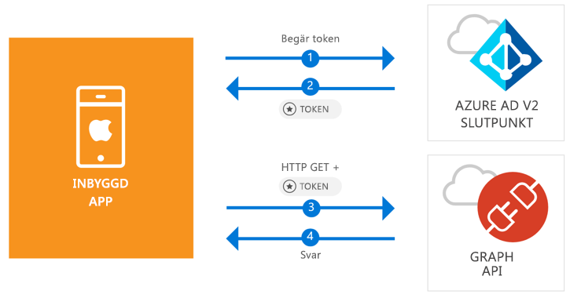

# <a name="quickstart-sign-in-users-and-call-the-microsoft-graph-api-from-an-ios-native-app"></a>Snabbstart: Logga in användare och anropa Microsoft Graph API från en intern iOS-app

[!INCLUDE [active-directory-develop-applies-v2-msal](../../../includes/active-directory-develop-applies-v2-msal.md)]

Den här snabbstarten innehåller ett kodexempel som visar hur ett internt iOS-program kan logga in personliga konton eller arbets- och skolkonton, hämta en åtkomsttoken och anropa Microsoft Graph API.



> [!div renderon="docs"]
> ## <a name="register-and-download"></a>Registrera och ladda ned
> ### <a name="register-and-configure-your-application-and-code-sample"></a>Registrera och konfigurera programmet och kodexemplet
> #### <a name="step-1-register-your-application"></a>Steg 1: Registrera ditt program
> Du registrerar programmet och lägger till programregistreringsinformationen i din lösning genom att göra följande:
> 1. Gå till [Microsoft-portalen för programregistrering](https://apps.dev.microsoft.com/portal/register-app) för att registrera ett program.
> 1. I rutan **Programnamn** anger du namnet på programmet.
> 1. Kontrollera att kryssrutan **Interaktiv installation** är avmarkerad och välj sedan **Skapa**.
> 1. Välj **Lägg till plattform**, välj **Internt program** och välj sedan **Spara**.

> [!div renderon="portal" class="sxs-lookup"]
> #### <a name="step-1-configure-your-application"></a>Steg 1: Konfigurera ditt program
> För att kodexemplet för den här snabbstarten ska fungera behöver du lägga till en svars-URL som `msal<AppId>://auth` (när msal<AppId> är detta program-ID).
> > [!div renderon="portal" id="makechanges" class="nextstepaction"]
> > [Gör den här ändringen åt mig]()
>
> > [!div id="appconfigured" class="alert alert-info"]
> >  appen konfigureras med det här attributet

#### <a name="step-2-download-your-web-server-or-project"></a>Steg 2: Ladda ned webbservern eller projektet

- [Ladda ned XCode-projektet](https://github.com/Azure-Samples/active-directory-ios-swift-native-v2/archive/master.zip)

#### <a name="step-3-configure-your-project"></a>Steg 3: Konfigurera projektet

1. Extrahera zip-filen och öppna projektet i XCode.
1. Redigera **ViewController.swift** och ersätt den rad som börjar med ”let kClientID” med följande kodavsnitt:

    > [!div renderon="portal" class="sxs-lookup"]
    > ```swift
    > let kClientID = "Enter_the_Application_Id_here"
    > ```

    > [!div renderon="docs"]
    > ```swift
    > let kClientID = "<ENTER_THE_APPLICATION_ID_HERE>"
    > ```   
1. Ctrl-klicka på **Info.plist** för att öppna snabbmenyn och välj sedan **Öppna som** > **Källkod**.
1. Under dict rotnoden lägger du till följande kod:

    > [!div renderon="portal" class="sxs-lookup"]
    > ```xml
    > <key>CFBundleURLTypes</key>
    > <array>
    >     <dict>
    >         <key>CFBundleTypeRole</key>
    >         <string>Editor</string>
    >         <key>CFBundleURLName</key>
    >         <string>$(PRODUCT_BUNDLE_IDENTIFIER)</string>
    >         <key>CFBundleURLSchemes</key>
    >         <array>
    >             <string>msalEnter_the_Application_Id_here</string>
    >         </array>
    >     </dict>
    > </array>
    > ```

    > [!div renderon="docs"]
    > ```xml
    > <key>CFBundleURLTypes</key>
    > <array>
    >     <dict>
    >         <key>CFBundleTypeRole</key>
    >         <string>Editor</string>
    >         <key>CFBundleURLName</key>
    >         <string>$(PRODUCT_BUNDLE_IDENTIFIER)</string>
    >         <key>CFBundleURLSchemes</key>
    >         <array>
    >             <string>msal<ENTER_THE_APPLICATION_ID_HERE></string>
    >         </array>
    >     </dict>
    > </array>
    > ```
    
> [!div renderon="docs"]
> <span>5.</span> Ersätt `<ENTER_THE_APPLICATION_ID_HERE>` med *program-ID* för ditt program. Om du behöver hitta *program-ID* går du till sidan *Översikt*.

## <a name="more-information"></a>Mer information

Läs dessa avsnitten om du vill lära dig mer om den här snabbstarten.

### <a name="msal"></a>MSAL

MSAL ([MSAL.framework](https://github.com/AzureAD/microsoft-authentication-library-for-objc)) är det bibliotek som används för att logga in användare och begära token som används för åtkomst till ett API som skyddas av Microsoft Azure Active Directory. Du kan lägga till MSAL i ditt program med hjälp av följande process:

```
$ vi Podfile
```
Lägg till följande i Podfile:

```
 target 'QuickStart' do
   use_frameworks!
 pod 'MSAL'
 end
```

### <a name="msal-initialization"></a>MSAL-initiering

Du kan lägga till referensen för MSAL genom att lägga till följande kod:

```swift
import MSAL
```

Initiera sedan MSAL med hjälp av följande kod:

```swift
let authority = MSALAuthority(url: URL(string: kAuthority)!)
self.applicationContext = try MSALPublicClientApplication(clientId: kClientID, authority: authority)
```

> |Där: ||
> |---------|---------|
> | `clientId` | Program-ID från den app som registrerats i *portal.azure.com* |
> | `authority` | Azure AD v2.0-slutpunkten. I de flesta fall är detta *https<span/>://login.microsoftonline.com/common* |

### <a name="requesting-tokens"></a>Begära token

MSAL har två metoder som används för att hämta token: `acquireToken` och `acquireTokenSilent`.

#### <a name="getting-an-access-token-interactively"></a>Hämta en åtkomsttoken interaktivt

Vissa situationer kräver att användare tvingas interagera med Azure Active Directory (Azure AD) v2.0-slutpunkten, vilket resulterar i ett kontextbyte till systemets webbläsare för att antingen verifiera användarnas autentiseringsuppgifter eller för medgivande. Några exempel är:

* Första gången användaren loggar in på programmet
* När användarna kan behöva ange sina autentiseringsuppgifter igen eftersom lösenordet har upphört att gälla
* När programmet begär åtkomst till en resurs som användaren behöver ge sitt medgivande för
* När tvåfaktorsautentisering krävs

```swift
applicationContext.acquireToken(forScopes: self.kScopes) { (result, error) in /* Add your handling logic */}
```

> |Där:||
> |---------|---------|
> | `forScopes` | Innehåller de omfång som begärs (det vill säga [ "user.read" ]` for Microsoft Graph or `[ "<Application ID URL>/scope" ]` for custom Web APIs (i.e. `api://<Application ID>/access_as_user`)) |

#### <a name="getting-an-access-token-silently"></a>Hämta en åtkomsttoken obevakat

Du vill inte kräva att användarna verifierar sina autentiseringsuppgifter varje gång de behöver komma åt en resurs. I de flesta fall vill du ha hämtning och förnyelse av token utan någon användarinteraktion. Du kan använda metoden `acquireTokenSilent` för att hämta token för att komma åt skyddade resurser efter den inledande metoden `acquireToken`:

```swift
applicationContext.acquireTokenSilent(forScopes: self.kScopes, account: applicationContext.allAccounts().first) { (result, error) in /* Add your handling logic */}
```

> |Där: ||
> |---------|---------|
> | `forScopes` | Innehåller de omfång som begärs (det vill säga `[ "user.read" ]` för Microsoft Graph eller `[ "<Application ID URL>/scope" ]` för anpassade webb-API:er (dvs. `api://<Application ID>/access_as_user`)) |
> | `account` | Det konto som begär token (MSAL stöder flera konton i en enda app). När det gäller den här snabbstarten pekar värdet på det första kontot i cachen (`applicationContext.allAccounts().first`). |

## <a name="next-steps"></a>Nästa steg

Prova att använda iOS-självstudien för en komplett stegvis guide till att skapa appar och nya funktioner, bland annat en fullständig förklaring av den här snabbstarten.

### <a name="learn-the-steps-to-create-the-application-used-in-this-quickstart"></a>Lär dig stegen för hur du skapar det program som används i den här snabbstarten

> [!div class="nextstepaction"]
> [Självstudie om att anropa Graph API för iOS](https://docs.microsoft.com/azure/active-directory/develop/guidedsetups/active-directory-ios)

[!INCLUDE [Help and support](../../../includes/active-directory-develop-help-support-include.md)]
