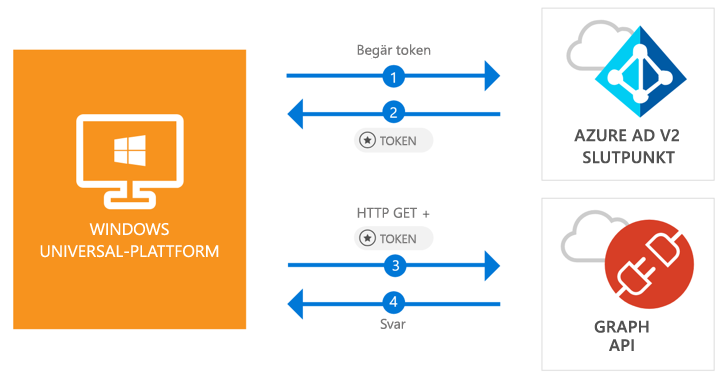

# <a name="call-the-microsoft-graph-api-from-a-universal-windows-platform-uwp-application"></a>Anropa Microsoft Graph API från en UWP-app (universell Windows-plattform)

[!INCLUDE [active-directory-develop-applies-v2-msal](../../../includes/active-directory-develop-applies-v2-msal.md)]

Den här snabbstarten innehåller ett kodexempel som visar hur en UWP-app (universell Windows-plattform) kan logga in användare med ett personligt konto eller arbets- och skolkonto, hämta en åtkomsttoken och anropa Microsoft Graph API.



> [!div renderon="docs"]
> ## <a name="register-and-download"></a>Registrera dig och ladda ned
> ### <a name="register-and-configure-your-application-and-code-sample"></a>Registrera och konfigurera appen och kodexemplet
> #### <a name="step-1-register-your-application"></a>Steg 1: Registrera din app
> Du registrerar appen och lägger till appregistreringsinformationen i din lösning genom att göra följande:
> 1. Gå till [Microsoft-portalen för appregistrering](https://apps.dev.microsoft.com/portal/register-app) för att registrera en app.
> 1. I rutan **Application Name** (Appnamn) anger du namnet på din app.
> 1. Kontrollera att kryssrutan **Guided Setup** (Interaktiv installation) är avmarkerad och välj sedan **Create** (Skapa).
> 1. Välj **Add Platform** (Lägg till plattform), välj **Native Application** (Internt program) och välj sedan **Save** (Spara).

> [!div renderon="portal" class="sxs-lookup alert alert-info"]
> #### <a name="step-1-configure-your-application"></a>Steg 1: Konfigurera din app
> För kodexemplet för den här snabbstarten måste du lägga till en omdirigerings-URL som **urn:ietf:wg:oauth:2.0:oob**.
> > [!div renderon="portal" id="makechanges" class="nextstepaction"]
> > [Gör den här ändringen åt mig]()
>
> > [!div id="appconfigured" class="alert alert-info"]
> >  Appen har konfigurerats med de här attributen

#### <a name="step-2-download-your-visual-studio-project"></a>Steg 2: Ladda ned ditt Visual Studio-projekt

 - [Ladda ned Visual Studio 2017-projektet](https://github.com/Azure-Samples/active-directory-dotnet-native-uwp-v2/archive/master.zip)

#### <a name="step-3-configure-your-visual-studio-project"></a>Steg 3: Konfigurera ditt Visual Studio-projekt

1. Extrahera zip-filen i en lokal mapp (t.ex. **C:\Azure-Samples**)
1. Öppna projektet i Visual Studio
1. Redigera **App.Xaml.cs** och ersätt raden som börjar med `private static string ClientId` med:

    ```csharp
    private static string ClientId = "Enter_the_Application_Id_here";
    ```

## <a name="more-information"></a>Mer information

Nedan en översikt över den här snabbstarten:

### <a name="msalnet"></a>MSAL.NET

MSAL ([Microsoft.Identity.Client](https://www.nuget.org/packages/Microsoft.Identity.Client)) är det bibliotek som används för att logga in användare och begära token som används för åtkomst till ett API som skyddas av Microsoft Azure Active Directory. Du kan installera det genom att köra följande kommando i *Package Manager-konsolen* i Visual Studio:

```powershell
Install-Package Microsoft.Identity.Client -Pre
```

### <a name="msal-initialization"></a>Initiering av MSAL

Du kan lägga till referensen för MSAL genom att lägga till raden nedan:

```csharp
using Microsoft.Identity.Client;
```

Initiera sedan MSAL med hjälp av raden nedan:

```csharp
public static PublicClientApplication PublicClientApp = new PublicClientApplication(ClientId);
```

> |Där: ||
> |---------|---------|
> |ClientId | Program-ID från appen som registrerats i *portal.microsoft.com* |

### <a name="requesting-tokens"></a>Begära token

MSAL har två metoder som används för att hämta token – `AcquireTokenAsync` och `AcquireTokenSilentAsync`:

#### <a name="get-a-user-token-interactively"></a>Hämta en token interaktivt

 Vissa situationer kräver att tvinga användare att interagera med Azure Active Directory v2-slutpunkten via ett popup-fönster för att verifiera sina autentiseringsuppgifter eller ge sitt medgivande – några exempel är:

- Första gången användaren loggar in på appen
- Användarna kan behöva ange sina autentiseringsuppgifter igen eftersom lösenordet har upphört att gälla
- Din app begär åtkomst till en resurs som användaren behöver ge sitt medgivande för
- Tvåfaktorsautentisering krävs

```csharp
authResult = await App.PublicClientApp.AcquireTokenAsync(scopes);
```

> |Där:||
> |---------|---------|
> |scopes | Innehåller de omfång som begärs (dvs. `{ "user.read" }` för Microsoft Graph eller `{ "api://<Application ID>/access_as_user" }` för anpassade webb-API:er) |

#### <a name="get-a-user-token-silently"></a>Hämta en token obevakat

Du vill inte kräva användare att verifiera sina autentiseringsuppgifter varje gång de behöver få åtkomst till en resurs – den mesta av tiden vill du ha tokenhämtningar och förnyelse utan någon användarinteraktion – `AcquireTokenSilentAsync` är metoden som vanligen används för att hämta token som används för åtkomstskyddade resurser efter den inledande `AcquireTokenAsync`:

```csharp
var accounts = await App.PublicClientApp.GetAccountsAsync();
authResult = await App.PublicClientApp.AcquireTokenSilentAsync(scopes, accounts.FirstOrDefault());
```

> |Där: ||
> |---------|---------|
> |scopes | Innehåller de omfång som begärs (dvs. `{ "user.read" }` för Microsoft Graph eller `{ "api://<Application ID>/access_as_user" }` för anpassade webb-API:er) |
> |accounts.FirstOrDefault() | Den första användaren i cachen (MSAL stöder flera användare i en enda app) |

## <a name="next-steps"></a>Nästa steg

Prova att använda självstudien om Windows-skrivbordet för en komplett steg för steg-guide till att skapa appar och skapa nya funktioner, bland annat en fullständig förklaring av den här snabbstarten:

### <a name="learn-the-steps-to-create-the-application-used-in-this-quickstart"></a>Lär dig hur du skapar appen som används i den här snabbstarten

> [!div class="nextstepaction"]
> [UWP – Självstudie om att anropa Graph API](tutorial-v2-windows-uwp.md)

[!INCLUDE [Help and support](../../../includes/active-directory-develop-help-support-include.md)]