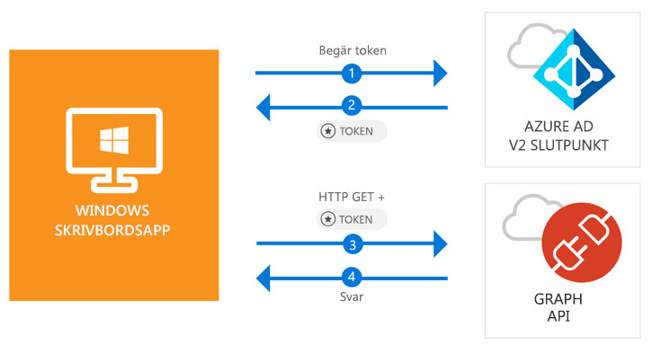

# <a name="quickstart-acquire-a-token-and-call-microsoft-graph-api-from-a-windows-desktop-app"></a>Snabbstart: Hämta en token och anropa Microsoft Graph API från en Windows-skrivbordsapp

[!INCLUDE [active-directory-develop-applies-v2-msal](../../../includes/active-directory-develop-applies-v2-msal.md)]

I den här snabbstarten får du lära dig hur ett Windows-skrivbordsprogram med .NET (WPF) kan logga in personliga konton och arbets- och skolkonton, hämta en åtkomsttoken samt anropa Microsoft Graph API.



> [!div renderon="docs"]
> ## <a name="register-and-download"></a>Registrera och ladda ned
> ### <a name="register-and-configure-your-application-and-code-sample"></a>Registrera och konfigurera programmet och kodexemplet
> #### <a name="step-1-register-your-application"></a>Steg 1: Registrera ditt program
> Du registrerar programmet och lägger till programregistreringsinformationen i din lösning genom att göra följande:
> 1. Gå till [Microsoft-portalen för programregistrering](https://apps.dev.microsoft.com/portal/register-app) för att registrera ett program.
> 1. I rutan **Programnamn** anger du namnet på programmet.
> 1. Kontrollera att kryssrutan **Interaktiv installation** är avmarkerad och välj sedan **Skapa**.
> 1. Välj **Lägg till plattform**, välj **Internt program** och välj sedan **Spara**.

> [!div renderon="portal" class="sxs-lookup"]
> #### <a name="step-1-configure-your-application"></a>Steg 1: Konfigurera programmet
> För att kodexemplet för den här snabbstarten ska fungera behöver du lägga till en svars-URL som **urn:ietf:wg:oauth:2.0:oob**.
> > [!div renderon="portal" id="makechanges" class="nextstepaction"]
> > [Gör den här ändringen åt mig]()
>
> > [!div id="appconfigured" class="alert alert-info"]
> >  appen konfigureras med de här attributen

#### <a name="step-2-download-your-visual-studio-project"></a>Steg 2: Ladda ned ditt Visual Studio-projekt

[Ladda ned Visual Studio 2017-projektet](https://github.com/Azure-Samples/active-directory-dotnet-desktop-msgraph-v2/archive/master.zip)

#### <a name="step-3-configure-your-visual-studio-project"></a>Steg 3: Konfigurera ditt Visual Studio-projekt

1. Extrahera zip-filen i en lokal mapp (till exempel **C:\Azure-Samples**)
1. Öppna projektet i Visual Studio.
1. Redigera **App.Xaml.cs** och ersätt den rad som börjar med `private static string ClientId` med program-ID från den app som du precis har registrerat:

```csharp
private static string ClientId = "Enter_the_Application_Id_here";
```

## <a name="more-information"></a>Mer information

### <a name="msalnet"></a>MSAL.NET

MSAL ([Microsoft.Identity.Client](https://www.nuget.org/packages/Microsoft.Identity.Client)) är det bibliotek som används för att logga in användare och begära token som används för åtkomst till ett API som skyddas av Microsoft Azure Active Directory (Azure AD). Du kan installera det genom att köra följande kommando i **Package Manager-konsolen** i Visual Studio:

```powershell
Install-Package Microsoft.Identity.Client -Pre
```

### <a name="msal-initialization"></a>MSAL-initiering

Du kan lägga till referensen för MSAL genom att lägga till följande kod:

```csharp
using Microsoft.Identity.Client;
```

Initiera sedan MSAL med hjälp av följande kod:

```csharp
public static PublicClientApplication PublicClientApp = new PublicClientApplication(ClientId);
```

> |Där: ||
> |---------|---------|
> | `ClientId` | Program-ID från den app som registrerats i *portal.microsoft.com* |

### <a name="requesting-tokens"></a>Begära token

MSAL har två metoder som används för att hämta token: `AcquireTokenAsync` och `AcquireTokenSilentAsync`.

#### <a name="get-a-user-token-interactively"></a>Hämta en användartoken interaktivt

Vissa situationer kräver att användare tvingas interagera med Azure AD v2.0-slutpunkten via ett popup-fönster för att antingen verifiera sina autentiseringsuppgifter eller ge sitt medgivande. Några exempel är:

- Första gången användaren loggar in på programmet
- När användarna kan behöva ange sina autentiseringsuppgifter igen eftersom lösenordet har upphört att gälla
- När programmet begär åtkomst till en resurs som användaren behöver ge sitt medgivande för
- När tvåfaktorsautentisering krävs

```csharp
authResult = await App.PublicClientApp.AcquireTokenAsync(_scopes);
```

> |Där:||
> |---------|---------|
> | `_scopes` | Innehåller de omfång som begärs (det vill säga `{ "user.read" }` för Microsoft Graph eller `{ "api://<Application ID>/access_as_user" }` för anpassade webb-API:er) |

#### <a name="get-a-user-token-silently"></a>Hämta en token obevakat

Du vill inte kräva att användarna verifierar sina autentiseringsuppgifter varje gång de behöver komma åt en resurs. I de flesta fall vill du ha hämtning och förnyelse av token utan någon användarinteraktion. Du kan använda metoden `AcquireTokenSilentAsync` för att hämta token för att komma åt skyddade resurser efter den inledande metoden `AcquireTokenAsync`:

```csharp
var accounts = await App.PublicClientApp.GetAccountsAsync();
authResult = await App.PublicClientApp.AcquireTokenSilentAsync(scopes, accounts.FirstOrDefault());
```

> |Där: ||
> |---------|---------|
> |scopes | innehåller de omfång som begärs (dvs. `{ "user.read" }` för Microsoft Graph eller `{ "api://<Application ID>/access_as_user" }` för anpassade webb-API:er) |
> |accounts.FirstOrDefault() | Den första användaren i cachen (MSAL stöder flera användare i en enda app) |

## <a name="next-steps"></a>Nästa steg

Prova att använda självstudien om Windows-skrivbordet för en komplett stegvis guide till att skapa appar och nya funktioner, däribland en fullständig förklaring av den här snabbstarten.

### <a name="learn-the-steps-to-create-the-application-used-in-this-quickstart"></a>Lär dig stegen för hur du skapar det program som används i den här snabbstarten

> [!div class="nextstepaction"]
> [Självstudie om att anropa Graph API](https://docs.microsoft.com/azure/active-directory/develop/guidedsetups/active-directory-windesktop)

[!INCLUDE [Help and support](../../../includes/active-directory-develop-help-support-include.md)]
