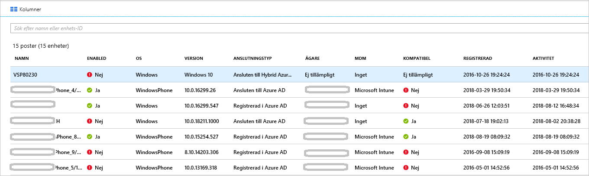

# <a name="how-to-manage-the-stale-devices-in-azure-ad"></a>Instruktioner: Hantera inaktuella enheter i Azure AD

Vi rekommenderar att avregistrera registrerade enheter när det inte behövs längre, och när livscykeln ska avslutas. Men på grund av, till exempel, förlorade, stulna eller trasiga enheter, eller ominstallationer av operativsystem har du vanligtvis enheter i din miljö. Som IT-administratör vill du troligen ha en metod för att ta bort inaktuella enheter, så att du kan fokusera dina resurser på att hantera enheter som faktiskt kräver hantering.

I den här artikeln lär du dig hur du på ett effektivt sätt hanterar inaktuella enheter i din miljö.
  

## <a name="what-is-a-stale-device"></a>Vad är en inaktuell enhet?

En inaktuell enhet är en enhet som har registrerats i Azure AD men inte har använts för åtkomst till några molnappar under en viss tid. Inaktuella enheter har en påverkan på din möjlighet att hantera och stödja dina enheter och användare i klientorganisationen eftersom: 

- Dubblettenheter kan göra det svårt för supportpersonalen att identifiera vilken enhet som är aktiv.

- Ett ökat antal enheter skapar onödiga enhetstillbakaskrivningar, som ökar tiden för AAD-anslutna synkroniseringar.

- Som allmän hygien och för att uppfylla efterlevnadskrav kan du vilja ha ett rent tillstånd med enheter. 


Inaktuella enheter i Azure AD kan störa de allmänna livscykelprinciperna för enheter i din organisation.


## <a name="detect-stale-devices"></a>Identifiera inaktuella enheter

Eftersom en inaktuell enhet definieras som en registrerad enhet som inte har används för åtkomst till några molnappar under en viss tid kräver identifieringen av inaktuella enheter en tidsstämpelrelaterad egenskap. I Azure AD kallas egenskapen **ApproximateLastLogonTimestamp** eller **aktivitetstidsstämpel**. Om delta mellan nu och värdet för **aktivitetsstämpeln** överskrider tidsintervallet du har definierat för aktiva enheter anses en enhet vara inaktuell. Denna **aktivitetsstämpel** är nu en offentlig förhandsversion.

## <a name="how-is-the-value-of-the-activity-timestamp-managed"></a>Hur hanteras värdet för aktivitetsstämpeln?  

Utvärderingen av aktivitetsstämpeln utlöses av ett autentiseringsförsök för en enhet. Azure AD utvärderar aktivitetsstämpeln när:

- En princip för villkorsstyrd åtkomst som kräver [hanterade enheter](../conditional-access/require-managed-devices.md) eller [godkända klientappar](../conditional-access/app-based-conditional-access.md) har utlösts.

- Windows 10-enheter som är Azure AD-anslutna eller Hybrid Azure AD-anslutna är aktiva i nätverket. 

- Intune-hanterade enheter har checkats in i tjänsten.


Om delta mellan det befintliga värdet för aktivitetsstämpeln och det aktuella värdet är mer än 14 dagar ersätts det befintliga värdet med det nya värdet.
    

## <a name="how-do-i-get-the-activity-timestamp"></a>Hur gör jag för att hämta aktivitetsstämpeln?

Du har två alternativ för att hämta aktivitetsstämpelns värde:

- Kolumnen **Aktivitet** på [enhetssidan](https://portal.azure.com/#blade/Microsoft_AAD_IAM/DevicesMenuBlade/Devices) i Azure-portalen

    


- Cmdleten [Get-MsolDevice](https://docs.microsoft.com/powershell/module/msonline/get-msoldevice?view=azureadps-1.0)

    


## <a name="plan-the-cleanup-of-your-stale-devices"></a>Planera rensningen av dina inaktuella enheter

Om du vill rensa inaktuella enheter effektivt i din miljö bör du definiera en relaterad princip. Med den här principen kan du fånga upp alla överväganden som rör inaktuella enheter. I följande avsnitt får du exempel på vanliga principöverväganden. 

### <a name="cleanup-account"></a>Rensningskonto

Om du vill uppdatera en enhet i Azure AD behöver du ett kont som har någon av följande roller tilldelade:

- Global administratör

- Molnenhetsadministratör (ny roll tillgänglig nu!)

- Administratör för Intune-tjänsten

I din rensningsprincip väljer du konton som har de roller som krävs tilldelade. 


### <a name="timeframe"></a>Tidsram

Definiera en tidsram som är din indikator för en inaktuell enhet. När du definierar tidsramen tar du med 14-dagarsfönstret i beräkningen för uppdatering av aktivitetstidsstämpeln till ditt värde. Till exempel bör du inte överväga en tidsstämpel som är yngre än 14 dagar som indikator för en inaktuell enhet. Det finns scenarier som kan göra så att en enhet ser inaktuell ut när den inte är det. Till exempel kan ägaren av den berörda enheten vara på semester eller vara sjuk.  som överskrider tidsramen för inaktuella enheter.

### <a name="disable-devices"></a>Inaktivera enheter

Det är inte lämpligt att ta bort en enhet direkt som verkar vara inaktuell eftersom du inte kan ångra en borttagning om det har gjorts en falsk positiv identifiering. Vi rekommenderar att inaktivera en enhet under en respitperiod innan den tas bort. Definiera i din princip en tidsram för att inaktivera en princip innan den tas bort.


### <a name="mdm-controlled-devices"></a>MDM-kontrollerade enheter

Om din enhet kontrolleras av Intune eller någon annan MDM-lösning fasar du ut enheten i hanteringssystemet innan du inaktiverar eller ta bort den.


### <a name="system-managed-devices"></a>Systemhanterade enheter

Ta inte bort systemhanterade enheter. Det finns vanligtvis enheter som auto-pilot. När dessa enheter tagits bort kan de inte etableras igen. Den nya cmdleten Get-MmsolDevice exkluderar systemhanterade enheter som standard. 


### <a name="hybrid-azure-ad-joined-devices"></a>Hybrid Azure AD-anslutna enheter

Dina Hybrid Azure AD-anslutna enheter bör följa dina principer för hantering av lokala inaktuella enheter. 

Rensa Azure AD:

- **Windows 10-enheter** – Inaktivera eller ta bort Windows 10-enheter i din lokala AD och låt Azure AD Connect synkronisera den ändra enhetsstatusen med Azure AD.

- **Windows 7/8** – Inaktivera eller ta bort Windows 10-enheter i Azure AD. Du kan inte använda Azure AD Connect till att inaktivera eller ta bort enheter med Windows 7/8 i Azure AD.


### <a name="azure-ad-joined-devices"></a>Azure AD-anslutna enheter

Inaktivera eller ta bort Azure AD-anslutna enheter i Azure AD.


### <a name="azure-ad-registered-devices"></a>Azure AD-registrerade enheter

Inaktivera eller ta bort Azure AD-registrerade enheter i Azure AD.


## <a name="cleanup-stale-devices-in-the-azure-portal"></a>Rensa inaktuella enheter i Azure-portalen  

Du kan rensa inaktuella enheter i Azure-portalen men det är effektivare att hantera processen med hjälp av ett PowerShell-skript. Använd den senaste PowerShell V1-modulen för att använda tidsstämpelfiltret och för att filtrera bort systemhanterade enheter som auto-pilot. Här rekommenderar vi inte att använda PowerShell V2.


En typisk rutin består av följande steg:

1. Ansluta till Azure Active Directory med hjälp av cmdleten [Connect-MsolService](https://docs.microsoft.com/powershell/module/msonline/connect-msolservice?view=azureadps-1.0)

2. Hämta listan över enheter

3. Inaktivera enheten med hjälp av cmdleten [Disable-MsolDevice](https://docs.microsoft.com/powershell/module/msonline/disable-msoldevice?view=azureadps-1.0). 

4. Ta bort enheten med hjälp av cmdleten [Remove-MsolDevice](https://docs.microsoft.com/powershell/module/msonline/remove-msoldevice?view=azureadps-1.0).

### <a name="get-the-list-of-devices"></a>Hämta listan över enheter

Hämta alla enheter och lagra returnerade data i en CSV-fil:

```powershell
Get-MsolDevice -all | select-object -Property Enabled, DeviceId, DisplayName, DeviceTrustType, Approxi
mateLastLogonTimestamp | export-csv devicelist-summary.csv
```

Om du har många enheter i din katalog använder du tidsstämpelfiltret för att begränsa antalet returnerade enheter. Hämta alla enheter med en äldre tidsstämpel än ett visst datum och lagra returnerade data i en CSV-fil: 

```powershell
$dt = [datetime]’2017/01/01’
Get-MsolDevice -all -LogonTimeBefore $dt | select-object -Property Enabled, DeviceId, DisplayName, DeviceTrustType, ApproximateLastLogonTimestamp | export-csv devicelist-olderthan-Jan-1-2017-summary.csv
```


## <a name="what-you-should-know"></a>Det här bör du känna till

### <a name="why-is-the-timestamp-not-updated-more-frequently"></a>Varför uppdateras inte tidsstämpeln oftare?

Tidsstämpeln uppdateras för att stödja enhetslivscykelscenarier. Det här är ingen granskning. Använd granskningsloggarna för inloggning för mer frekventa uppdateringar på enheten.

### <a name="why-should-i-worry-about-my-bitlocker-keys"></a>Varför bör jag bekymra mig om mina BitLocker-nycklar?

När BitLocker-nycklar för Windows 10-enheter har konfigurerats lagras de på enhetsobjektet i Azure AD. Om du tar bort en inaktuell enhet tar du även bort de BitLocker-nycklar som lagras på enheten. Du bör fastställa om din rensningsprincip överensstämmer med den faktiska livscykeln för din enhet innan du tar bort en inaktuell enhet. 

### <a name="how-do-i-know-all-the-type-of-devices-joined"></a>Hur tar jag reda på alla typer av anslutna enheter?

Mer information om de olika typerna finns i [enhetshanteringsöversikten](overview.md).

### <a name="what-happens-when-i-disable-a-device"></a>Vad händer när jag inaktiverar en enhet?

Alla autentiseringar där en enhet används för att autentisera för Azure AD nekas. Vanliga exempel:

- **Hybrid Azure AD-ansluten enhet** – Användare kan använda enheten till att logga in på sin lokala domän. Men det får inte åtkomst till Azure AD-resurser som Office 365.

- **Azure AD-ansluten enhet** – Användare kan inte använda enheten till att logga in. 

- **Mobila enheter** – Användare kan inte komma åt Azure AD-resurser som Office 365. 


## <a name="next-steps"></a>Nästa steg

Om du vill ha en översikt över hantering av enheter i Azure-portalen kan du läsa om att [hantera enheter med Azure-portalen](device-management-azure-portal.md)


