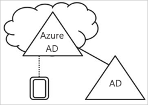
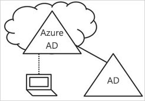
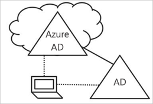

# Vad är enhetshantering i Azure Active Directory?

I en mobil- och molnorienterad värld ger Azure Active Directory (Azure AD) enkel inloggning till enheter, appar och tjänster från var som helst. I och med den ökande mängden enheter – inklusive BYOD står IT-experter inför två motsatta mål:

- Underlätta för slutanvändarna att vara produktiva oavsett tid och plats
- Se till att företagets resurser alltid är skyddade

Dina användare får åtkomst till gemensamma tillgångar genom sina enheter. Som IT-administratör vill du nog ha kontroll över de här enheterna så att du kan skydda de gemensamma tillgångarna. På så sätt kan du se till att användarna får åtkomst till resurserna från enheter som uppfyller dina krav för säkerhet och efterlevnad. 

Enhetshantering utgör även grunden för [enhetsbaserad villkorsstyrd åtkomst](../conditional-access/require-managed-devices.md). Med enhetsbaserad villkorsstyrd åtkomst kan du se till att endast hanterade enheter kan komma åt resurserna i miljön.   

Den här artikeln beskriver hur enhetshantering i Azure Active Directory fungerar.

## Hämta enheter med Azure AD-kontroll

Om du vill att en enhet ska kontrolleras av Azure AD har du två alternativ:

- Registrerar 
- Ansluta

När du **registrerar** en enhet till Azure AD kan du hantera en enhets identitet. När en enhet registreras ger Azure AD-enhetsregistrering den en identitet som används för att autentisera enheten när användaren loggar in på Azure AD. Du kan använda identiteten för att aktivera eller inaktivera en enhet.

När de kombineras med en MDM-lösning för hantering av mobila enheter, t.ex. Microsoft Intune, uppdateras enhetsattributen i Azure AD med ytterligare information om enheten. På så sätt kan du skapa regler för villkorlig åtkomst som säkerställer att åtkomsten från enheter uppfyller dina säkerhets- och efterlevnadskrav. Mer information om hur du registrerar enheter i Microsoft Intune finns i [Registrera enheter för hantering i Intune](https://docs.microsoft.com/intune/device-enrollment#supported-device-platforms).

Att **ansluta** en enhet är en utökning av att registrera tjänsten. Det innebär att du får alla fördelar med att registrera en enhet, och dessutom ändras enhetens lokala tillstånd. När du ändrar det lokala tillståndet kan användarna logga in på en enhet med en organisations arbets- eller skolkonto istället för ett personligt konto.

## Azure AD-registrerade enheter   

Målet med Azure AD-registrerade enheter är att ge dig stöd för scenariot **Bring Your Own Device (BYOD)**. I det här scenariot kan användaren få åtkomst till organisationens Azure Active Directory-kontrollerade resurser med en personlig enhet.  

Åtkomsten baseras på ett arbets- eller skolkonto konto som har angetts på enheten.  
Exempelvis Windows 10 gör det möjligt för användare att lägga till ett arbets- eller skolkonto till en dator, surfplatta eller telefon.  
När en användare har lagt till ett arbets- eller skolkonto är enheten registrerad för Azure AD, och du kan även registrera den för MDM-systemet (mobile device management) som din organisation har konfigurerat. Organisationens användare kan enkelt lägga till ett arbets- eller skolkonto till en personlig enhet:

- När du öppnar ett arbetsprogram för första gången
- Manuellt via menyn **Inställningar** i Windows 10 

Du kan konfigurera Azure AD-registrerade enheter till Windows 10, iOS, Android och macOS.

## Azure AD-anslutna enheter

Målet med Azure AD-anslutna enheter är att förenkla:

- Windows-distributioner av företagsägda enheter 
- Åtkomst till företagsappar och -resurser från valfri Windows-enhet
- Molnbaserad hantering av företagsägda enheter

Azure AD Join kan distribueras på något av följande sätt: 
 - [Windows Autopilot](https://docs.microsoft.com/windows/deployment/windows-autopilot/windows-10-autopilot)
 - [Massdistribution](https://docs.microsoft.com/intune/windows-bulk-enroll)
 - [Självbetjäning](azuread-joined-devices-frx.md) 

**Azure AD Join** är avsett för organisationer som vill sätta molnet främst (alltså i första hand använda molntjänster, med målet att minska användningen av en lokal infrastruktur) eller enbart molnet (ingen lokal infrastruktur). Det finns inga begränsningar för vilken storlek på eller typ av organisationer som kan distribuera Azure AD Join. Azure AD Join fungerar även bra i en hybridmiljö med åtkomst till både moln- och lokala appar och resurser.

När du implementerar Azure AD-anslutna enheter får du följande fördelar:

- **Enkel inloggning (SSO)** till dina Azure-hanterade SaaS-appar och tjänster. Användarna ser inte meddelanden för ytterligare autentisering vid åtkomst till arbetsresurser. SSO-funktionen fungerar även utan anslutning till tillgängliga domännätverk.

- **Företagskompatibel roaming** för användarinställningar med anslutna enheter. Användare behöver inte ansluta något Microsoft-konto (till exempel Hotmail) för att se inställningar på flera enheter.

- **Åtkomst till Windows Store for Business** med ett Azure AD-konto. Användarna kan välja bland ett urval program som valts i förväg av organisationen.

- **Windows Hello**-stöd för säker och bekväm åtkomst till arbetsresurser.

- **Begränsad åtkomst** till appar endast från enheter som uppfyller kompatibilitetsprincipen.

- **Smidig åtkomst till lokala resurser** när enheten har åtkomst till den lokala domänkontrollanten. 

Azure AD Join är främst avsett för organisationer som inte har någon lokal Windows Server Active Directory-infrastruktur, men du kan använda det i scenarier där:

- Du vill gå över till molnbaserad infrastruktur med Azure AD och MDM som Intune.

- Du inte kan använda en lokal domänanslutning, till exempel om du vill hämta mobila enheter som surfplattor och telefoner som kontrolleras.

- Användarna främst behöver åtkomst till Office 365 eller övriga SaaS-appar som är integrerade med Azure AD.

- Du vill hantera en grupp användare i Azure AD istället för Active Directory. Det kan till exempel gälla säsongsarbetare, leverantörer eller studenter.

- Du vill erbjuda anslutningsfunktioner för medarbetare på filialkontor med begränsad lokal infrastruktur.

Du kan konfigurera Azure AD-anslutna enheter för Windows 10-enheter.

## Hybrid Azure AD-anslutna enheter

I över ett årtionde har många organisationer använt domänanslutningen för att ansluta till sin lokala Active Directory för att göra det möjligt för:

- IT-avdelningar att hantera företagsägda enheter från en central plats.

- Användare att logga in på sina enheter med sina arbets- eller skolkonton i Active Directory. 

Vanligtvis förlitar sig organisationer med ett lokalt fotavtryck på bildhanteringsmetoder för att etablera enheter, och de använder ofta **System Center Configuration Manager (SCCM)** eller **grupprinciper (GP)** för att hantera dem.

Om din miljö har ett lokalt AD-fotavtryck och du vill dra nytta av funktionerna i Azure Active Directory kan du implementera Hybrid Azure AD-anslutna enheter. Det är enheter som är anslutna till din lokala Active Directory och registrerade i din Azure Active Directory.

Du ska använda Azure AD Hybrid-anslutna enheter om:

- Du har Win32-appar som är distribuerade till enheterna som förlitar sig på Active Directory-autentisering för datorn.

- Du kräver GP för att hantera enheter.

- Du vill fortsätta att använda bildhanteringslösningar för att konfigurera enheter för dina anställda.

Du kan konfigurera Hybrid Azure AD-anslutna enheter för Windows 10 och äldre enheter, till exempel Windows 8 och Windows 7.

## Sammanfattning

Med enhetshantering i Azure AD kan du: 

- Förenkla processen med att kontrollera enheter med Azure AD

- Ge användarna enkel åtkomst till organisationens molnbaserade resurser

Som tumregel ska du använda:

- Azure AD-registrerade enheter:

    - För personliga enheter 

    - För att manuellt registrera enheter med Azure AD

- Azure AD-anslutna enheter: 

    - För enheter som ägs av organisationen

    - För enheter som **inte** är anslutna till en lokal AD

    - För att manuellt registrera enheter med Azure AD

    - Ändra en enhets lokala tillstånd

- Hybrid Azure AD-anslutna enheter för enheter som är anslutna till en lokal AD     

    - För enheter som ägs av organisationen

    - För enheter som är anslutna till en lokal AD

    - För att automatiskt registrera enheter med Azure AD

    - Ändra en enhets lokala tillstånd

## Nästa steg

- Om du vill ha en översikt över hantering av enheter i Azure-portalen kan du läsa om att [hantera enheter med Azure-portalen](device-management-azure-portal.md)

- Om du vill veta mer om enhetsbaserad villkorlig åtkomst kan du läsa mer om att [konfigurera principer för Azure Active Directory-enhetsbaserad villkorlig åtkomst](../conditional-access/require-managed-devices.md).

- För att konfigurera:
    - Azure Active Directory-registrerade Windows 10-enheter läser du om att [konfigurera Azure Active Directory-registrerade Windows 10-enheter](../user-help/device-management-azuread-registered-devices-windows10-setup.md)
    - Azure Active Directory-anslutna enheter läser du om att [konfigurera Azure Active Directory-anslutna enheter](../user-help/device-management-azuread-joined-devices-setup.md)
    - Hybrid Azure AD-anslutna enheter: läs [Så här planerar du Azure Active Directory Join-hybridimplementeringen](hybrid-azuread-join-plan.md).

