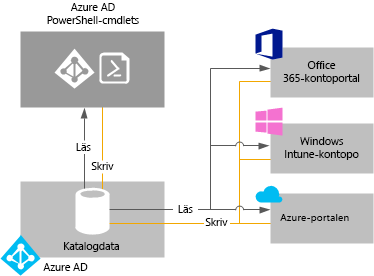

# Hantera din Azure Active Directory-klient

## Vad är en Azure AD-klientorganisation eller Azure AD-klient?
I Azure Active Directory (Azure AD) är en klient en dedikerad instans av en Azure AD-katalog som din organisation tilldelas när den registrerar sig för en Microsoft-molntjänst som Azure eller Office 365. Varje Azure AD-katalog är separat och åtskild från andra Azure AD-kataloger. Precis som ett företags kontorsbyggnad är en säker resurs som är specifik för din organisation har även Azure AD-katalogen utformats för att vara en säker tillgång för exklusiv användning av din organisation. Azure AD-arkitekturen håller isär kunddata och identitetsinformation så att användare och administratörer av en Azure AD-katalog inte oavsiktligt eller illvilligt kan komma åt data i en annan katalog.

## Hur kan jag skaffa en Azure AD-katalog?
Azure AD innehåller de grundläggande katalog- och identitetshanteringsfunktionerna bakom de flesta av Microsofts molntjänster, inklusive:

* Azure
* Microsoft Office 365
* Microsoft Dynamics CRM Online
* Microsoft Intune

Du får en Azure AD-katalog när du registrerar dig för någon av dessa Microsoft-molntjänster. Du kan skapa ytterligare kataloger efter behov. Du kan till exempel skapa din första katalog som en produktionskatalog och sedan skapa en annan katalog för testning eller mellanlagring.

### Använda Azure AD-katalogen som ingår i en ny Azure-prenumeration

Vi rekommenderar att du använder administratörskontot som du använde för din första tjänst när du registrerar dig för andra Microsoft-tjänster. Informationen du anger första gången du registrerar dig för en Microsoft-tjänst används för att skapa en ny Azure AD-kataloginstans för din organisation. Om du använder den katalogen för att autentisera inloggningsförsök när du prenumererar på andra Microsoft-tjänster kan de använda befintliga användarkonton, principer, inställningar eller lokal katalogintegrering som du konfigurerar i din standardkatalog.

Om du till exempel registrerar dig för en Microsoft Intune-prenumeration och sedan ytterligare synkroniserar din lokala Active Directory med din Azure AD-katalog kan du registrera dig för en annan Microsoft-tjänst, till exempel Office 365, och enkelt uppnå samma fördelar av katalogintegrering som du har med Microsoft Intune.

Mer information om hur du integrerar din lokala katalog med Azure AD finns i [Katalogintegrering med Azure AD Connect](../hybrid/whatis-hybrid-identity.md).

### Associera en befintlig Azure AD-katalog med en ny Azure-prenumeration
Du kan associera en ny Azure-prenumeration med samma katalog som autentiserar inloggningen för en befintlig Office 365- eller Microsoft Intune-prenumeration. Mer information om det scenariot finns i [Överföra ägarskap för en Azure-prenumeration till ett annat konto](../../billing/billing-subscription-transfer.md)

### Skapa en Azure AD-katalog genom att registrera dig för en Microsoft-molntjänst som en organisation
Om du inte har någon prenumeration på en Microsoft-molntjänst än kan du använda en av följande länkar för att registrera dig. När du registrerar dig för din första tjänst skapas en Azure AD-katalog automatiskt.

* [Microsoft Azure](https://account.azure.com/organization)
* [Office 365](https://products.office.com/business/compare-office-365-for-business-plans/)
* [Microsoft Intune](https://portal.office.com/Signup/Signup.aspx?OfferId=40BE278A-DFD1-470a-9EF7-9F2596EA7FF9&dl=INTUNE_A&ali=1#0%20)

### Så här ändrar du standardkatalogen för en prenumeration

1. Logga in i [Azure-kontocentret](https://account.azure.com/Subscriptions) med ett konto som är kontoadministratör för prenumerationen för att överföra äganderätten för prenumerationen.
2. Se till att den användare som ska vara prenumerationsägare finns i målkatalogen.
3. Klicka på **överföra äganderätten till prenumerationen**.
4. Ange mottagaren. Mottagaren hämtar automatiskt ett e-postmeddelande med en länk för godkännande.
5. Mottagaren klickar på länken och följer instruktionerna, inklusive att ange sin betalningsinformation. När mottagaren lyckas överförs prenumerationen. 
6. Standardkatalogen för prenumerationen ändras till den katalog där användaren finns om överföringen av ägarskapet för prenumerationen lyckas.

Läs mer i [Transfer Azure subscription ownership to another account](../../billing/billing-subscription-transfer.md) (Överföra äganderätten till Azure-prenumerationen till ett annat konto)

### Hantera standardkatalogen i Azure
När du registrerar dig för Azure associeras en standardkatalog för Azure AD med din prenumeration. Det kostar inget att använda Azure AD och dina kataloger är en kostnadsfri resurs. Det finns betalda Azure AD-tjänster som licensieras separat och innehåller ytterligare funktioner, till exempel företagsanpassning vid inloggning och lösenordsåterställning via självbetjäning. Du kan också skapa en anpassad domän med ett DNS-namn som du äger i stället för standarddomänen *.onmicrosoft.com.

## Hur hanterar jag katalogdata?
Om du vill administrera en eller flera Microsoft-molntjänstprenumerationer kan du använda [Azure AD-administrationscentret](https://aad.portal.azure.com), Microsoft Intune-kontoportalen eller [administrationscentret för Office 365](https://portal.office.com/) för att hantera organisationens katalogdata. Du kan också använda [Azure Active Directory PowerShell-cmdletar](https://docs.microsoft.com/powershell/azure/active-directory) för att hantera data som lagras i Azure AD.

Från dessa portaler (eller cmdletar) kan du:

* Skapa och hantera användar- och gruppkonton
* Hantera relaterade molntjänster för din organisations prenumerationer
* Konfigurera lokal integrering med identitets- och autentiseringstjänster i Azure AD

Azure AD-administrationscentret, administrationscentret för Office 365, Microsoft Intune-kontoportalen och Azure AD-cmdletarna läser alla från och skriver till en enda delad instans av Azure AD som associeras med din organisations katalog. Alla dessa verktyg fungerar som ett klientdelsgränssnitt som hämtar eller ändrar dina katalogdata.
När du ändrar organisationens data med hjälp av någon av portalerna eller cmdletarna medan du är inloggad i någon av dessa tjänster visas ändringarna också i de andra portalerna nästa gång du loggar in. Dessa data delas mellan de Microsoft-molntjänster som du prenumererar på.

Om du till exempel blockerar en användare via administrationscentret för Office 365 så kan användaren inte heller logga in till någon annan tjänst som din organisation prenumererar på. Om du visar samma användarkonto på Microsoft Intune-kontoportalen ser du också att användaren är blockerad.

## Hur kan jag lägga till och hantera flera kataloger?
Du kan [lägga till en Azure AD-katalog på Azure-portalen](https://portal.azure.com/#create/Microsoft.AzureActiveDirectory). Fyll i informationen och välj **Skapa**.

Du kan hantera alla kataloger som helt oberoende resurser. Varje katalog är en peer med en fullständig funktionsuppsättning som är logiskt oberoende av andra kataloger som du hanterar. Det finns ingen överordnad-underordnad-relation mellan kataloger. Detta oberoende mellan kataloger gäller resursoberoende, administrativt oberoende och synkroniseringsoberoende.

* **Resursoberoende**. Om du skapar eller tar bort en resurs i en katalog påverkas inte resurser i andra kataloger, delvis med undantag av externa användare. Om du använder en anpassad ”contoso.com”-domän med en katalog kan den inte användas med någon annan katalog.
* **Administrativt oberoende**.  Om en användare som inte är administratör för katalogen ”Contoso” skapar testkatalogen ”Test”:
  
  * Administratörerna av Contoso-katalogen har inte någon direkt administratörsbehörighet till katalogen Test såvida inte någon av administratörerna av Test-katalogen uttryckligen beviljar dem sådan behörighet. ”Contoso”-administratörerna kan kontrollera åtkomsten till katalogen ”Test” tack vare deras kontroll över användarkontot som skapade ”Test”.
    
  * Om du tilldelar eller tar bort en administratörsroll för en användare i en katalog så påverkar inte ändringen administratörsrollen som användaren kan ha i en annan katalog.
* **Synkroniseringsoberoende**. Du kan konfigurera varje Azure AD-klient oberoende om du vill synkronisera data från en enda instans med Azure AD Connect-katalogsynkroniseringsverktyget.

Till skillnad från andra Azure-resurser är dina kataloger inte underordnade resurser till en Azure-prenumeration. Så om du avbryter eller låter din Azure-prenumeration förfalla kan du fortfarande komma åt dina katalogdata med Azure AD PowerShell, Azure Graph-API:et eller andra gränssnitt, till exempel administrationscenter för Office 365. Du kan även associera en annan prenumeration med katalogen.

## Förbereda för att ta bort en Azure AD-katalog
En global administratör kan ta bort en Azure AD-katalog från portalen. När en katalog tas bort, tas även alla resurser som katalogen innehåller bort. Kontrollera att du inte behöver katalogen innan du tar bort den.

> [!NOTE]
> Om användaren har loggat in med ett arbets- eller skolkonto kan han eller hon inte ta bort sin arbetskatalog. Om användaren till exempel är inloggad som joe@contoso.onmicrosoft.com kan denna användare inte ta bort katalogen som har contoso.onmicrosoft.com som standarddomän.

Azure AD kräver att vissa villkor är uppfyllda innan du kan ta bort en katalog. Detta minskar risken för att borttagningen av en katalog påverkar användare eller program negativt, till exempel möjligheten för användare att logga in i Office 365 eller att komma åt resurser i Azure. Om en katalog för en prenumeration tas bort av misstag kan användare till exempel inte komma åt Azure-resurser för den prenumerationen.

Följande villkor kontrolleras:

* Den enda användaren i katalogen ska vara den globala administratören som ska ta bort katalogen. Andra användare måste tas bort innan katalogen kan tas bort. Om användarna synkroniseras lokalt måste synkroniseringen inaktiveras och användarna måste tas bort i molnkatalogen med hjälp av Azure Portal eller Azure PowerShell-cmdletar. Det finns inga krav på att ta bort grupper eller kontakter, till exempel kontakter som lagts till från administrationscenter för Office 365.
* Det får inte finnas några program i katalogen. Alla program måste tas bort innan katalogen kan tas bort.
* Inga Multi-Factor Authentication-providrar får vara kopplade till katalogen.
* Det får inte finnas några prenumerationer för Microsoft Online Services, till exempel Microsoft Azure, Office 365 eller Azure AD Premium, som är kopplade till katalogen. Om en standardkatalog skapades för dig i Azure kan du inte ta bort den katalogen om din Azure-prenumeration fortfarande är beroende av den här katalogen för autentisering. På liknande sätt kan du inte ta bort en katalog om en annan användare har associerat en prenumeration med den. 

## Nästa steg
* [Azure AD-forum](https://social.msdn.microsoft.com/forums/azure/en-US/home?forum=windowsazuread)
* [Azure Multi-Factor Authentication-forum](https://social.msdn.microsoft.com/Forums/azure/en-US/home?forum=windowsazureactiveauthentication)
* [StackOverflow för Azure-frågor](https://stackoverflow.com/questions/tagged/azure-active-directory)
* [Azure Active Directory PowerShell](https://docs.microsoft.com/powershell/azure/active-directory)
* [Tilldela administratörsroller i Azure AD](../users-groups-roles/directory-assign-admin-roles.md)
