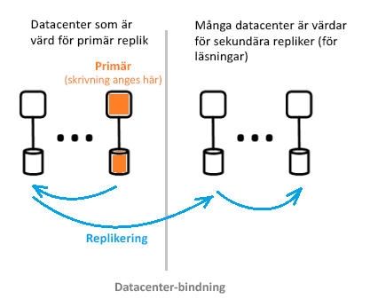

# Vad är Azure Active Directory arkitekturen?

Med Azure AD (Active Directory Azure) kan du på ett säkert sätt hantera åtkomsten till Azure-tjänster och -resurser för dina användare. En komplett uppsättning identitetshanteringsfunktioner ingår i Azure AD. Information om funktionerna i Azure AD finns i [Vad är Azure Active Directory?](active-directory-whatis.md)

Med Azure AD kan du skapa och hantera användare och grupper och aktivera behörigheter för att tillåta och neka åtkomst till företagsresurser. Information om identitetshantering finns i [The fundamentals of Azure identity management](active-directory-whatis.md) (Grunderna om Azure-identitetshantering).

## Azure AD-arkitekturen

Azure AD: s geografiskt distribuerade arkitektur kombinerar omfattande övervakning, automatisk omdirigering, redundans och återställnings funktioner, som ger kunderna tillgänglighet och prestanda för hela företaget.

Följande arkitekturelement beskrivs i den här artikeln:

*   Tjänstarkitekturens design
*   Skalbarhet
*   Kontinuerlig tillgänglighet
*   Datacenter

### Tjänstarkitekturens design

Det vanligaste sättet att bygga ett tillgängligt och användbart, data omfattande system är genom oberoende Bygg stenar eller skalnings enheter. För data nivån för Azure AD kallas skalnings enheter *partitioner*.

Datanivån har flera frontend-tjänster som tillhandahåller läs-och skrivfunktioner. Diagrammet nedan visar hur komponenterna i en partition med en enda katalog levereras i geografiskt distribuerade Data Center.

  

Komponenterna i Azure AD-arkitekturen består av en primär replik och flera sekundära repliker.

#### Primär replik

Den *primära repliken* tar emot alla *skrivningar* för den partition som den tillhör. Alla skrivåtgärder replikeras omedelbart till en sekundär replik i ett annat datacenter innan anroparen får en bekräftelse om att åtgärden lyckades. Den här metoden garanterar geo-redundant hållbarhet för skrivningar.

#### Sekundära repliker

Alla katalog *läsningar* betjänas från *sekundära repliker*, som finns på Data Center som är fysiskt placerade i olika geografiska områden. Det finns många sekundära repliker eftersom data replikeras asynkront. Katalog läsningar, till exempel autentiseringsbegäranden, betjänas från data Center som är nära kunder. De sekundära replikerna ansvarar för läsningarnas skalbarhet.

### Skalbarhet

Skalbarhet syftar på en tjänsts förmåga att skala upp för att möta ökade krav på prestanda. Skalbarhet för skrivningar uppnås genom datapartitionering. Skalbarhet för läsningar uppnås genom att data replikeras från en partition till flera sekundära repliker runtom i världen.

Begär Anden från katalog program dirigeras till data centret som de är fysiskt närmast. Skrivningar omdirigeras transparent till den primära repliken för att tillhandahålla konsekventa läsningar och skrivningar. Sekundära repliker utökar avsevärt partitionernas skalning eftersom katalogerna normalt hanterar läsningar större delen av tiden.

Katalogprogram ansluter till de närmaste datacentren. Den här anslutningen ger bättre prestanda och därför är det möjligt att skala ut. Eftersom en katalogpartition kan ha många sekundära repliker, kan sekundära repliker placeras närmare katalogklienterna. Endast interna katalogtjänstkomponenter som är skrivningsintensiva riktar sig direkt till den aktiva primära repliken.

### Kontinuerlig tillgänglighet

Tillgängligheten (eller drifttiden) syftar på ett systems möjlighet att köra kontinuerligt. Nyckeln till Azure AD: s hög tillgänglighet är att tjänsterna snabbt kan flytta trafik över flera geografiskt distribuerade Data Center. Varje data Center är oberoende, vilket möjliggör icke-korrelerade fellägen. Med den här designen av hög tillgänglighet krävs ingen nedtid för underhålls aktiviteter i Azure AD.

Azure AD: s partition design är förenklad jämfört med Enterprise AD-designen, med en enda huvud design som innehåller en noggrant dirigerad och deterministisk redundansväxling av primära repliker.

#### Feltolerans

Ett system är mer tillgängligt om det är tolerant för maskinvaru-, nätverks- och programvarurelaterade fel. För varje partition i katalogen finns det en huvudreplik med hög tillgänglighet: den primära repliken. Endast skrivningar till partitionen utförs på den här repliken. Repliken övervakas kontinuerligt och noggrant, och skrivningar kan omedelbart växlas till en annan replik (som blir den nya primära repliken) om det uppstår ett fel. Under en redundansväxling kan det uppstå ett avbrott i skrivtillgängligheten på 1 till 2 minuter. Lästillgängligheten påverkas inte under den här tiden.

Läsåtgärder (som är avsevärt många fler än skrivåtgärderna) skickas endast till sekundära repliker. Eftersom sekundära repliker är idempotenta kompenseras förlusten av en replik i en viss partition enkelt genom att läsningarna dirigeras till en annan replik, vanligtvis i samma datacenter.

#### Datahållbarhet

Varaktigt allokeras till minst två Data Center innan det bekräftas. Detta inträffar när du först genomför skrivningen på den primära servern och sedan omedelbart replikerar skrivningen till minst ett annat data Center. Den här Skriv åtgärden garanterar att en potentiell förlust av data Center som är värd för den primära inte leder till data förlust.

Azure AD har ett tomt [återställnings tids mål (RTO)](https://en.wikipedia.org/wiki/Recovery_time_objective) för att inte förlora data vid redundans. Det här omfattar:

* Utfärdande av token och katalog läsningar
* Tillåter endast cirka 5 minuter RTO för katalog skrivningar

### Datacenter

Azure Active Directorys repliker lagras i datacenter runtom i världen. Mer information finns i [Azure Global Infrastructure](https://azure.microsoft.com/global-infrastructure/).

Azure AD fungerar i Data Center med följande egenskaper:

* Autentisering, graf och andra AD-tjänster finns bakom Gateway-tjänsten. Gatewaytjänsten hanterar belastningsutjämningen av dessa tjänster. Den växlar automatiskt över automatiskt om några felaktiga servrar identifieras med hjälp av transaktionella hälso avsökningar. Utifrån dessa hälso avsökningar dirigerar gatewayen trafiken dynamiskt till felfria data Center.
* För *läsningar* har katalogen sekundära repliker och motsvarande front-end-tjänster i en aktiv-aktiv konfiguration i flera data Center. Om det uppstår ett problem med ett helt data Center dirigeras trafiken automatiskt till ett annat data Center.
 * För *skrivningar* växlar katalogen över den primära repliken (Master) över data Center via planerat (ny primär synkroniseras till gammal primär) eller nödfall. Data hållbarhet uppnås genom att du replikerar varje incheckning till minst två Data Center.

#### Datakonsekvens

Katalog modellen är en av de slutliga konsekvenserna. Ett typiskt problem med distribuerade asynkront replikerade system är att data som returneras från en "viss" replik kanske inte är uppdaterade. 

Azure AD tillhandahåller läs- och skrivkonsekvens för program som skriver och läser till en viss sekundär replik genom att skrivningarna dirigeras till den primära repliken, varefter de hämtas tillbaka synkront till den sekundära repliken.

Program skrivningar med Microsoft Graph-API: t för Azure AD är abstrakta från att upprätthålla tillhörigheten till en katalog replik för konsekvens av Läs-och skriv åtgärder. Microsoft Graph-API-tjänsten underhåller en logisk session som har tillhörighet till en sekundär replik som används för läsningar. tillhörigheten samlas in i en "replik-token" som tjänsten cachelagrar med hjälp av en distribuerad cache i data centret för den sekundära repliken. Denna token används sedan för efterföljande åtgärder i samma logiska session. Om du vill fortsätta använda samma logiska session måste efterföljande begär Anden dirigeras till samma Azure AD-datacenter. Det går inte att fortsätta en logisk session om katalog klient begär Anden dirigeras till flera Azure AD-datacenter. om detta inträffar har klienten flera logiska sessioner som har oberoende Läs-och skriv åtgärder.

 >[!NOTE]
 >Skrivningar replikeras direkt till den sekundära repliken som den logiska sessionens läsningar skickades till.

#### Skydd av säkerhetskopior

Katalogen implementerar mjuka borttagningar, i stället för hårda borttagningar, för användare och klientorganisationer så att oavsiktliga borttagningar av en kund enkelt kan återställas. Om din klient administratör oavsiktligt tar bort användare kan de enkelt ångra och återställa de borttagna användarna.

Azure AD implementerar dagliga säkerhetskopieringar av alla data och kan därför auktoritativt återställa data i händelse av logiska borttagningar eller skadade data. Data nivån använder fel vid korrigering av koder, så att den kan söka efter fel och automatiskt korrigera specifika typer av diskfel.

#### Mätvärden och övervakare

Körning av en tjänst med hög tillgänglighet kräver förstklassiga mät- och övervakningsfunktioner. Azure AD analyserar och rapporterar kontinuerligt viktiga mätvärden och framgångskriterier rörande tjänsternas hälsa för var och en av dess tjänster. Det finns också kontinuerlig utveckling och justering av mått och övervakning och aviseringar för varje scenario, inom varje Azure AD-tjänst och i alla tjänster.

Om någon Azure AD-tjänst inte fungerar som förväntat vidtas åtgärden omedelbart för att återställa funktionaliteten så snabbt som möjligt. De viktigaste måtten för Azure AD-spår är hur snabbt problem med Live-webbplatser kan identifieras och minimeras för kunderna. Vi har gjort stora investeringar inom övervakning och avisering för att minimera tiden för upptäckt (målsättning: < 5 minuter) och inom systemberedskap för att minimera tiden för avhjälpande åtgärder (målsättning: < 30 minuter).

#### Säkra åtgärder

Använda operativa kontroller, till exempel Multi-Factor Authentication (MFA) för alla åtgärder, samt granskning av alla åtgärder. Dessutom kan du använda en just-in-Time-höjning för att bevilja nödvändig tillfällig åtkomst för all drift aktivitet på begäran. Mer information finns i [The Trusted Cloud](https://azure.microsoft.com/support/trust-center) (Det säkra molnet).

## Nästa steg

[Utvecklarhandbok för Azure Active Directory](../develop/index.yml)