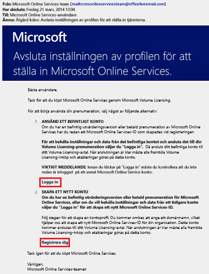
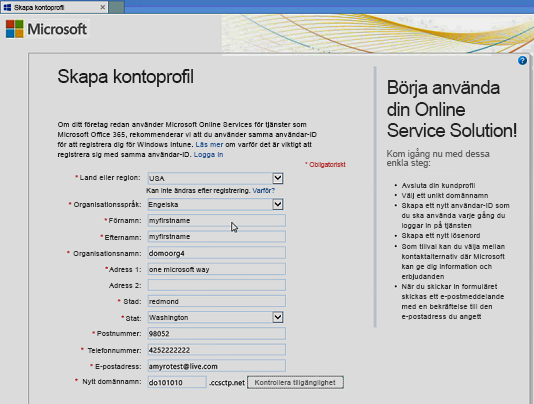
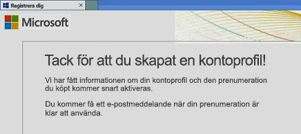
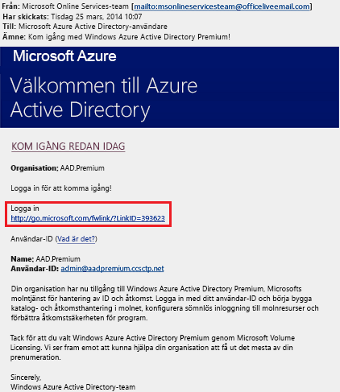
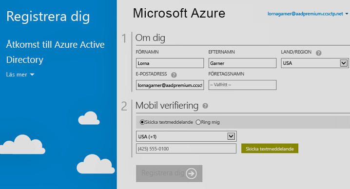

# Gör så här: Registrera dig för Azure Active Directory Premium
Du kan köpa och associera Azure Active Directory (Azure AD) Premium till din Azure-prenumeration. Om du behöver skapa en ny Azure-prenumeration måste du även aktivera din licensieringsplan och åtkomst till Azure AD-tjänsten.

> [!NOTE]
>Azure AD Premium och Basic är tillgängliga för kunder i Kina genom den globala instansen av Azure Active Directory. Azure AD Premium och Basic stöds inte för närvarande i den Azure-tjänst som drivs av 21Vianet i Kina. Om du vill ha mer information kontaktar du oss via [Azure Active Directory-forumet](https://feedback.azure.com/forums/169401-azure-active-directory/).

Innan du registrerar dig för Active Directory Premium 1 eller Premium 2 måste du först ta reda på vilken av dina befintliga prenumerationer eller planer som ska användas:

- Via din befintliga Azure- eller Office 365-prenumeration

- Via din Enterprise Mobility + Security-licensieringsplan

- Via en Microsoft-volymlicensieringsplan

Om du registrerar dig med din Azure-prenumeration med redan köpta och aktiverade Azure AD-licenser kan du automatiskt aktivera licenser i samma katalog. Om så inte är fallet måste du ändå aktivera din licensplan och din Azure AD-åtkomst. Mer information om hur du aktiverar din licensplan finns i [Aktivera din nya licensplan](#activate-your-new-license-plan). Mer information om hur du aktiverar din Azure AD-åtkomst finns i [Aktivera din Azure AD åtkomst](#activate-your-azure-ad-access). 

## Registrera dig med din befintliga Azure- eller Office 365-prenumeration
Som prenumerant på Azure eller Office 365 kan du köpa Azure Active Directory Premium online. Detaljerade anvisningar finns i [Köpa Azure Active Directory Premium – befintliga kunder](https://channel9.msdn.com/Series/Azure-Active-Directory-Videos-Demos/How-to-Purchase-Azure-Active-Directory-Premium-Existing-Customer) eller [Köpa Azure Active Directory Premium – nya kunder](https://channel9.msdn.com/Series/Azure-Active-Directory-Videos-Demos/How-to-Purchase-Azure-Active-Directory-Premium-New-Customers).

## Registrera dig med din Enterprise Mobility + Security-licensieringsplan
Enterprise Mobility + Security är en programsvit som består av Azure AD Premium, Azure Information Protection och Microsoft Intune. Om du redan har en EMS-licens kan du komma igång med Azure AD med något av följande licensieringsalternativ:

Mer information om EMS finns på webbplatsen [Enterprise Mobility + Security](https://www.microsoft.com/cloud-platform/enterprise-mobility-security).

- Testa EMS med en kostnadsfri [Enterprise Mobility + Security E5-utvärderingsversion](https://signup.microsoft.com/Signup?OfferId=87dd2714-d452-48a0-a809-d2f58c4f68b7&ali=1)

- Köp [Enterprise Mobility + Security E5-licenser](https://signup.microsoft.com/Signup?OfferId=e6de2192-536a-4dc3-afdc-9e2602b6c790&ali=1)

- Köp [Enterprise Mobility + Security E3-licenser](https://signup.microsoft.com/Signup?OfferId=4BBA281F-95E8-4136-8B0F-037D6062F54C&ali=1)

## Registrera dig med en Microsoft-volymlicensieringsplan
Via din Microsoft-volymlicensieringsplan kan du registrera dig för Azure AD Premium med hjälp av något av följande två program, baserat på antalet licenser som du vill ha:

- **För 250 eller fler licenser.** [Microsoft Enterprise-avtal](https://www.microsoft.com/en-us/licensing/licensing-programs/enterprise.aspx)

- **För 5 till 250-licenser.** [Open Volume License](https://www.microsoft.com/en-us/licensing/licensing-programs/open-license.aspx)

Mer information om köp via volymlicensiering finns i [Köpa via volymlicensieringsprogram](https://www.microsoft.com/en-us/licensing/how-to-buy/how-to-buy.aspx).

## Aktivera din nya licensplan
Om du har registrerat dig med hjälp av en ny Azure AD-licensieringsplan måste du aktivera den för din organisation med hjälp av den e-postbekräftelse som skickas efter köpet.

### Aktivera din licensplan
- Öppna den e-postbekräftelse som du har fått från Microsoft när du registrerat dig och klicka sedan på **Logga In** eller **Registrera dig**.
   
    

    - **Logga in.** Välj den här länken om du har en befintlig klient, och logga sedan in med ditt befintliga administratörskonto. Du måste vara en global administratör på den klient där licenserna aktiveras.

    - **Registrera dig.** Välj den här länken om du vill öppna sidan **Skapa kontoprofil** och skapa en ny Azure AD-klientorganisation för din licensieringsplan.

        

När du är klar visas en bekräftelsedialogruta som tackar dig för att du aktiverat licensplanen för din klient.

## Aktivera din Azure AD-åtkomst
Om du lägger till nya Azure AD Premium-licenser i en befintlig prenumeration, är din Azure AD-åtkomst förmodligen redan aktiverad. Annars måste du aktivera Azure AD-åtkomst när du har fått **välkomstmeddelandet**.  

När dina köpta licenser har etablerats i din katalog får du ett **välkomstmeddelande**. E-postmeddelandet bekräftar att du kan börja hantera dina licenser och funktioner för Azure AD Premium eller Enterprise Mobility + Security. 

> [!TIP]
> Du har inte åtkomst till Azure AD för den nya klientorganisationen förrän du aktiverar Azure AD-katalogåtkomst från välkomstmeddelandet.

### Aktivera din Azure AD-åtkomst

1. Öppna **välkomstmeddelandet** och klicka sedan på **Logga in**.
   
    

2. När du har loggat in går du igenom en tvåstegsverifieringsprocess med hjälp av en mobil enhet.
   
    

Aktiveringsprocessen tar normalt bara några minuter och sedan kan du använda din Azure AD-klient. 

## Nästa steg
Nu när du har Azure AD Premium kan du [anpassa din domän](add-custom-domain.md), lägga till din [företagsanpassning](customize-branding.md), [skapa en klient](active-directory-access-create-new-tenant.md) och [lägga till grupper](active-directory-groups-create-azure-portal.md)och [användare](add-users-azure-active-directory.md).
