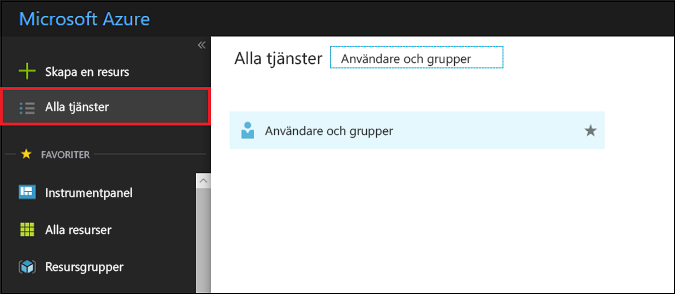
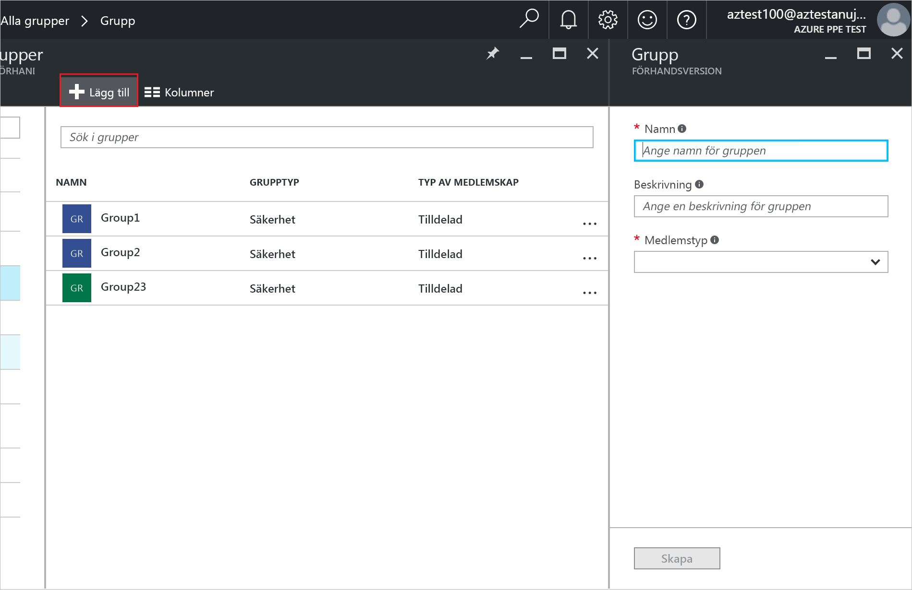
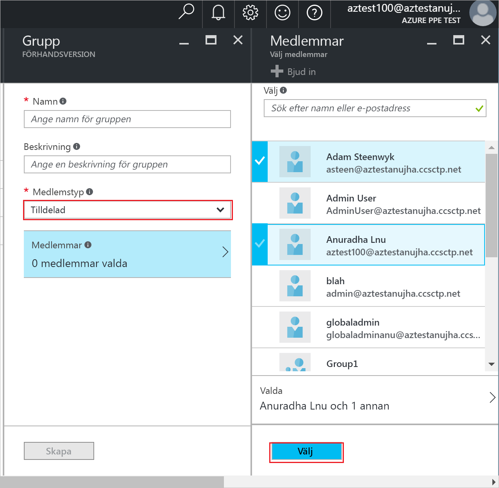
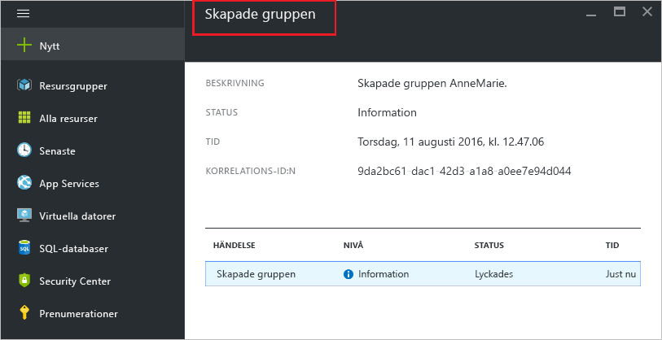

# Skapa en grupp och lägga till medlemmar i Azure Active Directory
> [!div class="op_single_selector"]
> * [Azure Portal](active-directory-groups-create-azure-portal.md)
> * [PowerShell](../active-directory-accessmanagement-groups-settings-v2-cmdlets.md)

Den här artikeln förklarar hur du skapar och fylla i en ny grupp i Azure Active Directory. Använda en grupp för att utföra hanteringsuppgifter, till exempel tilldela licenser eller behörigheter till ett antal användare eller enheter på samma gång.

## Hur skapar jag en grupp?
1. Logga in på den [Azure-portalen](https://portal.azure.com) med ett konto som är en global administratör för katalogen.
2. Välj **alla tjänster**, ange **användare och grupper** i textrutan och välj sedan **RETUR**.

   
3. På den **användare och grupper** bladet väljer **alla grupper**.

   
4. På den **användare och grupper – alla grupper** bladet väljer den **Lägg till** kommando.

   
5. På den **grupp** bladet Lägg till ett namn och en beskrivning för gruppen.
6. Om du vill välja medlemmar som ska läggas till i gruppen **tilldelad** i den **medlemskapstypen** och välj sedan **medlemmar**. Mer information om hur du hanterar medlemskap i en grupp dynamiskt finns [använda attribut för att skapa avancerade regler för gruppmedlemskap](../active-directory-groups-dynamic-membership-azure-portal.md).

   
7. På den **medlemmar** bladet, Välj en eller flera användare eller enheter att lägga till i gruppen och välj den **Välj** längst ned på bladet för att lägga till dem i gruppen. Den **användaren** rutan filtrerar baserat på matchning inmatningen till alla delar av namnet på en användare eller enhet. Inga jokertecken godkänns i rutan.
8. När du är klar med att lägga till medlemmar i gruppen, Välj **skapa** på den **grupp** bladet.    

   

## Nästa steg
Dessa artiklar innehåller ytterligare information om Azure Active Directory.

* [Se befintliga grupper](active-directory-groups-view-azure-portal.md)
* [Hantera inställningar för en grupp](active-directory-groups-settings-azure-portal.md)
* [Hantera medlemmar i en grupp](active-directory-groups-members-azure-portal.md)
* [Hantera medlemskap i en grupp](active-directory-groups-membership-azure-portal.md)
* [Hantera dynamiska regler för användare i en grupp](../active-directory-groups-dynamic-membership-azure-portal.md)
