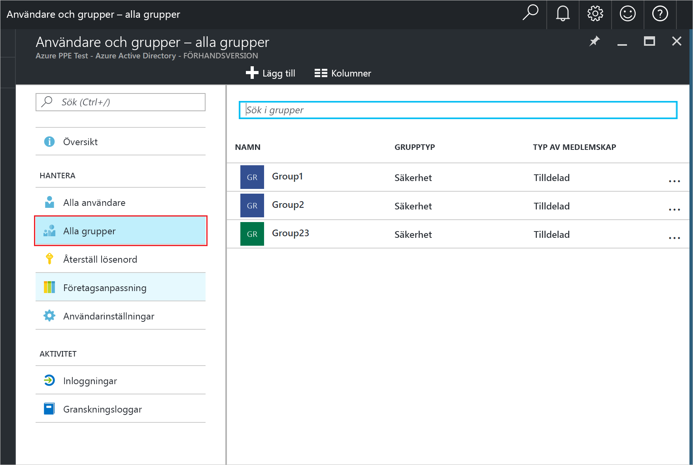
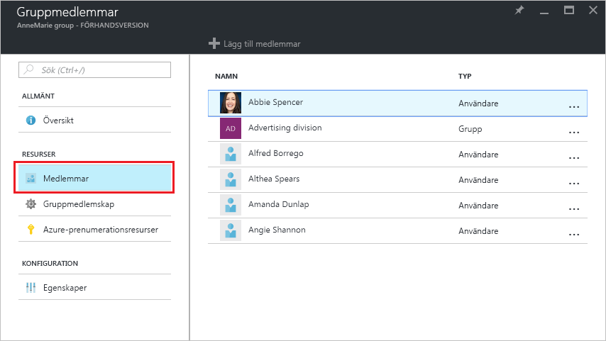
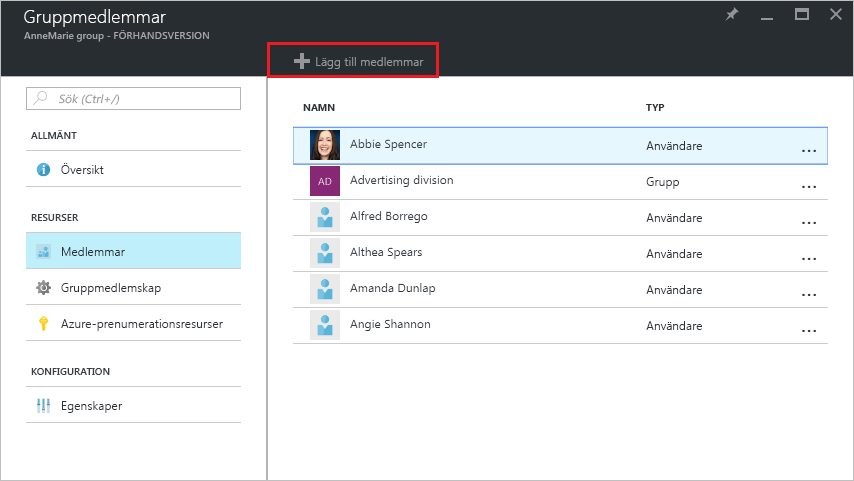
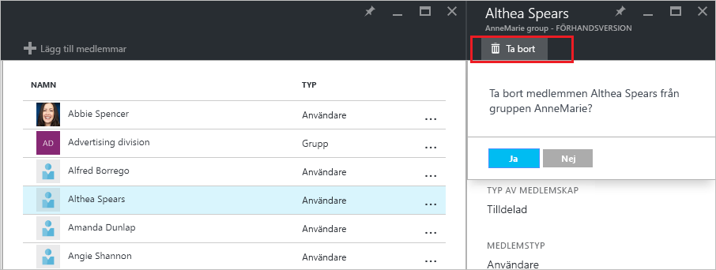

# Hantera gruppmedlemskap för användare i din Azure Active Directory-klient
Den här artikeln förklarar hur du hanterar medlemmar för en grupp i Azure Active Directory (AD Azure).

## Hur gör hitta medlemmarna och hantera dem?
1. Logga in på den [Azure-portalen](https://portal.azure.com) med ett konto som är en global administratör för katalogen.
2. Välj **alla tjänster**, ange **användare och grupper** i textrutan och välj sedan **RETUR**.

   
3. På den **användare och grupper** bladet väljer **alla grupper**.

   
4. På den **användare och grupper – alla grupper** bladet Välj en grupp.
5. På den **grupp - *groupname***  bladet väljer **medlemmar**.

   
6. Lägga till medlemmar i gruppen på den **grupp - medlemmar** bladet väljer **lägga till medlemmar**.

   
7. På den **medlemmar** bladet, Välj en eller flera användare eller enheter att lägga till i gruppen och välj den **Välj** längst ned på bladet för att lägga till dem i gruppen. Den **användaren** rutan filtrerar baserat på matchning inmatningen till alla delar av namnet på en användare eller enhet. Inga jokertecken godkänns i rutan.
8. Ta bort medlemmar från gruppen på den **grupp - medlemmar** bladet Välj en medlem.
9. På den ***membername*** bladet väljer den **ta bort** kommando och bekräfta valet i Kommandotolken.

   
10. När du har ändrat medlemmar för gruppen, Välj **spara**.

## Ytterligare information
Dessa artiklar innehåller ytterligare information om Azure Active Directory.

* [Se befintliga grupper](active-directory-groups-view-azure-portal.md)
* [Skapa en ny grupp och lägga till medlemmar](active-directory-groups-create-azure-portal.md)
* [Hantera inställningar för en grupp](active-directory-groups-settings-azure-portal.md)
* [Hantera medlemskap i en grupp](active-directory-groups-membership-azure-portal.md)
* [Hantera dynamiska regler för användare i en grupp](../active-directory-groups-dynamic-membership-azure-portal.md)
