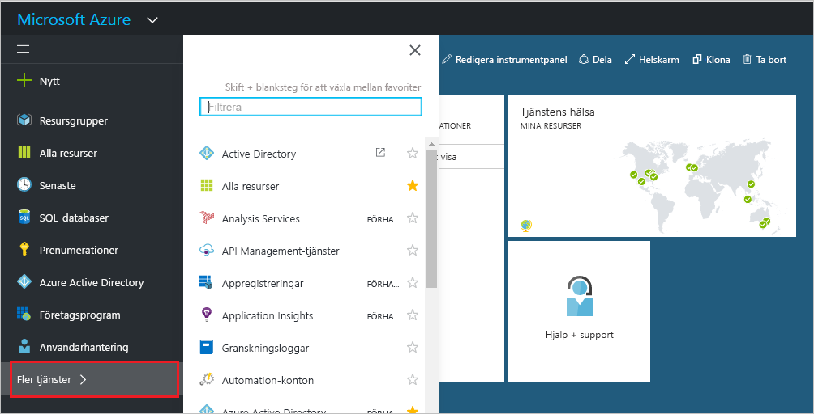
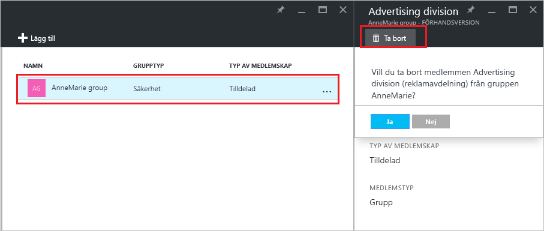

# Hantera vilka grupper som en grupp hör till i din Azure Active Directory-klientorganisation
Grupper kan innehålla andra grupper i Azure Active Directory. Här ser du hur du hanterar dessa medlemskap.

## Hur gör jag för att hitta de grupper som min grupp är medlem i?
1. Logga in på [Azure AD administratörscenter](https://aad.portal.azure.com) med ett konto som är en global administratör för katalogen.
2. Välj **Användare och grupper**.

   
1. Välj **Alla grupper**.

   
1. Välj en grupp.
2. Välj **Gruppmedlemskap**.

   
1. Om du vill lägga till en grupp som medlem i en annan grupp väljer du kommandot **Lägg till** på bladet **Grupp – gruppmedlemskap**.
2. Välj en grupp på bladet **Välj grupp** och välj sedan knappen **Välj** längst ned på bladet. Du kan bara lägga till en grupp till en grupp i taget. Rutan **Användare** filtrerar visningen baserat på matchningen av din inmatning till någon del av ett användar- eller enhetsnamn. Jokertecken accepteras inte i den rutan.

   
8. Om du vill ta bort en grupp som medlem i en annan grupp väljer du gruppen på bladet **Grupp – gruppmedlemskap**.
9. Välj kommandot **Ta bort** och bekräfta valet.

   
10. När du har ändrat gruppmedlemskapen för din grupp väljer du **Spara**.

## Ytterligare information
Dessa artiklar innehåller ytterligare information om Azure Active Directory.

* [Visa befintliga grupper](active-directory-groups-view-azure-portal.md)
* [Skapa en ny grupp och lägga till medlemmar](active-directory-groups-create-azure-portal.md)
* [Hantera inställningar för en grupp](active-directory-groups-settings-azure-portal.md)
* [Hantera medlemmar i en grupp](active-directory-groups-members-azure-portal.md)
* [Hantera dynamiska regler för användare i en grupp](../users-groups-roles/groups-dynamic-membership.md)
