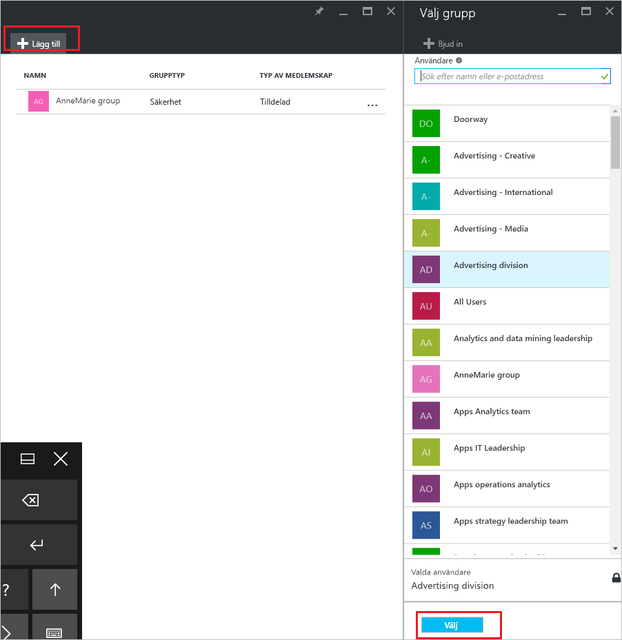
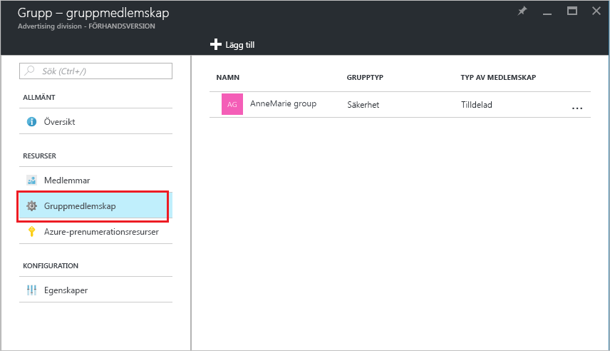

# Så här: lägga till eller ta bort en grupp från någon annan grupp med Azure Active Directory
Den här artikeln hjälper dig att lägga till och ta bort en grupp från någon annan grupp med Azure Active Directory.

>[!Note]
>Om du försöker ta bort den överordnade gruppen kan se [uppdatera eller ta bort en grupp och dess medlemmar](active-directory-groups-delete-group.md).

## Lägga till en grupp till en annan grupp
Du kan lägga till en befintlig säkerhetsgrupp till en annan befintlig säkerhetsgrupp (även kallat kapslade grupper), skapar en medlem i gruppen (Undergrupp) och en överordnad grupp. Medlem-grupp ärver de attribut och egenskaperna för den överordnade gruppen, sparar du konfigurationen.

>[!Important]
>Vi stöder för närvarande inte:<ul><li>Att lägga till säkerhetsgrupper till Office 365-grupper</li><li>Lägga till Office 365-grupper till säkerhetsgrupper eller andra Office 365-grupper</li><li>Tilldelning av appar till kapslade grupper</li><li>Tillämpa licenser på kapslade grupper</li></ul>

### Lägg till en grupp som en medlem i en annan grupp

1. Logga in på [Azure-portalen](https://portal.azure.com) med ett Globalt administratörskonto för katalogen.

2. Välj **Azure Active Directory**, och välj sedan **grupper**.

3. På den **grupper – alla grupper** , söka efter och välj den grupp som är för att bli medlem i en annan grupp. I den här övningen ska du använda den **MDM princip – västra** grupp.

    >[!Note]
    >Du kan lägga till din grupp som en medlem till endast en grupp i taget. Dessutom kan den **Välj grupp** box filtrerar visningen baserat på matchning av ditt bidrag till någon del av ett namn för användaren eller enheten. Dock stöds jokertecken inte.

    

4. På den **gruppmedlemskap för MDM - Väst - princip** väljer **gruppmedlemskap**väljer **Lägg till**, leta upp den grupp du vill att din grupp att vara medlem i och välj sedan  **Välj**. I den här övningen ska du använda den **MDM princip – alla org** grupp.

    Den **MDM princip – västra** är nu medlem av den **MDM princip – alla org** grupp, ärver alla egenskaper och konfiguration av MDM-principen - gruppen med alla org.

    

5. Granska den **gruppmedlemskap för MDM - Väst - princip** och se relationen mellan gruppen och medlemmen.

    

6. För en mer detaljerad vy av relationen mellan gruppen och medlemmen, väljer du gruppnamnet (**MDM princip – alla org**) och ta en titt på de **MDM princip – västra** sidan information.

    

## Ta bort en grupp från någon annan grupp
Du kan ta bort en befintlig säkerhetsgrupp från en annan säkerhetsgrupp. Men om du tar bort gruppen tar också bort alla ärvda attribut och egenskaper för dess medlemmar.

### Att ta bort en medlem från en annan grupp
1. På den **grupper – alla grupper** , söka efter och välj den grupp som ska tas bort som medlem i någon annan grupp. I den här övningen använder vi igen den **MDM princip – västra** grupp.

2. På den **MDM princip – västra översikt** väljer **gruppmedlemskap**.

    

3. Välj den **MDM princip – alla org** gruppen från den **gruppmedlemskap för MDM - Väst - princip** och välj sedan **ta bort** från den **MDM princip – västra** sidan information.

    

## Ytterligare information
Dessa artiklar innehåller ytterligare information om Azure Active Directory.

- [Visa dina grupper och medlemmar](active-directory-groups-view-azure-portal.md)

- [Skapa en basgrupp och lägga till medlemmar](active-directory-groups-create-azure-portal.md)

- [Lägg till eller ta bort medlemmar från en grupp](active-directory-groups-members-azure-portal.md)

- [Redigera dina gruppinställningar](active-directory-groups-settings-azure-portal.md)

- [Använda en grupp för att hantera åtkomst till SaaS-program](../users-groups-roles/groups-saasapps.md)

- [Scenarier, begränsningar och kända problem med hjälp av grupper för att hantera licensiering i Azure Active Directory](../users-groups-roles/licensing-group-advanced.md#limitations-and-known-issues)
