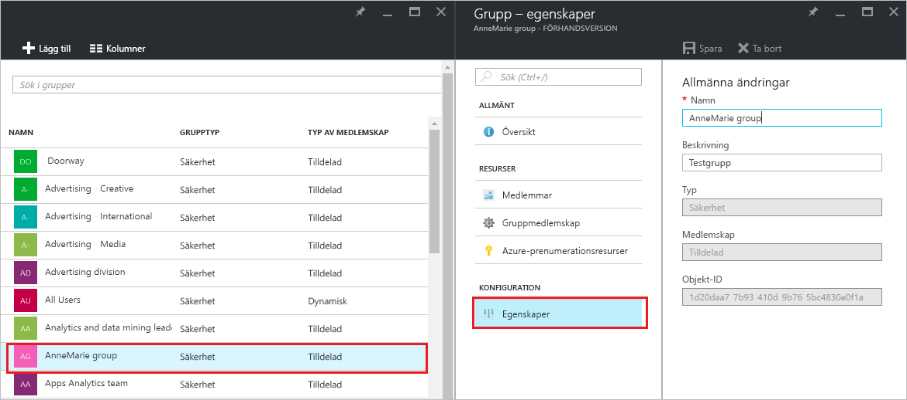
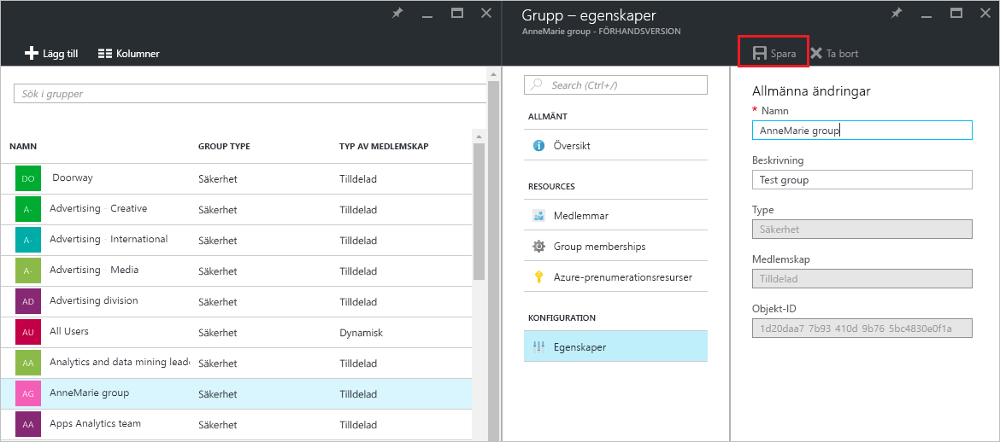

# Hantera inställningarna för en grupp i Azure Active Directory
Den här artikeln förklarar hur du ändrar inställningarna för en grupp i Azure Active Directory (AD Azure).

## Hur gör jag för att hitta och ändra inställningarna?
1. Logga in på [Azure AD administratörscenter](https://aad.portal.azure.com) med ett konto som är en global administratör för katalogen.
2. Välj **Alla tjänster**, ange **Användare och grupper** i textrutan och tryck på **Retur**.

   
3. På bladet **Användare och grupper** väljer du **Alla grupper**.

   
4. Välj en grupp på bladet **Användare och grupper – alla grupper**.
5. Välj **Egenskaper** på bladet **Grupp – *gruppnamn***.

   
6. När du har ändrat egenskaperna för gruppen väljer du **Spara**.    

   

## Nästa steg
Dessa artiklar innehåller ytterligare information om Azure Active Directory.

* [Visa befintliga grupper](active-directory-groups-view-azure-portal.md)
* [Skapa en ny grupp och lägga till medlemmar](active-directory-groups-create-azure-portal.md)
* [Hantera medlemmar i en grupp](active-directory-groups-members-azure-portal.md)
* [Hantera medlemskap i en grupp](active-directory-groups-membership-azure-portal.md)
* [Hantera dynamiska regler för användare i en grupp](../users-groups-roles/groups-dynamic-membership.md)
