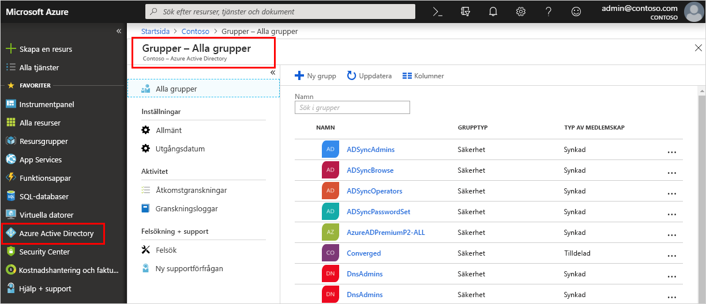

<!--As a brand-new Azure AD administrator, I need to view my organization’s groups along with the assigned members, so I can manage permissions to apps and services for people in my organization-->

# Snabbstart: Visa organisationens grupper och medlemmar i Azure Active Directory
Du kan visa organisationens befintliga grupper och gruppmedlemmar med hjälp av Azure-portalen. Grupper används till att hantera användare (medlemmar) som behöver samma åtkomst till och behörighet för potentiellt begränsade appar och tjänster.

I den här snabbstarten visar du alla organisationens befintliga grupper och visar de tilldelade medlemmarna.

Om du inte har en Azure-prenumeration kan du skapa ett [kostnads fritt konto](https://azure.microsoft.com/free/) innan du börjar. 

## Förutsättningar
Innan du börjar måste du:

- Skapa en klientorganisation i Azure Active Directory. Mer information finns i [Öppna Azure Active Directory-portalen och skapa en ny klientorganisation](active-directory-access-create-new-tenant.md).

## Logga in på Azure Portal
Du måste logga in på [Azure-portalen](https://portal.azure.com/) med ett konto för global administratör för katalogen.

## Skapa en ny grupp 
Skapa en ny grupp med namnet _MDM policy – West_. Mer information om hur du skapar en grupp finns i [Skapa en enkel grupp och lägga till medlemmar](active-directory-groups-create-azure-portal.md).

1. Välj **Azure Active Directory**, **Grupper** och välj sedan **Ny grupp**.

2. Fyll i sidan **Grupp**:
    
    - **Grupptyp:** Välj **säkerhet**
    
    - **Gruppnamn:** skriv _MDM policy – West_
    
    - **Medlemskaps typ:** Välj **tilldelad**.

3. Välj **Skapa**.

## Skapa en ny användare
Skapa en ny användare med namnet _Alain Charon_. En användare måste finnas innan den läggs till som gruppmedlem. Kontrol lera fliken "anpassade domän namn" först för att hämta det verifierade domän namnet som användarna ska skapas i. Mer information om hur du skapar en användare finns i [Lägga till eller ta bort användare](add-users-azure-active-directory.md).

1. Välj **Azure Active Directory**, **Användare** och välj sedan **Ny användare**.

2. Fyll i sidan **Användare**:

    - **Namn:** skriv _Alain Charon_.

    - **Användar namn:** Skriv *alain \@ contoso.com*.

3. Kopiera det automatiskt genererade lösenordet som anges i rutan **Lösenord** och välj sedan **Skapa**.

## Lägga till en gruppmedlem
Nu när du har en grupp och en användare kan du lägga till _Alain Charon_ som medlem i gruppen _MDM policy – West_. Mer information om hur du lägger till gruppmedlemmar finns i [Lägga till eller ta bort gruppmedlemmar](active-directory-groups-members-azure-portal.md).

1. Välj **Azure Active Directory**  >  **grupper**.

2. På sidan **Grupper – Alla grupper** söker du efter och väljer gruppen **MDM policy – West**.

3. På **översiktssidan för MDM policy – West** väljer du **Medlemmar** i området **Hantera**.

4. Välj **Lägg till medlemmar** och sök efter och välj sedan **Alain Charon**.

5. Välj **Välj**.

## Visa alla grupper
Du kan se alla grupper för din organisation på sidan **Grupper – Alla grupper** i Azure-portalen.

- Välj Azure **Active Directory**  >  **grupper**.

    Sidan **Grupper – Alla grupper** visas, med alla dina aktiva grupper.

    

## Söka efter gruppen
Sök på sidan **Grupper – Alla grupper** efter gruppen **MDM policy – West**.

1. På sidan **Grupper – Alla grupper** skriver du _MDM_ i rutan **Sök**.

    Sökresultatet visas under rutan **Sök**, inklusive gruppen _MDM policy – West_.

    

3. Välj gruppen **MDM policy – West**.

4. Visa gruppinformationen på **översiktssidan för MDM policy – West**, bland annat antalet medlemmar i den gruppen.

    

## Visa gruppmedlemmar
Nu när du har hittat gruppen kan du visa alla tilldelade medlemmar.

- Välj **Medlemmar** i området **Hantera** och granska sedan den fullständiga listan med medlemsnamn tilldelade till den specifika gruppen, till exempel _Alain Charon_.

    

## Rensa resurser
Den här gruppen används i flera instruktionerna som finns i avsnittet **Instruktionsguider** i den här dokumentationen. Men om du inte vill använda den här gruppen kan du ta bort den och dess tilldelade medlemmar med hjälp av följande steg:

1. På sidan **Grupper – Alla grupper** söker du efter **MDM policy – West**.

2.  Välj gruppen **MDM policy – West**.

    **Översiktssidan för MDM policy – West** visas.

3. Välj **Ta bort**.

    Gruppen och dess associerade medlemmar tas bort.

    

    >[!Important]
    >Det här tar inte bort användaren Alain Charon, bara hans medlemskap i den borttagna gruppen.

## Nästa steg
Gå vidare till nästa artikel om du vill lära dig hur du associerar en prenumeration till din Azure AD-katalog.

> [!div class="nextstepaction"]
> [Associera en Azure-prenumeration](active-directory-how-subscriptions-associated-directory.md)
