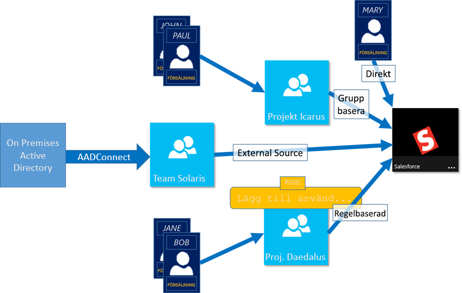
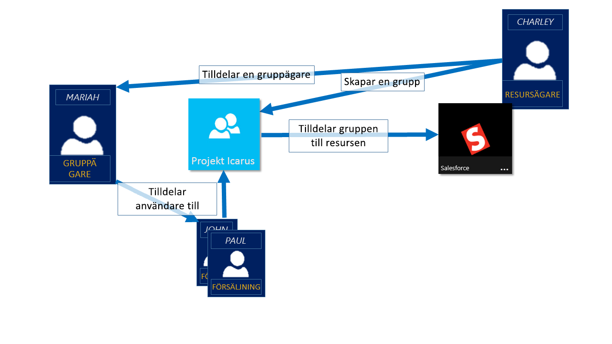

# Hantera åtkomst till resurser med Azure Active Directory-grupper
Azure Active Directory (Azure AD) är en omfattande lösning för identitets- och åtkomsthantering som tillhandahåller stabila funktioner för hantering av åtkomst till lokala och molnbaserade program och resurser, bland annat Microsofts onlinetjänster såsom Office 365 och en lång rad SaaS-program från tredje part. Den här artikeln innehåller en översikt, men om du vill börja använda Azure AD-grupper på en gång följer du anvisningarna i [Hantera säkerhetsgrupper i Azure AD](active-directory-groups-create-azure-portal.md). Om du vill se hur du kan använda PowerShell för att hantera grupper i Azure Active Directory kan du läsa mer i [Azure Active Directory-cmdletar för grupphantering](../users-groups-roles/groups-settings-v2-cmdlets.md).

> [!NOTE]
> För att använda Azure Active Directory behöver du ett Azure-konto. Om du inte har ett Azure-konto kan du [registrera dig för ett kostnadsfritt Azure-konto](https://azure.microsoft.com/pricing/free-trial/).
>
>

I Azure AD är en av de viktigaste funktionerna möjligheten att hantera åtkomst till resurser. Dessa resurser kan vara en del av katalogen, som i fallet med behörigheter för att hantera objekt via roller i katalogen, eller resurser som är externa för katalogen såsom SaaS-program, Azure-tjänster och SharePoint-webbplatser eller lokala resurser. Det finns fyra sätt som en användare kan tilldelas åtkomstbehörigheter till en resurs:

1. Direkt tilldelning

    Användare kan tilldelas direkt till en resurs av ägaren av den resursen.
2. Gruppmedlemskap

    En grupp kan tilldelas till en resurs av resursägaren, och när det sker beviljas medlemmarna i den gruppen åtkomst till resursen. Medlemskap i gruppen kan sedan hanteras av gruppens ägare. I princip delegerar resursägaren behörigheten att tilldela användare till resurserna till gruppens ägare.
3. Regelbaserat

    Resursägaren kan använda en regel för att uttrycka vilka användare som ska tilldelas åtkomst till en resurs. Resultatet av regeln beror på de attribut som används i regeln och deras värden för specifika användare. Därigenom delegerar resursägaren rätten att hantera åtkomst till resurserna till den auktoritativa källan för de attribut som används i regeln. Resursägaren hanterar fortfarande själva regeln och avgör vilka attribut och värden som ger åtkomst till resursen.
4. Extern auktoritet

    Åtkomsten till en resurs härleds från en extern källa, till exempel en grupp som synkroniseras från en auktoritativ källa såsom en lokal katalog eller en SaaS-app, till exempel WorkDay. Resursägaren tilldelar gruppen för att ge åtkomst till resursen, och den externa källan hanterar medlemmarna i gruppen.

   

## Titta på ett videoklipp som förklarar åtkomsthantering
Du kan titta på en kort video som förklarar mer om detta:

**Azure AD: Introduktion till dynamiskt medlemskap för grupper**

> [!VIDEO https://channel9.msdn.com/Series/Azure-Active-Directory-Videos-Demos/Azure-AD--Introduction-to-Dynamic-Memberships-for-Groups/player]
>
>

## Hur fungerar åtkomsthantering i Azure Active Directory?
I kärnan av Azure AD-lösningen för åtkomsthantering finns säkerhetsgruppen. Användning av en säkerhetsgrupp för att hantera åtkomst till resurser är ett välkänt paradigm som möjliggör ett flexibelt och lättförstått sätt att ge åtkomst till en resurs för den avsedda användargruppen. Resursägaren (eller administratören för katalogen) kan tilldela en grupp för att ge en viss åtkomsträtt till resurser som ägaren äger. Medlemmarna i gruppen ges åtkomst, och resursägaren kan delegera rätten att hantera listan över medlemmar i en grupp till någon annan, till exempel en avdelningschef eller en supportadministratör.

Ägaren av en grupp kan också göra gruppen tillgänglig för självbetjäningsbegäranden. På så sätt kan en slutanvändare söka efter och hitta gruppen och skapa en begäran att gå med, vilket i praktiken innebär att begära behörighet att komma åt de resurser som hanteras via gruppen. Gruppens ägare kan konfigurera gruppen så att deltagandebegäranden godkänns automatiskt eller kräver godkännande av gruppens ägare. När en användare skickar en begäran om att delta i en grupp vidarebefordras deltagningsbegäran till gruppens ägare. Om någon av ägarna godkänner begäran meddelas den begärande användaren och ansluts till gruppen. Om någon av ägarna nekar begäran meddelas den begärande användaren men ansluts inte till gruppen.

## Komma igång med åtkomsthantering
Redo att sätta igång? Du bör prova några av de grundläggande uppgifter som du kan göra med Azure AD-grupper. Använd dessa funktioner för att ge särskild åtkomst till olika grupper av personer för olika resurser i din organisation. En lista över grundläggande första steg finns nedan.

* [Skapa en enkel regel för att konfigurera dynamiska medlemskap för en grupp](active-directory-groups-create-azure-portal.md)
* [Använda en grupp för att hantera åtkomst till SaaS-program](../users-groups-roles/groups-saasapps.md)
* [Göra en grupp tillgänglig för självbetjäning av slutanvändare](../users-groups-roles/groups-self-service-management.md)
* [Synkronisera en lokal grupp till Azure med hjälp av Azure AD Connect](../connect/active-directory-aadconnect.md)
* [Hantera ägare för en grupp](active-directory-accessmanagement-managing-group-owners.md)

## Nästa steg
Nu när du förstår grunderna för åtkomsthantering följer här några ytterligare avancerade funktioner tillgängliga i Azure Active Directory för att hantera åtkomst till dina program och resurser.

* [Använda attribut för att skapa avancerade regler](../users-groups-roles/groups-dynamic-membership.md)
* [Hantera säkerhetsgrupper i Azure AD](active-directory-groups-create-azure-portal.md)
* [Graph API-referens för grupper](https://msdn.microsoft.com/Library/Azure/Ad/Graph/api/groups-operations#GroupFunctions)
* [Azure Active Directory-cmdletar för att konfigurera gruppinställningar](../users-groups-roles/groups-settings-cmdlets.md)
