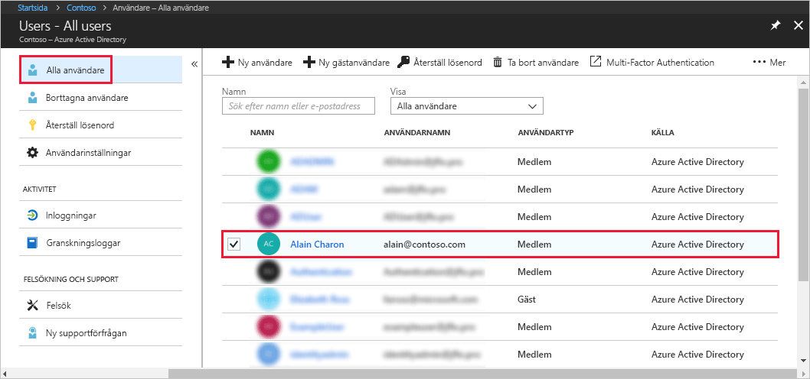
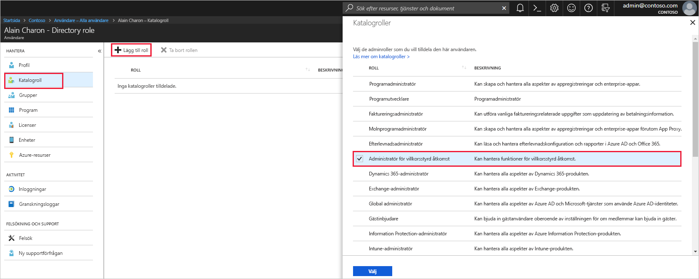

# Tilldela administratörsroller till en användare i Azure Active Directory
Den här artikeln beskriver hur du tilldelar administratörsroller till en användare i Azure Active Directory (AD Azure). Information om hur du lägger till nya användare i din organisation finns i [Lägga till nya användare i Azure Active Directory](../add-users-azure-active-directory.md). Tillagda användare har inte administratörsbehörighet som standard, men du kan tilldela roller till dem när som helst.

## Tilldela en roll till en användare
1. Logga in på [Azure-portalen](https://portal.azure.com) med ett konto som är en global administratör eller en administratör med privilegierad roll för katalogen.

2. Välj **Azure Active Directory**, välj **Users** (Användare) och välj sedan en specifik användare i listan.

    

3. För den valda användaren väljer du **Directory role** (Katalogroll), **Add role**, (Lägg till roll) och sedan lämpliga administratörsroller i listan **Directory roles** (Katalogroll), till exempel **Conditional access administrator** (Administratör med villkorlig åtkomst). Mer information om administrativa roller finns i [Tilldela administratörsroller i Azure AD](../active-directory-assign-admin-roles-azure-portal.md). 

    

1. Tryck på **Select** (Välj) för att spara.

## Nästa steg
* [Snabbstart: Lägg till eller ta bort användare i Azure Active Directory](add-users-azure-active-directory.md)
* [Hantera användarprofiler](active-directory-users-profile-azure-portal.md)
* [Lägga till gästanvändare från annan katalog](../b2b/what-is-b2b.md) 
* [Tilldela en användare till en roll i din Azure AD](active-directory-users-assign-role-azure-portal.md)
* [Återställa en borttagen användare](active-directory-users-restore.md)
