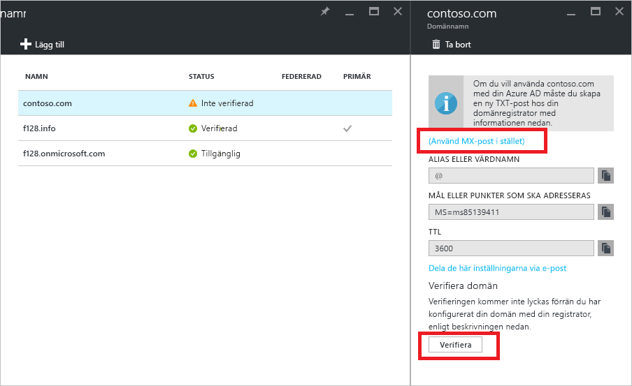

# Snabbstart: Lägga till ett anpassat domännamn i Azure Active Directory

Varje Azure AD-katalog levereras med ett initialt domännamn enligt mönstret *domännamn*.onmicrosoft.com. Det initiala domännamnet inte kan ändras eller tas bort, men du kan lägga till företagets domännamn till Azure AD också. Till exempel har din organisation förmodligen andra domännamn som används i verksamheten samt användare som loggar in med företagets domännamn. Genom att lägga till anpassade domännamn till Azure AD kan du tilldela användarnamn i katalogen som dina användare känner igen, till exempel ”alice@contoso.com”. i stället för ”alice@*domännamn*.onmicrosoft.com”. Processen är enkel:

1. Lägga till det anpassade domännamnet i din katalog
2. Lägga till en DNS-post för domännamnet hos domännamnsregistratorn
3. Verifiera det anpassade domännamnet i Azure AD

## Lägga till det anpassade domännamnet i din katalog
1. Logga in på [Azure-portalen](https://aad.portal.azure.com/#blade/Microsoft_AAD_IAM/ActiveDirectoryMenuBlade/Overview) med ett konto som är en global administratör för katalogen.
2. Till vänster väljer du **Anpassade domännamn**.
3. Välj **Lägg till en anpassad domän**.
   
   
5. På **Anpassade domännamn** anger du namnet på din anpassade domän i rutan, till exempel ”contoso.com”, och väljer sedan **Lägg till domän**. Glöm inte att ta med .com, .net eller ett annat tillägg för toppnivån.
6. På ***domännamn*** (det vill säga att ditt nya domännamn är rubriken) samlar du in DNS-postinformation för att använda senare för att verifiera det anpassade domännamnet i Azure AD.
   
   

> [!TIP]
> Om du planerar att federera din lokala Windows Server AD med Azure AD behöver du markera kryssrutan **Jag planerar att konfigurera den här domänen för enkel inloggning med min lokala Active Directory** när du kör Azure AD Connect-verktyget för att synkronisera dina kataloger. Du behöver även registrera samma domännamn som du väljer för federering med din lokala katalog i steget **Azure AD-domän** i guiden. Du kan se hur det steget i guiden ser ut [i dessa anvisningar](./../connect/active-directory-aadconnect-get-started-custom.md#verify-the-azure-ad-domain-selected-for-federation). Om du inte har verktyget Azure AD Connect kan du [ladda ned det här](http://go.microsoft.com/fwlink/?LinkId=615771).

## Lägga till en DNS-post för domännamnet hos domännamnsregistratorn
Nästa steg mot att kunna använda ditt anpassade domännamn med Azure AD är att du uppdaterar domänens DNS-zonfil. Azure AD kan då verifiera att din organisation äger det anpassade domännamnet. Du kan använda [Azure DNS](https://docs.microsoft.com/azure/dns/dns-getstarted-portal) för dina Azure- eller Office 365-DNS-poster eller externa DNS-poster i Azure, eller lägga till DNS-posten på [en annan DNS-registrator](https://support.office.com/article/Create-DNS-records-for-Office-365-when-you-manage-your-DNS-records-b0f3fdca-8a80-4e8e-9ef3-61e8a2a9ab23/).

1. Logga in hos domännamnsregistratorn för domänen. Om du inte har den åtkomst som krävs för att uppdatera DNS-posten så be den person eller grupp i din organisation som har denna åtkomst att utföra steg 2 och att meddela dig när det är klart.
2. Uppdatera DNS-zonfilen för domänen genom att lägga till DNS-posten som du fått från Azure AD. DNS-posten ändrar inga beteenden, till exempel e-postdirigering eller webbhosting.

## Verifiera det anpassade domännamnet i Azure AD
När du har lagt till DNS-posten är du redo att verifiera domännamnet med Azure AD. Ett domännamn kan endast verifieras efter det att DNS-posterna har spritts. Spridningen tar ofta bara några sekunder, men kan ibland ta en timme eller mer. Om verifieringen inte fungerar första gången försöker du igen lite senare.

1. Logga in på [Azure AD](https://aad.portal.azure.com/#blade/Microsoft_AAD_IAM/ActiveDirectoryMenuBlade/Overview) med ett konto som är en global administratör för klientorganisationen.
2. Välj **Egna domännamn**.
3. Välj det overifierade domännamn som du vill verifiera.
4. Kontrollera dina poster och välj **Verifiera** för att slutföra verifieringen.

Nu kan du [tilldela användarnamn som innehåller ditt domännamn](../users-groups-roles/domains-manage.md). Du kan skapa molnbaserade användarkonton eller uppdatering tidigare synkroniserad lokal användarkontoinformation med hjälp av ditt anpassade domännamn. Du kan även ändra synkroniserad information för användarkontodomänsuffix med [Microsoft PowerShell](https://msdn.microsoft.com/library/azure/e1ef403f-3347-4409-8f46-d72dafa116e0#BKMK_ManageDomains) eller [Graph API](https://msdn.microsoft.com/Library/Azure/Ad/Graph/api/domains-operations).

> [!TIP]
> Du kan lägga till upp till 900 hanterade domännamn. Om du konfigurerar alla dina domäner för federation lokalt med Active Directory kan du lägga till upp till 450 domännamn i varje katalog. Mer information finns i [Federerade och hanterade domännamn](https://docs.microsoft.com/azure/active-directory/active-directory-add-domain-concepts#federated-and-managed-domain-names).

## Felsökning
Om du inte kan verifiera ett anpassat domännamn provar du följande felsökningssteg:

1. **Vänta en timma**. DNS-posterna måste spridas innan Azure AD kan verifiera domänen. Processen kan ta en timma eller mer.
2. **Kontrollera att DNS-posten har angetts och att den är korrekt**. Utför det här steget på webbplatsen för domännamnsregistratorn för domänen. Azure AD kan inte verifiera domännamnet om 
  * DNS-posten inte finns i DNS-zonfilen
  * Det inte finns någon exakt matchning med DNS-posten som Azure AD gav dig. 
  
  Om du inte har den åtkomst som krävs för att uppdatera DNS-poster för domänen hos domännamnsregistratorn så dela DNS-posten med den person eller grupp i din organisation som har den åtkomst som krävs och be dem att lägga till DNS-posten.
3. **Ta bort domännamnet från en annan katalog i Azure AD**. Ett domännamn kan bara verifieras i en enskild katalog. Om ett domännamn för närvarande är verifierat i en annan katalog kan det inte verifieras i din nya katalog förrän det tas bort på den andra. Mer information om hur du tar bort domännamn finns i [Hantera anpassade domännamn](../users-groups-roles/domains-manage.md).    

Upprepa stegen i den här artikeln för att lägga till vart och ett av dina domännamn.

## Läs mer
[Konceptuell översikt över anpassade domännamn i Azure AD](../users-groups-roles/domains-manage.md)

[Hantera egna domännamn](../users-groups-roles/domains-manage.md)

## Nästa steg
I den här snabbstarten har du lärt dig hur du lägger till ett anpassat domännamn till Azure AD. 

Du kan använda följande länk för att skapa ett nytt anpassat domännamn i Azure AD från Azure-portalen.

> [!div class="nextstepaction"]
> [Lägga till en anpassad domän](https://aad.portal.azure.com/#blade/Microsoft_AAD_IAM/ActiveDirectoryMenuBlade/QuickStart) 