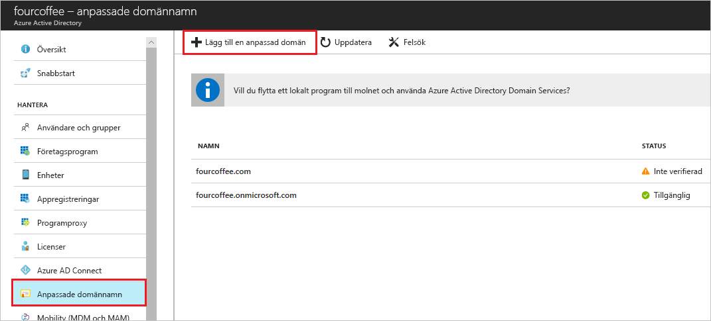

# Lägg till ditt anpassade domän namn med hjälp av Azure Active Directory portalen

Varje ny Azure AD-klient kommer med ett första domän namn, *\<domainname> . onmicrosoft.com*. Du kan inte ändra eller ta bort det ursprungliga domän namnet, men du kan lägga till organisationens namn. Genom att lägga till anpassade domän namn kan du skapa användar namn som är bekanta för dina användare, till exempel *alain \@ contoso.com*.

## Innan du börjar

Innan du kan lägga till ett anpassat domän namn skapar du domän namnet med en domän registrator. För en ackrediterad domän registrator, se [ICANN-ackrediterade registrators](https://www.icann.org/registrar-reports/accredited-list.html).

## Skapa din katalog i Azure AD

När du får ditt domän namn kan du skapa din första Azure AD-katalog. Logga in på Azure Portal för din katalog med hjälp av ett konto med **ägar** rollen för prenumerationen.

Skapa din nya katalog genom att följa stegen i [skapa en ny klient organisation för din organisation](active-directory-access-create-new-tenant.md#create-a-new-tenant-for-your-organization).

>[!IMPORTANT]
>Den person som skapar klienten är automatiskt den globala administratören för den klienten. Den globala administratören kan lägga till ytterligare administratörer till klienten.

Mer information om prenumerations roller finns i [Azure-roller](../../role-based-access-control/rbac-and-directory-admin-roles.md#azure-roles).

>[!TIP]
> Om du planerar att federera din lokala Windows Server AD med Azure AD måste du välja **Jag planerar att konfigurera den här domänen för enkel inloggning med min lokala Active Directory** när du kör Azure AD Connect-verktyget för att synkronisera dina kataloger.
>
> Du behöver även registrera samma domännamn som du väljer för federering med din lokala katalog i steget **Azure AD-domän** i guiden. Information om hur installationen ser ut finns i [Verifiera att den Azure AD-domän som valts för Federation](../hybrid/how-to-connect-install-custom.md#verify-the-azure-ad-domain-selected-for-federation). Om du inte har verktyget Azure AD Connect kan du [Ladda ned det här](https://go.microsoft.com/fwlink/?LinkId=615771).

## Lägg till ditt anpassade domän namn i Azure AD

När du har skapat din katalog kan du lägga till ditt anpassade domän namn.

1. Logga in på [Azure-portalen](https://portal.azure.com/) med ett Globalt administratörskonto för katalogen.

1. Sök efter och välj *Azure Active Directory* från vilken sida som helst. Välj sedan **anpassade domän namn**  >  **Lägg till anpassad domän**.

    

1. I **eget domän namn** anger du organisationens nya namn, i det här exemplet *contoso.com*. Välj **Lägg till domän**.

    

    >[!IMPORTANT]
    >Du måste inkludera *. com*, *.net* eller något annat tillägg på den översta nivån för att detta ska fungera korrekt.

    Den overifierade domänen har lagts till. Sidan **contoso.com** visas med din DNS-information. Spara den här informationen. Du behöver den senare för att kunna skapa en TXT-post för att konfigurera DNS.

    

## Lägg till DNS-informationen hos domänregistratorn

När du har lagt till ditt anpassade domän namn i Azure AD måste du gå tillbaka till domän registratorn och lägga till Azure AD DNS-information från den kopierade TXT-filen. Om du skapar den här TXT-posten för din domän verifieras ägarskapet för ditt domän namn.

Gå tillbaka till din domän registrator och skapa en ny TXT-post för din domän baserat på din kopierade DNS-information. Ange TTL-värdet (Time to Live) till 3600 sekunder (60 minuter) och spara sedan posten.

>[!IMPORTANT]
>Du kan registrera så många domän namn som du vill. Varje domän får dock sin egen TXT-post från Azure AD. Var försiktig när du anger TXT-filinformationen på domän registratorn. Om du anger fel eller Duplicerad information av misstag måste du vänta tills TTL-tiden nåtts (60 minuter) innan du kan försöka igen.

## Verifiera ditt anpassade domän namn

När du har registrerat ditt anpassade domän namn kontrollerar du att det är giltigt i Azure AD. Spridningen från din domän registrator till Azure AD kan vara omedelbar eller så kan det ta några dagar, beroende på din domän registrator.

Följ dessa steg om du vill verifiera ditt anpassade domän namn:

1. Logga in på [Azure-portalen](https://portal.azure.com/) med ett Globalt administratörskonto för katalogen.

1. Sök efter och välj *Azure Active Directory* från vilken sida som helst, och välj sedan **anpassade domän namn**.

1. I **anpassade domän namn** väljer du det anpassade domän namnet. I det här exemplet väljer du **contoso.com**.

    

1. På sidan **contoso.com** väljer du **Verifiera** för att kontrol lera att din anpassade domän är korrekt registrerad och är giltig för Azure AD.

    

När du har verifierat ditt anpassade domän namn kan du ta bort verifierings-TXT-eller MX-filen.

## Vanliga verifierings problem

Om det inte går att verifiera ett anpassat domän namn i Azure AD kan du prova följande förslag:

- **Vänta minst en timme och försök igen**. DNS-posterna måste spridas innan Azure AD kan verifiera domänen. Processen kan ta en timma eller mer.

- **Kontrol lera att DNS-posten är korrekt.** Gå tillbaka till webbplatsen för domän namns registratorn. Kontrol lera att posten finns där och att den matchar DNS-postinformationen som tillhandahålls av Azure AD.

  Om du inte kan uppdatera posten på registrator-webbplatsen delar du posten med någon som har behörighet att lägga till posten och kontrollerar att den är korrekt.

- **Kontrol lera att domän namnet inte redan används i en annan katalog.** Ett domän namn kan bara verifieras i en katalog. Om ditt domän namn för närvarande är verifierat i en annan katalog kan det inte också verifieras i den nya katalogen. Du måste ta bort domän namnet från den gamla katalogen för att åtgärda det här problemet. Mer information om hur du tar bort domän namn finns i [Hantera anpassade domän namn](../enterprise-users/domains-manage.md).

- **Kontrol lera att du inte har några ohanterade Power BI klienter.** Om dina användare har aktiverat Power BI via självbetjänings registrering och skapat en ohanterad klient för din organisation, måste du ta över hanteringen som en intern eller extern administratör med hjälp av PowerShell. Mer information finns i [Ta över en ohanterad katalog som administratör i Azure Active Directory](../enterprise-users/domains-admin-takeover.md).

## Nästa steg

- Lägg till en annan global administratör i katalogen. Mer information finns i [så här tilldelar du roller och administratörer](active-directory-users-assign-role-azure-portal.md).

- Lägg till användare till din domän. Mer information finns i [så här lägger du till eller tar bort användare](add-users-azure-active-directory.md).

- Hantera din domän namns information i Azure AD. Mer information finns i [Hantera anpassade domän namn](../enterprise-users/domains-manage.md).

- Om du har lokala versioner av Windows Server som du vill använda tillsammans med Azure Active Directory, se [integrera dina lokala kataloger med Azure Active Directory](../hybrid/whatis-hybrid-identity.md).