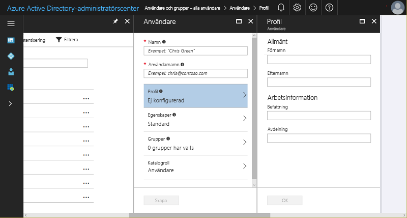
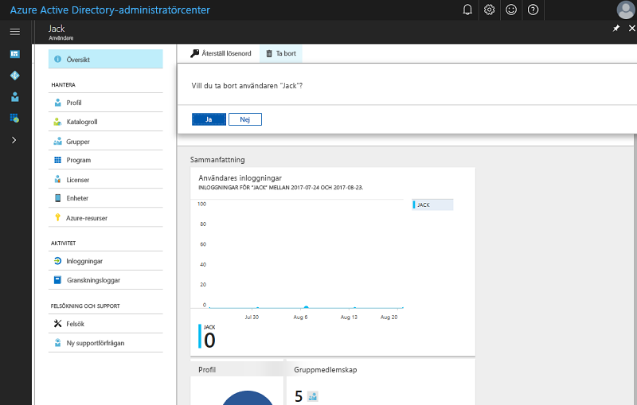

# Snabbstart: Lägga till nya användare i Azure Active Directory
Den här artikeln beskriver hur du tar bort eller lägger till användare i din organisation till organisationens Azure Active Directory-klientorganisation (Azure AD) med hjälp av Azure-portalen eller genom att synkronisera dina lokala Windows Server AD-användarkontodata. 

## Lägga till molnbaserade användare
1. Logga in på [Azure Active Directory-administratörscentret](https://aad.portal.azure.com) med ett konto som är en global administratör för katalogen.
2. Välj **Azure Active Directory** och sedan **Användare och grupper**.
3. På **Användare och grupper** väljer du **Alla användare** och sedan **Ny användare**.
   
4. Ange information för användaren, till exempel **Namn** och **Användarnamn**. Domännamndelen av användarnamnet måste vara antingen det initiala standarddomännamnet ”[domännamn].onmicrosoft.com” eller ett verifierat icke-federerat [domännamn](add-custom-domain.md) såsom ”contoso.com”.
5. Kopiera eller anteckna det genererade användarlösenordet på annat sätt så att du kan ge det till användaren när den här processen är klar.
6. Du kan också öppna och fylla i informationen i **Profil**, **Grupper** eller **Katalogroll** för användaren. Mer information om användar- och administratörsroller finns i [Tilldela administratörsroller i Azure AD](../users-groups-roles/directory-assign-admin-roles.md).
7. På **Användare** väljer du **Skapa**.
8. Distribuera det genererade lösenordet på ett säkert sätt till den nya användaren så att användaren kan logga in.

> [!TIP]
> Du kan också synkronisera användarkontodata från en lokal Windows Server AD. Microsofts identitetslösningar omfattar både lokala och molnbaserade funktioner, skapar en enda användaridentitet för autentisering och auktorisering till alla resurser, oavsett plats. Vi kallar den här för Hybrid Identity (hybrididentitet). [Azure AD Connect](https://docs.microsoft.com/azure/active-directory/connect/active-directory-aadconnect) kan användas för att integrera dina lokala kataloger med Azure Active Directory för hybrididentitetsscenarier. På så sätt kan du erbjuda en gemensam identitet för dina användare för Office 365- och Azure SaaS-program som är integrerade med Azure AD. 

## Ta bort användare från Azure AD
1. Logga in på [Azure Active Directory-administratörscentret](https://aad.portal.azure.com) med ett konto som är en global administratör för katalogen.
2. Välj **Användare och grupper**.
3. På bladet **Användare och grupper** väljer du den användare i listan som ska tas bort. 
4. På bladet för den valda användaren väljer du **Översikt** och sedan **Ta bort** i kommandofältet.
   

### Läs mer 
* [Lägga till gästanvändare från annan katalog](../b2b/what-is-b2b.md) 
* [Tilldela en användare till en roll i din Azure AD](active-directory-users-assign-role-azure-portal.md)
* [Hantera användarprofiler](active-directory-users-profile-azure-portal.md)
* [Återställa en borttagen användare](active-directory-users-restore.md)

## Nästa steg
I den här snabbstarten har du lärt dig hur du lägger till nya användare till Azure AD Premium. 

Du kan använda följande länk för att skapa en ny användare i Azure AD från Azure-portalen.

>[!div class="nextstepaction"]
>[Lägga till användare i Azure AD](https://aad.portal.azure.com/#blade/Microsoft_AAD_IAM/UserManagementMenuBlade/)