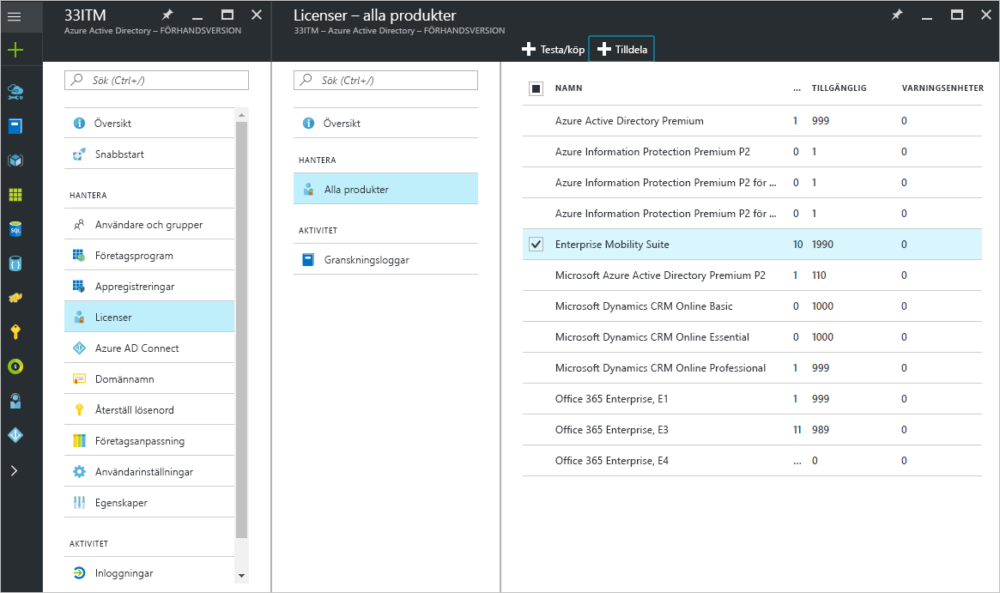
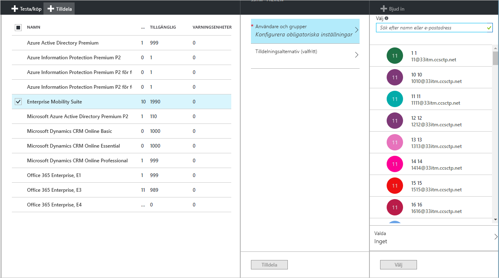
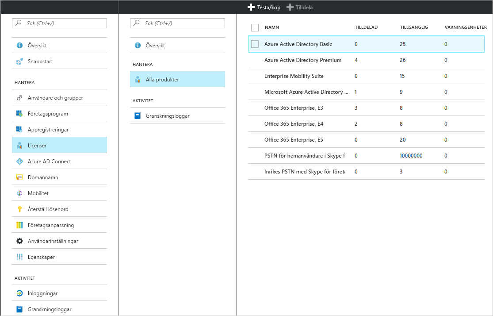
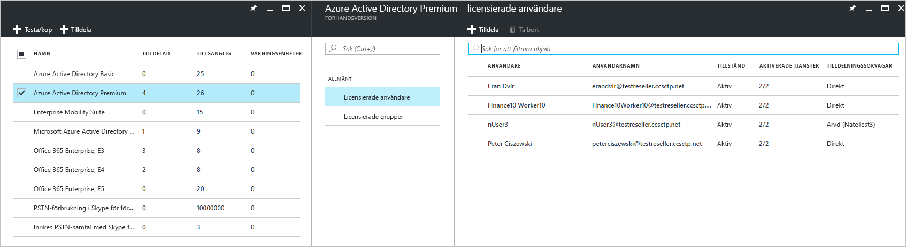
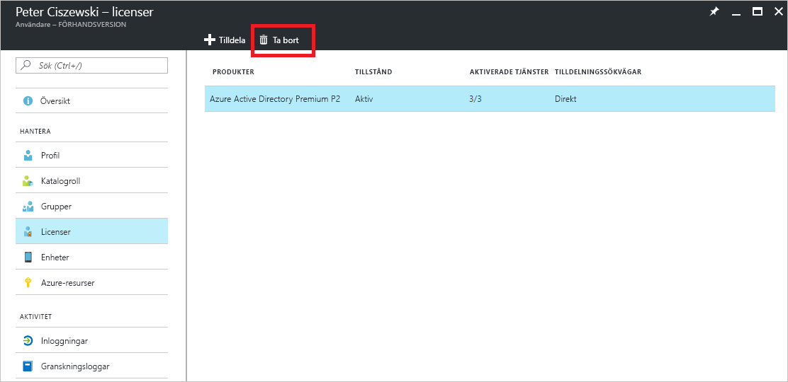

# Snabbstart: Licensiera användare i Azure Active Directory
Licensbaserade Azure AD-tjänster fungerar genom att aktivera en Azure Active Directory-prenumeration (Azure AD) i din Azure-klientorganisation. När prenumerationen är aktiv hanteras tjänstfunktioner av Azure AD-administratörer och används av licensierade användare. När du köper Enterprise Mobility + Security, Azure AD Premium eller Azure AD Basic, uppdateras din klient med prenumerationen, inklusive dess giltighetstid och förbetalda licenser. Du kommer åt din prenumerationsinformation, inklusive antalet tilldelade eller tillgängliga licenser, via Azure-portalen under **Azure Active Directory** genom att öppna panelen **Licenser**. Bladet **Licenser** är också den bästa platsen för att hantera dina licenstilldelningar.

Att skaffa en prenumeration är det enda du behöver för att konfigurera betalfunktioner, men du måste fortfarande tilldela användarlicenser för betalda Azure AD-betalfunktioner. Alla användare som ska ha åtkomst till eller som hanteras via en Azure AD-betalfunktion måste tilldelas en licens. Licenstilldelning är en mappning mellan en användare och en betaltjänst, till exempel Azure AD Premium, Basic eller Enterprise Mobility + Security.

Du kan använda [gruppbaserad licenstilldelning](active-directory-licensing-whatis-azure-portal.md) för att konfigurera regler, till exempel följande:
* Alla användare i din katalog får automatiskt en licens
* Alla med lämpliga befattningar får en licens
* Du kan delegera beslutet till andra chefer i organisationen (genom att använda [självbetjäningsgrupper](../users-groups-roles/groups-self-service-management.md))

> [!TIP]
> En detaljerad beskrivning av licenstilldelning till grupper, inklusive avancerade scenarier och Office 365-licensieringsscenarier finns i [Tilldela licenser till användare efter gruppmedlemskap i Azure Active Directory](../users-groups-roles/licensing-groups-assign.md).

## Tilldela licenser till användare och grupper
Med en aktiv prenumeration bör du först tilldela en licens till dig själv och uppdatera webbläsaren för att säkerställa att du ser alla förväntade funktioner som ingår i prenumerationen. Nästa steg är att tilldela licenser till de användare som behöver åtkomst till Azure AD-betalfunktioner. Ett enkelt sätt att tilldela licenser är att tilldela licenser till grupper av användare i stället för enskilda användare. När du tilldelar licenser till en grupp tilldelas alla medlemmar i gruppen en licens. Om användare läggs till eller tas bort från gruppen tilldelas eller tas rätt licens bort automatiskt. 

> [!NOTE]
> Vissa Microsoft-tjänster är inte tillgängliga på alla platser. Innan en licens kan tilldelas till en användare måste administratören ange egenskapen **Användningsplats** för användaren. Du kan ange den här egenskapen i **Användare** &gt; **Profil** &gt; **Inställningar** i Azure-portalen. När du använder grupplicenstilldelning ärver alla användare vars användningsplatser inte har angetts platsen för katalogen.

För att tilldela en licens går du till **Azure Active Directory** &gt; **Licenser** &gt; **Alla produkter**, väljer en eller flera produkter och väljer sedan **Tilldela** i kommandofältet.

Du kan använda bladet **Användare och grupper** för att välja flera användare eller grupper eller för att inaktivera tjänstplaner i produkten. Använd sökrutan längst upp för att söka efter användarnamn och gruppnamn.

När du tilldelar licenser till en grupp kan ta det lite tid innan alla användare ärver licensen beroende på gruppens storlek. Du kan kontrollera bearbetningsstatusen på bladet **Grupp** under panelen **Licenser**.

Tilldelningsfel kan uppstå under Azure AD-licenstilldelning men är relativt sällsynta när du hanterar Azure AD- och Enterprise Mobility + Security-produkter. Potentiella tilldelningsfel är begränsade till:
- Tilldelningskonflikt: när en användare tidigare tilldelades en licens som är inkompatibel med den aktuella licensen. I det här fallet måste den aktuella licensen tas bort för att den nya licensen ska kunna tilldelas.
- Tillgängliga licenser har överskridits: när antalet användare i tilldelade grupper överskrider de tillgängliga licenserna återspeglar en användares tilldelningsstatus en misslyckad tilldelning på grund av saknade licenser.

### Azure AD B2B-samarbetslicensiering

Med B2B-samarbete kan du bjuda in gästanvändare till din Azure AD-klientorganisation för att ge åtkomst till Azure AD-tjänster och alla Azure-resurser som du gör tillgängliga.  

Det finns ingen avgift för att bjuda in B2B-användare och tilldela dem till ett program i Azure AD. Upp till 10 appar per gästanvändare och 3 grundläggande rapporter är också kostnadsfria för B2B-samarbetsanvändare. Om din gästanvändare har tilldelats lämpliga licenser i partnerns Azure AD-klientorganisation licensieras användaren i din också.

Det krävs inte att B2B-gästanvändarna licensieras med lämpliga Azure AD-licenser, men däremot behövs det om du vill ge åtkomst till Azure AD-betalfunktioner. En inbjudande klientorganisation med en betald Azure AD-licens kan tilldela behörigheter för B2B-samarbete till ytterligare fem gästanvändare som bjudits in till klientorganisationen. Scenarier och information finns i [Vägledning om B2B-samarbetslicensiering](../b2b/licensing-guidance.md).

## Visa tilldelade licenser

En översikt över tilldelade och tillgängliga licenser visas under **Azure Active Directory** &gt; **Licenser** &gt; **Alla produkter**.

En detaljerad lista över tilldelade användare och grupper är tillgänglig en specifik produkt väljs. I listan **Licensierade användare** visas alla användare som för närvarande använder en licens och om licensen tilldelats direkt till användaren eller om den ärvts från en grupp.

På liknande sätt visas det i listan **Licensierade grupper** alla grupper som tilldelats licenser. Välj en användare eller en grupp för att öppna bladet **Licenser**, som visar alla licenser som tilldelats det objektet.

## Ta bort en licens

Om du vill ta bort en licens går du till användaren eller gruppen och öppnar panelen **Licenser**. Välj licensen och klicka på **Ta bort**.

Licenser som ärvs av användaren från en grupp kan inte tas bort direkt. Ta i stället bort användaren från gruppen som användaren ärver licensen från.

## Nästa steg
I den här snabbstarten har du lärt dig hur du tilldelar licenser till användare och grupper i Azure AD-katalogen. 

Du kan använda följande länk för att konfigurera prenumerationslicenstilldelningar i Azure AD från Azure-portalen.

> [!div class="nextstepaction"]
> [Tilldela Azure AD-licenser](https://aad.portal.azure.com/#blade/Microsoft_AAD_IAM/LicensesMenuBlade/Overview) 