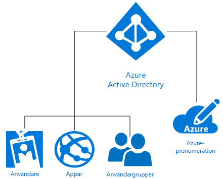

# Vad är Microsoft Azure-identitet?
Microsoft Azure Active Directory (Azure AD) är en molnlösning för identitets- och åtkomsthantering som tillhandahåller katalogtjänster, identitetsstyrning och programåtkomsthantering. Azure AD [aktiverar snabbt enkel inloggning (SSO)](https://docs.microsoft.com/azure/active-directory/active-directory-enterprise-apps-manage-sso) till tusentals förintegrerade kommersiella och anpassade appar i [Azure AD-programgalleriet](https://azure.microsoft.com/marketplace/active-directory/all/). Du använder säkert många av de här apparna, till exempel Office 365, Salesforce.com, Box, ServiceNow och Workday.

En enda Azure AD-katalog associeras automatiskt med en Azure-prenumeration när den skapas. Som identitetstjänst i Azure ger Azure AD sedan alla funktioner för identitetshantering och åtkomstkontroll för molnbaserade resurser. De här resurserna kan inbegripa användare, appar och grupper för en enskild klientorganisation (organisation) som visas i följande diagram:

Microsoft Azure erbjuder flera olika sätt att dra nytta av Identity as a Service (IDaaS) med olika komplexitetsnivåer för att uppfylla behoven i din organisation. Resten av den här artikeln hjälper dig att förstå grundläggande termer och begrepp om Azure-identitet samt ger rekommendationer så att du kan göra det bästa valet bland de tillgängliga alternativen.

## Termer att känna till

Innan du väljer en Azure-identitetslösning för din organisation behöver du en grundläggande förståelse av de termer som används ofta när man talar om Azure-identitetstjänster.

|Term att känna till| Beskrivning|
|-----|-----|
|Azure-prenumeration |Prenumerationer används för att betala för Azure-molntjänster och är vanligtvis kopplade till ett kreditkort. Du kan ha flera prenumerationer, men det kan vara svårt att dela resurser mellan prenumerationer.|
|Azure-klientorganisation | En Azure AD-klientorganisation är representativ för en enskild organisation. Det är en dedikerad, betrodd instans av Azure AD som skapas automatiskt när en organisation registrerar sig för en Microsoft-molntjänstprenumeration såsom Azure, Intune eller Office 365. Klientorganisationer kan få åtkomst till tjänster i antingen en dedikerad miljö (enskild klientorganisation) eller i en delad miljö med andra organisationer (flera klientorganisationer).|
|Azure AD-katalog | Varje Azure-klientorganisation har en dedikerad, betrodd Azure AD-katalog som innehåller klientorganisationens användare, grupper och program. Den används för att utföra funktioner för identitet och åtkomsthantering för klientorganisationsresurser. Eftersom en unik Azure AD-katalog etableras automatiskt för att representera organisationen när du registrerar dig för en Microsoft-molntjänst som Azure, Microsoft Intune eller Office 365 ser du ibland termerna *klientorganisation*,  *Azure AD*, och *Azure AD-katalog* användas synonymt. |
|Anpassad domän | När du först registrerar dig för en prenumeration på Microsoft-molntjänst använder din klientorganisation (organisationen) ett *. onmicrosoft.com*-domännamn. De flesta organisationer har dock ett eller flera domännamn som används i verksamhetssyfte och som slutanvändare använder för att komma åt företagets resurser. Du kan lägga till ett anpassat domännamn till Azure AD så att domännamnet är bekant för användarna, till exempel *alice@contoso.com* i stället för *alice@contoso.onmicrosoft.com*. |
|Azure AD-konto | Det här är identiteter som skapas med hjälp av Azure AD eller en annan Microsoft-molntjänst, till exempel Office 365. De lagras i Azure AD och är tillgängliga för alla organisationens prenumerationer på molntjänster. |
|Azure-prenumerationsadministratör| Kontoadministratören är den person som har registrerat sig för eller köpt Azure-prenumerationen. Den personen kan använda [Kontocenter](https://account.azure.com/Subscriptions) för att utföra olika hanteringsuppgifter som att skapa prenumerationer, avbryta prenumerationer, ändra faktureringen för en prenumeration eller ändra tjänstadministratör. |
|Global Azure AD-administratör | Globala Azure AD-administratörer har fullständig åtkomst till alla administrativa Azure AD-funktioner. Den person som registrerar sig för en prenumeration på Microsoft-molntjänst blir automatiskt en global administratör som standard. Du kan ha fler än en global administratör, men det är endast globala administratörer som kan tilldela [de andra administratörsrollerna](https://docs.microsoft.com/azure/active-directory/active-directory-assign-admin-roles-azure-portal) till användare. |
|Microsoft-konto | Microsoft-konton (som skapats av dig för personligt bruk) ger åtkomst till kundorienterade Microsoft-produkter och molntjänster, till exempel Outlook (Hotmail), OneDrive, Xbox LIVE och Office 365. Dessa identiteter skapas och lagras i Microsoft-systemet för konsumentidentitetskonto, som drivs av Microsoft.|
|Arbets- eller skolkonton | Arbets- eller skolkonton (som utfärdas av en administratör för företagsanvändning eller akademisk användning) ger åtkomst till Microsofts molntjänster på företagsnivå, till exempel Azure, Intune och Office 365.|

## Begrepp att känna till

Nu när du känner till de grundläggande Azure-identitetstermerna bör du läsa mer om dessa Azure-identitetsbegrepp som hjälper dig att fatta ett välgrundat beslut för Azure-identitetstjänsten.

|Begrepp att känna till |Beskrivning|
|-----|-----|
|[Hur Azure-prenumerationer är associerade med Azure Active Directory](https://docs.microsoft.com/azure/active-directory/active-directory-how-subscriptions-associated-directory) |Varje Azure-prenumeration har en förtroenderelation med en Azure AD-katalog för att autentisera användare, tjänster och enheter. *Flera prenumerationer kan lita på samma Azure AD-katalog, men en prenumeration litar bara på en enskild Azure AD-katalog*. Den här förtroenderelationen skiljer sig från den relation som en prenumeration har med andra Azure-resurser (webbplatser, databaser och så vidare), som är mer som underordnade resurser till en prenumeration. Om en prenumeration går ut stoppas även åtkomsten till resurser som är associerade med den prenumeration som inte är på Azure AD. Azure AD-katalogen finns dock kvar i Azure så att du kan associera en annan prenumeration med katalogen och fortsätta hantera klientorganisationsresurser.|
|[Så fungerar Azure AD-licensiering](https://docs.microsoft.com/azure/active-directory/active-directory-licensing-get-started-azure-portal) | När du köper eller aktiverar Enterprise Mobility Suite, Azure AD Premium eller Azure AD Basic uppdateras din katalog med prenumerationen, inklusive dess giltighetstid och förbetalda licenser. När prenumerationen blir aktiv kan tjänsten hanteras av globala Azure AD-administratörer och användas av licensierade användare. Du kommer åt din prenumerationsinformation, inklusive antalet tilldelade eller tillgängliga licenser, i Azure-portalen från bladet **Azure Active Directory** > **Licenser**. Det här är också den bästa platsen för att hantera dina licenstilldelningar.|
|[Rollbaserad åtkomstkontroll i Azure-portalen](https://docs.microsoft.com/azure/role-based-access-control/overview)|Rollbaserad åtkomstkontroll (RBAC) i Azure hjälper till att ge tillgång till ingående åtkomsthantering för Azure-resurser. Om det finns för många behörigheter kan det exponera ett konto för attacker. För få behörigheter innebär att anställda inte kan utföra sitt arbete effektivt. Med RBAC kan du ge anställda exakt de behörigheter de behöver baserat på tre grundläggande roller som gäller för alla resursgrupper: ägare, deltagare och läsare. Du kan även skapa upp till 2 000 [anpassade RBAC-roller](https://docs.microsoft.com/azure/role-based-access-control/custom-roles) som uppfyller dina särskilda behov. |
|[Hybrididentitet](https://docs.microsoft.com/azure/active-directory/connect/active-directory-aadconnect)|Hybrididentitet uppnås genom att du integrerar lokala Windows Server Active Directory (AD DS) med Azure AD via [Azure AD Connect](https://docs.microsoft.com/azure/active-directory/connect/active-directory-aadconnect). På så sätt kan du erbjuda en gemensam identitet för dina användare för Office 365- och Azure-appar samt lokala appar eller SaaS-appar som är integrerade med Azure AD. Med hybrididentitet utökar du i praktiken din lokala miljö till molnet för identitet och åtkomst.|

### Skillnaden mellan Windows Server AD DS och AD Azure
Både Azure Active Directory (Azure AD) och lokala Active Directory (Active Directory Domain Services eller AD DS) är system som lagrar katalogdata och hanterar kommunikation mellan användare och resurser, inklusive processer för användarinloggning, autentisering, och katalogsökningar.

Om du redan är bekant med lokala Windows Server Active Directory Domain Services (AD DS), som först introducerades med Windows 2000 Server, så förstår du förmodligen det grundläggande begreppet för en identitetstjänst. Det är dock även viktigt att känna till att Azure AD inte är bara en domänkontrollant i molnet. Det är ett helt nytt sätt att tillhandahålla identitet som en tjänst (IDaaS) i Azure som kräver ett nytt tankesätt för att helt anamma molnbaserade funktioner och skydda organisationen mot moderna hot. 

AD DS är en serverroll på Windows Server, vilket innebär att den kan distribueras på fysiska eller virtuella datorer. Den har en hierarkisk struktur som är baserad på X.500. Den använder DNS för att hitta objekt, kan interageras med via LDAP och använder främst Kerberos för autentisering. Active Directory aktiverar organisationsenheter (OU) och grupprincipobjekt (GPO) utöver att ansluta datorer till domänen, och förtroenden skapas mellan domäner.

IT har i åratal skyddat sin säkerhetsperimeter med hjälp av AD DS, men moderna, perimeterlösa företag som stöder identitetsbehov för anställda, kunder och partner kräver ett nytt kontrollplan. Azure AD är just ett sådant identitetskontrollplan. Säkerheten har flyttats bortom företagets brandvägg till molnet, där Azure AD skyddar företagets resurser och åtkomst genom att tillhandahålla en gemensam identitet för användare (antingen lokalt eller i molnet). Detta ger användarna flexibiliteten att på ett säkert sätt få åtkomst till de appar som de behöver för att utföra sitt arbete från i princip alla enheter. Sömlösa riskbaserade dataskyddskontroller som stöds av maskininlärningsfunktioner och fördjupad rapportering som IT behöver för att hålla företagets data tillhandahålls också.

Azure AD är en offentlig katalogtjänst för flera kunder, vilket innebär att du kan skapa en klientorganisation för dina molnservrar och program, till exempel Office 365, i Azure AD. Användare och grupper skapas i en platt struktur utan organisationsenheter eller grupprincipobjekt. Autentisering utförs via protokoll, till exempel SAML, WS-Federation och OAuth. Det är möjligt att köra frågor mot Azure AD, men i stället för LDAP måste du använda ett REST-API som kallas AD Graph API. Alla dessa fungerar över HTTP och HTTPS.

### Utöka hanterings- och säkerhetsfunktioner för Office 365
Använder du redan Office 365? Du kan påskynda den digitala omvandlingen genom att utöka inbyggda Office 365-funktioner med Azure AD för att skydda alla dina resurser och därmed ge säker produktivitet för alla medarbetare. När du använder Azure AD kan du, utöver Office 365-funktioner, skydda hela din programportfölj med en identitet som möjliggör enkel inloggning för alla appar. Du kan expandera dina funktioner för villkorlig åtkomst inte bara baserat på enhetens tillstånd, utan även användare, plats, program och risker. Funktioner för multifaktorautentisering (MFA) ger ytterligare skydd när du behöver det. Du får ytterligare översyn av användarbehörigheter och administrativ åtkomst som är på begäran och just-in-time. Dina användare blir mer produktiva och skapar färre supportbegäranden tack vare självbetjäningsfunktionerna som Azure AD tillhandahåller, såsom återställning av glömda lösenord, programåtkomstbegäranden samt skapande och hantering av grupper.

> [!TIP]
> Vill du veta mer om hur du använder Azure AD-identitetshantering med Office 365? [Hämta e-boken](https://info.microsoft.com/Extend-Office-365-security-with-EMS.html).

## Microsoft Azure-identitetslösningar

Microsoft Azure erbjuder flera olika sätt att hantera användarnas identiteter, oavsett om de underhålls helt lokalt, endast i molnet eller till och med någonstans mittemellan. Bland dessa alternativ ingår: gör-det-själv-AD DS i Azure (DIY), Azure Active Directory (AD Azure), Hybrid Identity och Azure AD Domain Services.

### Gör-det-själv-AD DS (DIY)
För företag som endast behöver ett litet fotavtryck i molnet kan **gör-det-själv-AD DS (DIY)** i Azure användas. Det här alternativet har stöd för många Windows Server AD DS-scenarier som lämpar sig väl för distribution som virtuella datorer (VM) på Azure. Du kan exempelvis skapa en virtuell Azure-dator som en domänkontrollant som körs i ett avlägset datacenter som är ansluten till fjärrnätverket. Därifrån kan skulle den virtuella datorn kunna stödja autentiseringsbegäranden från fjärranvändare och förbättra autentiseringsprestanda. Det här alternativet passar även bra som ett relativt kostnadseffektivt alternativ till dyra webbplatser för katastrofåterställning genom att vara värd för ett litet antal domänkontrollanter och ett enda virtuellt nätverk på Azure. Slutligen kan du behöva distribuera ett program på Azure, till exempel SharePoint, som kräver Windows Server AD DS men inte har något beroende på det lokala nätverket eller företagets Windows Server Active Directory. I det här fallet kan du distribuera en isolerad skog på Azure för att uppfylla SharePoint-servergruppens krav. Det finns även stöd för att distribuera nätverksprogram som kräver anslutning till det lokala nätverket och den lokala Active Directory.

### Azure Active Directory (Azure AD)
**Fristående Azure AD** är en helt molnbaserad lösning för identitets- och åtkomsthantering (IDaaS). Med Azure AD får du en robust uppsättning funktioner för att hantera användare och grupper. Det hjälper till att skydda åtkomsten till både lokala program och molnprogram, däribland webbtjänster från Microsoft som Office 365 och många SaaS-program som inte kommer från Microsoft. Azure AD finns i tre versioner: Kostnadsfri, Basic och Premium. Azure AD förbättrar organisationens effektivitet och utökar säkerheten utöver gränsbrandväggen till ett nytt kontrollplan som skyddas av Azure-maskininlärning och andra avancerade säkerhetsfunktioner.

### Hybrididentitet
I stället för att välja mellan lokala och molnbaserade lösningar utökar framåttänkande CIO:er och företag med framförhållning vad gäller företagets långsiktiga strategi sina lokala kataloger till molnet via **hybrididentitetslösningar**. Med hybrididentitet får du en verkligt global lösning för identitets- och åtkomsthantering som ger säker och produktiv åtkomst till de program som användare behöver för att utföra sitt arbete.

> [!TIP]
> Om du vill veta mer om hur CIO:er har gjort Azure Active Directory till en central del av sina IT-strategier kan du ladda ned [CIO:ns guide för Azure Active Directory](https://aka.ms/AzureADCIOGuide).

### Azure AD Domain Services
**Azure AD Domain Services** ger ett molnbaserad alternativ för att använda AD DS till enkel konfigurationskontroll för virtuella Azure-datorer och ett sätt att uppfylla lokala identitetskrav för utveckling och testning av nätverksprogram. Azure AD Domain Services är inte avsett att lift and shift-hantera din lokala AD DS-infrastruktur till virtuella Azure-datorer som hanteras av Azure AD Domain Services. I stället ska virtuella Azure-datorer i hanterade domäner användas för att stödja utveckling, testning och flytt av lokala program som kräver AD DS-autentiseringsmetoder till molnet.

## Vanliga scenarier och rekommendationer

Här följer några vanliga scenarier om identitet och åtkomst med rekommendationer om vilket Azure-identitetsalternativ som passar bäst för respektive scenario.

|Identitetsscenario| Rekommendation|
|-----|-----|
|Min organisation har stora tillgångar i den lokala Windows Server Active Directory, men vi vill utöka identitet till molnet.| Den mest använda Azure-identitetslösningen är [hybrididentitet](https://docs.microsoft.com/azure/active-directory/active-directory-hybrid-identity-design-considerations-overview). Om du redan har tillgångar i lokalt AD DS kan du enkelt utöka identitet till molnet med Azure AD Connect.|
|Mitt företag grundades med utgångspunkt i molnet, och vi har inga tillgångar i lokala identitetslösningar.| [Azure Active Directory](https://docs.microsoft.com/azure/active-directory/active-directory-whatis) är det bästa valet för helt molnbaserade företag utan lokala tillgångar.|
|Jag behöver enkel konfiguration och kontroll för virtuella Azure-datorer för att uppfylla lokala identitetskrav för utveckling och testning av appar.|[Azure AD Domain Services](https://docs.microsoft.com/azure/active-directory-domain-services/active-directory-ds-overview) är ett bra alternativ om du behöver använda AD DS för enkel konfigurationskontroll för virtuella Azure-datorer eller vill utveckla eller migrera äldre, katalogbaserade lokala program till molnet.|  
|Jag behöver bara stödja ett fåtal virtuella datorer i Azure, men företaget har fortfarande betydande tillgångar i det lokala Active Directory (AD DS).|Använd [gör-det-själv-AD DS](https://docs.microsoft.com/azure/active-directory-domain-services/active-directory-ds-comparison#do-it-yourself-diy-ad-deployment-options) för att använda virtuella Azure-datorer när du bara behöver stödja ett fåtal virtuella datorer och har stora AD DS-tillgångar lokalt. |

## Var hittar jag mer information?
Vi har en mängd bra resurser online för att lära dig allt om Azure AD. Här är en lista över bra artiklar för att komma igång:

* [Aktivera din katalog för hybridhantering med Azure AD Connect](../hybrid/whatis-hybrid-identity.md)
* [Ytterligare säkerhet för en allt mer ansluten värld](../authentication/multi-factor-authentication.md)
* [Automatisera användaretablering och avetablering för SaaS-program med Azure Active Directory](../manage-apps/user-provisioning.md)
* [Hantera dina lösenord var du än är](../user-help/active-directory-passwords-update-your-own-password.md)
* [Vad är programåtkomst och enkel inloggning med Azure Active Directory?](../manage-apps/what-is-single-sign-on.md)
* [Automatisera användaretablering och avetablering för SaaS-program med Azure Active Directory](../manage-apps/user-provisioning.md)
* [Ge säker fjärråtkomst till lokala program](../manage-apps/application-proxy.md)
* [Hantera åtkomst till resurser med Azure Active Directory-grupper](active-directory-manage-groups.md)
* [Vad är Microsoft Azure Active Directory-licensiering?](active-directory-licensing-whatis-azure-portal.md)
* [Hur identifierar jag osanktionerade molnappar som används i min organisation?](../manage-apps/cloud-app-discovery.md)

## Nästa steg

Nu när du förstår Azure-identitetsbegreppen och de alternativ du har tillgång till kan du använda följande resurser för att börja implementera det alternativ du har valt:

[Mer information om lösningar för Azure-hybrididentitet](https://docs.microsoft.com/azure/active-directory/choose-hybrid-identity-solution)

[Lär dig mer i en Azure Proof of Concept-miljö](https://aka.ms/aad-poc)
