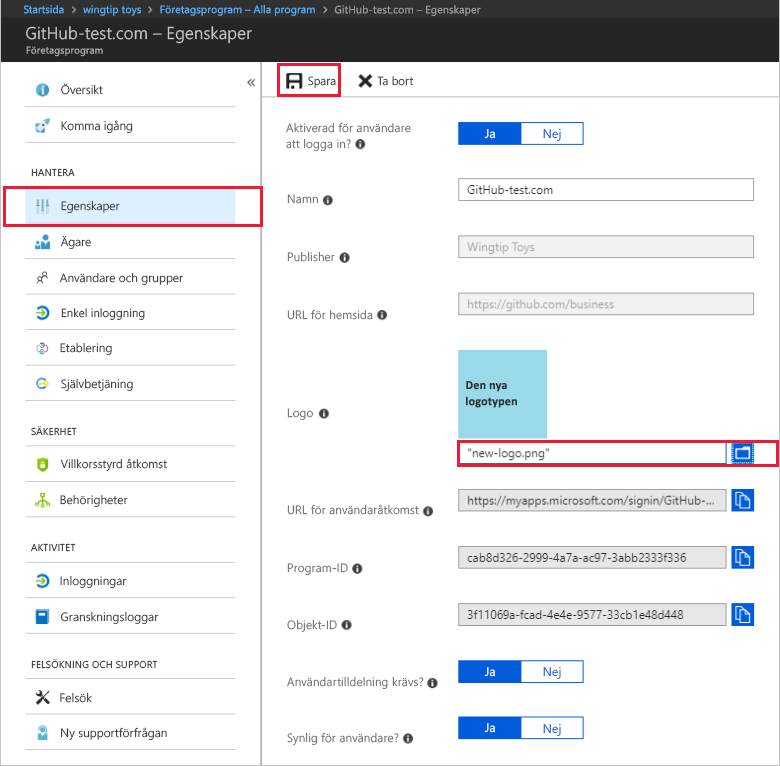

# Snabb start: konfigurera egenskaper för ett program i din Azure Active Directory (Azure AD)-klient

I den tidigare snabb starten lade du till ett program till din Azure Active Directory-klient (Azure AD). När du lägger till ett program kan du låta din Azure AD-klient veta det är identitets leverantören för appen. Nu ska du konfigurera några av egenskaperna för appen.
 
## Förutsättningar

Om du vill konfigurera egenskaperna för ett program i din Azure AD-klient behöver du:

- Ett Azure-konto med en aktiv prenumeration. [Skapa ett konto kostnads fritt](https://azure.microsoft.com/free/?WT.mc_id=A261C142F).
- En av följande roller: global administratör, moln program administratör, program administratör eller ägare av tjänstens huvud namn.
- Valfritt: Slutför [visningen av Visa dina appar](view-applications-portal.md).
- Valfritt: slut för ande av [Lägg till en app](add-application-portal.md).

>[!IMPORTANT]
>Använd en icke-produktions miljö för att testa stegen i den här snabb starten.

## Konfigurera app-egenskaper

När du har lagt till ett program i Azure AD-klienten visas sidan Översikt. Om du konfigurerar ett program som redan har lagts till tittar du på den första snabb starten. Den vägleder dig genom att visa de program som har lagts till i din klient organisation. 

Redigera program egenskaperna:

1. I Azure AD-portalen väljer du **företags program**. Hitta och välj sedan det program som du vill konfigurera.
2. I avsnittet **Hantera** väljer du **Egenskaper** för att öppna fönstret **Egenskaper** för redigering.
3. Ägna en stund åt att förstå tillgängliga alternativ. Vilka alternativ som är tillgängliga beror på hur appen är integrerad med Azure AD. Till exempel kommer en app som använder SAML-baserad enkel inloggning att ha fält som *användar åtkomst-URL* , medan en app som använder OIDC-baserad enkel inloggning inte är det. Observera också att appar som läggs till via **Azure Active Directory > Appregistreringar** är som standard OIDC-baserade appar. Appar som läggs till via **Azure Active Directory > företags program** kan använda ett antal enkla inloggnings standarder. Alla appar har fält för att konfigurera när en app visas och kan användas. Dessa fält är:
    - **Aktiverat för användare att logga in?** Anger om användare som är tilldelade till programmet kan logga in.
    - **Krävs användar tilldelning?** Anger om användare som inte är tilldelade till programmet kan logga in.
    - **Synlig för användarna?** Anger om användare som är tilldelade till en app kan se den i [Mina appar](https://myapps.microsoft.com) och Microsoft 365 App Launcher. (Se rutmärket-menyn i det övre vänstra hörnet på en Microsoft 365 webbplats.)
    
    > [!TIP]
    > Tilldelning av användare sker i avsnittet **användare och grupper** i navigeringen.

    De tre alternativen kan växlas oberoende av varandra och det resulterande beteendet är inte alltid uppenbart. Här är en tabell som kan hjälpa dig:
    
    | Aktiverat för användare att logga in? | Användartilldelning krävs? | Synlig för användare? | Beteende för användare som antingen har tilldelats till appen eller inte. |
    |---|---|---|---|
    | Ja | Ja | Ja | Tilldelade användare kan se appen och logga in. Otilldelade användare kan inte se appen och kan inte logga in. |
    | Ja | Ja | Inga  | Tilldelad använder kan inte se appen, men de kan logga in. Otilldelade användare kan inte se appen och kan inte logga in. |
    | Ja | Inga  | Ja | Tilldelade användare kan se appen och logga in. Otilldelade användare kan inte se appen men kan logga in. |
    | Ja | Inga  | Inga  | Tilldelade användare kan inte se appen men kan logga in. Otilldelade användare kan inte se appen men kan logga in. |
    | Inga  | Ja | Ja | Tilldelade användare kan inte se appen och kan inte logga in. Otilldelade användare kan inte se appen och kan inte logga in. |
    | Inga  | Ja | Inga  | Tilldelade användare kan inte se appen och kan inte logga in. Otilldelade användare kan inte se appen och kan inte logga in. |
    | Inga  | Inga  | Ja | Tilldelade användare kan inte se appen och kan inte logga in. Otilldelade användare kan inte se appen och kan inte logga in. |
    | Inga  | Inga  | Inga  | Tilldelade användare kan inte se appen och kan inte logga in. Otilldelade användare kan inte se appen och kan inte logga in. |

4. När du är klar väljer du **Spara**.

## Använda en anpassad logotyp

Så här använder du en anpassad logotyp:

1. Skapa en logo typ som är 215 x 215 pixlar och spara den i PNG-format.
2. I Azure AD-portalen väljer du **företags program**. Hitta och välj sedan det program som du vill konfigurera.
3. I avsnittet **Hantera** väljer du **Egenskaper** för att öppna fönstret **Egenskaper** för redigering. 
4. Välj ikonen för att ladda upp logo typen.
5. När du är klar väljer du **Spara**.

    

   > [!NOTE]
   > Miniatyr bilden som visas i det här **egenskaps** fönstret uppdateras inte omedelbart. Du kan stänga och öppna fönstret **Egenskaper** för att se den uppdaterade ikonen.

> [!TIP]
> Du kan automatisera hantering av appar med hjälp av Graph API, se [Automatisera program hantering med Microsoft Graph API](/graph/application-saml-sso-configure-api).

## Lägg till anteckningar

Du kan använda fältet Anteckningar om du vill lägga till information som är relevant för hanteringen av programmet i Azure AD. Anteckningar är ett fritext fält med en maximal storlek på 1024 tecken.

1. I Azure AD-portalen väljer du **företags program**. Hitta och välj sedan det program som du vill konfigurera.
2. I avsnittet **Hantera** väljer du **Egenskaper** för att öppna fönstret **Egenskaper** för redigering.
3. Uppdatera fältet Anteckningar och välj **Spara**.

    

    
## Rensa resurser

Om du inte kommer att fortsätta med snabb starts serien kan du ta bort appen för att rensa test klienten. Borttagning av appen beskrivs i den senaste snabb starten i den här serien. se [ta bort en app](delete-application-portal.md).

## Nästa steg

Gå vidare till nästa artikel om du vill lära dig hur du tilldelar användare till appen.
> [!div class="nextstepaction"]
> [Tilldela användare en app](add-application-portal-assign-users.md)