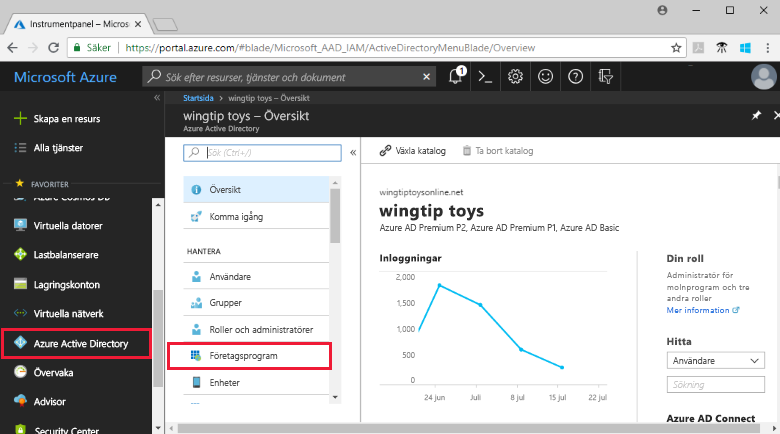
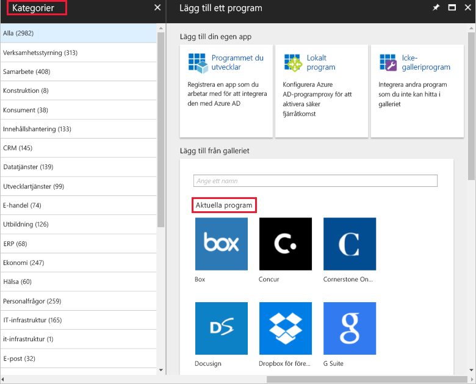
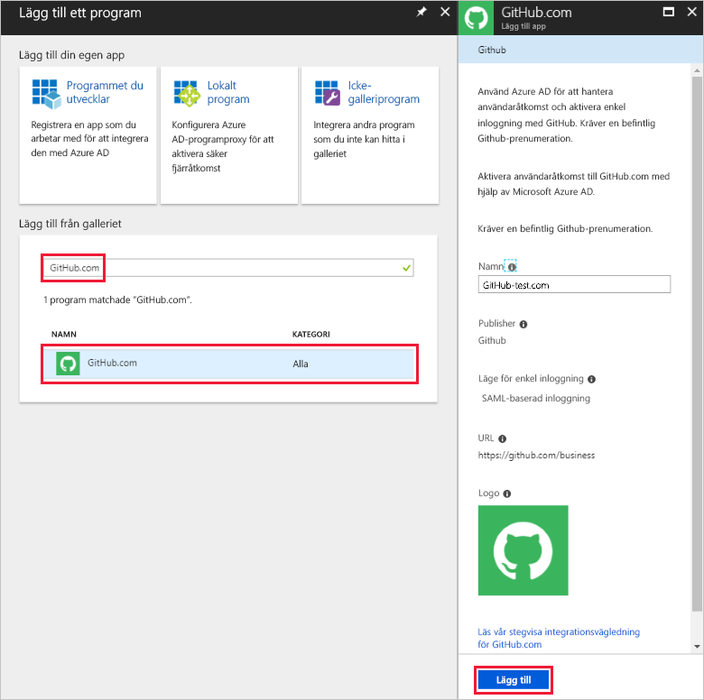
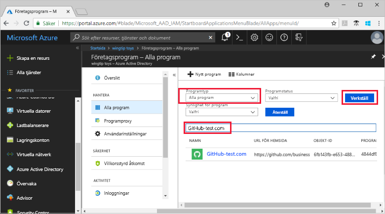
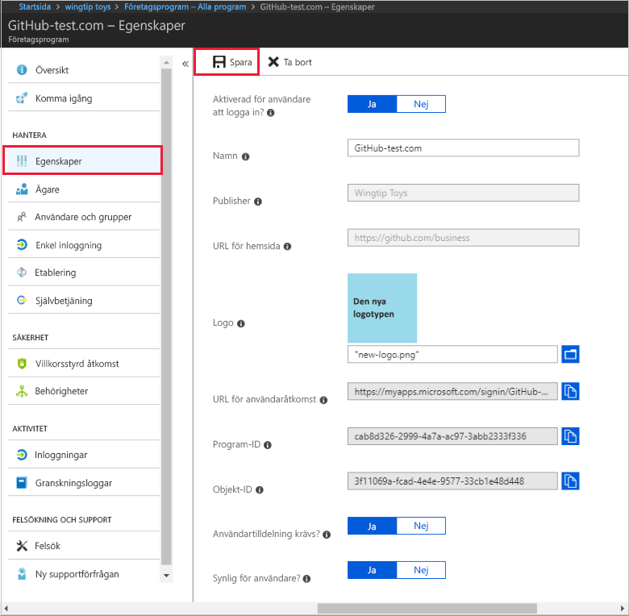

# Snabbstart: Lägga till ett program i din Azure Active Directory-klientorganisation

Azure Active Directory (Azure AD) har ett galleri som innehåller tusentals förintegrerade program. Vissa av de program som din organisation använder finns förmodligen i galleriet. I den här snabbstarten använder du Azure Portal för att lägga till ett galleriprogram i din Azure Active Directory-klientorganisation (Azure AD).

När ett program har lagts till Azure AD-klienten kan du:

- Hantera användaråtkomst till programmet med en princip för villkorsstyrd åtkomst.
- Konfigurera användare för enkel inloggning till programmet med deras Azure AD-konton.

## Innan du börjar

Om du vill lägga till ett program till din klientorganisation behöver du:

- En Azure AD-prenumeration
- En prenumeration som är aktiverad för enkel inloggning för ditt program

Logga in på [Azure-portalen](https://portal.azure.com) som global administratör för din Azure AD-klientorganisation, som administratör för molnprogram eller som programadministratör.

För testning av stegen i den här självstudien rekommenderar vi att du använder en icke-produktionsmiljö. Om du inte har en icke-produktionsmiljö för Azure AD kan du [få en månads kostnadsfri utvärdering](https://azure.microsoft.com/pricing/free-trial/).

## Lägga till ett program till din Azure AD-klientorganisation

Så här lägger du till ett galleriprogram i din Azure AD-klientorganisation:

1. I den [Azure-portalen](https://portal.azure.com), på den vänstra navigeringspanelen väljer **Azure Active Directory**.

1. I den **Azure Active Directory** väljer **företagsprogram**.

    

1. Den **alla program** öppnas fönstret för att visa ett slumpmässigt urval av program i Azure AD-klienten. Välj **nytt program** överst i den **alla program** fönstret.

    

1. I den **kategorier** fönstret visas ikonerna under de **aktuellt program** område som är ett slumpmässigt urval av galleriprogram.  Om du vill se fler program kan du välja **visa fler**. Men vi rekommenderar inte att söka på så sätt eftersom det finns tusentals program i galleriet.

    

1. Att söka efter ett program under **Lägg till från galleriet**, anger du namnet på programmet som du vill lägga till. Markera programmet i resultaten och välj **Lägg till**. I följande exempel visas formuläret **Lägg till app**, som visas när du har sökt efter github.com.

    

1. I det programspecifika formuläret kan du ändra egenskapsinformation. Till exempel kan du redigera namnet på programmet så att det matchar behoven i din organisation. I det här exemplet används namnet **GitHub-test**.

1. När du är klar gör ändringar i egenskaperna, väljer **Lägg till**.

1. En komma igång-sida visas med alternativ för att konfigurera programmet för din organisation.

Du har lagt till ditt program. Passa på att ta en paus. Nästa avsnitt visar hur du ändrar logotypen och redigerar andra egenskaper för programmet.

## Hitta ditt Azure AD-klientorganisationsprogram

Vi förutsätter att du behövde gå iväg en stund och nu har kommit tillbaka för att konfigurera programmet. Det första du ska göra är att hitta dina program.

1. I den  **[Azure-portalen](https://portal.azure.com)**, på den vänstra navigeringspanelen väljer **Azure Active Directory**.

1. I den **Azure Active Directory** väljer **företagsprogram**.

1. Från den **programtyp** nedrullningsbara menyn och välj **alla program**, och välj sedan **tillämpa**. Mer information om visningsalternativ finns på sidan om att [visa klientorganisationsprogram](view-applications-portal.md).

1. Du kan nu se en lista över alla program i Azure AD-klientorganisationen. Listan är ett slumpmässigt urval. Om du vill se fler program **visa fler** en eller flera gånger.

1. För att snabbt hitta ett program i din klient, ange namnet på programmet i sökrutan och välj **tillämpa**. Det här exemplet hittar GitHub-test-programmet har lagts till tidigare.

    

## Konfigurera egenskaper för användarinloggning

Nu när du har hittat programmet, kan du öppna den och konfigurera egenskaper för program.

Redigera egenskaper för program:

1. Välj program att öppna den.
1. Välj **egenskaper** att öppna egenskapsfönstret för redigering.

    

1. Läs igenom alternativen för inloggning. De fastställer hur användare som tilldelats eller otilldelade till programmet kan logga in i programmet. Och alternativen också bestämma om en användare kan se programmet i åtkomstpanelen.

    - **Aktiverad för användare att logga in** bestämmer huruvida användare som är tilldelade till programmet kan logga in.
    - **Användartilldelning krävs** styr huruvida användare som inte har tilldelats till programmet kan logga in.
    - **Synlig för användaren** bestämmer huruvida användare som är tilldelade till en app kan se den i åtkomstpanelen och O365-appfönstret.

1. Använd följande tabeller för att hjälpa dig att välja de bästa alternativen för dina behov.

   - Beteende för **tilldelade** användare:

       | Egenskapsinställningar för program | | | Upplevelse för tilldelad användare | |
       |---|---|---|---|---|
       | Aktiverad för användare att logga in? | Användartilldelning krävs? | Synlig för användare? | Kan tilldelade användare logga in? | Kan tilldelade användare se programmet?* |
       | ja | ja | ja | ja | ja  |
       | ja | ja | nej  | ja | nej   |
       | ja | nej  | ja | ja | ja  |
       | ja | nej  | nej  | ja | nej   |
       | nej  | ja | ja | nej  | nej   |
       | nej  | ja | nej  | nej  | nej   |
       | nej  | nej  | ja | nej  | nej   |
       | nej  | nej  | nej  | nej  | nej   |

   - Beteende för **ej tilldelade** användare:

       | Egenskapsinställningar för program | | | Upplevelse för ej tilldelade användare | |
       |---|---|---|---|---|
       | Aktiverad för användare att logga in? | Användartilldelning krävs? | Synlig för användare? | Kan ej tilldelade användare logga in? | Kan ej tilldelade användare se programmet?* |
       | ja | ja | ja | nej  | nej   |
       | ja | ja | nej  | nej  | nej   |
       | ja | nej  | ja | ja | nej   |
       | ja | nej  | nej  | ja | nej   |
       | nej  | ja | ja | nej  | nej   |
       | nej  | ja | nej  | nej  | nej   |
       | nej  | nej  | ja | nej  | nej   |
       | nej  | nej  | nej  | nej  | nej   |

     *Kan användaren se programmet i åtkomstpanelen och Office 365-appfönstret?

## Använda en anpassad logotyp

Så här använder du en anpassad logotyp:

1. Skapa en logotyp som är 215 x 215 bildpunkter och spara den i PNG-format.
1. Eftersom du redan har hittat ditt program, Välj ett program.
1. I den vänstra rutan väljer **egenskaper**.
1. Ladda upp logotypen.
1. När du är klar väljer du **spara**.

    

## Nästa steg

I den här snabbstarten har du lärt dig hur du lägger till ett galleriprogram i din Azure AD-klientorganisation. Du har lärt dig hur du redigerar egenskaperna för ett program.

Nu är du redo att konfigurera programmet för enkel inloggning.

> [!div class="nextstepaction"]
> [Konfigurera enkel inloggning](configure-single-sign-on-portal.md)

