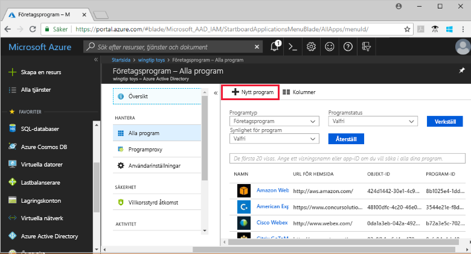

# Snabb start: lägga till ett program till din Azure Active Directory-klient (Azure AD)

Azure Active Directory (Azure AD) har ett galleri som innehåller tusentals förintegrerade program. Många av de program som organisationen använder finns förmodligen redan i galleriet.

När ett program har lagts till Azure AD-klienten kan du:

- Konfigurera egenskaper för appen.
- Hantera användar åtkomst till appen med en princip för villkorlig åtkomst.
- Konfigurera enkel inloggning så att användarna kan logga in i appen med sina autentiseringsuppgifter för Azure AD.

## Förutsättningar

Om du vill lägga till ett program i Azure AD-klienten behöver du:

- Ett Azure-konto med en aktiv prenumeration. [Skapa ett konto kostnads fritt](https://azure.microsoft.com/free/?WT.mc_id=A261C142F).
- En av följande roller: global administratör, moln program administratör, program administratör eller ägare av tjänstens huvud namn.
- (Valfritt: slut för ande av [Visa dina appar](view-applications-portal.md)).

>[!IMPORTANT]
>Vi rekommenderar att du använder en icke-produktions miljö för att testa stegen i den här snabb starten.

## Lägg till en app till din Azure AD-klient

Så här lägger du till ett program i Azure AD-klienten:

1. Välj **Azure Active Directory** på den vänstra navigerings panelen i [Azure Portal](https://portal.azure.com).
2. I fönstret **Azure Active Directory** väljer du **företags program**. Fönstret **alla program** öppnas och visar ett slumpmässigt exempel på programmen i din Azure AD-klient.
3. I fönstret **företags program** väljer du **nytt program**. 
    
4. Växla till den nya Galleri förhands granskningen: i banderollen högst upp på **sidan Lägg till ett program** väljer du den länk som visas **Klicka här för att prova det nya och förbättrade app-galleriet**.
5. Fönstret **Bläddra i Azure AD-galleriet (förhands granskning)** öppnas och visar paneler för moln plattformar, lokala program och aktuella program. Program som listas i avsnittet **aktuella program** innehåller ikoner som visar om de stöder federerad enkel inloggning (SSO) och etablering. 
    
6. Du kan bläddra i galleriet för det program som du vill lägga till eller söka efter programmet genom att ange dess namn i sökrutan. Välj sedan programmet från resultaten. 
7. Nästa steg är beroende av hur utvecklaren av programmet har implementerat enkel inloggning (SSO). Enkel inloggning kan implementeras av apps-utvecklare på fyra sätt. De fyra sätten är SAML, OpenID Connect, Password och Linked. När du lägger till en app kan du välja att filtrera och bara se appar med en viss SSO-implementering som visas på skärm bilden. Till exempel kallas en populär standard för att implementera SSO Security Assertion Markup Language (SAML). En annan standard som är populär kallas OpenId Connect (OIDC). Sättet att konfigurera SSO med dessa standarder är annorlunda, och anteckna vilken typ av SSO som implementeras av appen som du lägger till.

    :::image type="content" source="media/add-application-portal/sso-types.png" alt-text="Skärm bild som visar väljaren för SSO-typer." lightbox="media/add-application-portal/sso-types.png":::

    - Om utvecklaren av appen använde OIDC- **standarden** för SSO väljer du **Registrera dig**. En installations sida visas. Gå sedan till snabb starten för att konfigurera OIDC-baserad enkel inloggning.
    :::image type="content" source="media/add-application-portal/sign-up-oidc-sso.png" alt-text="Skärm bild som visar hur du lägger till en OIDC-baserad SSO-app.":::

    - Om utvecklaren av appen använde SAML- **standarden** för SSO väljer du **skapa**. En komma igång-sida visas med alternativ för att konfigurera programmet för din organisation. I formuläret kan du redigera namnet på programmet så att det matchar organisationens behov. Gå sedan till snabb starten för att konfigurera SAML-baserad enkel inloggning.
    :::image type="content" source="media/add-application-portal/create-application.png" alt-text="Skärm bild som visar hur du lägger till en SAML-baserad SSO-app.":::

> [!IMPORTANT]
> Det finns vissa viktiga skillnader mellan SAML-baserade och OIDC-baserade SSO-implementeringar. Med SAML-baserade appar kan du lägga till flera instanser av samma app. Till exempel GitHub1, GitHub2 osv. För OIDC-baserade appar kan du bara lägga till en instans av en app. Om du redan har lagt till en OIDC-baserad app och försöker lägga till samma app igen och ange medgivande två gånger, läggs den inte till igen i klient organisationen.

Om det program som du söker efter inte finns i galleriet kan du välja länken **skapa ditt eget program** och under **vad vill du göra med ditt program?** Välj **integrera andra program som du inte hittar i galleriet**. Microsoft har redan arbetat med många programutvecklare för att förkonfigurera dem att fungera med Azure AD. Förkonfigurerade appar visas i galleriet. Men om den app som du vill lägga till inte visas i listan kan du skapa en ny, allmän app och sedan konfigurera den själv eller med hjälp av den utvecklare som skapade den.

Du har lagt till ett program. Nästa snabb start visar hur du ändrar logo typen och redigerar andra egenskaper för programmet.

> [!TIP]
> Du kan automatisera hantering av appar med hjälp av Graph API, se [Automatisera program hantering med Microsoft Graph API](/graph/application-saml-sso-configure-api).

## Rensa resurser

Om du inte kommer att fortsätta med snabb starts serien kan du ta bort appen för att rensa test klienten. Borttagning av appen beskrivs i den senaste snabb starten i den här serien. se [ta bort en app](delete-application-portal.md).

## Nästa steg

Gå vidare till nästa artikel om du vill lära dig hur du konfigurerar en app.
> [!div class="nextstepaction"]
> [Konfigurera en app](add-application-portal-configure.md)