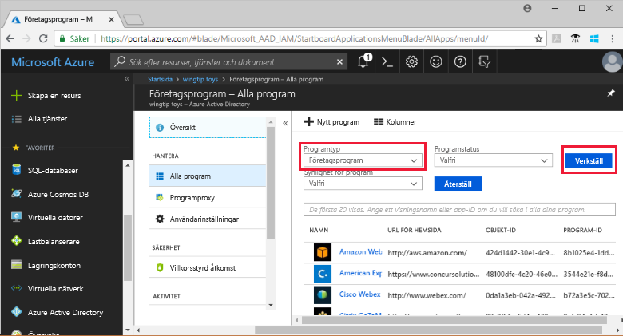
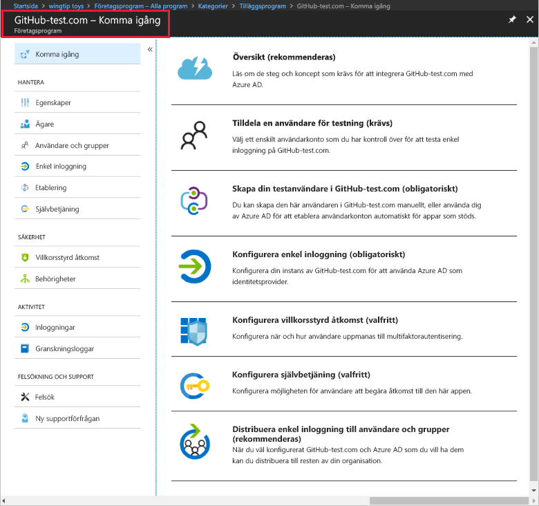

# Snabbstart: Lägga till ett program i din Azure Active Directory-klientorganisation

Azure Active Directory (Azure AD) har ett galleri som innehåller tusentals förintegrerade program. Vissa av de program som din organisation använder finns förmodligen i galleriet. I den här snabbstarten använder du Azure Portal för att lägga till ett galleriprogram i din Azure Active Directory-klientorganisation (Azure AD).

När ett program har lagts till Azure AD-klienten kan du:

- Hantera användaråtkomst till programmet med en princip för villkorsstyrd åtkomst.
- Konfigurera användare för enkel inloggning till programmet med deras Azure AD-konton.

## Innan du börjar

Om du vill lägga till ett program till din klientorganisation behöver du:

- En Azure AD-prenumeration
- En prenumeration som är aktiverad för enkel inloggning för ditt program

Logga in på [Azure-portalen](https://portal.azure.com) som global administratör för din Azure AD-klientorganisation, som administratör för molnprogram eller som programadministratör.

För testning av stegen i den här självstudien rekommenderar vi att du använder en icke-produktionsmiljö. Om du inte har en icke-produktionsmiljö för Azure AD kan du [få en månads kostnadsfri utvärdering](https://azure.microsoft.com/pricing/free-trial/).

## Lägga till ett program till din Azure AD-klientorganisation

Så här lägger du till ett galleriprogram i din Azure AD-klientorganisation:

1. I [Azure-portalen](https://portal.azure.com) går du till den vänstra navigeringspanelen och klickar på **Azure Active Directory**.

2. På bladet **Azure Active Directory** klickar du på **Företagsprogram**.

    

3. Bladet **Alla program** öppnas och visar ett slumpmässigt urval av programmen i din Azure AD-klientorganisation.

    

4. Klicka på **Nytt program** överst på bladet **Alla program**.

    

5. Om du vill se en lista över program i galleriet är det enklast att använda **kategorierna** eftersom ikonerna under **Aktuella program** är ett slumpmässigt urval av galleriprogram.

    

    Om du vill se fler program kan du klicka på **Visa mer**. Vi rekommenderar inte att du söker på det här sättet eftersom det finns tusentals program i galleriet.

6. För att söka efter ett program går du till **Lägg till från galleriet** och anger namnet på det program som du vill lägga till. Välj programmet från resultaten och klicka på **Lägg till**. I följande exempel visas formuläret **Lägg till app**, som visas när du har sökt efter github.com.

    

6. I det programspecifika formuläret kan du ändra egenskapsinformation. Till exempel kan du redigera namnet på programmet så att det matchar behoven i din organisation. I det här exemplet används namnet **GitHub-test**.

8. När du är klar med ändringarna av egenskaperna klickar du på **Lägg till**.

9. En komma igång-sida visas med alternativ för att konfigurera programmet för din organisation.

    

Du har lagt till ditt program. Passa på att ta en paus. Nästa avsnitt visar hur du ändrar logotypen och redigerar andra egenskaper för programmet.

## Hitta ditt Azure AD-klientorganisationsprogram

Vi förutsätter att du behövde gå iväg en stund och nu har kommit tillbaka för att konfigurera programmet. Det första du behöver göra är att hitta ditt program.

1. I **[Azure-portalen](https://portal.azure.com)** går du till den vänstra navigeringspanelen och klickar på **Azure Active Directory**.

2. På bladet Azure Active Directory klickar du på **Företagsprogram**.

3. På den nedrullningsbara menyn **Programtyp** väljer du **Alla program** och klickar på **Applicera**. Mer information om visningsalternativ finns på sidan om att [visa klientorganisationsprogram](view-applications-portal.md).

4. Du kan nu se en lista över alla program i Azure AD-klientorganisationen. Listan är ett slumpmässigt urval. Om du vill se fler program klickar du på **Visa mer** en eller flera gånger.

5. För att snabbt hitta ett program i klientorganisationen anger du namnet på programmet i sökrutan och klickar på **Applicera**. Det här exemplet hittar det GitHub-test-program som vi lade till tidigare.

    

## Konfigurera egenskaper för användarinloggning

Nu när du har hittat programmet kan du öppna det och konfigurera programegenskaper.

Så här redigerar du programegenskaperna

1. Klicka på programmet för att öppna det.
2. Klicka på **Egenskaper** för att öppna egenskapsbladet för redigering.

    

3. Läs igenom alternativen för inloggning. **Aktiverad för användare att logga in**, **Användartilldelning krävs** och **Synlig för användare** kombineras för att bestämma huruvida användare som är tilldelade eller inte tilldelade till programmet kan logga in. De bestämmer även om användaren kan se programmet i åtkomstpanelen.

    - **Aktiverad för användare att logga in** bestämmer huruvida användare som är tilldelade till programmet kan logga in.
    - **Användartilldelning krävs** bestämmer huruvida användare som inte har tilldelats programmet kan logga in.
    - **Synlig för användaren** bestämmer huruvida användare som är tilldelade till en app kan se den i åtkomstpanelen och O365-appfönstret.

4. Använd följande tabeller för att få hjälp med att välja de alternativ som är bäst för dina behov.

    - Beteende för **tilldelade** användare:

        | Egenskapsinställningar för program | | | Upplevelse för tilldelad användare | |
        |---|---|---|---|---|
        | Aktiverad för användare att logga in? | Användartilldelning krävs? | Synlig för användare? | Kan tilldelade användare logga in? | Kan tilldelade användare se programmet?* |
        | ja | ja | ja | ja | ja  |
        | ja | ja | nej  | ja | nej   |
        | ja | nej  | ja | ja | ja  |
        | ja | nej  | nej  | ja | nej   |
        | nej  | ja | ja | nej  | nej   |
        | nej  | ja | nej  | nej  | nej   |
        | nej  | nej  | ja | nej  | nej   |
        | nej  | nej  | nej  | nej  | nej   |

    - Beteende för **ej tilldelade** användare:

        | Egenskapsinställningar för program | | | Upplevelse för ej tilldelade användare | |
        |---|---|---|---|---|
        | Aktiverad för användare att logga in? | Användartilldelning krävs? | Synlig för användare? | Kan ej tilldelade användare logga in? | Kan ej tilldelade användare se programmet?* |
        | ja | ja | ja | nej  | nej   |
        | ja | ja | nej  | nej  | nej   |
        | ja | nej  | ja | ja | nej   |
        | ja | nej  | nej  | ja | nej   |
        | nej  | ja | ja | nej  | nej   |
        | nej  | ja | nej  | nej  | nej   |
        | nej  | nej  | ja | nej  | nej   |
        | nej  | nej  | nej  | nej  | nej   |

    *Kan användaren se programmet i åtkomstpanelen och Office 365-appfönstret?

## Använda en anpassad logotyp

Så här använder du en anpassad logotyp:

1. Skapa en logotyp som är 215 x 215 bildpunkter och spara den i PNG-format.
2. Eftersom du redan har hittat ditt program klickar du på programmet.
2. På det vänstra bladet klickar du på **Egenskaper**.
4. Ladda upp logotypen.
5. När du är klar klickar du på **Spara**.

    

## Nästa steg

I den här snabbstarten har du lärt dig hur du lägger till ett galleriprogram i din Azure AD-klientorganisation. Du har lärt dig hur du redigerar egenskaperna för ett program.

Nu är du redo att konfigurera programmet för enkel inloggning.

> [!div class="nextstepaction"]
> [Konfigurera enkel inloggning](configure-single-sign-on-portal.md)

