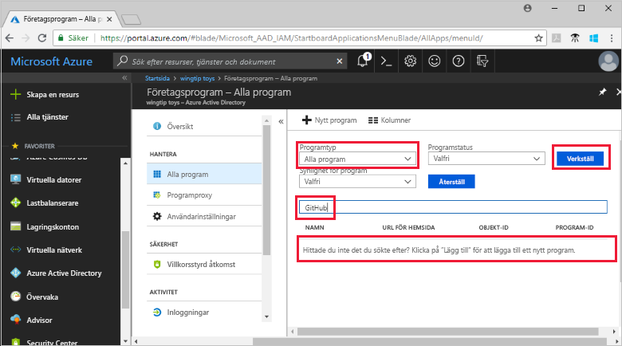
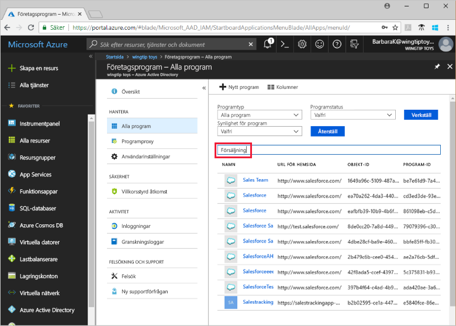

# Snabb start: Visa listan över program som använder din Azure Active Directory (Azure AD)-klient för identitets hantering

Kom igång med att använda Azure AD som identitets-och åtkomst hanterings system (IAM) för de program som organisationen använder. I den här snabb starten kommer du att se programmen, även kallade appar, som redan har kon figurer ATS för att använda din Azure AD-klient som identitets leverantör (IdP).

## Förutsättningar

Om du vill visa program som har registrerats i din Azure AD-klient behöver du:

- Ett Azure-konto. [Skapa ett konto kostnads fritt](https://azure.microsoft.com/free/?WT.mc_id=A261C142F).

>[!IMPORTANT]
>Vi rekommenderar att du använder en icke-produktions miljö för att testa stegen i den här snabb starten.

## Hitta listan över program i din klient organisation

De program som har registrerats med din Azure AD-klient visas i avsnittet **Enterprise Apps** i Azure Portal.

Så här visar du de program som är registrerade i din klient organisation:

1. Logga in på din [Azure Portal](https://portal.azure.com).
2. På den vänstra navigerings panelen väljer du **Azure Active Directory**.
3. I fönstret **Azure Active Directory** väljer du **företags program**.
4. I list rutan **program typ** väljer du **alla program** och sedan **Använd**. Ett slumpmässigt urval av programmen i din klientorganisation visas.
5. Om du vill visa fler program väljer du **Läs in mer** längst ned i listan. Om det finns flera program i klient organisationen kan det vara lättare att söka efter ett visst program i stället för att bläddra i listan. Sökning efter ett visst program beskrivs senare i den här snabb starten.

## Välj visningsalternativ

Välj alternativ enligt vad du letar efter.

1. Du kan visa programmen efter **program typ**, **program status** och **program synlighet**.
2. Välj något av följande alternativ under **Programtyp**:
    - **Företagsprogram** visar andra program än Microsoft-program.
    - **Microsoft-program** visar Microsoft-program.
    - **Alla program** visar både Microsoft-program och andra program.
3. Välj **Alla**, **Inaktiverade** eller **Aktiverade** under **Programstatus**. Alternativet **Alla** omfattar både inaktiverade och aktiverade program.
4. Välj **Alla** eller **Dolda** under **Synlighet för program**. Alternativet **dold** visar program som finns i klienten, men som inte är synliga för användare.
5. När du har valt de alternativ som du vill använda väljer du **Använd**.

## Söka efter ett program

Så här söker du efter ett visst program:

1. I menyn **program typ** väljer du **alla program** och sedan **Använd**.
2. Ange namnet på det program som du vill söka efter. Om programmet har lagts till i din Azure AD-klient visas det i Sök resultaten. Det här exemplet visar att GitHub inte har lagts till i klient programmet.
    
3. Prova att skriva de första bokstäverna i ett programnamn. I det här exemplet visas alla program som börjar med **Sales**.
    

> [!TIP]
> Du kan automatisera hantering av appar med hjälp av Graph API, se [Automatisera program hantering med Microsoft Graph API](/graph/application-saml-sso-configure-api).

## Rensa resurser

Du har inte skapat några nya resurser i den här snabb starten, så det finns ingenting att rensa.

## Nästa steg

Fortsätt till nästa artikel och lär dig hur du använder Azure AD som identitets leverantör för en app.
> [!div class="nextstepaction"]
> [Lägga till en app](add-application-portal.md)