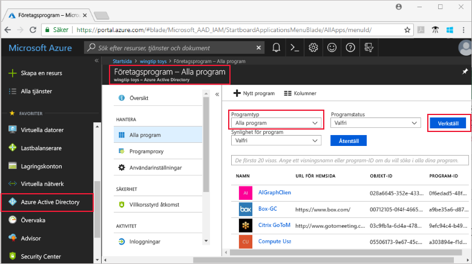
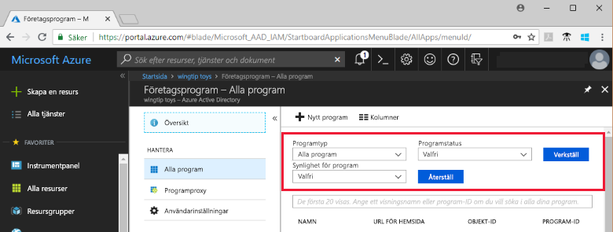

# Visa programmen i din Azure Active Directory-klientorganisation

I den här snabbstarten använder du Azure Portal för att visa programmen i din Azure Active Directory-klientorganisation (Azure AD).

## Innan du börjar

Det måste finnas minst ett program i Azure AD-klientorganisationen för att du ska se några resultat. Anvisningar som beskriver hur du lägger till ett program finns i snabbstarten [Lägga till ett program](add-application-portal.md).

Logga in på [Azure Portal](https://portal.azure.com) som global administratör för din Azure AD-klientorganisation, som administratör för molnprogram eller som programadministratör.

## Leta upp listan med program i klientorganisationen

Du kan se programmen i din Azure AD-klientorganisation i avsnittet **Företagsprogram** på Azure Portal.

Så här hittar du programmen i din klientorganisation:

1. Klicka på **Azure Active Directory** på den vänstra navigeringspanelen på **[Azure Portal](https://portal.azure.com)**. 

2. På bladet Azure Active Directory klickar du på **Företagsprogram**. 

3. Välj **Alla program** på den nedrullningsbara menyn **Programtyp** och klicka på **Använd**. Ett slumpmässigt urval av programmen i din klientorganisation visas.

    
   
4. Om du vill visa fler program klickar du på **Visa fler** längst ned i listan. Om det finns många program i din klientorganisation kan det vara enklare att [söka efter ett visst program](#search-for-a-tenant-application), i stället för att bläddra i listan.

## Välj visningsalternativ

I det här avsnittet väljer du alternativ beroende på vad du letar efter.

1. Du kan visa programmen baserat på alternativen för **Programtyp**, **Programstatus** och **Synlighet för program**. 

    

2. Välj något av följande alternativ under **Programtyp**:

    - **Företagsprogram** visar andra program än Microsoft-program.
    - **Microsoft-program** visar Microsoft-program.
    - **Alla program** visar både Microsoft-program och andra program.

3. Välj **Alla**, **Inaktiverade** eller **Aktiverade** under **Programstatus**. Alternativet **Alla** omfattar både inaktiverade och aktiverade program.

4. Välj **Alla** eller **Dolda** under **Synlighet för program**. Alternativet **Dolda** visar program som finns i samma klientorganisation, men som inte visas för användarna.

5. Klicka på **Använd** när du har valt alternativ.
 

## Söka efter ett klientprogram

Så här söker du efter ett specifikt program:

1. Välj **Alla program** på menyn **Programtyp** och klicka på **Använd**.

2. Ange namnet på det program som du vill söka efter. Om programmet har lagts till i din Azure AD-klientorganisation visas det i sökresultatet. I det här exemplet ser du att GitHub inte har lagts till i programmen för din klientorganisation.

    

3. Prova att skriva de första bokstäverna i ett programnamn.  I det här exemplet visas alla program som börjar med **Sales**.

    

## Nästa steg

I den här snabbstarten har du lärt dig hur du visar programmen i din Azure AD-klientorganisation och hur du filtrerar listan med program baserat på programtyp, status och synlighet. Du har också lärt dig hur du söker efter ett specifikt program.

Nu när du har hittat programmet som du letade efter kan du fortsätta att [lägga till fler program i din klientorganisation](add-application-portal.md) eller klicka på programmet för att visa eller redigera egenskaper och konfigurationsalternativ. Du kan till exempel konfigurera enkel inloggning. 

> [!div class="nextstepaction"]
> [Konfigurera enkel inloggning](configure-single-sign-on-portal.md)

