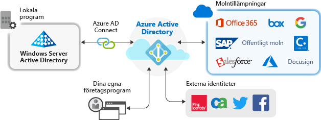

# Vad är programhantering?

Azure AD är ett IAM-system (identitets- och åtkomsthantering). Det ger en enskild plats för lagring av information om digitala identiteter. Du kan konfigurera dina program så att de använder Azure AD som den plats där användarinformation lagras. 

Azure AD måste konfigureras för integrering med ett program. Med andra ord måste du veta vilka program som använder den som ett identitets system. Processen för att hålla Azure AD medveten om dessa program och hur de ska hantera dem kallas för program hantering.

Du hanterar program på bladet **företags program** som finns i avsnittet hantera i Azure Active Directory-portalen.

## Vad är ett identitets-och åtkomst hanterings system (IAM)?
Ett program är en del av program varan som används för något ändamål. De flesta program kräver att användare loggar in så att programmet kan ge en anpassad upplevelse för den specifika användaren. Med andra ord måste programmet känna till identiteten för användaren med hjälp av programmet. Eftersom det vet vilka funktioner du kan erbjuda, eller ta bort, för användaren.

Om varje program håller reda på användare separat, skulle resultatet vara en silo av olika användar namn och inloggningar för varje program. Ett program vet inte något om användarna i andra program.

Ett centraliserat identitets system löser problemet genom att tillhandahålla en enda plats för att lagra användar information som sedan kan användas av alla program. Dessa system har visat sig vara kända som identitets-och åtkomst hanterings system (IAM). Azure Active AD är IAM-systemet för Microsoft-molnet.

>[!TIP]
>Ett IAM-system ger en enda plats för att hålla koll på användar identiteter. Azure AD är IAM-systemet för Microsoft-molnet.

## Varför hantera program med en molnlösning?

Organisationer har ofta hundratals program som användarna behöver för att utföra sitt arbete. Användare använder dessa program på många enheter och platser. Nya program läggs till, utvecklas och tas ur bruk varje dag. Med så många program och åtkomst punkter är det viktigare än någonsin att använda en molnbaserad lösning för att hantera användar åtkomst till alla program.

>[!TIP]
>Azure AD App-galleriet innehåller många populära program som redan är förkonfigurerade för att fungera med Azure AD som en identitets leverantör.

## Hur fungerar Azure AD med program?

Azure AD fören klar hanteringen av dina program genom att tillhandahålla ett enda identitets system för dina molnbaserade och lokala appar. Du kan lägga till SaaS-program (program vara som en tjänst), lokala program och LOB-appar (Line of Business) till Azure AD. Användarna loggar sedan in en gång för att på ett säkert och smidigt sätt komma åt dessa program, tillsammans med Microsoft 365 och andra företags program från Microsoft. Du kan minska administrativa kostnader genom att [Automatisera användar etableringen](../app-provisioning/user-provisioning.md). Du kan också använda Multi-Factor Authentication och principer för villkorlig åtkomst för att ge säker åtkomst till programmet.

## Vilka typer av program kan jag integrera med Azure AD?

Det finns fyra huvud typer av program som du kan lägga till i dina **företags program** och hantera med Azure AD:

- **Azure AD Gallery-program** – Azure AD har ett galleri som innehåller tusentals program som har integrerats för enkel inloggning med Azure AD. Vissa av de program som din organisation använder finns förmodligen i galleriet. [Lär dig mer om att planera din program integrering](plan-an-application-integration.md)eller få detaljerade integrerings steg för enskilda appar i [självstudierna för SaaS-program](/azure/active-directory/saas-apps/).

- **Lokala program med programproxy** – med Azure AD-programproxy kan du integrera dina lokala webbappar med Azure AD för att stödja enkel inloggning. Slutanvändare kan sedan komma åt dina lokala webbappar på samma sätt som de kommer åt Microsoft 365 och andra SaaS-appar, se [ge fjärråtkomst till lokala program via Azure Ads programproxy](application-proxy.md).

- **Anpassade program** – när du skapar dina egna affärs program kan du integrera dem med Azure AD för att stödja enkel inloggning. Genom att registrera ditt program med Azure AD har du kontroll över autentiseringsprincip för programmet. Mer information finns i [vägledning för utvecklare](developer-guidance-for-integrating-applications.md).

- **Program som inte är gallerier** – ta med dina egna program! Stöd för enkel inloggning för andra appar genom att lägga till dem i Azure AD. Det finns flera sätt att integrera ett program, men några av dem visas nedan. Mer information finns i [Konfigurera enkel inloggning med SAML](configure-saml-single-sign-on.md).

>[!TIP]
>Du kan integrera Azure AD med ett program även om det inte redan är förkonfigurerat och i app-galleriet. Du kan **integrera Azure AD med något** av följande
> - Alla webb länkar eller program som återger ett **användar namn och lösen ord**.
> - Alla program som stöder **SAML-eller OpenID Connect-protokoll**.
> - Alla program som stöder **systemet för scim-standarden (Cross-Domain Identity Management)** .

## Hantera risker med principer för villkorlig åtkomst

Koppling av enkel inloggning med Azure AD (SSO) med [villkorlig åtkomst](../conditional-access/concept-conditional-access-cloud-apps.md) ger hög säkerhet för åtkomst till program. Säkerhetsfunktionerna omfattar moln skalning av identitets skydd, riskfylld åtkomst kontroll, inbyggd Multi-Factor Authentication och principer för villkorlig åtkomst. De här funktionerna möjliggör detaljerade kontrollprinciper baserade på program eller på grupper som behöver högre säkerhet.

## Förbättra produktiviteten med enkel inloggning

Att aktivera enkel inloggning (SSO) i alla program och Microsoft 365 ger en överlägsen inloggnings upplevelse för befintliga användare genom att minska eller eliminera inloggnings meddelanden. Användarnas miljöer känns mer sammanhängande och mindre störande med färre uppmaningar och utan behov för flera lösenord. Affärsgruppen kan hantera och godkänna åtkomst via självbetjäning och dynamiska medlemskap. Då rätt personer i företaget hanterar åtkomst till program förbättras även säkerheten för ID-system.

Enkel inloggning ger bättre säkerhet. *Utan enkel inloggning* måste administratörer skapa och uppdatera användarkonton för varje enskilt program, vilket kräver tid. Användare måste dessutom hålla reda på flera autentiseringsuppgifter för att använda olika program. Därmed tenderar användarna att skriva ned sina lösenord eller använda andra lösningar för lösenordshantering, vilket medför datasäkerhetsrisker. [Läs mer om enkel inloggning](what-is-single-sign-on.md).

## Ta itu med styrning och efterlevnad

Med Azure AD kan du övervaka programinloggningar via rapporter som utnyttjar verktyg för säkerhetsinformation och händelsehantering (SIEM). Du kommer åt rapporterna i portalen eller med API:er. Granska programmatiskt vem som har åtkomst till dina program och ta bort åtkomst för inaktiva användare via åtkomstgranskningar.

## Hantera kostnader

Genom att migrera till Azure AD kan du minska kostnaderna och slippa besväret med att hantera en lokal infrastruktur. Azure AD tillhandahåller även åtkomst till program via självbetjäning, vilket sparar tid för både administratörer och användare. Enkel inloggning eliminerar programspecifika lösenord. Den här möjligheten att logga in en enda gång sänker kostnaderna i samband med återställning av lösenord för program och förlorad produktivitet under hämtning av lösenord.

För program som riktar sig till mänsklig personal eller andra program med en stor uppsättning användare kan du använda app-etablering för att automatisera processen för etablering och avetablering av användare, se [Vad är program etablering?](../app-provisioning/user-provisioning.md).

## Nästa steg

- [Snabb starts serie för program hantering](view-applications-portal.md)
- [Kom igång med program integrering](plan-an-application-integration.md)
- [Lär dig hur du automatiserar etablering](../app-provisioning/user-provisioning.md)