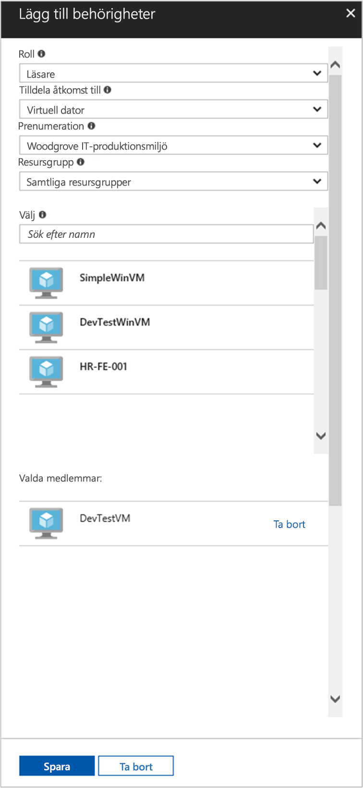

# <a name="use-a-linux-vm-system-assigned-managed-identity-to-access-azure-resource-manager"></a>Använda en systemtilldelad hanterad identitet för en virtuell Linux-dator för åtkomst till Azure Resource Manager

[!INCLUDE [preview-notice](../../../includes/active-directory-msi-preview-notice.md)]

Den här snabbstarten visar hur du kommer åt Azure Resource Manager-API:et med en systemtilldelad identitet för en virtuell Linux-dator. Hanterade identiteter för Azure-resurser hanteras automatiskt av Azure och gör att du kan autentisera mot tjänster som stöder Azure AD-autentisering, utan att du behöver skriva in autentiseringsuppgifter i koden. Lär dig att:

> [!div class="checklist"]
> * Ge den virtuella datorn åtkomst till en resursgrupp i Azure Resource Manager 
> * Hämta en åtkomsttoken med hjälp av den virtuella datorns identitet och använd den för att anropa Azure Resource Manager 

## <a name="prerequisites"></a>Förutsättningar

- Förståelse för hanterade identiteter. Om du inte känner till funktionen för hanterade identiteter för Azure-resurser kan du läsa igenom den här [översikten](overview.md). 
- Ett Azure-konto kan du [Registrera dig för ett kostnads fritt konto](https://azure.microsoft.com/free/).
- Du behöver också en virtuell Linux-dator som har systemtilldelade hanterade identiteter aktiverade.
  - Om du behöver skapa en virtuell dator för den här självstudien kan du följa artikeln [skapa en virtuell Linux-dator med Azure Portal](../../virtual-machines/linux/quick-create-portal.md#create-virtual-machine)

## <a name="grant-access"></a>Bevilja åtkomst

Med hjälp av hanterade identiteter för Azure-resurser kan din kod hämta åtkomsttoken för att autentisera mot resurser som har stöd för Azure AD-autentisering. Azure Resource Manager API har stöd för Azure AD-autentisering. Först måste vi ge den virtuella datorns identitet åtkomst till en resurs i Azure Resource Manager, i detta fall den resursgrupp som den virtuella datorn finns i.  

1. Gå till fliken för **resursgrupper**.
2. Välj den **resurs grupp** som du använde för den virtuella datorn.
3. Gå till **Åtkomstkontroll (IAM)** i den vänstra panelen.
4. Klicka på **Lägg till** en ny rolltilldelning för den virtuella datorn. Välj **rollen** som **läsare**.
5. I nästa listruta tilldelar du **åtkomst till** den virtuella resurs **datorn**.
6. Kontrollera sedan att rätt prenumeration visas i listrutan **Prenumeration**. Och för **Resursgrupp** väljer du **Alla resursgrupper**.
7. I **Välj** väljer du sedan din virtuella Linux-dator i listrutan och klickar på **Spara**.

    

## <a name="get-an-access-token-using-the-vms-system-assigned-managed-identity-and-use-it-to-call-resource-manager"></a>Hämta en åtkomsttoken med hjälp av den virtuella datorns systemtilldelade hanterade identitet och använd den för att anropa Resource Manager

Om du vill slutföra de här stegen behöver du en SSH-klient. Om du använder Windows kan du använda SSH-klienten i [Windows-undersystemet för Linux](/windows/wsl/about). Om du behöver hjälp att konfigurera SSH-klientens nycklar läser du [Så här använder du SSH-nycklar med Windows i Azure](../../virtual-machines/linux/ssh-from-windows.md) eller [How to create and use an SSH public and private key pair for Linux VMs in Azure](../../virtual-machines/linux/mac-create-ssh-keys.md) (Skapa och använda SSH-nyckelpar med privata och offentliga nycklar för virtuella Linux-datorer i Azure).

1. I portalen går du till den virtuella Linux-datorn och i **översikten** klickar du på **Anslut**.  
2. **Anslut** till den virtuella datorn med valfri SSH-klient. 
3. Använd `curl` i terminalfönstret och skicka en begäran till de lokala hanterade identiteterna för Azure-resursslutpunkter för att hämta en åtkomsttoken för Azure Resource Manager.  
 
    `curl`-begäran för åtkomsttoken visas nedan.  
    
    ```bash
    curl 'http://169.254.169.254/metadata/identity/oauth2/token?api-version=2018-02-01&resource=https://management.azure.com/' -H Metadata:true   
    ```
    
    > [!NOTE]
    > Värdet för parametern ”resource” måste vara en exakt matchning av vad som förväntas av Azure AD.  När det gäller Resource Manager-resurs-ID:t måste du ta med det avslutande snedstrecket i URI:n. 
    
    Svaret innehåller den åtkomsttoken som du behöver för att komma åt Azure Resource Manager. 
    
    Svar:  

    ```bash
    {"access_token":"eyJ0eXAiOi...",
    "refresh_token":"",
    "expires_in":"3599",
    "expires_on":"1504130527",
    "not_before":"1504126627",
    "resource":"https://management.azure.com",
    "token_type":"Bearer"} 
    ```
    
    Du kan använda den här åtkomsttoken för att komma åt Azure Resource Manager, till exempel för att läsa information om den resursgrupp som du tidigare gav den här virtuella datorn åtkomst till. Ersätt värdena för \<SUBSCRIPTION ID\> , \<RESOURCE GROUP\> och \<ACCESS TOKEN\> med de som du skapade tidigare. 
    
    > [!NOTE]
    > Eftersom URL:en är skiftlägeskänslig måste du använda exakt samma skiftläge som du använde tidigare när du namngav resursgruppen samt versalt ”G” i ”resourceGroup”.  
    
    ```bash 
    curl https://management.azure.com/subscriptions/<SUBSCRIPTION ID>/resourceGroups/<RESOURCE GROUP>?api-version=2016-09-01 -H "Authorization: Bearer <ACCESS TOKEN>" 
    ```
    
    Svar tillbaka information för den specifika resursgruppen: 
     
    ```bash
    {"id":"/subscriptions/98f51385-2edc-4b79-bed9-7718de4cb861/resourceGroups/DevTest","name":"DevTest","location":"westus","properties":{"provisioningState":"Succeeded"}} 
    ```

## <a name="next-steps"></a>Nästa steg

I den här snabbstarten har du lärt dig hur du använder en systemtilldelad hanterad identitet för att få åtkomst till Azure Resource Manager-API:et.  Mer information om Azure Resource Manager finns här:

> [!div class="nextstepaction"]
>[Azure Resource Manager](../../azure-resource-manager/management/overview.md) 
> [Skapa, Visa eller ta bort en användardefinierad hanterad identitet med hjälp av Azure PowerShell](how-to-manage-ua-identity-powershell.md)