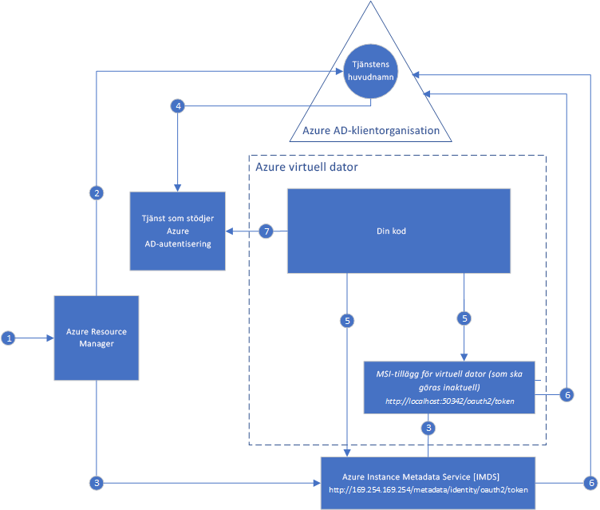

#  Vad är Hanterad tjänstidentitet för Azure-resurser?

[!INCLUDE[preview-notice](../../../includes/active-directory-msi-preview-notice.md)]

En vanligt utmaning när man skapar molnprogram är hur man hanterar de autentiseringsuppgifter som måste finnas i koden för att kunna autentisera till molntjänster. Att skydda dessa autentiseringsuppgifter är en viktig uppgift. Vi rekommenderar att de aldrig visas på utvecklarnas arbetsstationer eller att de checkas in i källkodskontrollen. Azure Key Vault är ett sätt att lagra autentiseringsuppgifter samt andra nycklar och hemligheter på ett säkert sätt, men din kod måste autentiseras till Key Vault för att kunna hämta dem. Hanterad tjänstidentitet löser detta problem på ett enklare sätt genom att ge Azure-tjänsterna en automatiskt hanterad identitet i Azure Active Directory (Azure AD). Du kan använda den här identiteten för att autentisera till alla tjänster som stöder Azure AD-autentisering, inklusive Key Vault, utan att behöva ha några autentiseringsuppgifter i koden.

Hanterad tjänstidentitet är en kostnadsfri del av Azure Active Directory, vilket är standard för Azure-prenumerationer. Det finns ingen ytterligare kostnad för Hanterad tjänstidentitet.

## Hur fungerar det?

Det finns två typer av hanterade tjänstidentiteter: **Systemtilldelade** och **Användartilldelade**.

- En **Systemtilldelad identitet** aktiveras direkt på en instans av Azure-tjänsten. När den är aktiverad skapar Azure en identitet för tjänstinstansen i Azure AD-klientorganisationen, som är betrodd av prenumerationen för tjänstinstansen. När identiteten har skapats etableras autentiseringsuppgifterna på tjänstinstansen. Livscykeln för en systemtilldelad identitet är direkt knuten till den tjänstinstans i Azure som den är aktiverad på. Om tjänstinstansen tas bort rensar Azure automatiskt autentiseringsuppgifterna och identiteten i Azure AD.
- En **Användartilldelad identitet** skapas som en fristående Azure-resurs. När den skapas skapar Azure en identitet i den Azure AD-klientorganisation som är betrodd av den prenumeration som används. När identiteten har skapats kan den tilldelas till en eller flera tjänstinstanser i Azure. Livscykeln för en användartilldelad identitet hanteras separat från livscykeln för de Azure-tjänstinstanser som den har tilldelats till.

Koden kan därför antingen använda en systemtilldelad eller användartilldelad identitet, och begära åtkomsttokens för tjänster som stöder Azure AD-autentisering. Samtidigt tar Azure hand om de autentiseringsuppgifter som används av tjänstinstansen.

Här är ett exempel på hur systemtilldelade identiteter fungerar i Azure Virtual Machines:

1. Azure Resource Manager tar emot en begäran om att aktivera den systemtilldelade identiteten på en virtuell dator.
2. Azure Resource Manager skapar ett huvudnamn för tjänsten i Azure AD som representerar identiteten för den virtuella datorn. Tjänstens huvudnamn skapas i den Azure AD-klientorganisation som är betrodd av prenumerationen.
3. Azure Resource Manager konfigurerar identiteten på den virtuella datorn:
    - Azure Instance Metadata Service-identitetens slutpunkt uppdateras med klient-ID och certifikat för tjänstens huvudnamn.
    - Etablerar tillägget för den virtuella datorn och lägger till klient-ID och certifikat för tjänstens huvudnamn. (kommer att bli inaktuell)
4. Nu när den virtuella datorn har en identitet, använder vi informationen om tjänstens huvudnamn för ge åtkomst till Azure-resursernas virtuella dator. Om din kod exempelvis måste anropa Azure Resource Manager, tilldelar du tjänstens huvudnamn för den virtuella datorn lämplig roll med hjälp av rollbaserad åtkomstkontroll (RBAC) i Azure AD. Om din kod måste anropa Key Vault, ger du din kod åtkomst till den specifika hemligheten eller nyckeln i Key Vault.
5. Din kod som körs på den virtuella datorn kan begära en token från två slutpunkter som endast är tillgängliga inifrån den virtuella datorn:

    - Azure Instance Metadata Service (IMDS) identitetsslutpunkt: http://169.254.169.254/metadata/identity/oauth2/token (rekommenderas)
        - Resursparametern anger vilken tjänst som denna token ska skickas till. Om du exempelvis vill att din kod ska autentisera till Azure Resource Manager, använder du resource=https://management.azure.com/.
        - API-versionsparametern anger IMDS-versionen, använd api-version=2018-02-01 eller högre.
    - Slutpunkt för tillägget för den virtuella datorn: http://localhost:50342/oauth2/token (kommer att bli inaktuell)
        - Resursparametern anger vilken tjänst som denna token ska skickas till. Om du exempelvis vill att din kod ska autentisera till Azure Resource Manager, använder du resource=https://management.azure.com/.

6. Anrop görs till Azure AD och begär en åtkomsttoken enligt steg 5 med det klient-ID och certifikat som konfigurerades i steg 3. Azure AD returnerar en åtkomsttoken för JSON Web Token (JWT).
7. Koden skickar åtkomsttoken vid ett anrop till en tjänst som stöder Azure AD-autentisering.

Med hjälp av samma diagram är här ett exempel på hur en användartilldelad hanterad identitet fungerar med virtuella Azure-datorer.

1. Azure Resource Manager tar emot en begäran om att skapa en användartilldelad identitet.
2. Azure Resource Manager skapar ett huvudnamn för tjänsten i Azure AD som representerar den användartilldelade identiteten. Tjänstens huvudnamn skapas i den Azure AD-klientorganisation som är betrodd av prenumerationen.
3. Azure Resource Manager tar emot en begäran om att konfigurera den användartilldelade identiteten på en virtuell dator:
    - Azure Instance Metadata Service-identitetens slutpunkt uppdateras med klient-ID och certifikat för tjänstens huvudnamn i den användartilldelade identiteten.
    - Tillägget för den virtuella datorn etableras, och klient-ID och certifikat för tjänstens huvudnamn i den användartilldelade identiteten läggs till (kommer att bli inaktuell).
4. Nu när den användartilldelade identiteten har skapats, använder vi informationen om tjänstens huvudnamn för ge åtkomst till Azure-resurser. Om din kod exempelvis måste anropa Azure Resource Manager, tilldelar du tjänstens huvudnamn för den användartilldelade identiteten lämplig roll med hjälp av rollbaserad åtkomstkontroll (RBAC) i Azure AD. Om din kod måste anropa Key Vault, ger du din kod åtkomst till den specifika hemligheten eller nyckeln i Key Vault. Obs: Även det här steget kan utföras innan steg 3.
5. Din kod som körs på den virtuella datorn kan begära en token från två slutpunkter som endast är tillgängliga inifrån den virtuella datorn:

    - Azure Instance Metadata Service (IMDS) identitetsslutpunkt: http://169.254.169.254/metadata/identity/oauth2/token (rekommenderas)
        - Resursparametern anger vilken tjänst som denna token ska skickas till. Om du exempelvis vill att din kod ska autentisera till Azure Resource Manager, använder du resource=https://management.azure.com/.
        - Klient-ID:ts parameter anger den identitet som token har begärt. Detta krävs för att undvika konflikter när mer än en tilldelad användaridentitet finns på en enda virtuell dator.
        - API-versionsparametern anger IMDS-versionen, använd api-version=2018-02-01 eller högre.

    - Slutpunkt för tillägget för den virtuella datorn: http://localhost:50342/oauth2/token (kommer att bli inaktuell)
        - Resursparametern anger vilken tjänst som denna token ska skickas till. Om du exempelvis vill att din kod ska autentisera till Azure Resource Manager, använder du resource=https://management.azure.com/.
        - Klient-ID:ts parameter anger den identitet som token har begärt. Detta krävs för att undvika konflikter när mer än en tilldelad användaridentitet finns på en enda virtuell dator.
6. Anrop görs till Azure AD och begär en åtkomsttoken enligt steg 5 med det klient-ID och certifikat som konfigurerades i steg 3. Azure AD returnerar en åtkomsttoken för JSON Web Token (JWT).
7. Koden skickar åtkomsttoken vid ett anrop till en tjänst som stöder Azure AD-autentisering.
     
## Testa Hanterad tjänstidentitet

Testa självstudien Hanterad tjänstidentitet för att lära dig scenarier från slutpunkt till slutpunkt där du får åtkomst till olika Azure-resurser:
  
| Från resurser som är aktiverade för hanterad identitet | Lär dig att |
| ------- | -------- |
| Azure VM (Windows) | [Åtkomst till Azure Data Lake Store med en hanterad tjänstidentitet i en virtuell Windows-dator](tutorial-windows-vm-access-datalake.md) |
|                    | [Åtkomst till Azure Resource Manager med en hanterad tjänstidentitet i en virtuell Windows-dator](tutorial-windows-vm-access-arm.md) |
|                    | [Åtkomst till Azure SQL med en hanterad tjänstidentitet i en virtuell Windows-dator](tutorial-windows-vm-access-sql.md) |
|                    | [Åtkomst till Azure Storage via en åtkomstnyckel med en hanterad tjänstidentitet i en virtuell Windows-dator](tutorial-windows-vm-access-storage.md) |
|                    | [Åtkomst till Azure Storage via SAS med en hanterad tjänstidentitet i en virtuell Windows-dator](tutorial-windows-vm-access-storage-sas.md) |
|                    | [Åtkomst till en resurs som inte finns i Azure AD med en hanterad tjänstidentitet i en virtuell Windows-dator och Azure Key Vault](tutorial-windows-vm-access-nonaad.md) |
| Azure VM (Linux)   | [Åtkomst till Azure Data Lake Store med en hanterad tjänstidentitet i en virtuell Linux-dator](tutorial-linux-vm-access-datalake.md) |
|                    | [Åtkomst till Azure Resource Manager med en hanterad tjänstidentitet i en virtuell Linux-dator](tutorial-linux-vm-access-arm.md) |
|                    | [Åtkomst till Azure Storage via en åtkomstnyckel med en hanterad tjänstidentitet i en virtuell Linux-dator](tutorial-linux-vm-access-storage.md) |
|                    | [Åtkomst till Azure Storage via SAS med en hanterad tjänstidentitet i en virtuell Linux-dator](tutorial-linux-vm-access-storage-sas.md) |
|                    | [Åtkomst till en resurs som inte finns i Azure AD med hanterad tjänstidentitet i en virtuell Linux-dator och Azure Key Vault](tutorial-linux-vm-access-nonaad.md) |
| Azure App Service  | [Använda hanterad tjänstidentitet med Azure App Service eller Azure Functions](/azure/app-service/app-service-managed-service-identity) |
| Azure Functions    | [Använda hanterad tjänstidentitet med Azure App Service eller Azure Functions](/azure/app-service/app-service-managed-service-identity) |
| Azure Service Bus  | [Använda hanterad tjänstidentitet med Azure Service Bus](../../service-bus-messaging/service-bus-managed-service-identity.md) |
| Azure Event Hubs   | [Använda hanterad tjänstidentitet med Azure Event Hubs](../../event-hubs/event-hubs-managed-service-identity.md) |
| Azure API Management | [Använda hanterade tjänstidentiteter med Azure API Management](../../api-management/api-management-howto-use-managed-service-identity.md) |

## Vilka tjänster stöder Hanterad tjänstidentitet?

Hanterade identiteter kan användas för att autentisera till tjänster som stöder Azure AD-autentisering. En lista med Azure-tjänster som stöder hanterad tjänstidentitet finns i följande artikel:
- [Tjänster som stöder Hanterad tjänstidentitet (MSI)](services-support-msi.md)

## Nästa steg

Kom igång med Hanterad tjänstidentitet i Azure med följande snabbstarter:

* [Använda Hanterad tjänstidentitet i en virtuell Windows-dator för att få åtkomst till Azure Resource Manager – Virtuell Windows-dator](tutorial-windows-vm-access-arm.md)
* [Använda Hanterad tjänstidentitet i en virtuell Linux-dator för att få åtkomst till Azure Resource Manager – Virtuell Linux-dator](tutorial-linux-vm-access-arm.md)
