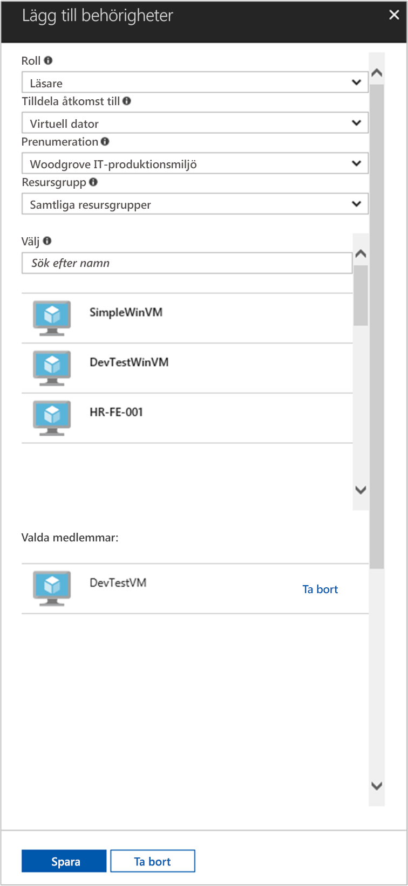

# <a name="use-a-linux-vm-managed-service-identity-to-access-azure-resource-manager"></a>Använda hanterad tjänstidentitet i en virtuell Linux-dator för att få åtkomst till Azure Resource Manager

[!INCLUDE[preview-notice](../../../includes/active-directory-msi-preview-notice.md)]

Den här snabbstarten visar hur du kommer åt Azure Resource Manager-API:et med en systemtilldelad identitet för en virtuell Linux-dator. Hanterade tjänstidentiteter hanteras automatiskt av Azure och gör att du kan autentisera mot tjänster som stöder Azure Active Directory-autentisering, utan att du behöver bädda in autentiseringsuppgifter i din kod. Lär dig att:

> [!div class="checklist"]
> * Aktivera hanterad tjänstidentitet på en virtuell Linux-dator 
> * Ge den virtuella datorn åtkomst till en resursgrupp i Azure Resource Manager 
> * Hämta en åtkomsttoken med hjälp av den virtuella datorns identitet och använda den för att anropa Azure Resource Manager 

## <a name="prerequisites"></a>Nödvändiga komponenter

[!INCLUDE [msi-qs-configure-prereqs](../../../includes/active-directory-msi-qs-configure-prereqs.md)]

[!INCLUDE [msi-tut-prereqs](../../../includes/active-directory-msi-tut-prereqs.md)]

- [Logga in på Azure-portalen](https://portal.azure.com)

- [Skapa en virtuell Linux-dator](/azure/virtual-machines/linux/quick-create-portal)

- [Aktivera systemtilldelad identitet på den virtuella datorn](/azure/active-directory/managed-service-identity/qs-configure-portal-windows-vm#enable-system-assigned-identity-on-an-existing-vm)

## <a name="grant-your-vm-access-to-a-resource-group-in-azure-resource-manager"></a>Ge den virtuella datorn åtkomst till en resursgrupp i Azure Resource Manager 

Med hjälp av en hanterade tjänstidentitet kan din kod hämta åtkomsttoken och autentisera mot resurser som stöder Azure AD-autentisering. Azure Resource Manager API har stöd för Azure AD-autentisering. Först måste vi ge den virtuella datorns identitet åtkomst till en resurs i Azure Resource Manager, i detta fall den resursgrupp som den virtuella datorn finns i.  

1. Gå till fliken för **resursgrupper**.
2. Välj den specifika **resursgrupp** som du skapade tidigare.
3. Gå till **Åtkomstkontroll (IAM)** i den vänstra panelen.
4. Klicka på **Lägg till** en ny rolltilldelning för den virtuella datorn. Välj **rollen** som **läsare**.
5. I nästa listruta **tilldelar du behörighet till** resursen **Virtuell dator**.
6. Kontrollera sedan att rätt prenumeration visas i listrutan **Prenumeration**. Och för **Resursgrupp** väljer du **Alla resursgrupper**.
7. I **Välj** väljer du sedan din virtuella Linux-dator i listrutan och klickar på **Spara**.

    

## <a name="get-an-access-token-using-the-vms-identity-and-use-it-to-call-resource-manager"></a>Hämta en åtkomsttoken med hjälp av den virtuella datorns identitet och använd den för att anropa Resource Manager 

För att slutföra de här stegen behöver du en SSH-klient. Om du använder Windows kan du använda SSH-klienten i [Windows-undersystemet för Linux](https://msdn.microsoft.com/commandline/wsl/about). Om du behöver hjälp att konfigurera SSH-klientens nycklar läser du [Använda SSH-nycklar med Windows i Azure](../../virtual-machines/linux/ssh-from-windows.md) eller [Så här skapar du säkert ett offentligt och ett privat SSH-nyckelpar för virtuella Linux-datorer i Azure](../../virtual-machines/linux/mac-create-ssh-keys.md).

1. I portalen går du till den virtuella Linux-datorn och i **översikten** klickar du på **Anslut**.  
2. **Anslut** till den virtuella datorn med valfri SSH-klient. 
3. I terminalfönstret, med hjälp av CURL, skickar du en begäran till den lokala slutpunkten för hanterad tjänstidentitet för att hämta en åtkomsttoken för Azure Resource Manager.  
 
    CURL-begäran för åtkomsttoken visas nedan.  
    
    ```bash
    curl 'http://169.254.169.254/metadata/identity/oauth2/token?api-version=2018-02-01&resource=https%3A%2F%2Fmanagement.azure.com%2F' -H Metadata:true   
    ```
    
    > [!NOTE]
    > Värdet för parametern ”resource” måste vara en exakt matchning av vad som förväntas av Azure AD.  När det gäller Resource Manager-resurs-ID:t måste du ta med det avslutande snedstrecket i URI:n. 
    
    Svaret innehåller den åtkomsttoken som du behöver för att komma åt Azure Resource Manager. 
    
    Svar:  

    ```bash
    {"access_token":"eyJ0eXAiOi...",
    "refresh_token":"",
    "expires_in":"3599",
    "expires_on":"1504130527",
    "not_before":"1504126627",
    "resource":"https://management.azure.com",
    "token_type":"Bearer"} 
    ```
    
    Du kan använda den här åtkomsttoken för att komma åt Azure Resource Manager, till exempel för att läsa information om den resursgrupp som du tidigare gav den här virtuella datorn åtkomst till. Ersätt värdena för \<PRENUMERATIONS-ID\>, \<RESURSGRUPP\> och \<ÅTKOMSTTOKEN\> med dem som du skapade tidigare. 
    
    > [!NOTE]
    > Eftersom URL:en är skiftlägeskänslig måste du använda exakt samma skiftläge som du använde tidigare när du namngav resursgruppen samt versalt ”G” i ”resourceGroup”.  
    
    ```bash 
    curl https://management.azure.com/subscriptions/<SUBSCRIPTION ID>/resourceGroups/<RESOURCE GROUP>?api-version=2016-09-01 -H "Authorization: Bearer <ACCESS TOKEN>" 
    ```
    
    Svar tillbaka information för den specifika resursgruppen: 
     
    ```bash
    {"id":"/subscriptions/98f51385-2edc-4b79-bed9-7718de4cb861/resourceGroups/DevTest","name":"DevTest","location":"westus","properties":{"provisioningState":"Succeeded"}} 
    ```     

## <a name="next-steps"></a>Nästa steg

I den här självstudien har du lärt dig hur du skapar en användartilldelad identitet och kopplar den till en virtuell Azure-dator för att komma åt Azure Resource Manager-API:et.  Mer information om Azure Resource Manager finns här:

> [!div class="nextstepaction"]
>[Azure Resource Manager](/azure/azure-resource-manager/resource-group-overview)