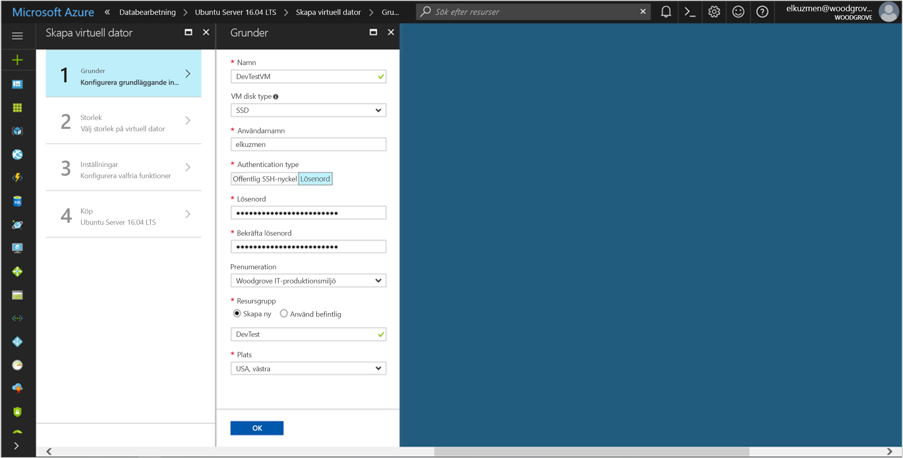

# <a name="tutorial-use-a-linux-vm-managed-service-identity-to-access-azure-key-vault"></a>Självstudie: Använda en hanterad tjänstidentitet i en virtuell Linux-dator för att få åtkomst till Azure Key Vault 

[!INCLUDE[preview-notice](../../../includes/active-directory-msi-preview-notice.md)]

Den här självstudien visar hur du aktiverar en hanterad tjänstidentitet för en virtuell Linux-dator and sedan använder den identiteten för att få åtkomst till Azure Key Vault. Key Vault fungerar som en bootstrap som gör det möjligt för klientprogrammet att använda hemligheten för åtkomst till resurser som inte skyddas av Azure Active Directory (AD). Hanterade tjänstidentiteter hanteras automatiskt av Azure och gör att du kan autentisera mot tjänster som stöder Azure AD-autentisering, utan att du behöver skriva in autentiseringsuppgifter i koden. 

Lär dig att:

> [!div class="checklist"]
> * Aktivera hanterad tjänstidentitet på en virtuell Linux-dator 
> * Ge din virtuella dator åtkomst till en hemlighet som lagras i Key Vault 
> * Få ett åtkomsttoken med hjälp av den virtuella datorns identitet och hämta hemligheten från Key Vault med hjälp av den 
 
## <a name="prerequisites"></a>Nödvändiga komponenter

[!INCLUDE [msi-qs-configure-prereqs](../../../includes/active-directory-msi-qs-configure-prereqs.md)]

[!INCLUDE [msi-tut-prereqs](../../../includes/active-directory-msi-tut-prereqs.md)]

## <a name="sign-in-to-azure"></a>Logga in på Azure
Logga in på Azure Portal på [https://portal.azure.com](https://portal.azure.com). 

## <a name="create-a-linux-virtual-machine-in-a-new-resource-group"></a>Skapa en virtuell Linux-dator i en ny resursgrupp

I den här självstudien skapar vi en ny virtuell Linux-dator. Du kan även aktivera hanterad tjänstidentitet på en befintlig virtuell dator.

1. Klicka på knappen **Skapa en resurs** längst upp till vänster i Azure Portal.
2. Välj **Compute** och välj sedan **Ubuntu Server 16.04 LTS**.
3. Ange informationen för den virtuella datorn. För **Autentiseringstyp** väljer du **Offentlig SSH-nyckel** eller **Lösenord**. Med de skapade autentiseringsuppgifterna kan du logga in på den virtuella datorn.

    

4. Välj en **Prenumeration** för den virtuella datorn i listrutan.
5. Välj en ny **resursgrupp** som den virtuella datorn ska skapas i genom att klicka på **Skapa ny**. När du är klar klickar du på **OK**.
6. Välj storlek för den virtuella datorn. Om du vill se fler storlekar väljer du **Visa alla** eller så ändrar du filtret för disktyper som stöds. Acceptera alla standardvärden på inställningssidan och klicka på **OK**.

## <a name="enable-managed-service-identity-on-your-vm"></a>Aktivera hanterad tjänstidentitet på en virtuell dator

Med en hanterad tjänstidentitet på en virtuell dator kan du få åtkomsttoken från Azure Active Directory utan att du behöver skriva in autentiseringsuppgifter i koden. När du aktiverar en hanterad tjänstidentitet på en virtuell dator händer två saker: din virtuella dator registreras hos Azure Active Directory och dess hanterade tjänstidentitet skapas, och identiteten konfigureras på den virtuella datorn.

1. Välj den **virtuella dator** som du vill aktivera hanterad tjänstidentitet på.
2. Klicka på **Konfiguration** i det vänstra navigeringsfältet.
3. **Hanterad tjänstidentitet** visas. Om du vill registrera och aktivera den hanterade tjänstidentiteten väljer du **Ja**. Om du vill inaktivera den väljer du Nej.
4. Klicka på **Spara** för att spara konfigurationen.

    

## <a name="grant-your-vm-access-to-a-secret-stored-in-a-key-vault"></a>Ge din virtuella dator åtkomst till en hemlighet som lagras i Key Vault  

Med hjälp av en hanterade tjänstidentitet kan din kod hämta åtkomsttoken och autentisera mot resurser som stöder Azure Active Directory-autentisering. Men alla Azure-tjänster stöder inte Azure Active Directory-autentisering. Om du vill använda hanterad tjänstidentitet med dessa tjänster lagrar du autentiseringsuppgifterna för tjänsten i Azure Key Vault och får åtkomst till Key Vault och hämtar autentiseringsuppgifterna med hjälp den hanterade tjänstidentiteten. 

Börja med att skapa ett Key Vault och bevilja den virtuella datorns identitet åtkomst till Key Vault.   

1. Överst i det vänstra navigeringsfältet väljer du **Skapa en resurs** > **Säkerhet och identitet** > **Key Vault**.  
2. Ange ett **namn** för det nya Key Vault. 
3. Leta upp Key Vault i samma prenumerations- och resursgrupp som den virtuella dator du skapade tidigare. 
4. Välj **Åtkomstprinciper** och klicka på **Lägg till**. 
5. I Konfigurera från mall väljer du **Hemlighetshantering**. 
6. Välj **Välj huvudkonto** och ange namnet på den virtuella dator som du skapade tidigare i sökfältet.  Välj den virtuella datorn i resultatlistan och klicka på **Välj**. 
7. Klicka på **OK** och lägg till den nya åtkomstprincipen. Klicka sedan på **OK** och slutför valet av åtkomstprincip. 
8. Klicka på **Skapa** och skapa Key Vault. 

    

Lägg sedan till en hemlighet i Key Vault, så att du senare kan hämta hemligheten med hjälp av koden som körs i den virtuella datorn: 

1. Välj **Alla resurser** och leta upp och välj det Key Vault som du skapade. 
2. Välj **Hemligheter** och klicka på **Lägg till**. 
3. Välj **Manuell** från **Uppladdningsalternativ**. 
4. Ange ett namn och värde för hemligheten.  Värdet kan vara vad du vill. 
5. Låt aktiveringsdatum och förfallodatum vara tomt och sätt **Aktiverad** som **Ja**. 
6. Klicka på **Skapa** för att skapa hemligheten. 
 
## <a name="get-an-access-token-using-the-vms-identity-and-use-it-to-retrieve-the-secret-from-the-key-vault"></a>Få ett åtkomsttoken med hjälp av identiteten för de virtuella datorerna och använd den för att hämta hemligheten från Key Vault  

För att slutföra de här stegen behöver du en SSH-klient.  Om du använder Windows kan du använda SSH-klienten i [Windows-undersystemet för Linux](https://msdn.microsoft.com/commandline/wsl/about). Om du behöver hjälp att konfigurera SSH-klientens nycklar läser du [Använda SSH-nycklar med Windows i Azure](../../virtual-machines/linux/ssh-from-windows.md) eller [Så här skapar du säkert ett offentligt och ett privat SSH-nyckelpar för virtuella Linux-datorer i Azure](../../virtual-machines/linux/mac-create-ssh-keys.md).
 
1. I portalen går du till den virtuella Linux-datorn och i **översikten** klickar du på **Anslut**. 
2. **Anslut** till den virtuella datorn med valfri SSH-klient. 
3. I terminalfönstret, med hjälp av CURL, skickar du en begäran till den lokala slutpunkten för hanterad tjänstidentitet för att hämta en åtkomsttoken för Azure Key Vault.  
 
    CURL-begäran för åtkomsttoken visas nedan.  
    
    ```bash
    curl 'http://169.254.169.254/metadata/identity/oauth2/token?api-version=2018-02-01&resource=https%3A%2F%2Fvault.azure.net' -H Metadata:true  
    ```
    Svaret innehåller den åtkomsttoken som du behöver för att komma åt Resource Manager. 
    
    Svar:  
    
    ```bash
    {"access_token":"eyJ0eXAi...",
    "refresh_token":"",
    "expires_in":"3599",
    "expires_on":"1504130527",
    "not_before":"1504126627",
    "resource":"https://vault.azure.net",
    "token_type":"Bearer"} 
    ```
    
    Du kan använda denna åtkomsttoken för att autentisera till Azure Key Vault.  Nästa CURL-begäran visar hur du kan läsa en hemlighet från Key Vault med hjälp av CURL och Key Vault REST API:et.  Du behöver URL:en till ditt Key Vault, som finns i avsnittet **Essentials** på Key Vault-sidan **Översikt**.  Du Behöver också den åtkomsttoken som du fick i det föregående anropet. 
        
    ```bash
    curl https://<YOUR-KEY-VAULT-URL>/secrets/<secret-name>?api-version=2016-10-01 -H "Authorization: Bearer <ACCESS TOKEN>" 
    ```
    
    Svaret ser ut såhär: 
    
    ```bash
    {"value":"p@ssw0rd!","id":"https://mytestkeyvault.vault.azure.net/secrets/MyTestSecret/7c2204c6093c4d859bc5b9eff8f29050","attributes":{"enabled":true,"created":1505088747,"updated":1505088747,"recoveryLevel":"Purgeable"}} 
    ```
    
När du har hämtat hemligheten från Key Vault kan du använda den och autentisera mot en tjänst som kräver ett namn och lösenord.

## <a name="next-steps"></a>Nästa steg

I den här självstudien har du lärt dig hur du använder en hanterad tjänstidentitet på en virtuell Linux-dator för att få åtkomst till Azure Key Vault.  Läs mer om Azure Key Vault här:

> [!div class="nextstepaction"]
>[Azure Key Vault](/azure/key-vault/key-vault-whatis)


