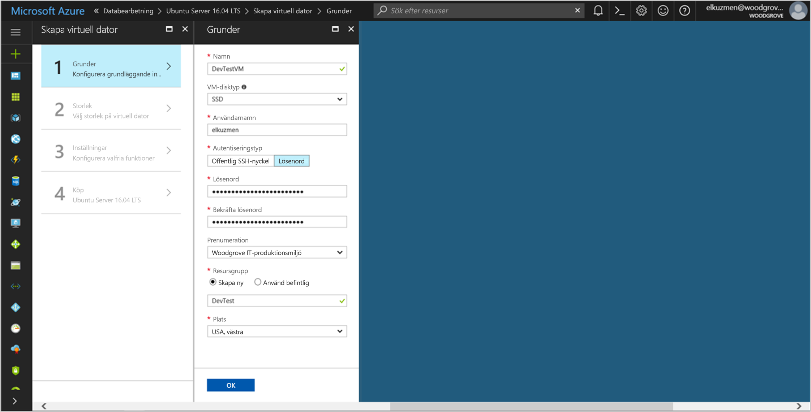

# <a name="tutorial-use-a-linux-vm-managed-service-identity-to-access-azure-storage-via-access-key"></a>Självstudier: Använd en Linux VM hanteras tjänstidentitet för åtkomst till Azure Storage via snabbtangent

[!INCLUDE[preview-notice](../../../includes/active-directory-msi-preview-notice.md)]

Den här kursen visar hur du aktiverar hanterade tjänsten identitet (MSI) för en virtuell Linux-dator och sedan använda identitet för att hämta nycklar för lagringskonto åtkomst. Du kan använda en lagringsåtkomstnyckel som vanligt när gör lagringsåtgärder, till exempel när du använder Storage SDK: N. Den här självstudiekursen kommer vi ladda upp och hämta blobar med hjälp av Azure CLI. Du får lära dig hur du:

> [!div class="checklist"]
> * Aktivera MSI på en virtuell Linux-dator 
> * Ger dina VM tillgång till åtkomstnycklarna för storage-konto i Resource Manager 
> * Få en åtkomsttoken med hjälp av den Virtuella datorns identitet och använda den för att hämta åtkomstnycklar för lagring från Resource Manager  

## <a name="prerequisites"></a>Förutsättningar

[!INCLUDE [msi-qs-configure-prereqs](../../../includes/active-directory-msi-qs-configure-prereqs.md)]

[!INCLUDE [msi-tut-prereqs](../../../includes/active-directory-msi-tut-prereqs.md)]

## <a name="sign-in-to-azure"></a>Logga in på Azure
Logga in på Azure Portal på [https://portal.azure.com](https://portal.azure.com).


## <a name="create-a-linux-virtual-machine-in-a-new-resource-group"></a>Skapa en virtuell Linux-dator i en ny resursgrupp

Den här självstudiekursen skapar vi en ny Linux VM. Du kan också aktivera MSI på en befintlig virtuell dator.

1. Klicka på den **+/ Skapa ny tjänst** knapp hittades i det övre vänstra hörnet i Azure-portalen.
2. Välj **Compute** och välj sedan **Ubuntu Server 16.04 LTS**.
3. Ange informationen för den virtuella datorn. För **autentiseringstyp**väljer **offentliga SSH-nyckeln** eller **lösenord**. Autentiseringsuppgifterna som har skapats kan du logga in på den virtuella datorn.

    

4. Välj en **prenumeration** för den virtuella datorn i listrutan.
5. Att välja en ny **resursgruppen** du vill att den virtuella datorn ska skapas i, Välj **Skapa nytt**. När du är klar klickar du på **OK**.
6. Välj storlek för den virtuella datorn. Om du vill se mer storlekar, Välj **visa alla** eller ändra typ-filter stöds disk. Acceptera alla standardvärden på bladet Inställningar och klicka på **OK**.

## <a name="enable-msi-on-your-vm"></a>Aktivera MSI på den virtuella datorn

En virtuell dator MSI kan du få åtkomst-token från Azure AD utan att du behöver publicera autentiseringsuppgifter i koden. Aktivera hanterade tjänstidentiteten på en virtuell dator har två saker: registrerar den virtuella datorn med Azure Active Directory för att skapa hanterade identitet och konfigurerar identiteten på den virtuella datorn.  

1. Gå till resursgruppen för den nya virtuella datorn och välj den virtuella dator som du skapade i föregående steg.
2. Under den virtuella datorn ”inställningar” till vänster klickar du på **Configuration**.
3. För att registrera och aktivera MSI-filerna, Välj **Ja**, om du vill inaktivera det, väljer du Nej.
4. Se till att du klickar på **spara** att spara konfigurationen.

    

## <a name="create-a-storage-account"></a>skapar ett lagringskonto 

Om du inte redan har ett kommer du nu skapa ett lagringskonto.  Du kan också hoppa över detta steg och ger dina VM MSI tillgång till nycklarna i ett befintligt lagringskonto. 

1. Klicka på den **+/ Skapa ny tjänst** knapp hittades i det övre vänstra hörnet i Azure-portalen.
2. Klicka på **lagring**, sedan **Lagringskonto**, och en ny panel ”skapa storage-konto” visas.
3. Ange en **namn** för storage-konto som du vill använda senare.  
4. **Distributionsmodell** och **konto kind** respektive ska vara inställd på ”Resource manager” och ”generella”. 
5. Se till att den **prenumeration** och **resursgruppen** matchar de som du angav när du skapade den virtuella datorn i föregående steg.
6. Klicka på **Skapa**.

    

## <a name="create-a-blob-container-in-the-storage-account"></a>Skapa en blobbbehållare i storage-konto

Senare kommer att ladda upp och hämta en fil till det nya lagringskontot. Eftersom filer kräver blob-lagring, som vi behöver skapa en blobbbehållare där filen ska sparas.

1. Gå tillbaka till det nyligen skapade lagringskontot.
2. Klicka på den **behållare** länken till vänster under ”Blob-tjänst”.
3. Klicka på **+ behållare** överst på sidan och en ”ny behållare” panelen bilder ut.
4. Namnge behållaren, Välj en åtkomstnivå och klicka sedan på **OK**. Det namn du angav används senare under kursen. 

    

## <a name="grant-your-vms-msi-access-to-use-storage-account-access-keys"></a>Ge den Virtuella datorns MSI åtkomst för att använda åtkomst lagringskontonycklar

Azure Storage stöder inte Azure AD authentication internt.  Dock kan du använda en MSI för att hämta nycklar för lagringskonto åtkomst från Resource Manager sedan använda en för att få åtkomst till lagring.  I det här steget kan bevilja du din VM MSI tillgång till nycklarna till ditt lagringskonto.   

1. Gå tillbaka till det nyligen skapade lagringskontot.
2. Klicka på den **åtkomstkontroll (IAM)** länken i den vänstra panelen.  
3. Klicka på **+ Lägg till** på sidan för att lägga till en ny rolltilldelning för den virtuella datorn
4. Ange **rollen** ”Storage-konto nyckeln operatorn Service roll”, till höger på sidan. 
5. I nästa listrutan, ange **bevilja åtkomst till** resursen ”virtuell dator”.  
6. Kontrollera sedan att korrekt prenumeration visas i **prenumeration** och sedan ange **resursgruppen** till ”alla resursgrupper”.  
7. Slutligen under **Välj** Välj din virtuella Linux-dator i listrutan och klicka sedan på **spara**. 

    

## <a name="get-an-access-token-using-the-vms-identity-and-use-it-to-call-azure-resource-manager"></a>Få en åtkomsttoken med hjälp av den Virtuella datorns identitet och använda den för att anropa Azure Resource Manager

Vi kommer att fungera från den virtuella datorn som vi skapade tidigare under resten av kursen.

För att slutföra de här stegen behöver du en SSH-klient. Om du använder Windows, kan du använda SSH-klienten i den [Windows undersystem för Linux](https://msdn.microsoft.com/commandline/wsl/install_guide). Om du behöver hjälp konfigurerar SSH-klientens nycklar, se [hur du använder SSH-nycklar med Windows på Azure](../../virtual-machines/linux/ssh-from-windows.md), eller [hur du skapar och använder ett SSH offentliga och privata nyckelpar för Linux virtuella datorer i Azure](../../virtual-machines/linux/mac-create-ssh-keys.md).

1. I Azure-portalen går du till **virtuella datorer**, gå till din Linux virtuella dator, sedan från den **översikt** klickar **Anslut** längst upp. Kopiera strängen som ska ansluta till den virtuella datorn. 
2. Ansluta till den virtuella datorn med hjälp av SSH-klienten.  
3. Därefter uppmanas du att ange i din **lösenord** du har lagt till när du skapar den **Linux VM**. Du bör sedan vara loggat in.  
4. Använd CURL för att hämta ett åtkomsttoken för Azure Resource Manager.  

    CURL förfrågan och svar för åtkomsttoken understiger:
    
    ```bash
    curl 'http://169.254.169.254/metadata/identity/oauth2/token?api-version=2018-02-01&resource=https%3A%2F%2Fmanagement.azure.com%2F' -H Metadata:true
    ```
    
    > [!NOTE]
    > Värdet för ”resurser”-parametern måste vara en exakt matchning för vad som förväntas av Azure AD i den tidigare begäranden. När du använder Azure Resource Manager resurs-ID, måste du inkluderar det avslutande snedstrecket på URI.
    > I följande svaret access_token elementet som kortats planeringsaspekter.
    
    ```bash
    {"access_token":"eyJ0eXAiOiJ...",
    "refresh_token":"",
    "expires_in":"3599",
    "expires_on":"1504130527",
    "not_before":"1504126627",
    "resource":"https://management.azure.com",
    "token_type":"Bearer"} 
     ```
    
## <a name="get-storage-account-access-keys-from-azure-resource-manager-to-make-storage-calls"></a>Hämta nycklar för lagringskonto åtkomst från Azure Resource Manager för att göra anrop för lagring  

Nu använder CURL för att anropa Resource Manager med den åtkomst-token som vi hämtades i föregående avsnitt, att hämta lagringsåtkomstnyckel. När vi har lagringsåtkomstnyckel kallar vi överför/hämta lagringsåtgärder. Se till att ersätta den `<SUBSCRIPTION ID>`, `<RESOURCE GROUP>`, och `<STORAGE ACCOUNT NAME>` parametervärden med egna värden. Ersätt den `<ACCESS TOKEN>` värde med den åtkomsttoken som du hämtade tidigare:

```bash 
curl https://management.azure.com/subscriptions/<SUBSCRIPTION ID>/resourceGroups/<RESOURCE GROUP>/providers/Microsoft.Storage/storageAccounts/<STORAGE ACCOUNT NAME>/listKeys?api-version=2016-12-01 --request POST -d "" -H "Authorization: Bearer <ACCESS TOKEN>" 
```

> [!NOTE]
> Texten i den tidigare URL: en är skiftlägeskänsligt, så kontrollera om du använder övre gemena för resursgrupperna återspeglar den därför. Dessutom är det viktigt att du vet att det här är en POST-begäran inte en GET-begäran och se till att du skickar ett värde för att avbilda en längdbegränsningen med -d som kan vara NULL.  

Svaret CURL gör att du listan med nycklar:  

```bash 
{"keys":[{"keyName":"key1","permissions":"Full","value":"iqDPNt..."},{"keyName":"key2","permissions":"Full","value":"U+uI0B..."}]} 
```
Skapa en exempelfil blob att överföra till blob storage-behållare. Du kan göra detta med följande kommando på en Linux-VM. 

```bash
echo "This is a test file." > test.txt
```

Därefter autentisera med CLI `az storage` med lagringsåtkomstnyckel och överföra filen till blob-behållaren. För det här steget behöver du [installera den senaste Azure CLI](https://docs.microsoft.com/cli/azure/install-azure-cli) på den virtuella datorn, om du inte redan har gjort.
 

```azurecli-interactive
az storage blob upload -c <CONTAINER NAME> -n test.txt -f test.txt --account-name <STORAGE ACCOUNT NAME> --account-key <STORAGE ACCOUNT KEY>
```

Svar: 

```JSON
Finished[#############################################################]  100.0000%
{
  "etag": "\"0x8D4F9929765C139\"",
  "lastModified": "2017-09-12T03:58:56+00:00"
}
```

Dessutom kan du hämta filen med hjälp av Azure CLI och autentisera med lagringsåtkomstnyckel. 

Begäran: 

```azurecli-interactive
az storage blob download -c <CONTAINER NAME> -n test.txt -f test-download.txt --account-name <STORAGE ACCOUNT NAME> --account-key <STORAGE ACCOUNT KEY>
```

Svar: 

```JSON
{
  "content": null,
  "metadata": {},
  "name": "test.txt",
  "properties": {
    "appendBlobCommittedBlockCount": null,
    "blobType": "BlockBlob",
    "contentLength": 21,
    "contentRange": "bytes 0-20/21",
    "contentSettings": {
      "cacheControl": null,
      "contentDisposition": null,
      "contentEncoding": null,
      "contentLanguage": null,
      "contentMd5": "LSghAvpnElYyfUdn7CO8aw==",
      "contentType": "text/plain"
    },
    "copy": {
      "completionTime": null,
      "id": null,
      "progress": null,
      "source": null,
      "status": null,
      "statusDescription": null
    },
    "etag": "\"0x8D5067F30D0C283\"",
    "lastModified": "2017-09-28T14:42:49+00:00",
    "lease": {
      "duration": null,
      "state": "available",
      "status": "unlocked"
    },
    "pageBlobSequenceNumber": null,
    "serverEncrypted": false
  },
  "snapshot": null
}
```

## <a name="next-steps"></a>Nästa steg

I kursen får du har lärt dig hur du använder hanterade tjänstidentiteten Linux virtuella datorer för att få åtkomst till Azure Storage med hjälp av en snabbtangent.  Om du vill veta se mer om Azure Storage snabbtangenter:

> [!div class="nextstepaction"]
>[Hantera dina åtkomstnycklar för lagring](/azure/storage/common/storage-create-storage-account#manage-your-storage-access-keys)
