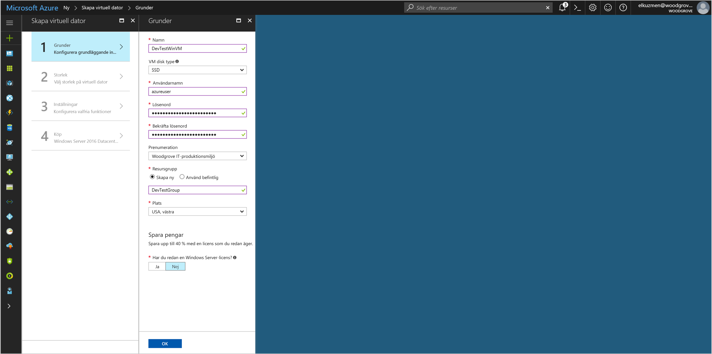
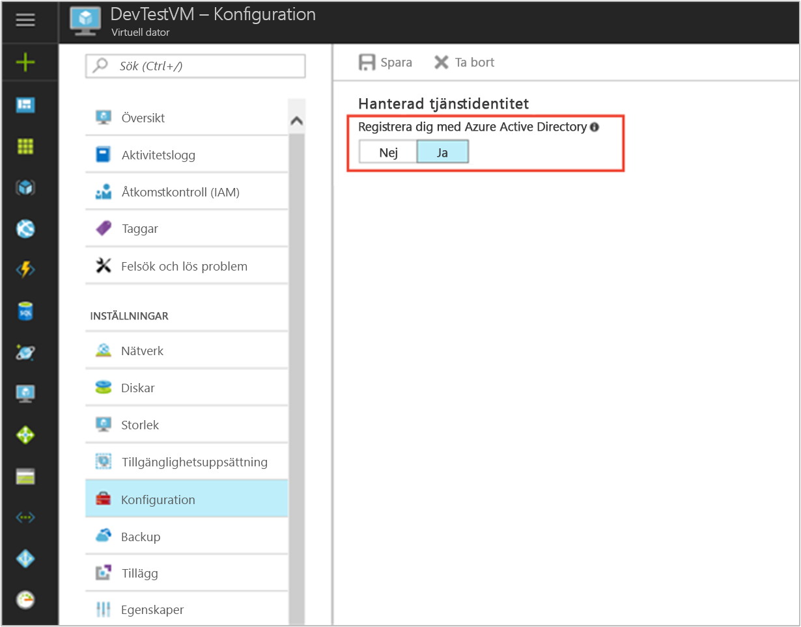

# <a name="tutorial-use-a-windows-vm-managed-service-identity-to-access-azure-sql"></a>Självstudie: Använda en hanterad tjänstidentitet på en virtuell Windows-dator och komma åt Azure SQL

[!INCLUDE[preview-notice](../../../includes/active-directory-msi-preview-notice.md)]

Den här självstudien beskriver steg för steg hur du använder en hanterad tjänstidentitet för en virtuell Windows-dator (VM) för att komma åt en Azure SQL-server. Hanterade tjänstidentiteter hanteras automatiskt av Azure och gör att du kan autentisera mot tjänster som stöder Azure AD-autentisering, utan att du behöver skriva in autentiseringsuppgifter i koden. Lär dig att:

> [!div class="checklist"]
> * Aktivera hanterad tjänstidentitet på en virtuell Windows-dator 
> * Ge din virtuella dator åtkomst till en Azure SQL-server
> * Hämta en åtkomsttoken med hjälp av den virtuella datorns identitet och använda den för att köra frågor mot en Azure SQL-server

## <a name="prerequisites"></a>Nödvändiga komponenter

[!INCLUDE [msi-qs-configure-prereqs](../../../includes/active-directory-msi-qs-configure-prereqs.md)]

[!INCLUDE [msi-tut-prereqs](../../../includes/active-directory-msi-tut-prereqs.md)]

## <a name="sign-in-to-azure"></a>Logga in på Azure

Logga in på Azure Portal på [https://portal.azure.com](https://portal.azure.com).

## <a name="create-a-windows-virtual-machine-in-a-new-resource-group"></a>Skapa en virtuell Windows-dator i en ny resursgrupp

I den här självstudien ska vi skapa en ny virtuell Windows-dator.  Du kan även aktivera hanterad tjänstidentitet på en befintlig virtuell dator.

1.  Klicka på knappen **Skapa en resurs** längst upp till vänster i Azure Portal.
2.  Välj **Compute**, och välj sedan **Windows Server 2016 Datacenter**. 
3.  Ange informationen för den virtuella datorn. **Användarnamnet** och **lösenordet** som skapas här är de autentiseringsuppgifter som du använder när du loggar in på den virtuella datorn.
4.  Välj lämplig **prenumeration** för den virtuella datorn i listrutan.
5.  Du väljer en ny **Resursgrupp** där du skapar din virtuella dator genom att välja **Skapa ny**. När du är klar klickar du på **OK**.
6.  Välj storlek för den virtuella datorn. Om du vill se fler storlekar väljer du **Visa alla** eller så ändrar du filtret för **disktyper som stöds**. Acceptera alla standardvärden på inställningssidan och klicka på **OK**.

    

## <a name="enable-managed-service-identity-on-your-vm"></a>Aktivera hanterad tjänstidentitet på en virtuell dator 

Med en hanterad tjänstidentitet på en virtuell dator kan du få åtkomsttoken från Azure Active Directory utan att du behöver skriva in autentiseringsuppgifter i koden. När du aktiverar hanterad tjänstidentitet skapar Azure en hanterad identitet för den virtuella datorn. I bakgrunden sker två saker när du aktiverar en hanterad tjänstidentitet på en virtuell dator: din virtuella dator registreras hos Azure Active Directory och dess hanterade tjänstidentitet skapas, och identiteten konfigureras på den virtuella datorn.

1.  Välj den **virtuella dator** som du vill aktivera hanterad tjänstidentitet på.  
2.  Klicka på **Konfiguration** i det vänstra navigeringsfältet. 
3.  **Hanterad tjänstidentitet** visas. Om du vill registrera och aktivera den hanterade tjänstidentiteten väljer du **Ja**. Om du vill inaktivera den väljer du Nej. 
4.  Klicka på **Spara** för att spara konfigurationen.  
    

## <a name="grant-your-vm-access-to-a-database-in-an-azure-sql-server"></a>Ge din virtuella dator åtkomst till en databas i en Azure SQL-server

Nu kan du ge din virtuella dator åtkomst till en databas i en Azure SQL-server.  Du kan använda en befintlig SQL-server eller skapa en ny för det här steget.  Om du vill skapa en ny server och en databas med hjälp av Azure-portalen följer du den här [Azure SQL-snabbstarten](https://docs.microsoft.com/azure/sql-database/sql-database-get-started-portal). Det finns även snabbstarter som använder Azure CLI och Azure PowerShell i [Azure SQL-dokumentationen](https://docs.microsoft.com/azure/sql-database/).

Det finns tre steg för att ge den virtuella datorn åtkomst till en databas:
1.  Skapa en grupp i Azure AD och gör den virtuella datorns hanterade tjänstidentitet till medlem i gruppen.
2.  Aktivera Azure AD-autentisering för SQL-servern.
3.  Skapa en **innesluten användare** i databasen som representerar Azure AD-gruppen.

> [!NOTE]
> Normalt skapar du en innesluten användare som mappar direkt till den virtuella datorns hanterade tjänstidentitet.  För närvarande tillåter inte Azure SQL att det Azure AD-tjänsthuvudnamn som representerar den virtuella datorns hanterade tjänstidentitet mappas till en innesluten användare.  Som en tillfällig lösning kan du göra den virtuella datorns hanterade tjänstidentitet till medlem i en Azure AD-grupp och sedan skapa en innesluten användare i databasen som representerar gruppen.


### <a name="create-a-group-in-azure-ad-and-make-the-vm-managed-service-identity-a-member-of-the-group"></a>Skapa en grupp i Azure AD och göra den virtuella datorns hanterade tjänstidentitet medlem i gruppen

Du kan använda en befintlig Azure AD-grupp eller skapa en ny med hjälp av Azure AD PowerShell.  

Först installerar du [Azure AD PowerShell](https://docs.microsoft.com/powershell/azure/active-directory/install-adv2)-modulen. Logga sedan in med `Connect-AzureAD` och kör följande kommando för att skapa gruppen. Spara den sedan i en variabel:

```powershell
$Group = New-AzureADGroup -DisplayName "VM Managed Service Identity access to SQL" -MailEnabled $false -SecurityEnabled $true -MailNickName "NotSet"
```

Utdata ser ut som följande, vilket också undersöker värdet för variabeln:

```powershell
$Group = New-AzureADGroup -DisplayName "VM Managed Service Identity access to SQL" -MailEnabled $false -SecurityEnabled $true -MailNickName "NotSet"
$Group
ObjectId                             DisplayName          Description
--------                             -----------          -----------
6de75f3c-8b2f-4bf4-b9f8-78cc60a18050 VM Managed Service Identity access to SQL
```

Lägg sedan till den virtuella datorns hanterade tjänstidentitet i gruppen.  Du behöver **ObjectId** för den hanterade tjänstidentiteten, vilket du kan få med Azure PowerShell.  Ladda först ned [Azure PowerShell](https://docs.microsoft.com/powershell/azure/install-azurerm-ps). Logga sedan in med `Connect-AzureRmAccount` och kör följande kommandon för att:
- Se till att din sessionskontext är inställd på önskad Azure-prenumeration om du har flera.
- Lista tillgängliga resurser i Azure-prenumerationen och verifiera rätt resursgrupp och namn på virtuella datorer.
- Hämta egenskaper för den virtuella datorns hanterade tjänstidentitet med hjälp av lämpliga värden för `<RESOURCE-GROUP>` och `<VM-NAME>`.

```powershell
Set-AzureRMContext -subscription "bdc79274-6bb9-48a8-bfd8-00c140fxxxx"
Get-AzureRmResource
$VM = Get-AzureRmVm -ResourceGroup <RESOURCE-GROUP> -Name <VM-NAME>
```

Utdata ser ut som följande, vilket också undersöker tjänstens huvudnamns objekt-ID för den virtuella datorns hanterade tjänstidentitet:
```powershell
$VM = Get-AzureRmVm -ResourceGroup DevTestGroup -Name DevTestWinVM
$VM.Identity.PrincipalId
b83305de-f496-49ca-9427-e77512f6cc64
```

Lägg till den virtuella datorns hanterade tjänstidentitet i gruppen.  Du kan bara lägga till ett tjänsthuvudnamn till en grupp med hjälp av Azure AD PowerShell.  Kör följande kommando:
```powershell
Add-AzureAdGroupMember -ObjectId $Group.ObjectId -RefObjectId $VM.Identity.PrincipalId
```

Om du även undersöker gruppmedlemskapet efteråt ser utdata ut så här:

```powershell
Add-AzureAdGroupMember -ObjectId $Group.ObjectId -RefObjectId $VM.Identity.PrincipalId
Get-AzureAdGroupMember -ObjectId $Group.ObjectId

ObjectId                             AppId                                DisplayName
--------                             -----                                -----------
b83305de-f496-49ca-9427-e77512f6cc64 0b67a6d6-6090-4ab4-b423-d6edda8e5d9f DevTestWinVM
```

### <a name="enable-azure-ad-authentication-for-the-sql-server"></a>Aktivera Azure AD-autentisering för SQL-servern

Nu när du har skapat gruppen och lagt till den virtuella datorns hanterade tjänstidentitet i medlemskapet kan du [konfigurera Azure AD-autentisering för SQL-servern](/azure/sql-database/sql-database-aad-authentication-configure#provision-an-azure-active-directory-administrator-for-your-azure-sql-server) med följande steg:

1.  I Azure-portalen väljer du **SQL-servrar** från det vänstra navigeringsfältet.
2.  Klicka på den SQL server som ska aktiveras för Azure AD-autentisering.
3.  I avsnittet **Inställningar** avsnittet på bladet klickar du på **Active Directory-administratör**.
4.  I kommandofältet klickar du på **Konfigurera administratör**.
5.  Välj ett Azure AD-användarkonto som ska bli administratör för servern och klicka på **Välj**.
6.  I kommandofältet klickar du på **Spara**.

### <a name="create-a-contained-user-in-the-database-that-represents-the-azure-ad-group"></a>Skapa en innesluten användare i databasen som representerar Azure AD-gruppen

För nästa steg behöver du [Microsoft SQL Server Management Studio](https://docs.microsoft.com/sql/ssms/download-sql-server-management-studio-ssms) (SSMS). Innan du börjar kan det också vara bra att granska följande artiklar för att få bakgrundsinformation om Azure AD-integrering:

- [Universell autentisering med SQL Database och SQL Data Warehouse (SSMS-stöd för MFA)](/azure/sql-database/sql-database-ssms-mfa-authentication.md)
- [Konfigurera och hantera Azure Active Directory-autentisering med SQL Database eller SQL Data Warehouse](/azure/sql-database/sql-database-aad-authentication-configure.md)

1.  Starta SQL Server Management Studio.
2.  I dialogrutan **Anslut till server** anger du SQL-servernamnet i fältet **Servernamn**.
3.  I fältet **Autentisering** väljer du **Active Directory – Universell med stöd för MFA**.
4.  I fältet **Användarnamn** anger du namnet på det Azure AD-konto som du anger som serveradministratör, till exempel helen@woodgroveonline.com
5.  Klicka på **Alternativ**.
6.  I fältet **Anslut till databas** anger du namnet på den icke-systembaserade databas som du vill konfigurera.
7.  Klicka på **Anslut**.  Slutför inloggningsprocessen.
8.  I **Object Explorer** expanderar du mappen **Databaser**.
9.  Högerklicka på en användardatabas och klicka på **Ny fråga**.
10.  I frågefönstret anger du följande rad och klickar på **Kör** i verktygsfältet:
    
     ```
     CREATE USER [VM Managed Service Identity access to SQL] FROM EXTERNAL PROVIDER
     ```
    
     Kommandot bör slutföras utan problem och skapa den inneslutna användaren för gruppen.
11.  Rensa frågefönstret, ange följande rad och klicka på **Kör** i verktygsfältet:
     
     ```
     ALTER ROLE db_datareader ADD MEMBER [VM Managed Service Identity access to SQL]
     ```

     Kommandot bör slutföras utan problem och bevilja den inneslutna användaren möjligheten att läsa hela databasen.

Kod som körs i den virtuella datorn kan nu få en token från den hanterade tjänstidentiteten och använda token för att autentisera till SQL-servern.

## <a name="get-an-access-token-using-the-vm-identity-and-use-it-to-call-azure-sql"></a>Hämta en åtkomsttoken med hjälp av den virtuella datorns identitet och använda den för att anropa Azure SQL 

Azure SQL har inbyggt stöd för Azure AD-autentisering, vilket gör att åtkomsttoken som hämtas med hanterad tjänstidentitet kan accepteras direkt.  Du använder metoden med **åtkomsttoken** för att skapa en anslutning till SQL.  Detta är en del av integreringen av Azure SQL med Azure AD, och skiljer sig från att ange autentiseringsuppgifter i anslutningssträngen.

Här är ett kodexempel med .Net för att öppna en anslutning till SQL med hjälp av en åtkomsttoken.  Koden måste köras på den virtuella datorn om du vill komma åt slutpunkten för den virtuella datorns hanterade tjänstidentitet.  **.Net Framework 4.6** eller senare krävs om du vill använda metoden med åtkomsttoken.  Ersätt värdena för AZURE-SQL-SERVERNAME och DATABASE i enlighet med detta.  Observera at resurs-ID för Azure SQL är ”https://database.windows.net/”.

```csharp
using System.Net;
using System.IO;
using System.Data.SqlClient;
using System.Web.Script.Serialization;

//
// Get an access token for SQL.
//
HttpWebRequest request = (HttpWebRequest)WebRequest.Create("http://169.254.169.254/metadata/identity/oauth2/token?api-version=2018-02-01&resource=https://database.windows.net/");
request.Headers["Metadata"] = "true";
request.Method = "GET";
string accessToken = null;

try
{
    // Call Managed Service Identity endpoint.
    HttpWebResponse response = (HttpWebResponse)request.GetResponse();

    // Pipe response Stream to a StreamReader and extract access token.
    StreamReader streamResponse = new StreamReader(response.GetResponseStream()); 
    string stringResponse = streamResponse.ReadToEnd();
    JavaScriptSerializer j = new JavaScriptSerializer();
    Dictionary<string, string> list = (Dictionary<string, string>) j.Deserialize(stringResponse, typeof(Dictionary<string, string>));
    accessToken = list["access_token"];
}
catch (Exception e)
{
    string errorText = String.Format("{0} \n\n{1}", e.Message, e.InnerException != null ? e.InnerException.Message : "Acquire token failed");
}

//
// Open a connection to the SQL server using the access token.
//
if (accessToken != null) {
    string connectionString = "Data Source=<AZURE-SQL-SERVERNAME>; Initial Catalog=<DATABASE>;";
    SqlConnection conn = new SqlConnection(connectionString);
    conn.AccessToken = accessToken;
    conn.Open();
}
```

Du kan snabbt testa konfigurationen av slutpunkt till slutpunkt utan att behöva skriva och distribuera en app på den virtuella datorn med hjälp av PowerShell.

1.  I portalen går du till **Virtuella datorer** och sedan till den virtuella Windows-datorn. Under **Översikt** klickar du på **Anslut**. 
2.  Ange ditt **användarnamn** och **lösenord** som du lade till när du skapade den virtuella Windows-datorn. 
3.  Nu när du har skapat en **anslutning till fjärrskrivbord** med den virtuella datorn öppnar du **PowerShell** i fjärrsessionen. 
4.  Använd PowerShells `Invoke-WebRequest` och skicka en begäran till den lokala slutpunkten för hanterad tjänstidentitet för att hämta en åtkomsttoken för Azure SQL.

    ```powershell
       $response = Invoke-WebRequest -Uri 'http://169.254.169.254/metadata/identity/oauth2/token?api-version=2018-02-01&resource=https%3A%2F%2Fdatabase.windows.net%2F' -Method GET -Headers @{Metadata="true"}
    ```
    
    Konvertera svaret från ett JSON-objekt till ett PowerShell-objekt. 
    
    ```powershell
    $content = $response.Content | ConvertFrom-Json
    ```

    Extrahera åtkomsttoken från svaret.
    
    ```powershell
    $AccessToken = $content.access_token
    ```

5.  Öppna en anslutning till SQL-servern. Kom ihåg att ersätta värdena för AZURE-SQL-SERVERNAME och DATABASE.
    
    ```powershell
    $SqlConnection = New-Object System.Data.SqlClient.SqlConnection
    $SqlConnection.ConnectionString = "Data Source = <AZURE-SQL-SERVERNAME>; Initial Catalog = <DATABASE>"
    $SqlConnection.AccessToken = $AccessToken
    $SqlConnection.Open()
    ```

    Sedan skapar du och skickar en fråga till servern.  Kom ihåg att ersätta värdet för TABLE.

    ```powershell
    $SqlCmd = New-Object System.Data.SqlClient.SqlCommand
    $SqlCmd.CommandText = "SELECT * from <TABLE>;"
    $SqlCmd.Connection = $SqlConnection
    $SqlAdapter = New-Object System.Data.SqlClient.SqlDataAdapter
    $SqlAdapter.SelectCommand = $SqlCmd
    $DataSet = New-Object System.Data.DataSet
    $SqlAdapter.Fill($DataSet)
    ```

Kontrollera värdet på `$DataSet.Tables[0]` för att visa resultatet av frågan.  Grattis! Du har frågat databasen med hjälp av en virtuell datorns hanterade tjänstidentitet utan att behöva ange autentiseringsuppgifter.

## <a name="next-steps"></a>Nästa steg

I den här självstudien har du lärt dig att skapa en hanterad tjänstidentitet och komma åt en Azure SQL-server.  Läs mer om Azure SQL Server här:

> [!div class="nextstepaction"]
>[Azure SQL Database-tjänsten](/azure/sql-database/sql-database-technical-overview)
