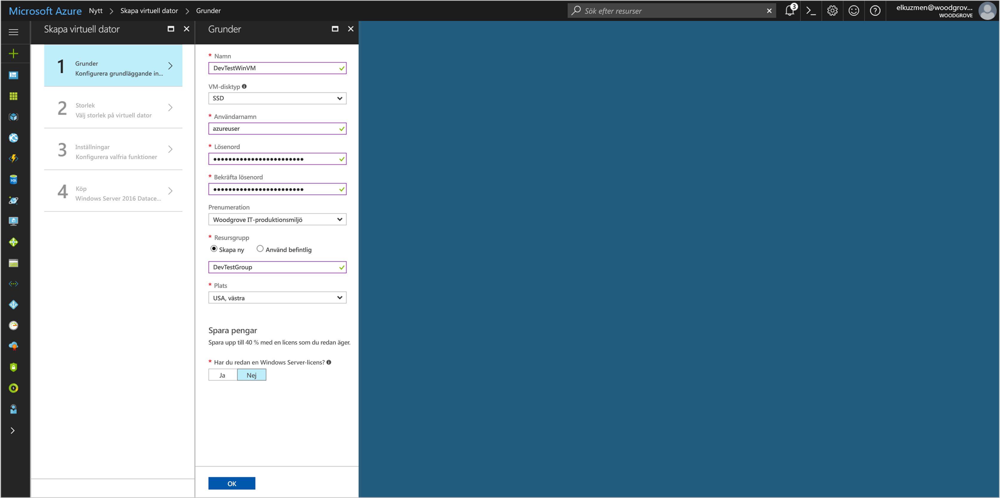
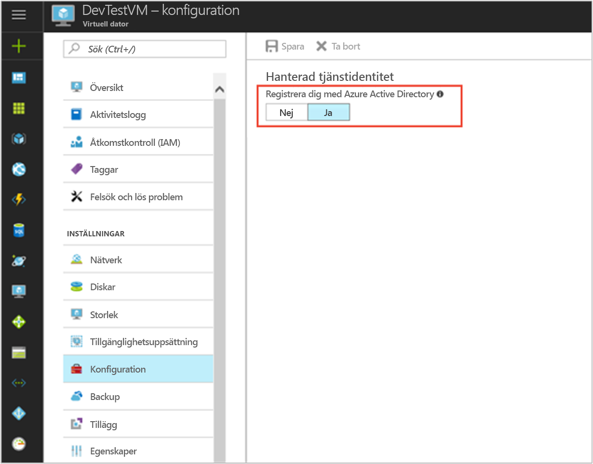

# <a name="tutorial-use-a-windows-vm-managed-service-identity-to-access-azure-storage-via-access-key"></a>Självstudie: Använda en hanterad tjänstidentitet på en virtuell Windows-dator för att komma åt Azure Storage via åtkomstnycklar

[!INCLUDE[preview-notice](../../../includes/active-directory-msi-preview-notice.md)]

Den här självstudien beskriver hur du aktiverar MSI (hanterad tjänstidentitet) för en virtuell Windows-dator och hur du sedan använder identiteten för att hämta åtkomstnycklar för lagringskonton. Du kan använda lagringsåtkomstnycklar som vanligt när du utför lagringsåtgärder, till exempel när du använder Storage SDK. I den här självstudien laddar vi upp och hämtar blobar med Azure Storage PowerShell. Du lär dig hur du:


> [!div class="checklist"]
> * Aktiverar MSI på en virtuell Windows-dator 
> * Ger den virtuella datorn åtkomst till åtkomstnycklar för lagringskonton i Resource Manager 
> * Hämtar en åtkomsttoken med hjälp av den virtuella datorns identitet och använder den för att hämta lagringsåtkomstnycklarna från Resource Manager 

## <a name="prerequisites"></a>Nödvändiga komponenter

[!INCLUDE [msi-qs-configure-prereqs](../../../includes/active-directory-msi-qs-configure-prereqs.md)]

[!INCLUDE [msi-tut-prereqs](../../../includes/active-directory-msi-tut-prereqs.md)]

## <a name="sign-in-to-azure"></a>Logga in på Azure

Logga in på Azure Portal på [https://portal.azure.com](https://portal.azure.com).

## <a name="create-a-windows-virtual-machine-in-a-new-resource-group"></a>Skapa en virtuell Windows-dator i en ny resursgrupp

I den här självstudiekursen ska vi skapa en ny virtuell Windows-dator. Du kan även aktivera MSI på en befintlig virtuell dator.

1.  Klicka på knappen **+/Skapa ny tjänst** som finns i det övre vänstra hörnet på Azure Portal.
2.  Välj **Compute**, och välj sedan **Windows Server 2016 Datacenter**. 
3.  Ange informationen för den virtuella datorn. **Användarnamnet** och **lösenordet** som skapas här är de autentiseringsuppgifter som du använder för att logga in på den virtuella datorn.
4.  Välj lämplig **prenumeration** för den virtuella datorn i listrutan.
5.  Välj en ny **Resursgrupp** som den virtuella datorn ska skapas i genom att klicka på **Skapa ny**. När du är klar klickar du på **OK**.
6.  Välj storlek för den virtuella datorn. Om du vill se fler storlekar väljer du **Visa alla** eller så ändrar du filtret för **disktyper som stöds**. Acceptera alla standardvärden på bladet Inställningar och klicka på **OK**.

    

## <a name="enable-msi-on-your-vm"></a>Aktivera MSI på den virtuella datorn

Med en MSI för en virtuell dator kan du hämta en åtkomsttoken från Azure AD utan att du behöver bädda in autentiseringsuppgifter i din kod. När du aktiverar MSI sker två saker i bakgrunden: den virtuella datorn registreras med Azure Active Directory för att skapa dess hanterade identitet och identiteten konfigureras på den virtuella datorn.

1. Gå till den nya virtuella datorns resursgrupp och välj den virtuella dator som du skapade i föregående steg.
2. Klicka på **Konfiguration** till vänster under inställningarna för den virtuella datorn.
3. Om du vill registrera och aktivera den hanterade tjänstidentiteten väljer du **Ja**. Om du vill inaktivera den väljer du Nej.
4. Klicka på **Spara** för att spara konfigurationen.

    

## <a name="create-a-storage-account"></a>skapar ett lagringskonto 

Nu skapar du ett lagringskonto, om du inte redan har ett. Du kan även hoppa över det här steget och ge den hanterade tjänstidentiteten för den virtuella datorn åtkomst till nycklarna för ett befintligt lagringskonto. 

1. Klicka på knappen **+/Skapa ny tjänst** som finns i det övre vänstra hörnet på Azure Portal.
2. Klicka på **Lagring** och sedan på **Lagringskonto**. Panelen ”Skapa lagringskonto” visas.
3. Ange ett namn för lagringskontot. Du ska använda namnet senare.  
4. **Distributionsmodell** och **Typ av konto** ska vara inställda på Resurshanterare respektive Generell användning. 
5. Kontrollera att informationen under **Prenumeration** och **Resursgrupp** matchar informationen som du angav när du skapade den virtuella datorn i föregående steg.
6. Klicka på **Skapa**.

    

## <a name="create-a-blob-container-in-the-storage-account"></a>Skapa en blob-container i lagringskontot

Senare ska vi ladda upp och ned en fil till det nya lagringskontot. Eftersom filer kräver blob-lagring måste vi skapa en blob-container som filen ska lagras i.

1. Gå tillbaka till det lagringskonto som du nyss skapade.
2. Klicka på länken **Containers** till vänster, under Blob Service.
3. Klicka på **+ Container** längst upp på sidan. Panelen ”Ny container” visas.
4. Ge containern ett namn, välj en åtkomstnivå och klicka sedan på **OK**. Du ska använda det här namnet senare i självstudien. 

    

## <a name="grant-your-vms-msi-access-to-use-storage-account-access-keys"></a>Ge den virtuella datorns MSI behörighet att använda åtkomstnycklar för lagringskonton 

Azure Storage har inte inbyggt stöd för Azure AD-autentisering.  Du kan dock använda en MSI och hämta åtkomstnycklar för lagringskonton från Resource Manager, och sedan få åtkomst till lagringen med hjälp av en nyckel.  I det här steget ger du den virtuella datorns MSI åtkomst till nycklarna för ditt lagringskonto.   

1. Gå tillbaka till det lagringskonto som du nyss skapade.  
2. Klicka på länken **Åtkomstkontroll (IAM)** på den vänstra panelen.  
3. Klicka på **+ Lägg till** längst upp på sidan för att lägga till en ny rolltilldelning för den virtuella datorn
4. Ställ in **Roll** på ”Tjänstroll som operatör av lagringskontonyckel”, till höger på sidan. 
5. I nästa listruta väljer du resursen Virtuell dator under **Tilldela behörighet till**.  
6. Kontrollera sedan att rätt prenumeration visas i listrutan **Prenumeration**. Välj Alla resursgrupper under **Resursgrupper**.  
7. Under **Välj** väljer du sedan din virtuella Windows-dator i listrutan och klickar på **Spara**. 

    

## <a name="get-an-access-token-using-the-vms-identity-and-use-it-to-call-azure-resource-manager"></a>Hämta en åtkomsttoken med hjälp av den virtuella datorns identitet och använd den för att anropa Azure Resource Manager 

Under resten av självstudiekursen arbetar vi från den virtuella datorn som vi skapade tidigare. 

Du måste använda Azure Resource Manager PowerShell-cmdlets i den här delen.  Om du inte har installerat det [hämtar du den senaste versionen](https://docs.microsoft.com/powershell/azure/overview) innan du fortsätter.

1. Gå till **Virtuella datorer** på Azure Portal, gå till din virtuella Windows-dator och klicka sedan på **Anslut** längst upp på sidan **Översikt**. 
2. Ange ditt **användarnamn** och **lösenord** som du lade till när du skapade den virtuella Windows-datorn. 
3. Nu när du har skapat en **anslutning till fjärrskrivbord** med den virtuella datorn öppnar du PowerShell i fjärrsessionen.
4. Använd PowerShells Invoke-WebRequest och skicka en förfrågan till den lokala MSI-slutpunkten för att hämta en åtkomsttoken för Azure Resource Manager.

    ```powershell
       $response = Invoke-WebRequest -Uri 'http://169.254.169.254/metadata/identity/oauth2/token?api-version=2018-02-01&resource=https%3A%2F%2Fmanagement.azure.com%2F' -Method GET -Headers @{Metadata="true"}
    ```
    
    > [!NOTE]
    > Värdet för parametern ”resource” måste vara en exakt matchning av vad som förväntas av Azure AD. När du använder Azure Resource Manager-resurs-ID:t måste du ta med det avslutande snedstrecket i URI:n.
    
    Extrahera sedan elementet ”Content”, som lagras som en JSON-formaterad sträng (JavaScript Object Notation) i $response-objektet. 
    
    ```powershell
    $content = $response.Content | ConvertFrom-Json
    ```
    Extrahera sedan åtkomsttoken från svaret.
    
    ```powershell
    $ArmToken = $content.access_token
    ```
 
## <a name="get-storage-account-access-keys-from-azure-resource-manager-to-make-storage-calls"></a>Hämta åtkomstnycklar för lagringskonton från Azure Resource Manager för att göra lagringsanrop  

Anropa Resource Manager via PowerShell och använd den åtkomsttoken som vi hämtade i föregående avsnitt för att hämta lagringsåtkomstnyckeln. När vi har fått lagringsåtkomstnyckeln kan vi anropa uppladdnings- och nedladdningsåtgärder för lagring.

```powershell
$keysResponse = Invoke-WebRequest -Uri https://management.azure.com/subscriptions/<SUBSCRIPTION-ID>/resourceGroups/<RESOURCE-GROUP>/providers/Microsoft.Storage/storageAccounts/<STORAGE-ACCOUNT>/listKeys/?api-version=2016-12-01 -Method POST -Headers @{Authorization="Bearer $ARMToken"}
```
> [!NOTE] 
> Eftersom URL:en är skiftlägeskänslig måste du använda exakt samma skiftläge som du använde tidigare när du namngav resursgruppen, inklusive versalt ”G” i ”resourceGroups”. 

```powershell
$keysContent = $keysResponse.Content | ConvertFrom-Json
$key = $keysContent.keys[0].value
```

Nu ska vi skapa en fil med namnet ”test.txt”. Använd sedan lagringsåtkomstnyckeln för att autentisera med cmdleten `New-AzureStorageContent`, ladda upp filen till vår blob-container och ladda sedan ned filen.

```bash
echo "This is a test text file." > test.txt
```

Se till att installera alla Azure Storage-cmdlets först med hjälp av `Install-Module Azure.Storage`. Ladda upp bloben som du precis skapat med hjälp av PowerShell-cmdleten `Set-AzureStorageBlobContent`:

```powershell
$ctx = New-AzureStorageContext -StorageAccountName <STORAGE-ACCOUNT> -StorageAccountKey $key
Set-AzureStorageBlobContent -File test.txt -Container <CONTAINER-NAME> -Blob testblob -Context $ctx
```

Svar:

```powershell
ICloudBlob        : Microsoft.WindowsAzure.Storage.Blob.CloudBlockBlob
BlobType          : BlockBlob
Length            : 56
ContentType       : application/octet-stream
LastModified      : 9/13/2017 6:14:25 PM +00:00
SnapshotTime      :
ContinuationToken :
Context           : Microsoft.WindowsAzure.Commands.Storage.AzureStorageContext
Name              : testblob
```

Du kan också ladda ned bloben som du precis laddade upp med hjälp av PowerShell-cmdleten `Get-AzureStorageBlobContent`:

```powershell
Get-AzureStorageBlobContent -Blob testblob -Container <CONTAINER-NAME> -Destination test2.txt -Context $ctx
```

Svar:

```powershell
ICloudBlob        : Microsoft.WindowsAzure.Storage.Blob.CloudBlockBlob
BlobType          : BlockBlob
Length            : 56
ContentType       : application/octet-stream
LastModified      : 9/13/2017 6:14:25 PM +00:00
SnapshotTime      :
ContinuationToken :
Context           : Microsoft.WindowsAzure.Commands.Storage.AzureStorageContext
Name              : testblob
```

## <a name="next-steps"></a>Nästa steg

I den här självstudien har du lärt dig hur du skapar en hanterad tjänstidentitet för att komma åt Azure Storage med hjälp av en åtkomstnyckel.  Mer information om Azure Storage-åtkomstnycklar finns här:

> [!div class="nextstepaction"]
>[Hantera dina åtkomstnycklar för lagring](/azure/storage/common/storage-create-storage-account#manage-your-storage-access-keys)

