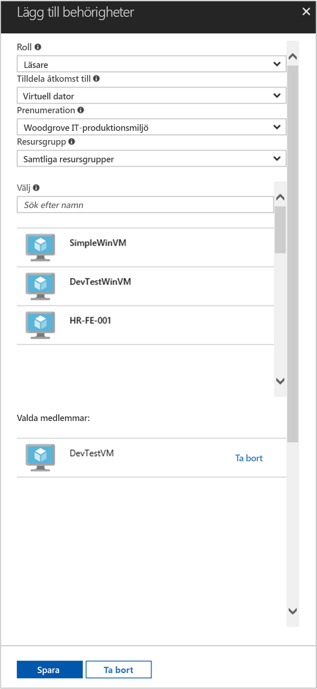

# <a name="use-a-linux-vm-managed-service-identity-msi-to-access-azure-resource-manager"></a>Använd en Linux VM hanterade tjänsten identitet (MSI) för att komma åt Azure Resource Manager

[!INCLUDE[preview-notice](../../includes/active-directory-msi-preview-notice.md)]

Den här kursen visar hur du aktiverar hanterade tjänsten identitet (MSI) för en virtuell Linux-dator och sedan använda identitet för åtkomst till Azure Resource Manager API. Hanterade Tjänsteidentiteter hanteras automatiskt av Azure och gör att du kan autentisera tjänster som stöder Azure AD-autentisering utan att behöva infoga autentiseringsuppgifter i din kod. Lär dig att:

> [!div class="checklist"]
> * Aktivera MSI på en virtuell Linux-dator 
> * Ge dina VM-åtkomst till en resursgrupp i Azure Resource Manager 
> * Hämta en åtkomst-token med VM-identitet och använda den för att anropa Azure Resource Manager 

## <a name="prerequisites"></a>Krav

[!INCLUDE [msi-qs-configure-prereqs](../../includes/active-directory-msi-qs-configure-prereqs.md)]

[!INCLUDE [msi-tut-prereqs](../../includes/active-directory-msi-tut-prereqs.md)]

## <a name="sign-in-to-azure"></a>Logga in på Azure

Logga in på Azure Portal på [https://portal.azure.com](https://portal.azure.com).

## <a name="create-a-linux-virtual-machine-in-a-new-resource-group"></a>Skapa en virtuell Linux-dator i en ny resursgrupp

Den här självstudiekursen skapar vi en ny Linux VM. Du kan också aktivera MSI på en befintlig virtuell dator.

1. Klicka på knappen **New** (Nytt) i det övre vänstra hörnet i Azure Portal.
2. Välj **Compute** och välj sedan **Ubuntu Server 16.04 LTS**.
3. Ange informationen för den virtuella datorn. För **autentiseringstyp**väljer **offentliga SSH-nyckeln** eller **lösenord**. Autentiseringsuppgifterna som har skapats kan du logga in på den virtuella datorn.

    

4. Välj en **prenumeration** för den virtuella datorn i listrutan.
5. Att välja en ny **resursgruppen** du vill att den virtuella datorn ska skapas i, Välj **Skapa nytt**. När du är klar klickar du på **OK**.
6. Välj storlek för den virtuella datorn. Om du vill se mer storlekar, Välj **visa alla** eller ändra typ-filter stöds disk. Acceptera alla standardvärden på bladet Inställningar och klicka på **OK**.

## <a name="enable-msi-on-your-vm"></a>Aktivera MSI på den virtuella datorn

En virtuell dator MSI kan du få åtkomst-token från Azure AD utan att du behöver publicera autentiseringsuppgifter i koden. Under försättsbladen, aktivera MSI gör två saker: MSI VM-tillägget installeras på den virtuella datorn och det möjliggör MSI för den virtuella datorn.  

1. Välj den **virtuella** som du vill aktivera MSI på.
2. Klicka på det vänstra navigeringsfältet **Configuration**.
3. Du ser **hanterade tjänstidentiteten**. För att registrera och aktivera MSI-filerna, Välj **Ja**, om du vill inaktivera det, väljer du Nej.
4. Se till att du klickar på **spara** att spara konfigurationen.

    

5. Om du vill se vilka tillägg som finns på den här **Linux VM**, klickar du på **tillägg**. Om MSI aktiveras den **ManagedIdentityExtensionforLinux** visas i listan.

    

## <a name="grant-your-vm-access-to-a-resource-group-in-azure-resource-manager"></a>Ge dina VM-åtkomst till en resursgrupp i Azure Resource Manager 

Med hjälp av MSI hämta koden åtkomsttoken att autentisera till resurser som stöder Azure AD-autentisering. Azure Resource Manager API stöder Azure AD-autentisering. Vi måste först och ge den här Virtuella datorns identitet åtkomst till en resurs i Azure Resource Manager i det här fallet resursgruppen där den virtuella datorn finns.  

1. Gå till fliken för **resursgrupper**.
2. Välj specifikt **resursgruppen** du skapade tidigare.
3. Gå till **komma åt control(IAM)** i den vänstra panelen.
4. Klicka om du vill **Lägg till** en ny rolltilldelning för den virtuella datorn. Välj **rollen** som **Reader**.
5. I nästa listrutan **bevilja åtkomst till** resursen **virtuella**.
6. Kontrollera sedan att korrekt prenumeration visas i den **prenumeration** listrutan. Och för **resursgruppen**väljer **alla resursgrupper**.
7. Slutligen i **Välj** Välj din virtuella Linux-dator i listrutan och klicka på **spara**.

    

## <a name="get-an-access-token-using-the-vms-identity-and-use-it-to-call-resource-manager"></a>Få en åtkomsttoken med hjälp av den Virtuella datorns identitet och använda den för att anropa Resource Manager 

För att slutföra de här stegen behöver du en SSH-klient. Om du använder Windows, kan du använda SSH-klienten i den [Windows undersystem för Linux](https://msdn.microsoft.com/commandline/wsl/about). Om du behöver hjälp konfigurerar SSH-klientens nycklar, se [hur du använder SSH-nycklar med Windows på Azure](../virtual-machines/linux/ssh-from-windows.md), eller [hur du skapar och använder ett SSH offentliga och privata nyckelpar för Linux virtuella datorer i Azure](../virtual-machines/linux/mac-create-ssh-keys.md).

1. I portalen, navigera till Linux-VM och i den **översikt**, klickar du på **Anslut**.  
2. **Ansluta** till den virtuella datorn med SSH-klient av önskat slag. 
3. I fönstret terminal med CURL, gör en begäran till den lokala MSI-slutpunkten för att hämta ett åtkomsttoken för Azure Resource Manager.  
 
    CURL begäran om åtkomsttoken är under.  
    
    ```bash
    curl http://localhost:50342/oauth2/token --data "resource=https://management.azure.com/" -H Metadata:true   
    ```
    
    > [!NOTE]
    > Värdet för ”resurser”-parametern måste vara en exakt matchning för vad som förväntas av Azure AD.  När det gäller hanteraren för filserverresurser resurs-ID måste du inkluderar det avslutande snedstrecket på URI. 
    
    Svaret innehåller den åtkomst-token som du behöver åtkomst till Azure Resource Manager. 
    
    Svar:  

    ```bash
    {"access_token":"eyJ0eXAiOi...",
    "refresh_token":"",
    "expires_in":"3599",
    "expires_on":"1504130527",
    "not_before":"1504126627",
    "resource":"https://management.azure.com",
    "token_type":"Bearer"} 
    ```
    
    Du kan använda denna åtkomsttoken för att få åtkomst till Azure Resource Manager, till exempel för att läsa information om den resursgrupp som du tidigare har beviljats åtkomst VM. Ersätt värdena för \<PRENUMERATIONS-ID\>, \<RESURSGRUPPEN\>, och \<åtkomst-TOKEN\> med de som du skapade tidigare. 
    
    > [!NOTE]
    > URL: en är skiftlägeskänsligt, så kontrollera om du använder samma skiftläge som du använde tidigare när du namnet på resursgruppen och versaler ”G” i ”resourceGroup”.  
    
    ```bash 
    curl https://management.azure.com/subscriptions/<SUBSCRIPTION ID>/resourceGroups/<RESOURCE GROUP>?api-version=2016-09-01 -H "Authorization: Bearer <ACCESS TOKEN>" 
    ```
    
    Svaret tillbaka med den specifika resursgruppen informationen: 
     
    ```bash
    {"id":"/subscriptions/98f51385-2edc-4b79-bed9-7718de4cb861/resourceGroups/DevTest","name":"DevTest","location":"westus","properties":{"provisioningState":"Succeeded"}} 
    ```
     
## <a name="related-content"></a>Relaterat innehåll

- En översikt över MSI finns [hanterade tjänstidentiteten översikt](../active-directory/msi-overview.md).

Använd följande avsnitt för kommentarer för att ge feedback och hjälp oss att förfina och utforma innehållet.

